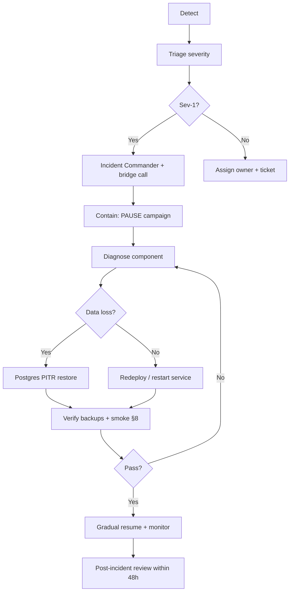

# Disaster Recovery Playbook — Full BPA Campaign

**Scope:** BPA 2026 Cat Flu + Rabies Vaccination Campaign  
**Systems:** `backend-api` · `vaccination_2026` · `bpa_web` · `bpa_app`  
**Infrastructure:** PostgreSQL · Redis · MinIO (S3-compatible) · SMS · Payment gateways  
**Last updated:** June 2, 2026  
**Owner:** Platform Engineering + Campaign Operations

---

## 1. Purpose

This playbook defines **operational recovery** after incidents affecting campaign availability or data integrity. It covers backup verification, restore procedures, recovery objectives (RPO/RTO), contacts, and a standard incident workflow.

**Principles:**

- **Forward recovery** — prefer redeploy + restore from backup over schema rollback (see `MIGRATION-VERIFICATION.md`).
- **Health records** — `campaign_bookings`, `campaign_pets`, and `vaccinations` are legal/clinical data; treat loss as **Critical**.
- **Regenerable assets** — booking QR images and certificate PDFs can be **rebuilt from the database** if secrets are intact.

---

## 2. System map (what must be protected)

```
┌─────────────────────────────────────────────────────────────────┐
│                     CAMPAIGN CRITICAL PATH                       │
├─────────────────────────────────────────────────────────────────┤
│  PostgreSQL          │ Bookings, pets, slots, payments, certs   │
│  Redis               │ OTP, sessions, BullMQ SMS, payment replay │
│  backend-api         │ API + worker:notifications               │
│  vaccination_2026    │ Landing /book (stateless build)          │
│  bpa_web             │ Admin + staff UI (stateless build)       │
│  MinIO               │ General media (optional for campaign)    │
└─────────────────────────────────────────────────────────────────┘
```

| Asset | Stored where | Backup required? | Regenerate without backup? |
|-------|--------------|------------------|----------------------------|
| Bookings / pets / slots | PostgreSQL | **Yes** | No |
| `qrToken`, `bookingRef` | PostgreSQL `campaign_bookings` | **Yes** (in DB) | QR **image** yes — API regenerates |
| `certificateToken` | PostgreSQL `campaign_pets` / `vaccinations` | **Yes** (in DB) | PDF/QR yes — `GET /certificates/:token/pdf` |
| OTP / SMS queue | Redis | Snapshot optional | Users re-request OTP; `recover-stuck` SMS |
| Payment idempotency keys | Redis + PostgreSQL | DB orders required | DB is source of truth |
| Uploaded clinic/media files | MinIO `bpa-pets` (+ `BD/` prefix) | **Yes** if used | No |
| Env secrets | Vault / host env | **Yes** (secure store) | Must restore to verify QR checksums |

**Campaign note:** QR and certificate **files are not persisted to MinIO** by default — they are generated at runtime (`qr.service.ts`, `certificate.service.ts` via Puppeteer). **Protect the database and secrets**, not a separate QR bucket.

---

## 3. Recovery objectives (RPO / RTO)

| Tier | Definition | Campaign examples |
|------|------------|-------------------|
| **Tier 0** | Total platform loss | Region/DC outage, ransomware |
| **Tier 1** | Campaign path down | API down, DB corrupt, Redis down |
| **Tier 2** | Degraded | SMS delay, payment gateway only, landing CDN |

### 3.1 RPO (Recovery Point Objective) — max acceptable data loss

| Component | Target RPO | Production expectation | Verification |
|-----------|------------|------------------------|--------------|
| **PostgreSQL** | **1 hour** | PITR or hourly snapshot | Last backup age < 1h before incident |
| **Redis** | **6 hours** | RDB/AOF snapshot | Accept OTP re-auth; drain SMS before restore |
| **MinIO** | **24 hours** | Daily replica to cold storage | `mc mirror` / S3 sync timestamp |
| **Secrets (Vault)** | **0** | Versioned secrets store | No data loss if vault HA |
| **Git / configs** | **0** | Tagged releases | Redeploy last good tag |

**Campaign-critical RPO:** **≤ 1 hour** for PostgreSQL (bookings + vaccinations). If RPO exceeded, expect missing bookings/check-ins since last snapshot — use paper logs at clinics.

### 3.2 RTO (Recovery Time Objective) — max acceptable downtime

| Scenario | Target RTO | Procedure summary |
|----------|------------|-------------------|
| API pod crash / deploy bad | **15 min** | Roll back container image; campaign PAUSED |
| Redis unavailable | **30 min** | Failover/restart; restart `worker:notifications` |
| PostgreSQL failover (replica) | **30 min** | Promote replica or restore snapshot |
| PostgreSQL full restore (PITR) | **2–4 hours** | Restore + migrate status check + smoke tests |
| MinIO bucket loss | **4 hours** | Restore from mirror; campaign ops if media-only |
| Complete DR site | **4 hours** | DNS cutover + full stack restore |
| Landing / web only | **30 min** | Redeploy previous frontend build |

**Campaign go-live constraint:** Do not declare **recovered** until staff can **QR check-in** and **certificate PDF** generate successfully (see §8).

---

## 4. Backup verification (run monthly + before campaign deploy)

### 4.1 PostgreSQL

**Expected production pattern:**

- Automated **daily full** backup + **continuous WAL / hourly** snapshots (managed Postgres, RDS, or `pg_basebackup` + WAL archive).
- Retention: **30 days** minimum for campaign season.

**Verify backup exists (< 24h):**

```bash
# Managed cloud: check provider console — last snapshot timestamp
# Self-hosted example:
pg_dump -Fc -h <HOST> -U <USER> -d bpa_pet_db -f /secure/backups/bpa_pet_db_$(date +%Y%m%d).dump
# Test restore quarterly to isolated instance:
createdb bpa_dr_test
pg_restore -d bpa_dr_test /secure/backups/bpa_pet_db_YYYYMMDD.dump
psql -d bpa_dr_test -c "SELECT COUNT(*) FROM campaign_bookings;"
```

**Checklist:**

- [ ] Last successful backup < 24 hours (deploy checklist: `06-DEPLOYMENT-PLAN.md`)
- [ ] Restore drill completed in last **90 days**
- [ ] `DATABASE_URL` documented in vault (not only on one host)
- [ ] Migration state documented — `MIGRATION-VERIFICATION.md` (254 migrations)

**Local dev reference:** Docker volume `bpa_pg_data` (`docker-compose.yml`) — **not** production backup.

---

### 4.2 Object storage (MinIO dev / Backblaze B2 production)

**Configuration:** `STORAGE_PROVIDER=minio|b2`, `AWS_*` (MinIO) or `S3_*` (B2), `STORAGE_PUBLIC_URL`, optional `STORAGE_USE_COUNTRY_PREFIX=true` → keys like `BD/...`. See `docs/integrations/storage-providers.md`.

**Expected production pattern:**

- Daily **`mc mirror`** or S3 cross-region replication to secondary bucket.
- Retention: **90 days** for compliance media.

**Verify:**

```bash
# MinIO Client — list bucket
mc alias set bpa https://<minio-host>:9000 <ACCESS_KEY> <SECRET_KEY>
mc ls bpa/bpa-pets --recursive | tail -20
mc mirror bpa/bpa-pets s3/bpa-pets-dr-backup --overwrite

# AWS CLI equivalent
aws s3 ls s3://bpa-pets/ --endpoint-url https://<minio-host>:9000
```

**Checklist:**

- [ ] Bucket `bpa-pets` (or prod name) exists
- [ ] Last mirror/sync < 24h
- [ ] `MINIO_PUBLIC_URL` / `AWS_ENDPOINT` in vault
- [ ] Init script tested: `npm run storage:init` (MinIO dev only; B2 via console)

**Campaign impact if MinIO lost:** **Low** for core booking/QR/cert flows. **High** only if clinics uploaded media via owner/clinic modules during campaign.

---

### 4.3 Redis

**Configuration:** `REDIS_URL` or `REDIS_HOST` + `REDIS_PORT`; Docker uses **AOF** (`--appendonly yes`, volume `bpa_redis_data`).

**Uses for campaign:**

| Key pattern | Purpose | Loss impact |
|-------------|---------|-------------|
| `campaign:otp:*` | OTP hashes | Users re-request OTP |
| `campaign:session:*` | JWT session cache | Re-login via OTP |
| `campaign:payment:event:*` | Payment replay guard | DB idempotency still applies |
| BullMQ `notif_sms` | SMS queue | Run stuck SMS recovery |

**Expected production pattern:**

- RDB snapshot every **6 hours** + AOF persistence.
- Retention: **7 days**.

**Verify:**

```bash
redis-cli -u "$REDIS_URL" PING
redis-cli -u "$REDIS_URL" INFO persistence
# Optional: trigger BGSAVE and confirm last save time
redis-cli -u "$REDIS_URL" LASTSAVE
```

**Checklist:**

- [ ] `redis-cli PING` → `PONG`
- [ ] AOF or RDB enabled in prod config
- [ ] Snapshot age < 6h (or accept 6h RPO)
- [ ] `worker:notifications` monitored separately

---

### 4.4 Certificate files (logical + PDF)

**Source of truth:** Database columns, not filesystem.

| Field | Table | Notes |
|-------|-------|-------|
| `certificateToken` | `campaign_pets`, `vaccinations` | Public verify token `CERT-…` |
| `certificateGeneratedAt` | `campaign_pets` | Audit timestamp |
| Vaccination clinical data | `vaccinations` | Batch, dates, vaccine type |

**PDF generation:** On-demand via Puppeteer in API (`generateCertificatePdf`). No MinIO path required.

**Verify after incident:**

```bash
# Replace TOKEN with real cert from DB
curl -s "https://<API>/api/v1/campaign/public/certificates/<TOKEN>" | jq .success
curl -s "https://<API>/api/v1/campaign/public/certificates/<TOKEN>/pdf" | jq .success
```

**Secrets required for QR on certificates:**

- `CAMPAIGN_QR_SECRET` (or `JWT_SECRET` fallback)
- `CAMPAIGN_BASE_URL` for verify links

---

### 4.5 Campaign QR assets

**Source of truth:** `campaign_bookings.qrToken` (32-char hex) + `bookingRef` (`VAC-…`).

**QR images:** Generated by `generateBookingQr()` — not stored in MinIO.

**Staff check-in:** Validates token via `POST /api/v1/campaign/staff/qr/validate` (requires staff auth).

**Verify:**

```sql
SELECT id, "bookingRef", "qrToken", status, "paymentStatus"
FROM campaign_bookings
ORDER BY id DESC LIMIT 5;
```

```bash
# Staff validate (Bearer staff token)
curl -X POST "https://<API>/api/v1/campaign/staff/qr/validate" \
  -H "Authorization: Bearer <STAFF_JWT>" \
  -H "Content-Type: application/json" \
  -d '{"token":"<qrToken>"}'
```

**If `CAMPAIGN_QR_SECRET` rotated without migration:** Old printed QR checksums may fail until HMAC verification is enforced — document secret rotation in change window.

---

## 5. Restore procedures

### 5.1 PostgreSQL — point-in-time restore (production)

1. **Declare incident** — Incident Commander (§7).  
2. **Stop writes** — Scale API to 0 or enable maintenance mode; **PAUSE** all campaigns in admin.  
3. **Identify target time** — Last known good (before corruption/deletion).  
4. **Restore** — Use provider PITR or `pg_restore` from snapshot.  
5. **Run migrations** — `npx prisma migrate deploy` (expect up to date).  
6. **Verify row counts:**

```sql
SELECT status, COUNT(*) FROM campaign_bookings GROUP BY status;
SELECT COUNT(*) FROM campaign_pets WHERE "certificateToken" IS NOT NULL;
SELECT COUNT(*) FROM campaign_sms_logs WHERE status = 'SENT';
```

7. **Smoke test** — §8.  
8. **Resume** — Unpause campaign; monitor 30 min.

**Do not:** `prisma migrate down` on production with live campaign data.

---

### 5.2 Redis — restore or cold start

**Option A — Restore from snapshot**

1. Stop API workers consuming Redis.  
2. Replace Redis data dir with snapshot / promote replica.  
3. Start Redis; `PING`.  
4. Restart `npm run worker:notifications`.  
5. Check BullMQ depth: `GET /api/v1/campaign/public/sms/health`.

**Option B — Cold start (acceptable for many incidents)**

1. Start fresh Redis instance.  
2. Update `REDIS_URL`; restart API + worker.  
3. **OTP:** Users request new codes.  
4. **SMS:** Admin `POST /api/v1/campaign/admin/campaigns/:id/sms/recover-stuck` for stuck logs.  
5. **Payments:** Rely on PostgreSQL `order` / `orderPayment` idempotency.

---

### 5.3 MinIO — restore bucket

1. Identify last good mirror path (`bpa-pets-dr-backup` or S3 version).  
2. `mc mirror s3/bpa-pets-dr-backup bpa/bpa-pets --overwrite`  
3. Verify random object GET via public URL or signed URL.  
4. Confirm API `AWS_*` env points to restored endpoint.

---

### 5.4 Certificates & QR — regenerate (no file restore)

When **database is intact** but PDF/QR services failed:

1. Confirm `CAMPAIGN_QR_SECRET`, `JWT_SECRET`, Puppeteer/Chrome in API image.  
2. Regenerate certificate PDF per token (API or batch script).  
3. Booking QR: call internal `generateBookingQr(bookingId)` or expose staff UI refresh.  
4. Communicate to clinics: existing **booking ref** still valid even if QR image reprinted.

**Batch reprint query (pets vaccinated, cert missing token):**

```sql
SELECT id, name, "certificateToken"
FROM campaign_pets
WHERE "vaccinationStatus" = 'COMPLETED' AND "certificateToken" IS NULL;
```

Run `generateCertificate` via staff complete flow or admin tooling.

---

### 5.5 Application tier — redeploy last known good

| Component | Action |
|-----------|--------|
| backend-api | Deploy git tag `release-campaign-YYYY-MM-DD`; run `migrate deploy` |
| worker | Same image; `REDIS_ENABLED=true` |
| vaccination_2026 | Hosting rollback (Vercel/hosting previous build) |
| bpa_web | Previous production build |
| bpa_app | Optional; API compatibility only |

See `docs/vaccination-campaign-2026/05-ROLLBACK-PLAN.md` for layer-specific rollback.

---

## 6. Rollback simulation (planning only)

Prisma Migrate is **forward-only**. Disaster **rollback** = restore backup + redeploy prior app tag, not migration down.

**Tool:** `npm run migrate:rollback-sim -- --tail=5`  
**Doc:** `MIGRATION-VERIFICATION.md` § Rollback simulation

**Campaign tail migrations (inverse planning):**

| Migration | Rollback impact |
|-----------|-----------------|
| `20260603120000_campaign_sms_cost_monitoring` | Drop 3 columns on `campaign_sms_logs` — safe |
| `20260602_add_vaccination_campaign_2026` | **Drops all campaign tables** — catastrophic; backup only |

---

## 7. Emergency contacts

> **Action:** Replace placeholders with your org chart and on-call rotation. Store authoritative copy in PagerDuty/Opsgenie + printed clinic runbook.

| Role | Name | Phone | Email | When to call |
|------|------|-------|-------|--------------|
| **Incident Commander** | _On-call Engineering Lead_ | _+880…_ | _oncall@bpa…_ | All Sev-1/2 |
| **Database / DBA** | _DBA Primary_ | _+880…_ | _dba@bpa…_ | Postgres restore |
| **DevOps / Infra** | _Platform_ | _+880…_ | _platform@bpa…_ | Redis, MinIO, DNS |
| **Campaign Product Owner** | _Campaign PM_ | _+880…_ | _campaign@bpa…_ | Pause/go-live decisions |
| **Clinic Operations Lead** | _Field Ops_ | _+880…_ | _clinics@bpa…_ | Site comms, paper fallback |
| **SMS Provider (SSL Wireless)** | _Account mgr_ | _…_ | _…_ | OTP/SMS outage |
| **Payment (bKash/Nagad/SSL)** | _Merchant support_ | _…_ | _…_ | Payment gateway down |
| **Security** | _InfoSec_ | _+880…_ | _security@bpa…_ | Breach, webhook abuse |

**Communication channels:**

| Channel | Use |
|---------|-----|
| `#campaign-incidents` (Slack/Teams) | Real-time coordination |
| `#campaign-launch` | Status updates to wider team |
| Clinic WhatsApp / phone tree | Field staff instructions |
| Status page (if available) | Public degradation notice |

---

## 8. Incident workflow



### 8.1 Severity guide

| Sev | Criteria | Examples |
|-----|----------|----------|
| **1** | Booking/vaccination stopped nationally; data loss suspected | DB down, corrupt bookings |
| **2** | Major degradation | OTP down >15m, payment fail >50% |
| **3** | Partial | One clinic site, admin UI only |
| **4** | Minor | Cosmetic landing issue |

### 8.2 Contain (first 15 minutes)

1. Assign **Incident Commander**.  
2. **Pause campaign** — Admin → campaign `status = PAUSED` (stops new bookings).  
3. Preserve evidence — logs, `traceId`, Redis queue depth, last deploy tag.  
4. If payment anomaly — disable paid pricing or gateway (see `05-ROLLBACK-PLAN.md`).  
5. Notify **Clinic Ops** — switch to **paper backup forms** if check-in broken.

### 8.3 Recover

Follow §5 by failed component. Parallel track:

- Engineering — restore/redploy  
- Ops — clinic communication  
- Product — pilot vs national scope decision  

### 8.4 Recovery smoke tests (required before “all clear”)

| # | Test | Pass criteria |
|---|------|----------------|
| 1 | `GET /api/v1/auth/health` or API health | 200 |
| 2 | `GET /api/v1/campaign/public/sms/health` | `redisEnabled: true`, providers configured |
| 3 | `POST /api/v1/campaign/auth/request-otp` (test phone) | SMS received or queue enqueued |
| 4 | `GET /api/v1/campaign/public/campaigns` | Active campaign listed |
| 5 | Staff `POST .../staff/qr/validate` | Known `qrToken` → valid |
| 6 | `GET .../public/certificates/:token/pdf` | PDF success for known cert |
| 7 | Payment callback URLs | Provider dashboard green |
| 8 | Landing `/book` | Loads, creates DRAFT booking |

Document results in incident ticket.

### 8.5 Post-incident review (within 48 hours)

- Timeline, root cause, RPO/RTO achieved  
- Backup gaps discovered  
- Action items: automation, monitoring, runbook updates  
- Update this playbook if procedures changed  

---

## 9. Operational recovery quick reference

| Symptom | First action | Doc |
|---------|--------------|-----|
| API 500 on booking | Pause campaign; check API logs; rollback image | `05-ROLLBACK-PLAN.md` |
| OTP not received | `sms/health`; restart worker; check Redis | `SMS-PRODUCTION-VALIDATION.md` |
| Payment stuck PENDING | Webhook logs; replay from gateway dashboard | `PAYMENT-PRODUCTION-READINESS.md` |
| SMS stuck QUEUED | `POST .../sms/recover-stuck` | `SMS-PRODUCTION-VALIDATION.md` |
| Migration failed deploy | Do not downgrade; fix forward; see audit | `MIGRATION-VERIFICATION.md` |
| Certificate PDF blank | Puppeteer/Chrome in container; check API logs | §5.4 |
| QR scan fails | Verify `qrToken` in DB; staff auth; payment guard | `PAYMENT-AUDIT-REPORT.md` |

---

## 10. Pre-season DR drill (quarterly)

| Week | Activity | Owner |
|------|----------|-------|
| Q1–Q4 | Restore Postgres backup to isolated DB + count `campaign_bookings` | DBA |
| Q1–Q4 | `mc mirror` restore test (one object) | DevOps |
| Q1–Q4 | Redis snapshot restore to staging | DevOps |
| Before campaign | Full §8 smoke on staging | QA + Eng |
| Before campaign | Confirm backup < 24h (`06-DEPLOYMENT-PLAN.md`) | Release manager |

---

## 11. Related documents

| Document | Path |
|----------|------|
| Migration verification | `MIGRATION-VERIFICATION.md` |
| Payment recovery | `PAYMENT-PRODUCTION-READINESS.md` |
| SMS recovery | `SMS-PRODUCTION-VALIDATION.md` |
| Rollback plan | `docs/vaccination-campaign-2026/05-ROLLBACK-PLAN.md` |
| Deployment plan | `docs/vaccination-campaign-2026/06-DEPLOYMENT-PLAN.md` |
| Architecture DR summary | `docs/vaccination-campaign-2026/03-system-architecture.md` §9 |
| Migration governance | `docs/migration-governance-report.md` |

---

## 12. Sign-off

| Control | Status |
|---------|--------|
| Backup verification procedures documented | Complete |
| RPO/RTO defined per component | Complete |
| Restore procedures (DB, Redis, MinIO, cert/QR) | Complete |
| Emergency contact template | **Requires org fill-in** |
| Incident workflow | Complete |
| Rollback simulation referenced | Complete |

**Next actions for operations team:**

1. Fill §7 contact table and store in on-call tool.  
2. Run §4 verification checklist before next production deploy.  
3. Schedule quarterly Postgres restore drill.  
4. Confirm managed backups enabled for production Postgres (not Docker volumes).
