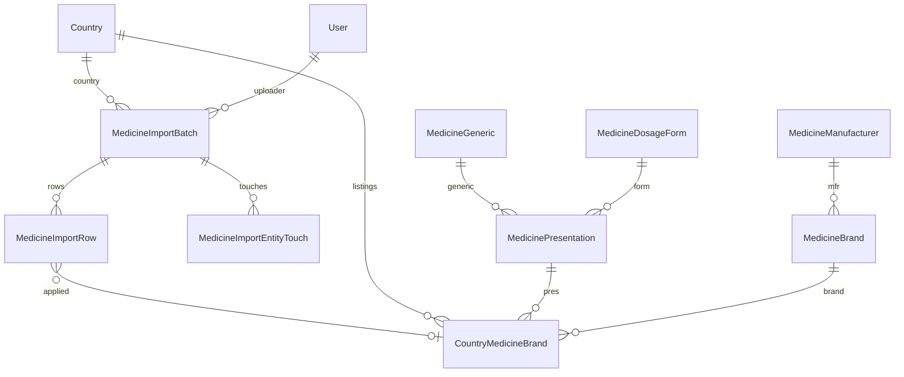

# Admin Medicine Catalog Import System

Enterprise global medicine reference import: staging tables, preview/dry-run, explicit confirm, transactional apply. See implementation in `src/api/v1/services/medicine-import/` and `src/api/v1/modules/admin_medicine_import/`.

**Broader admin product:** For the planned **top-level Admin Medicine workspace** (dashboard, master-data CRUD, country catalogs, imports hub, exports, review queues, permissions), see **[`ADMIN_MEDICINE_WORKSPACE_ENTERPRISE_PLAN.md`](./ADMIN_MEDICINE_WORKSPACE_ENTERPRISE_PLAN.md)**. This import document remains the authoritative reference for **batch staging, preview, confirm, apply, and row-level governance** only.

## Data model

- **Staging:** `medicine_import_batches`, `medicine_import_rows`, `medicine_import_entity_touches`
- **Core:** `medicine_generics`, `medicine_dosage_forms`, `medicine_manufacturers`, `medicine_brands`, `medicine_presentations`
- **Country catalog:** `country_medicine_brands` (unique `countryId` + `importFingerprint`)

## Fingerprint / deduplication

`importFingerprint` = SHA-256 hex of `countryId|genericKey|dosageFormKey|strengthKey|manufacturerKey|brandKey|packageKey` (normalized). Used for in-file duplicates, DB existence, and idempotent re-import.

## API (admin)

Base: `/api/v1/admin/medicine-catalog-import`

- `POST /upload` — multipart `file`, `countryCode` or `countryId`, optional `provider`
- `GET /batches` — query: `page`, `limit`, `countryId`, `status`
- `GET /batches/:id`
- `POST /batches/:id/preview` — recompute preview (idempotent)
- `POST /batches/:id/confirm` — body `{ previewVersion? }` (recommended; must match current preview)
- `POST /batches/:id/apply`
- `POST /batches/:id/cancel`
- `GET /batches/:id/rows` — query: `page`, `limit`, `classification`, `applyStatus`
- `GET /batches/:id/export-invalid` — CSV of invalid rows

**Production note:** `npm start` serves `dist/`. Run a successful `npm run build` before deploy so `dist/api/v1/modules/admin_medicine_import/` and `dist/api/v1/routes.js` stay in sync. The app also hard-mounts this namespace in `src/app.ts` (before the v1 router) so a stale `routes.js` still resolves these paths when the compiled module exists; if the module is absent from `dist/`, those URLs return **503** with a rebuild hint instead of a silent 404.

## UI

Admin routes under `/admin/medicine-catalog-import` (list, new upload, batch detail with preview/confirm/apply).

## Related

Parallel pattern to owner product import (`docs/PRODUCT_IMPORT_GUIDE.md` — cross-linked at top of that guide); this module is **global** and **admin-only**.

## Plan alignment (architecture doc ↔ code)

The enterprise plan used illustrative names; **this codebase** uses the Prisma models below (same behavior).

| Plan concept | Implemented as |
|--------------|----------------|
| `MedicineCatalogImportBatch` | `MedicineImportBatch` (`medicine_import_batches`) |
| `MedicineCatalogImportRow` | `MedicineImportRow` |
| `MedicineCatalogImportEntityTouch` | `MedicineImportEntityTouch` |
| `CountryMedicineCatalogEntry` | `CountryMedicineBrand` (`countryId` + `importFingerprint`) |
| `MedicineCatalogImportApplyLog` (per-attempt log) | **Consolidated** into `applySummaryJson` + row-level `applyDetailJson` on the batch/rows (simpler ops; entity touch log covers reversibility) |
| Issue codes file | `src/api/v1/constants/medicineImportIssueCodes.ts` (same shape as product import: `code`, `field`, `severity`, `message`) |
| Services folder | `src/api/v1/services/medicine-import/` |
| Admin module | `src/api/v1/modules/admin_medicine_import/` |

**Batch extensions (P3+ forward-compat):** `rawStorageKey` (optional object-storage pointer), `uploadSource` (default `ADMIN`; reserved for manufacturer-led uploads later).

## Entity relationship (implemented)



## CSV column mapping

Headers are matched **case-insensitive**; spaces and `_`/`-` are stripped before alias lookup (`extractMedicineFields`).

| Logical field | Required | Aliases accepted (non-exhaustive) |
|---------------|----------|-----------------------------------|
| Generic name | Yes | `genericname`, `generic`, `drugname`, `molecule` |
| Brand / trade name | Yes | `brandname`, `brand`, `tradename` |
| Dosage form / type | Yes | `dosagetype`, `dosageform`, `dosage`, `form`, `type` |
| Strength | Yes | `strength`, `potency`, `dose` |
| Manufacturer | Yes | `manufacturer`, `mfr`, `maker`, `company` |
| Package mark | No | `packagemark`, `package`, `pack`, `mark` |

**Normalization:** display strings preserved; **keys** for dedupe use normalized folding (see `normalize.ts`, `fingerprint.ts`).

## Example API payloads (admin)

**`POST /upload` success (simplified):** `data` includes batch id, `status` (e.g. `PREVIEW_READY` after sync ingest+preview), `totalRows`, `previewVersion`, `fileSha256`.

```json
{
  "success": true,
  "data": {
    "batchId": 42,
    "status": "PREVIEW_READY",
    "totalRows": 1200,
    "previewVersion": 1,
    "fileSha256": "abc…64hex…"
  }
}
```

**`POST /batches/:id/preview`:** returns `previewSummaryJson` shape with counts such as `new`, `invalid`, `needsReview`, `duplicateInFile`, `existsInDb` (exact keys match `MedicineImportPreviewSummary` in code).

**`POST /batches/:id/confirm` body:**

```json
{
  "previewVersion": 1,
  "acknowledgeNeedsReviewSkip": true
}
```

**`POST /batches/:id/apply`:** response `data` includes structured apply summary: applied/skipped/failed counts and `finalStatus` (`APPLIED` | `PARTIALLY_APPLIED` | `FAILED`).

## Constants & limits

- Env-backed caps: `src/api/v1/constants/medicineImportLimits.ts` (`MEDICINE_IMPORT_MAX_ROWS`, `MEDICINE_IMPORT_MAX_FILE_BYTES`, chunk size for staging writes).
- Upload route uses the same rate limiter family as product import where configured.

## Future phases (P3–P4, optional)

- **Aliases / review queue:** dedicated `MedicineImportFieldAlias` (or equivalent) + UI to map external strings → core entities; rows already support `NEEDS_REVIEW`.
- **Manufacturer submitter:** gate `confirm`/`apply` on `uploadSource` + org approval; use `uploadSource` + optional `submitterOrgId` (not in schema v1 — add when RBAC is ready).
- **Async jobs:** BullMQ `medicine_catalog_import` job type mirroring product import when Redis is available; sync path remains default.
- **Raw file retention:** populate `rawStorageKey` after upload to object storage for long-term audit; keep `fileSha256` as integrity anchor.

## QA / governance (implemented)

- **Statuses:** `UPLOADED` → `PARSED` → `PREVIEW_READY` → `CONFIRMED` → `APPLYING` → `APPLIED` | `PARTIALLY_APPLIED` | `FAILED`; `CANCELLED` ends a batch. Preview failure after staging sets `FAILED` with `errorMessage`.
- **Confirm guardrails:** `previewVersion` is **required** and must match the batch; if `needsReview > 0`, API requires `acknowledgeNeedsReviewSkip: true` (UI checkbox) or confirm is rejected.
- **Preview:** Re-run allowed for `PARSED`, `PREVIEW_READY`, `FAILED` (recovery). **Not** allowed after `CONFIRMED` or `APPLYING` (prevents overwriting admin commitment).
- **Apply:** Only when `CONFIRMED`. `NEEDS_REVIEW`, `INVALID`, `DUPLICATE_IN_FILE` rows are skipped with row-level `applyDetailJson`.
- **Audit:** Upload audit includes `fileSha256`, country, row count; confirm audit includes `previewVersion` and review acknowledgement; apply persists structured `applySummaryJson` on the batch.
- **Exports:** `GET .../export-invalid`; `GET .../export-classification?classification=NEEDS_REVIEW` (and other classifications).

## Row-level audit

Each staging row keeps immutable `rawPayloadJson`, computed `rowFingerprint`, `classification`, `issuesJson`, `normalizedPayloadJson` (when valid), and post-apply `applyStatus` / `applyDetailJson` / optional `countryMedicineBrandId`.

## Consumption in BPA/WPA (clinic & prescriptions)

Applied import rows become **`CountryMedicineBrand`** records (per country + presentation + brand + package fingerprint). This layer stays **separate** from:

- **Org inventory** — `Product` / `ProductVariant` (`medicine-search` on clinic API).
- **Clinic pharmacy catalog** — `ClinicalItemVariant` (`clinicalItemVariantId` on prescription lines).

### Country resolution for clinics

- **Branch → Organization → `countryId`**: search and validation use the owning org’s `countryId`. Listings are always filtered by that id — e.g. Bangladesh (`BD`) orgs only see rows where `country_medicine_brands.countryId` matches Bangladesh; no cross-country leakage via branch context.
- If `Organization.countryId` is **null**, catalog search returns an empty list with an actionable notice; prescription lines **cannot** attach `countryMedicineBrandId` until the org has a country.
- If the **Country** row is **inactive** (`countries.isActive = false`), the catalog is treated as unavailable (same as missing country) for clinic/doctor flows; admin search requires an **active** country id or code.

### APIs (read/search; stable namespaces)

| Scope | Base | Search | Detail |
|--------|------|--------|--------|
| **Clinic/staff** | `/api/v1/clinic/branches/:branchId` | `GET .../medicine-catalog/search?q=&page=&limit=&genericId=&manufacturerId=&dosageFormId=&strength=` | `GET .../medicine-catalog/brands/:brandId` |
| **Doctor** | `/api/v1/doctor` | `GET /medicine-catalog/search?branchId=&q=&…` (doctor must have DOCTOR profile on that branch) | `GET /medicine-catalog/brands/:brandId?branchId=` |
| **Admin** | `/api/v1/admin/medicine-catalog` | `GET /search?countryId=` or `countryCode=&q=&…` | `GET /brands/:id?countryId=` or `countryCode=` |

Search matches **brand name, generic name, manufacturer, strength display, dosage form, and package marking** (`packageMarkDisplay`, substring, case-insensitive). Results include `source: "IMPORTED_CATALOG"` and `countryMedicineBrandId`. Successful search payloads may include `catalogCountry: { code, name }` (e.g. `BD` / Bangladesh) so UIs can show scope explicitly.

### Prescription linkage

- `prescription_items.countryMedicineBrandId` (optional FK) references `country_medicine_brands.id`.
- On create/update, the API **validates** that the listing exists, is **active**, and **`countryId` matches** the visit’s branch org country.
- **Free-text** lines remain valid without a catalog id.

### UI

- Doctor visit **Prescription** tab: catalog autocomplete (branch-scoped) plus “Imported catalog” badge; inventory picker unchanged elsewhere.
- Staff can call the same clinic `medicine-catalog` endpoints when building future pickers (`staffClinicMedicineCatalogSearch` in `lib/api.ts`).

## QA / consumption hardening (enterprise)

- **Prescription validation** uses a **single batched** `findMany` for all `countryMedicineBrandId` values on a line set (no N+1 per item).
- **Admin `countryId`**: numeric id must refer to an **active** country (same as `countryCode` resolution).
- **Detail API** (`getCountryMedicineBrandDetail`) returns **no row** if the parent **Country** is inactive, even if a `CountryMedicineBrand` row still exists.
- **Architecture**: `medicine-search` (inventory) and `medicine-catalog/*` (national reference) remain **separate routes and services**; prescription lines keep **three optional links** (`productVariantId`, `clinicalItemVariantId`, `countryMedicineBrandId`) without collapsing into one table.
