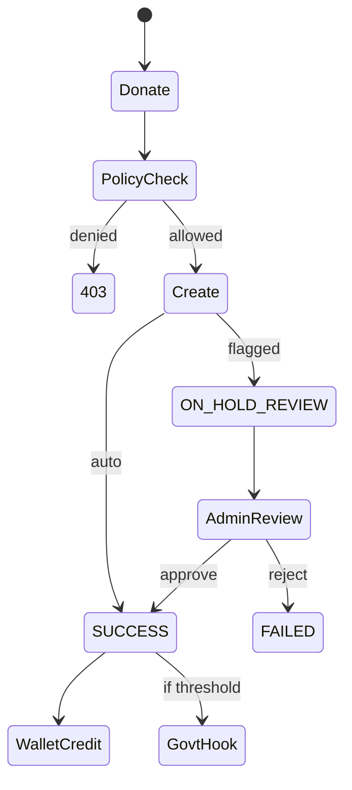

# AML / KYC Flow – Donation & Review

**Purpose:** Donation status machine, admin review, and audit for Global-Ready compliance.

*(Reference: [GLOBAL_READY_FULL_PLANNING.md](./GLOBAL_READY_FULL_PLANNING.md), [GLOBAL_READY_PHASE2_APPLY.md](./GLOBAL_READY_PHASE2_APPLY.md).)*

---

## 1. Donation Status (TransactionStatus)

| Status | Meaning |
|--------|---------|
| SUCCESS | Completed; wallet credited |
| FAILED | Rejected or failed |
| KYC_REQUIRED | Flagged for KYC before completion |
| ON_HOLD_REVIEW | Pending admin review (e.g. threshold or pattern) |

Only `ON_HOLD_REVIEW` and `KYC_REQUIRED` can be updated by admin to SUCCESS or FAILED.

---

## 2. Flow (high level)

```
User donates
    → Policy check (feature DONATION, limits)
    → Create Donation (status SUCCESS or ON_HOLD_REVIEW / KYC_REQUIRED if flagged)
    → If SUCCESS: credit wallet, audit DONATION_CREATED
    → If threshold exceeded: govt reporting hook (log + optional webhook)

Admin review (hold list)
    → GET /api/v1/fundraising/admin/donations/hold?status=ON_HOLD_REVIEW
    → PATCH /api/v1/fundraising/admin/donations/:id/status { status: SUCCESS | FAILED }
    → If SUCCESS: credit wallet, stats, reward points; audit DONATION_STATUS_UPDATE
    → Govt reporting hook if threshold exceeded
```

---

## 3. Audit

- **Entity types:** DONATION, TRANSACTION (and existing ORGANIZATION, BRANCH, OWNER_KYC).
- **Actions:** DONATION_CREATED, DONATION_STATUS_UPDATE.
- **Actor roles:** USER, ADMIN, SUPER_ADMIN, STAFF, OWNER.
- Each donation record stores `policyVersion` and optional `idempotencyKey`.

---

## 4. Govt Reporting Hook

- When donation amount ≥ `GOVT_REPORTING_DONATION_THRESHOLD`, service calls `notifyDonationThresholdExceeded(...)`.
- Logs payload; optionally POSTs to `GOVT_REPORTING_WEBHOOK_URL`.
- Triggered after successful donate and after admin approves a held donation.

---

## 5. Mermaid (simplified)


