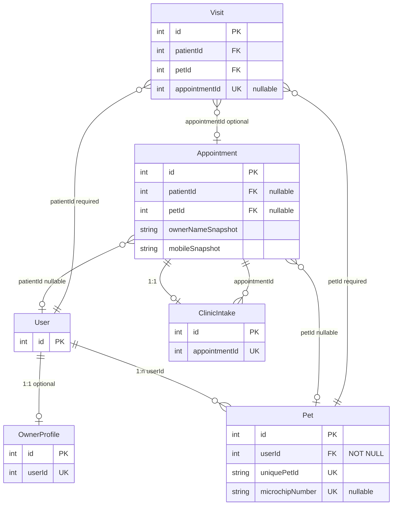

# BPA Clinic + App Owner/Pet Identity — DB Relation and Migration Plan

**Purpose:** Schema relations, constraints, optional migrations, backward compatibility for unified owner/pet identity.

**Reference:** [CLINIC_APP_OWNER_PET_IDENTITY_STRATEGY.md](./CLINIC_APP_OWNER_PET_IDENTITY_STRATEGY.md). **Baseline:** `prisma/schema.prisma`.

---

## 1. Entity relation diagram

---

## 2. Current schema (no change required for User-first)

- **User:** id, status, auth (UserAuth), profile (UserProfile). No change.
- **OwnerProfile:** id, userId (unique), name, supportPhone, supportEmail, addressJson, ... Optional 1:1. No change.
- **Pet:** id, userId (NOT NULL), animalTypeId, breedId, name, uniquePetId (unique), microchipNumber (unique, nullable), ... No change.
- **Appointment:** patientId (nullable), petId (nullable), ownerNameSnapshot, mobileSnapshot, petNameSnapshot, petTypeSnapshot, ... No change.
- **ClinicIntake:** appointmentId (unique). No change.
- **Visit:** patientId (required), petId (required), appointmentId (optional). No change.

---

## 3. Constraints (existing)

| Entity | Constraint | Notes |
|--------|------------|-------|
| Pet | userId NOT NULL | Enforced |
| Pet | microchipNumber UNIQUE | Nullable; enforced when set |
| Pet | uniquePetId UNIQUE | System-generated |
| Appointment | patientId nullable | Snapshot-only allowed |
| Appointment | petId nullable | Snapshot-only allowed |
| Visit | patientId required | No Visit without owner |
| Visit | petId required | No Visit without pet |

---

## 4. Optional migrations (audit / UX)

| Migration | Purpose | Rollback |
|-----------|---------|----------|
| **Appointment.promotedAt** (DateTime? @db.Timestamptz) | Audit when snapshot was promoted to linked | Drop column |
| **Pet.linkedAt** (DateTime? @db.Timestamptz) | Audit when Pet was linked to a different owner via link-owner | Drop column |

Both nullable; no breaking change. Apply only if audit requirements demand.

---

## 5. Index recommendations

- **User:** Lookup by phone/email is via UserAuth (nested). Existing indexes on User; ensure UserAuth has index or unique on (provider, phone) and (provider, email) as per current schema.
- **Pet:** Existing @@index([ownerUserId]) or equivalent; @@index or unique on microchipNumber, uniquePetId. Already present in schema.
- **Appointment:** @@index([patientId]), @@index([branchId, status]). Already present.

No new indexes required for identity strategy unless promoting by mobileSnapshot is queried at scale (then optional index on (branchId, mobileSnapshot) for snapshot-only list).

---

## 6. Backward compatibility

- Snapshot fields (ownerNameSnapshot, mobileSnapshot, petNameSnapshot, petTypeSnapshot) remain. Do not drop; promote flow does not overwrite them (audit trail).
- Existing APIs keep same request/response shapes; new endpoint (link-owner) is additive.
- Visit and Appointment relations unchanged.

---

## 7. Data hygiene

- **Orphan pets:** Pet.userId must reference existing User. If User is soft-deleted or removed, policy: do not hard-delete Pets; reassign (link-owner) or mark Pet.deleted. Optional script: list Pets where User not found or User.status = DELETED.
- **Snapshot-only appointments:** Optional batch job or admin tool to list appointments where patientId is null and scheduledStartAt is in the past; support manual promote or bulk link.
- **Duplicate phone:** ensureOwnerByPhone normalizes phone and finds existing User before create; duplicate User creation avoided by unique phone in UserAuth.

---

## 8. Rollback notes

- If optional columns promotedAt / linkedAt are added: rollback migration drops the columns; application code must treat their absence (no-op).
- No rollback needed for "identity strategy" itself—it is documentation and enforcement of existing schema (User-first).
