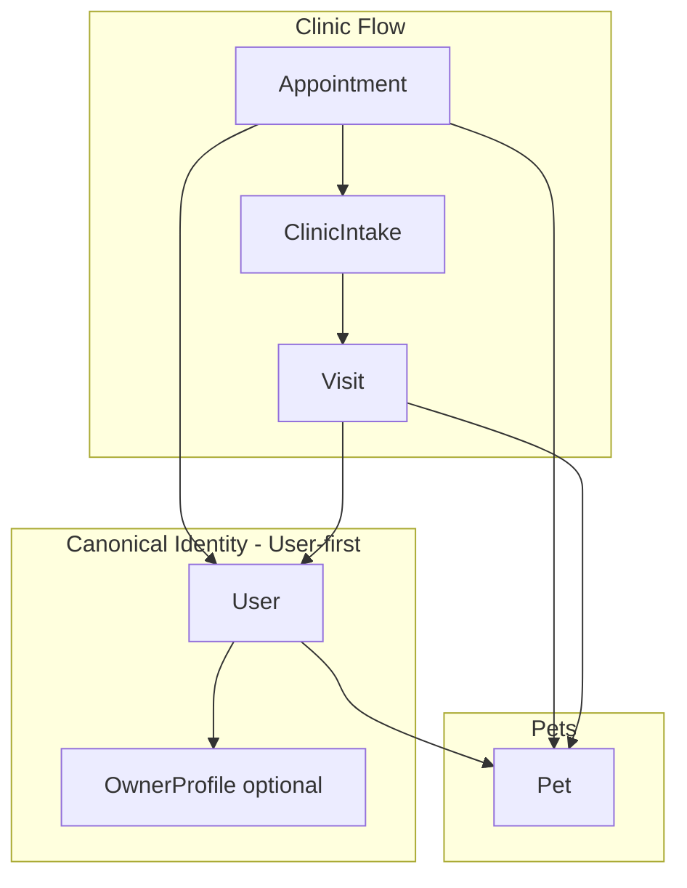

# BPA Clinic + App Unified Owner/Pet Identity Strategy

**Purpose:** Single source of truth for unified owner and pet identity across clinic (staff) and app (owner panel). Ensures clinic-side and app-side registration, owner/user linking, and appointment → intake → visit flow converge to one canonical pet/owner model.

**Baseline:** Backend `backend-api`, Frontend `bpa_web`. BPA_STANDARD.md and PROJECT_CONTEXT.md apply.

---

## 1. Purpose and Scope

- **In scope:** Clinic-side pet registration; app-side pet registration; owner/user linking; appointment → intake → visit flow; canonical pet/owner model; duplicate prevention; snapshot promotion; future auto-link policy. Single identity model shared by clinic and app.
- **Out of scope:** Separate "customer" or "owner" module unrelated to User/Pet; redesign of existing auth or KYC flows beyond linking.

---

## 2. Canonical Identity Decision (MANDATORY)

The system must choose one final model and document it here.

### Option A: User-first identity model

- **User** is the canonical owner identity.
- Clinic creates a **minimal User** (UserAuth.phone, UserProfile.displayName) when needed; no separate Owner entity.
- **OwnerProfile** is optional 1:1 enrichment (name, supportPhone, addressJson) for owner-specific features; can be created when User enters owner panel or when clinic ensures owner.
- **Pet.userId** = User (owner). Appointment/Visit **patientId** = User.
- **Rationale:** Aligns with current schema; no migration; single identity for login and owner context.

### Option B: Owner/Customer-first model with User linking

- A separate **Owner** (or Customer) entity exists; can exist before any User account.
- **Pet** belongs to Owner (Pet.ownerId). Appointment/Visit reference Owner as patient.
- **User** links to Owner when the person signs up (e.g. phone match); User.ownerId or Owner.userId.
- **Rationale:** Separates "customer record" from "login account"; allows multiple Users per Owner (e.g. family) in future. Requires new Owner table, Pet.ownerId, and migration of Appointment/Visit patientId to Owner.

### Final decision

| Decision | Model | Rationale |
|----------|--------|------------|
| **Adopted** | **A) User-first** | Current schema already uses User as owner; Pet.userId, Appointment.patientId, Visit.patientId all reference User. OwnerProfile is optional. No schema change; document and enforce. |

**Migration impact if B were chosen:** New Owner table; Pet.ownerId; Appointment/Visit patientId → Owner; data migration and backfill. Out of scope unless explicitly approved.

---

## 3. Identity Model Definitions

- **Owner/Customer identity (canonical):** In User-first, the owner identity **is** the User. There is no separate Owner entity. "Owner" in clinic context = User (patientId).
- **User Account identity (auth):** User + UserAuth + UserProfile. Same User is used for login and as owner of pets.
- **Clinic-created owner before user signup:** Clinic creates a **minimal User** (phone, displayName) via ensure-owner flow. That User has no password initially; "signup" later = same User adding password/email. No separate "owner profile" record is required before signup.
- **Verified auto-link:** In User-first, when a person signs up with the same phone as a clinic-created User, they are the **same identity** (same User). No merge or link record needed—they log into the existing User. Optional: ensure OwnerProfile exists when they first access owner panel.

---

## 4. Canonical Pet/Patient Model

- **Single Pet entity** shared by clinic and app. No separate "Patient" table; Patient = Pet in clinic context.
- **Pet.userId** = owner (User). **Pet.uniquePetId** (system-generated) and **Pet.microchipNumber** (optional, unique) for identification.
- Clinic and app both create/update the same Pet model; both must set **userId** and adhere to duplicate-prevention rules.

---

## 5. Flow: Appointment → Intake → Visit

- **Appointment:** May be created with **snapshot only** (ownerNameSnapshot, mobileSnapshot, petNameSnapshot, petTypeSnapshot) when owner/pet are not yet linked—e.g. phone-call pre-booking. patientId and petId are nullable. Later resolution: link to User and Pet or promote.
- **Intake:** Reconciliation point for owner/pet. Staff completes intake for an appointment; before or during intake, snapshot-only appointments must be **resolved** (owner lookup → ensure-owner → register/link pet) or **promoted** (set patientId + petId from existing User/Pet). Visit cannot be created without resolved owner and pet.
- **Visit:** Actual treatment object. **petId** and **patientId** (User) are required. Created from queue/check-in when appointment is linked and intake is complete (or not required by policy).

---

## 6. Registration Paths

| Path | Steps | Outcome |
|------|--------|---------|
| **Clinic** | Owner lookup (phone/email) → ensure-owner (create minimal User if needed) → register-patient (Pet with userId) | Pet with userId; optional OwnerProfile creation |
| **App** | Logged-in User → create Pet (userId = req.user.id) | Pet with userId |

Both paths converge to the same canonical model: **Pet** with **userId** (User). No divergence.

---

## 7. Owner ↔ User Auto-Link Policy

- In **User-first**, there is no separate Owner entity to "link." Clinic-created User and app signup with same phone = **same User**.
- **Auto-link** in this model means: when User logs in and their phone matches **Appointment.mobileSnapshot** for snapshot-only appointments, the system may **suggest promoting** those appointments to this User (set patientId, and petId if pet selected or registered). Optional feature: API or UI to "claim" or "link my visits."
- **Verified auto-link rules:** Phone normalized and matched; optional consent/confirmation in UI before promoting. No automatic merge of different Users.

---

## 8. Pet Convergence Policy

- Same pet registered from clinic and from app must resolve to **one Pet record**. Duplicate prevention: **microchipNumber** unique; **uniquePetId** unique; soft check for same **name + userId + animalTypeId** to warn or block duplicate creation when appropriate.
- When clinic registers a pet for a User who already has that pet in the app, prefer **owner lookup** → select existing pet rather than creating a second pet.

---

## 9. Snapshot Promotion Workflow

- **Promote:** Set Appointment.patientId and Appointment.petId from snapshot-only state. Optional: set Appointment.promotedAt (audit).
- **When:** At intake or before check-in/visit creation. Intake is the designated **reconciliation point**—staff must resolve owner/pet before starting visit.
- **How:** POST promote (patientId, petId) or complete intake with linked owner/pet. Snapshot fields (ownerNameSnapshot, mobileSnapshot, etc.) are **retained** for audit; not overwritten.

---

## 10. Branch vs Org Identity Rules

- **Pet** and **User** are **org-agnostic**. They are global identities; not scoped by org or branch.
- **Appointment** and **Visit** are scoped by **orgId** and **branchId**. Same User/Pet can have appointments and visits at different branches. List/filter by branch in clinic APIs.

---

## 11. DB Relation Rules

- **User** ← OwnerProfile (1:1, optional).
- **User** ← Pet (1:n, Pet.userId NOT NULL).
- **Appointment:** patientId → User (nullable for snapshot-only), petId → Pet (nullable).
- **Visit:** patientId → User (required), petId → Pet (required).
- **ClinicIntake:** appointmentId → Appointment (1:1).

---

## 12. API Contracts (Summary)

Full contracts in [CLINIC_APP_OWNER_PET_API_CONTRACTS.md](./CLINIC_APP_OWNER_PET_API_CONTRACTS.md).

| Namespace | Endpoints |
|-----------|-----------|
| **Clinic** `/api/v1/clinic/branches/:branchId/` | owner-lookup, ensure-owner, patients (list, get, register, update, link-owner), appointments/promote |
| **Owner** `/api/v1/owner/` | me/pets, me/pets/:petId |
| **Pets** `/api/v1/pets/` | register, POST / |

---

## 13. Duplicate Prevention Rules

- **Phone:** Normalize (digits-only, leading 0/88 for BD); find existing User before creating.
- **Microchip:** Pet.microchipNumber UNIQUE; reject duplicate on create/update.
- **uniquePetId:** System-generated; UNIQUE.
- **Soft duplicate:** Same userId + name + animalTypeId → warn or block in UI/API (configurable).

---

## 14. Owner/User Linking Strategy

- **findOwner:** Search User by phone or email (owner-lookup).
- **ensureOwner:** Get or create minimal User by phone (ensure-owner).
- **linkPetToOwner:** PATCH patients/:petId/link-owner { userId } — reassign Pet.userId to another User (e.g. correct owner). Permission-gated.
- **promote:** Set appointment patientId and petId from snapshot-only state (appointments/:id/promote).

---

## 15. Status Map

| Entity | States |
|--------|--------|
| **Appointment** | snapshot-only (patientId/petId null) vs linked (both set); status: BOOKED, CHECKED_IN, CANCELLED, NO_SHOW, etc. |
| **Intake** | NOT_STARTED, PARTIAL, COMPLETE |
| **Visit** | CHECKED_IN, IN_PROGRESS, COMPLETED |

---

## 16. Final Architecture Diagram

- **User** = owner identity. **Pet.userId** = User.
- **Appointment** may have snapshot only or linked patientId + petId. **Intake** = reconciliation. **Visit** requires both.

---

## 17. Implementation Goals

- Single source of truth for owner and pet across clinic and app.
- No orphan pets (every Pet has a valid userId).
- Consistent identity: clinic registration and app registration produce the same Pet model.
- Snapshot flow supported; promotion at intake; Visit always linked.
- Duplicate prevention and optional auto-link/promotion on login.

**References:** [CLINIC_APP_OWNER_PET_IMPLEMENTATION_SPEC.md](./CLINIC_APP_OWNER_PET_IMPLEMENTATION_SPEC.md), [CLINIC_APP_OWNER_PET_API_CONTRACTS.md](./CLINIC_APP_OWNER_PET_API_CONTRACTS.md), [CLINIC_APP_OWNER_PET_DB_PLAN.md](./CLINIC_APP_OWNER_PET_DB_PLAN.md).
