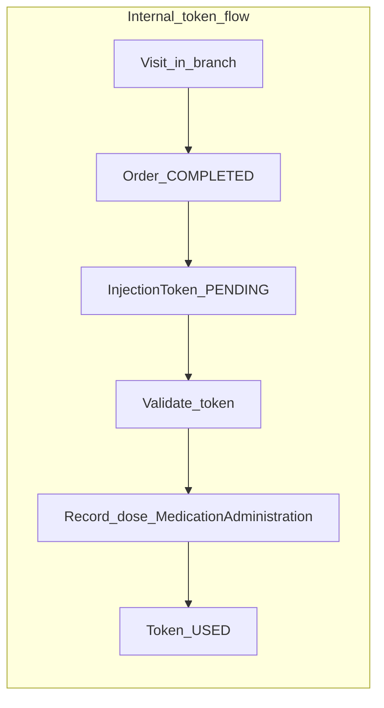

# Clinic Injection Token — Enterprise Audit (codebase-first)

**Date:** 2026-03-23.
**Scope:** End-to-end injection token workflow (staff UI, backend API, Prisma, billing/inventory touchpoints, permissions) audited against internal + external patient business requirements.
**Related docs:** Operational/stabilization focus in [CLINIC_INJECTION_FINAL_AUDIT.md](./CLINIC_INJECTION_FINAL_AUDIT.md), [CLINIC_INJECTION_TOKENS_INJECTION_ROOM_AUDIT.md](./CLINIC_INJECTION_TOKENS_INJECTION_ROOM_AUDIT.md).

---

## 1. Executive Summary

**Readiness verdict: PARTIAL / READY WITH GAPS** (strong internal “visit + paid order + token + vial” path; **weak/missing** for true external prescription / walk-in without full internal shell; **broken/inconsistent** areas around `EXTERNAL` enum vs injection and emergency bypass).

**Summary (facts from code):**

- Staff UI at `bpa_web/app/staff/(larkon)/branch/[branchId]/clinic/medicine-control/injection-tokens/page.tsx` implements list, filters, generate (visit search / verify, Rx/course/day/vial options), validate, detail drawer, cancel.
- Backend `src/api/v1/modules/clinic/injectionToken.service.ts` **always** requires a `Visit` in-branch and a **COMPLETED** `Order` for that visit before creating a token (`generateToken`, approximately lines 63–100).
- Dose recording `src/api/v1/modules/clinic/doseConsumption.service.ts` **rejects** `EXTERNAL` for injection (“take-home sale” semantics, lines 83–86); `OUTSIDE` requires `outsideMedicineService.hasValidOutsideReceive` and forbids vial session; `INTERNAL` requires vial session for mL consumption.
- Prisma model `InjectionToken` in `prisma/schema.prisma` ties `patientId` → `User` and `petId` → `Pet` (required FKs) — no anonymous/guest patient on the token model.
- **Emergency bypass** modal in `bpa_web/app/staff/(larkon)/branch/[branchId]/clinic/medicine-control/injection-room/page.tsx` posts `medicineSource: "INTERNAL"` with **no** `vialSessionId` (`handleEmergencyBypassSubmit`, approximately lines 248–258), which **contradicts** backend rule “Vial session is required for internal medicine dose administration” (`doseConsumption.service.ts` lines 88–90). **Verdict: broken path unless backend is different in deployment (not seen in repo).**
- Generate form allows `medicineSource` **EXTERNAL** on the token (`injection-tokens/page.tsx`, `MEDICINE_SOURCE_OPTIONS`), which makes a token that **cannot** be completed through normal dose recording.

---

## 2. What Exists Today

### Frontend

| Area | Path / symbol |
|------|----------------|
| Injection Tokens page | `bpa_web/app/staff/(larkon)/branch/[branchId]/clinic/medicine-control/injection-tokens/page.tsx` — `staffClinicInjectionTokensList`, `staffClinicGenerateInjectionToken`, `staffClinicValidateInjectionToken`, `staffClinicCancelInjectionToken`, `staffClinicInjectionTokenWithContext`, visit search via `staffClinicVisitsList`, Rx via `staffClinicPrescriptionsByVisit`, courses via `staffClinicTreatmentCoursesList` / `staffClinicTreatmentCourseSchedule`, vials via `staffClinicVialSessionsList`, policies for variant dropdown via `staffClinicMedicinePoliciesList` |
| Injection Room | `bpa_web/app/staff/(larkon)/branch/[branchId]/clinic/medicine-control/injection-room/page.tsx` — validate, context, vial pick, `staffClinicRecordDose`, board `staffClinicInjectionRoomBoard`, rooms `staffClinicRoomsList` |
| Medicine Control hub | `bpa_web/app/staff/(larkon)/branch/[branchId]/clinic/medicine-control/page.jsx` — link to injection-tokens |
| Treatment billing token batch | `bpa_web/app/staff/(larkon)/branch/[branchId]/clinic/treatment-billing/page.tsx` — `staffClinicGenerateInjectionToken` with `orderId`, course/day |
| API client | `bpa_web/lib/api.ts` — `staffClinicGenerateInjectionToken`, `staffClinicValidateInjectionToken`, `staffClinicInjectionTokensList`, `staffClinicCancelInjectionToken`, `staffClinicInjectionTokenWithContext`, `staffClinicRecordDose`, `staffClinicInjectionRoomBoard`, `staffClinicDoseByVisit`, etc. |
| Types | `bpa_web/src/types/clinicMedicineControl.ts` — `InjectionToken`, `MedicineSource`, board shapes |
| Staff nav | `bpa_web/src/lib/branchSidebarConfig.ts` — `medicine-injection-tokens`, `medicine-injection-room` with perms |
| Clinic app menu (non-staff) | `bpa_web/src/lib/permissionMenu.ts` — `clinic.medicineControl.tokens` |
| Doctor visit (read-only tokens) | `bpa_web/app/doctor/(larkon)/visits/[id]/page.tsx`; backend `src/api/v1/modules/doctor/doctor.service.ts` `getVisitById` → `injectionTokens` select |

### Backend

| Area | Path / symbol |
|------|----------------|
| Routes | `src/api/v1/modules/clinic/clinic.routes.ts` — POST `.../medicine-control/injection-token`, GET validate, GET list `.../injection-tokens`, PATCH cancel, GET `.../injection-token/:id/context`, POST dose `.../medicine-control/dose`, GET `.../medicine-control/injection-room/board` |
| Controllers | `src/api/v1/modules/clinic/clinic.controller.ts` — `generateInjectionToken`, `validateInjectionToken`, `cancelInjectionToken`, `listInjectionTokens`, `getInjectionTokenWithContext`, `recordDose`, `getInjectionRoomBoard` |
| Token service | `src/api/v1/modules/clinic/injectionToken.service.ts` — `generateToken`, `validateToken`, `consumeToken`, `cancelToken`, `listTokens`, `getTokenWithTreatmentContext`, `expireStaleTokens` |
| Dose / consumption | `src/api/v1/modules/clinic/doseConsumption.service.ts` — `recordAdministration`, `getConsumptionByVisit` |
| Injection room board | `src/api/v1/modules/clinic/auditIntelligence.service.ts` — `getInjectionRoomBoard` |
| Outside medicine gate | `src/api/v1/modules/clinic/outsideMedicine.service.ts` (referenced from dose service) + model `OutsideMedicineReceive` in schema |
| Audit | Clinic audit actions on generate/validate/cancel/dose in `clinic.controller.ts` |

### Database

- `InjectionToken` (`prisma/schema.prisma`) — `tokenCode`, `branchId`, `visitId`, `prescriptionId?`, `orderId?`, `patientId`, `petId`, `variantId`, `expectedDose`, `unit`, `medicineSource` (`INTERNAL` | `EXTERNAL` | `OUTSIDE`), status enum `PENDING` | `USED` | `EXPIRED` | `CANCELLED`, audit users/timestamps, optional `treatmentCourseId`, `treatmentDayId`, `selectedVialSessionId`.
- `MedicationAdministration` — links `injectionTokenId?` @unique, `visitId?`, vial, `medicineSource`, `emergencyBypassReason`.
- `OutsideMedicineReceive` — branch + variant batch/expiry verification for outside medicine.
- **No** fields on `InjectionToken` for: external prescription image/ref, ad-hoc service fee amount, consumables JSON, or “patient origin” beyond `medicineSource`.

### Billing / inventory (confirmed)

- **Billing linkage:** Token creation requires a **paid** `Order` for the visit (`injectionToken.service.ts`, lines 81–100). There is **no** dedicated “injection administration fee” column on the token; bill composition is whatever the `Order` contains (**line-item semantics for injection fee vs drug not confirmed** without tracing order creation UIs).
- **Inventory:** `INTERNAL` administrations call `openVialService.recordDose` from `doseConsumption.service.ts` when `vialSessionId` is set — reduces vial `remainingQty`. `OUTSIDE` explicitly **no** clinic vial.
- **Settlement / doctor earnings:** No references in `src/api/v1/modules/clinic/settlementHooks.service.ts` to injection tokens or medication administration (**no direct linkage confirmed**).

### Permissions

- Registry: `src/api/v1/services/permissionsRegistry.service.ts` — `injection.token.generate|validate|list|cancel|emergency_bypass`.
- Default role wiring: `src/api/v1/constants/branchRoles.ts`, seed `prisma/seeders/seedRolesPermissions.ts`.
- Route guards: `clinic.routes.ts` (e.g. generate → `injection.token.generate`; list → `list` OR `generate`; validate → validate OR generate OR `medicine.dose.record`; cancel → `injection.token.cancel`; context → validate OR `medicine.dose.record`).

---

## 3. Current Workflow Mapping

- **Internal patient injection:** Register/select visit → ensure **completed payment** on an order for that visit → generate token (optional Rx/course/day/vial) → injection room validate → select vial (if INTERNAL) → record dose → token consumed, vial qty decremented.
- **“External” in business language:** Code maps “brought-in medicine” to enum **`OUTSIDE`**, not `EXTERNAL`. `OUTSIDE` still needs token + `OutsideMedicineReceive` verification; no vial.
- **Billing flow:** Implicit: charges must already be on the **Order** before token generation; token stores `orderId`.
- **Lifecycle:** `PENDING` → validate sets `validatedAt` / `validatedByUserId` → dose `consumeToken` → `USED`; or expiry → `EXPIRED`; or cancel → `CANCELLED`.

---

## 4. Gap Analysis vs Required Business Model

| Requirement | Assessment |
|-------------|------------|
| Internal patients (appointments/visits/Rx) | **Present** — visit-scoped token, optional `prescriptionId`, course/day hooks. |
| External patients (outside Rx, no full internal history) | **Missing / Partial** — still need `User` + `Pet` + `Visit` + paid `Order`; no walk-in-only token; no unstructured external Rx capture on token. |
| Service charge attachable | **Partial** — only via **Order** contents; no token-level fee field; UI does not expose fee composition on token page. |
| Medicine charge if sold by clinic | **Partial** — if billed on same paid order, token can be generated; **not** modeled as separate token line items. |
| Optional consumables / nursing charges | **Missing** — no model/UI on token or administration record for extra charge lines. |
| Billing integration (POS/invoice/visit bill) | **Partial** — `orderId` link; **doctor settlement hooks not found** for injection. |
| Inventory | **Present** for INTERNAL + vial; **correctly absent** for OUTSIDE vial consumption path. |
| Prescription linkage | **Partial** — optional `prescriptionId`; external paper Rx not represented. |
| Walk-in support | **Missing** as first-class flow (must fabricate visit + customer shell). |
| Audit trail | **Present** — token user/timestamps + clinic audit actions; administration has `administeredBy`, bypass reason. |
| Role permissions | **Present** — granular injection permissions; doctor UI read-only on visit. |

**EXTERNAL enum:** **Broken** for end-to-end injection (token can be created with `EXTERNAL`, dose recording rejects it).

**Emergency bypass:** **Broken** as implemented (INTERNAL without vial).

---

## 5. Route / API / Model Inventory

**Frontend routes (staff):**

- `/staff/branch/:branchId/clinic/medicine-control/injection-tokens`
- `/staff/branch/:branchId/clinic/medicine-control/injection-room`
- Related: `.../medicine-control`, `.../clinic/treatment-billing`, `.../clinic/visits/:visitId`

**Frontend API (`bpa_web/lib/api.ts`):** `staffClinicGenerateInjectionToken`, `staffClinicValidateInjectionToken`, `staffClinicInjectionTokensList`, `staffClinicCancelInjectionToken`, `staffClinicInjectionTokenWithContext`, `staffClinicRecordDose`, `staffClinicInjectionRoomBoard`, `staffClinicDoseByVisit`, …

**Backend endpoints (branch-scoped clinic router, `clinic.routes.ts`):**

- `POST /branches/:branchId/medicine-control/injection-token`
- `GET /branches/:branchId/medicine-control/injection-token/validate`
- `GET /branches/:branchId/medicine-control/injection-tokens`
- `PATCH /branches/:branchId/medicine-control/injection-token/:id/cancel`
- `GET /branches/:branchId/medicine-control/injection-token/:id/context`
- `POST /branches/:branchId/medicine-control/dose`
- `GET /branches/:branchId/medicine-control/injection-room/board`

**DB models:** `InjectionToken`, `MedicationAdministration`, `Order`, `Visit`, `Prescription`, `VialSession`, `OutsideMedicineReceive`, `DispenseRequest` (tokenId trigger), enums `InjectionTokenStatus`, `MedicineSource`.

---

## 6. Risks and Hidden Problems

1. **Semantic trap:** UI label “External” = enum `EXTERNAL` (take-home) vs business “external prescription” expected as **`OUTSIDE`** + verification.
2. **Dead or misleading token states:** Tokens generated with `EXTERNAL` may be undeliverable in injection room.
3. **Emergency bypass** UI/backend mismatch (INTERNAL + no vial).
4. **`submitDose(e, true)`** path appears **unused** (only `false` is passed from the record form) — dead code branch.
5. **Operational dependency:** `OUTSIDE` injections fail without prior `OutsideMedicineReceive` — staff training / UI clarity risk.
6. **No settlement attribution** traced from injection administration — financial reporting gap **if** expected.
7. **AccessDenied** on injection-room uses `medicine.dose.record` only in message while route allows validate-only users — **minor UX inconsistency** (perm check still passes with validate).

---

## 7. Implementation Backlog Recommendation

**P0 — Blockers**

- Fix **emergency bypass** contract: either require `vialSessionId` in modal for INTERNAL, or backend exception for audited bypass, or use a different `medicineSource` rule — **must align UI and `recordAdministration`**.
- Remove or block **EXTERNAL** on token generation for injection-intended flows, **or** redefine enum and dose rules with clear product copy.

**P1 — Core business**

- **External / walk-in injection:** design `Visit` (or lightweight encounter) + **billing** path that does not require full consult history; optional structured “external Rx” capture; clarify `OUTSIDE` workflow in UI (rename labels, link to outside receive).
- **Explicit service fee + medicine lines** on order or token metadata; staff UI to confirm charges before token issue.

**P2 — Enterprise hardening**

- Filter/list by `medicineSource`; reporting; link to settlement if required by finance.
- Defensive nulls on injection-room board (`expiredOrProblemToday`) per prior audit doc.

**P3 — Nice-to-have**

- Owner-facing read APIs (section header in `bpa_web/app/owner/_lib/ownerApi.ts` — **full owner UX not audited here**).

---

## 8. Recommended Target Architecture

- **Encounter model:** `Visit` or `ClinicEncounter` with type `INTERNAL_CONSULT` vs `INJECTION_ONLY` / `EXTERNAL_RX` supporting minimal chart.
- **Token:** `origin` (INTERNAL_RX | EXTERNAL_RX | COURSE_DAY), `medicineSource` aligned with dose rules, optional `externalRxRef` (JSON/media).
- **Billing:** `Order` with explicit line kinds: `INJECTION_SERVICE`, `DRUG_DISPENSE`, `CONSUMABLE`; token holds `orderId` + optional line references.
- **Dose:** unchanged principle: INTERNAL → vial + stock; OUTSIDE → verification record, no vial; audit on all paths.
- **Lifecycle:** keep current enum; add explicit user-facing labels.

---

## 9. Exact Files Likely to Change Next Phase

**Backend:** `src/api/v1/modules/clinic/injectionToken.service.ts`, `src/api/v1/modules/clinic/doseConsumption.service.ts`, `src/api/v1/modules/clinic/clinic.controller.ts`, `src/api/v1/modules/clinic/clinic.routes.ts`, `prisma/schema.prisma` + migration, possibly order/invoice services for injection-only billing.

**Frontend:** `bpa_web/app/staff/(larkon)/branch/[branchId]/clinic/medicine-control/injection-tokens/page.tsx`, `bpa_web/app/staff/(larkon)/branch/[branchId]/clinic/medicine-control/injection-room/page.tsx`, `bpa_web/lib/api.ts`, `bpa_web/src/types/clinicMedicineControl.ts`, `bpa_web/src/lib/branchSidebarConfig.ts` if new routes.

**Docs:** This audit file; optional cross-link from [CLINIC_INJECTION_FINAL_AUDIT.md](./CLINIC_INJECTION_FINAL_AUDIT.md).

---

## 10. Final Verdict

- **How much is built?** A **solid internal anti-fraud gate**: token tied to paid order and visit, validation, cancellation, injection room workflow, vial consumption for internal medicine, outside medicine verification gate, operations board, doctor read-only visibility.
- **What is missing for internal + external injection?** **External/walk-in** without registered patient + visit + paid order; **first-class injection service fee and consumables**; **clear “external Rx” data**; **financial settlement tie-in** (not found). Enum/naming **EXTERNAL** vs **OUTSIDE** conflicts with real-world “external patient.”
- **Implement first next?** **P0:** fix bypass + EXTERNAL inconsistency; **P1:** product/legal workflow for injection-only visit + billing + optional external Rx record.

---

### Assumptions explicitly not confirmed from code

- Exact **order line types** available in UI for “injection administration only” pricing.
- Whether production DB constraints differ from `schema.prisma`.
- Full **owner API** injection/reconciliation behavior beyond comment in `ownerApi.ts`.

---

## 11. Post-implementation pointer (2026-03-23)

Subsequent releases added enterprise `MedicineSource`, walk-in visit + **`billingCheckout`** (real orders), settlement hook, external Rx upload, and internal rollout documentation. This document remains a **point-in-time audit**; current behavior and finance/inventory limits are summarized in [CLINIC_INJECTION_TOKEN_IMPLEMENTATION_REPORT.md](./CLINIC_INJECTION_TOKEN_IMPLEMENTATION_REPORT.md) and [CLINIC_INJECTION_TOKEN_INTERNAL_ROLLOUT_NOTE.md](./CLINIC_INJECTION_TOKEN_INTERNAL_ROLLOUT_NOTE.md).
