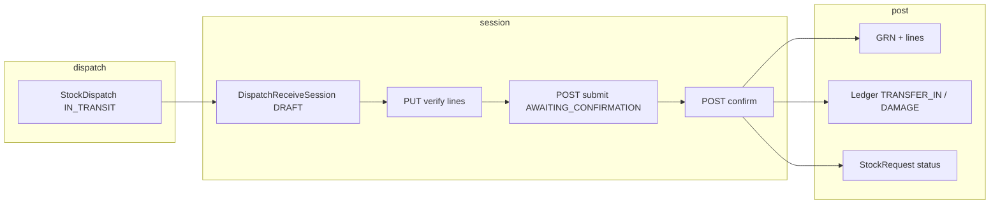

# Delivery system — final validation checklist

> **Last updated:** 2026-04-11
> **Use when:** release candidate for canonical enterprise delivery

## Preconditions

- [ ] `npx prisma validate` — pass
- [ ] `npx prisma generate` — pass
- [ ] `node scripts/check-migration-integrity.js` — no unexpected drift (or governed `--fix`)
- [ ] `npx prisma migrate deploy` — success on **staging** DB (never reset production-like DB per policy)

## Shadow / CI

- [x] `npx prisma migrate diff --from-migrations prisma/migrations --to-schema prisma/schema.prisma` — **passes** (2026-04-11); review any small drift SQL output vs intentional schema

## Receive flow (enterprise) — diagram

- **GRN:** One GRN per **confirm** that posts ledger (`receiveDispatchLedgerInTx`). Partial receives on the same dispatch may run multiple confirms until the dispatch line totals match `quantityDispatched`; dispatch becomes **`DELIVERED`** when all lines are fully accounted.
- **Stock request status (`markStockRequestStatusFromDispatchReceive`):**
  - Any `StockDispatch` not yet **`DELIVERED`** → **`PARTIALLY_RECEIVED`**
  - All **`DELIVERED`** and all lines accounted → **`RECEIVED`**
- **Optional:** `ENTERPRISE_DISPATCH_RECEIVE_SESSION_ONLY=true` disables immediate `legacy_immediate` receive; use verify → submit → confirm only.

## API smoke (enterprise)

- [ ] `POST /api/v1/fulfillment/stock-requests/:id/start` — creates/returns plan
- [ ] `POST /api/v1/allocation-plans/:id/confirm` — CONFIRMED, optional demand/backorder
- [ ] `POST /api/v1/pick-lists/from-plan/:planId` — first wave; second call after **handoff** of completed wave — second pick list with **remaining** lines only; plan `PARTIALLY_DISPATCHED` after first handoff when qty remains
- [ ] `POST /api/v1/inventory/dispatches` + `.../send` — IN_TRANSIT
- [ ] Receive session: `PUT .../dispatches/:id/receive-session` (verify) → `POST .../submit` → `POST .../confirm` — GRN, ledger, `StockDispatch` → `DELIVERED` when line complete; `StockRequest` → `PARTIALLY_RECEIVED` or `RECEIVED` (multi-DO aggregation)
- [ ] **Single DO full receive:** confirm full qty → SR `RECEIVED` if no other open DOs
- [ ] **Multi-wave:** DO1 receive → SR `PARTIALLY_RECEIVED`; DO2 receive → SR `RECEIVED`
- [ ] **Partial line receive:** dispatch 60, receive 50 good + 0 short → DO stays `IN_TRANSIT`, SR `PARTIALLY_RECEIVED`; second confirm for 10 → `DELIVERED`, then SR per aggregation above
- [ ] **Damage:** 55 good + 5 damaged → ledger `TRANSFER_IN` + `DAMAGE`; totals must not exceed dispatched per line
- [ ] **Legacy blocked:** `PATCH /api/v1/stock-requests/:id/fulfill` with existing `StockDispatch` → **409** `ENTERPRISE_DISPATCH_BLOCKS_LEGACY`
- [ ] **Transfer receive blocked:** `POST` transfer receive when SR has `StockDispatch` → error (no SR status mutation from transfer)

## Owner UI

- [ ] Enterprise card visible; legacy quick dispatch **hidden** when `hideLegacyOwnerFulfillUi` (plan, enterprise dispatch, or `DISABLE_LEGACY_STOCK_REQUEST_FULFILL`)
- [ ] Internal transfer shows fulfillment guide alert

## Browser QA

- [ ] Full matrix in `DELIVERY_SYSTEM_MASTER_EXECUTION_PLAN.md` § Browser QA Matrix (when phases 5–10 complete)
- [ ] **Partial dispatch / multi-wave:** allocate 60; pick 40; complete picking; handoff → plan `PARTIALLY_DISPATCHED`; generate next pick list → 20 on line; complete + handoff → plan `DISPATCHED`

## Sign-off

- [ ] Product owner
- [ ] Engineering lead
