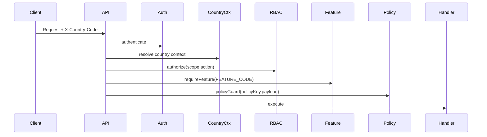

# Global Architecture (Country-First)

Purpose: define the Global -> Country -> Org/Branch architecture and the
mandatory request gate for all modules. This document is additive and
compatible with existing BPA_STANDARD rules (ports, merge-only).

## 1) Layers

1. Global layer
   - Owns: countries, global policies, compliance baseline, global roles.
2. Country layer
   - Owns: country policy, feature toggles, country staff, legal configs.
3. Org/Branch layer
   - Owns: operational data (organizations, branches, services, orders, etc.)

## 2) Data scope rules

- Country scoped data must always be resolved via `req.countryContext`.
- Org/Branch data must be bound to a country (via organization binding).
- Cross-country access is denied by default (guard middleware).

## 3) Mandatory request gate (all endpoints)

## 4) Country resolution order

1. Header: `X-Country-Code`
2. Authenticated user country role
3. Organization country
4. Default `COUNTRY_DEFAULT` (BD)

## 5) Ports (fixed)

See [infrastructure/PORT_AND_DOMAIN_MAP.md](./infrastructure/PORT_AND_DOMAIN_MAP.md) for the full matrix.

- API: **3000** (`backend-api`)
- **bpa_web** panels: **3100–3107** (mother/staff, shop, clinic, admin, owner, producer, country, doctor)
- **bpa-landing:** **3101** (apex marketing; local conflict with bpa_web shop — separate containers in production)
- **vaccination_2026:** **3110** (campaign subdomain)
- Reserved: **3111–3119** (future standalone frontends)

## 6) Additive-only policy

- No breaking changes to existing endpoints.
- All new features must be merge-only and backward compatible.

