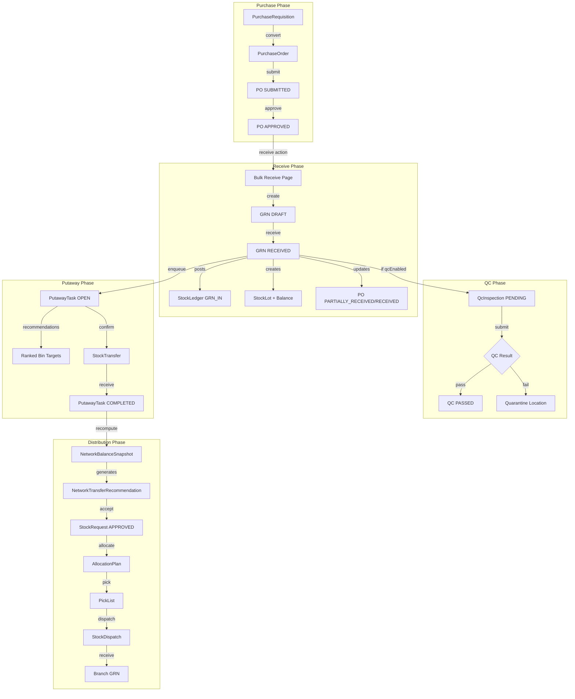

# PO → GRN → QC → Batch → Putaway → Distribution: Enterprise Implementation Plan

**Document path:** `docs/PO_TO_GRN_QC_BATCH_PUTAWAY_DISTRIBUTION_ENTERPRISE_PLAN.md`
**Created:** 2026-04-03
**Governance:** Follow [`WINDSURF_GLOBAL_RULE.md`](./WINDSURF_GLOBAL_RULE.md) and [`PRISMA_MIGRATION_NON_DESTRUCTIVE_POLICY.md`](./PRISMA_MIGRATION_NON_DESTRUCTIVE_POLICY.md)

---

## 1. Executive Summary

This plan completes the missing enterprise flow:

```
PO Detail "Receive against PO"
    → GRN created (draft or direct)
    → Batch/expiry/barcode/QC captured
    → Inventory posted to warehouse/quarantine
    → PO received qty updated
    → All GRNs visible on PO
    → Putaway done (staging → storage)
    → Branch distribution suggestion/generation
    → Internal transfer to branches
```

**Key finding:** The majority of this flow is **already implemented** in backend services. The gaps are primarily in:
- UI polish and workflow connections
- Staff-side warehouse receiving UX
- Putaway recommendations usage in UI
- Distribution execution from recommendations
- Audit trail completeness for stock requests

---

## 2. Current-State Audit

### 2.1 Backend Implementation Status

| Component | Status | Key Files |
|-----------|--------|-----------|
| **PurchaseOrder** | Complete | `purchaseOrder.service.ts`, `purchaseOrder.controller.ts` |
| **PurchaseOrderLine** | Complete | Schema + service |
| **PO Lifecycle** | Complete | DRAFT→SUBMITTED→APPROVED→PARTIALLY_RECEIVED→RECEIVED |
| **GRN/GrnLine** | Complete | `grn.service.ts` with PO linkage |
| **GRN Receive** | Complete | `receiveGrn` posts GRN_IN, updates PO |
| **Bulk Receive** | Complete | `createAndReceiveGrn` with idempotency |
| **StockLot** | Complete | Lot/batch/expiry tracking |
| **Barcode Capture** | Complete | `GrnLine.supplierBarcode`, `StockLot.supplierBarcode` |
| **QcInspection** | Complete | Post-receive QC with quarantine |
| **PutawayTask** | Complete | `putawayTask.service.ts` with recommendations |
| **PutawayRecommendation** | Complete | `putawayRecommendation.service.ts` |
| **InboundShipment** | Complete | ASN-style with PO links |
| **InboundDiscrepancy** | Complete | GRN/PO line variance tracking |
| **StockTransfer** | Complete | Location-to-location transfers |
| **StockDispatch** | Complete | Branch fulfillment with GRN on receive |
| **StockRequest** | Complete | Branch replenishment workflow |
| **NetworkTransferRecommendation** | Complete | Distribution suggestions |
| **Warehouse/Branch** | Complete | WAREHOUSE_DC convergence |

### 2.2 Frontend Implementation Status

| Component | Status | Location |
|-----------|--------|----------|
| **Owner PO List/Detail** | Complete | `app/owner/(larkon)/inventory/purchase-orders/` |
| **Owner PO Create** | Needs polish | JSON lines → proper form needed |
| **"Receive against PO" Link** | Complete | Deep link to bulk receive |
| **Bulk Receive Page** | Complete | `receipts/bulk/BulkReceivePage.tsx` |
| **GRN Detail** | Complete | `app/owner/(larkon)/inventory/grn/[id]/` |
| **Receipts List** | Complete | `app/owner/(larkon)/inventory/receipts/` |
| **Putaway Queue (Owner)** | Complete | `app/owner/(larkon)/inventory/putaway/` |
| **QC Queue (Owner)** | Complete | `app/owner/(larkon)/inventory/qc-queue/` |
| **Quarantine (Owner)** | Complete | `app/owner/(larkon)/inventory/quarantine/` |
| **Inbound Shipments List** | Partial | List only, no create/detail |
| **Distribution Recommendations** | Complete | `app/owner/(larkon)/inventory/distribution/` |
| **Stock Requests (Owner)** | Complete | `app/owner/(larkon)/inventory/stock-requests/` |
| **Stock Requests (Staff)** | Complete | `app/staff/(larkon)/branch/.../inventory/stock-requests/` |
| **Staff Receive Dispatch** | Complete | `app/staff/(larkon)/branch/.../inventory/receive-dispatch/` |
| **Staff Putaway** | Missing | No staff putaway UI |
| **Staff QC** | Complete | `app/staff/(larkon)/branch/.../warehouse/qc/` |

### 2.3 Prisma Models (Key Schema References)

```
PurchaseOrder        → PurchaseOrderLine
        ↓
Grn                  → GrnLine (purchaseOrderLineId)
        ↓
StockLedger          ← GRN_IN type
StockLot             ← lotCode, expDate, supplierBarcode
StockLotBalance      ← per location qty
QcInspection         ← PENDING/PASSED/FAILED
PutawayTask          ← OPEN/COMPLETED
        ↓
StockTransfer        ← putaway confirm creates transfer
        ↓
NetworkTransferRecommendation  ← distribution suggestions
        ↓
StockRequest/StockDispatch     ← branch fulfillment
```

### 2.4 Key Service Methods (Backend)

| Service | Method | Purpose |
|---------|--------|---------|
| `grn.service.ts` | `createGrn` | Draft GRN with PO line resolution |
| `grn.service.ts` | `receiveGrn` | Post GRN_IN, create lots, update PO, enqueue putaway |
| `grn.service.ts` | `createAndReceiveGrn` | Atomic bulk receive |
| `purchaseOrder.service.ts` | `applyGrnReceiveToPurchaseOrder` | Update PO line receivedQty |
| `putawayTask.service.ts` | `enqueuePutawayTasksAfterGrnReceive` | Create putaway tasks |
| `putawayTask.service.ts` | `confirmPutawayTask` | Execute transfer to storage |
| `putawayRecommendation.service.ts` | `computePutawayRecommendations` | Rank bin targets |
| `qcInspection.service.ts` | `submitInspection` | QC disposition |
| `networkBalance.service.ts` | `acceptRecommendation` | Create WTO or stock request |
| `dispatches.service.ts` | `createDispatch` | Branch dispatch |
| `dispatches.service.ts` | `receiveDispatch` | Branch receive + GRN |

---

## 3. Reuse Map

### 3.1 Backend Services to Reuse (No Changes Needed)

| Service | Reuse As-Is |
|---------|-------------|
| `grn.service.ts` | Full GRN lifecycle |
| `purchaseOrder.service.ts` | PO lifecycle + GRN rollup |
| `ledger.service.ts` | `recordLedgerEntryInTx` |
| `putawayTask.service.ts` | Task CRUD + confirm |
| `putawayRecommendation.service.ts` | Bin ranking |
| `qcInspection.service.ts` | QC workflow |
| `networkBalance.service.ts` | Distribution recommendations |
| `dispatches.service.ts` | Branch dispatch/receive |
| `stock_requests.service.ts` | Stock request workflow |
| `transfers.service.ts` | Internal transfers |
| `warehouseAudit.service.ts` | Audit event logging |

### 3.2 Frontend Components to Reuse

| Component | Location | Reuse For |
|-----------|----------|-----------|
| `VendorLookup.jsx` | `app/owner/_components/` | PO vendor search |
| `ProductBrowserPanel.tsx` | `receipts/bulk/` | Variant search |
| `SelectedReceiveGrid.tsx` | `receipts/bulk/` | Line entry grid |
| `DispatchReceiveDrawer.jsx` | `staff/.../receive/_components/` | Staff receive |
| Table patterns | `purchase-orders/`, `receipts/` | List pages |
| Form patterns | `stock-requests/new/` | Create forms |

### 3.3 API Helpers to Reuse (`lib/api.ts`)

| Helper | Used By |
|--------|---------|
| `purchaseOrdersList/Get/Create/Action` | PO pages |
| `grnGet` | GRN detail (currently unused, prefer `ownerGet`) |
| `putawayTasksList`, `putawayTaskConfirm` | Putaway pages |
| `qcInspectionsList`, `qcInspectionSubmit` | QC pages |
| `staffReceiveDispatch` | Staff receive |
| `staffStockRequestCreate/Submit` | Staff requests |
| `networkBalanceRecompute` | Distribution trigger |

---

## 4. Gap Analysis

### 4.1 Critical Gaps (Must Fix)

| Gap | Impact | Resolution |
|-----|--------|------------|
| **PO Create UX** | JSON textarea unusable | Replace with proper form + line builder |
| **Staff Putaway UI** | Warehouse staff cannot execute putaway | Add `app/staff/.../warehouse/putaway/` |
| **putawayRecommendations API unused** | Users see task list but not ranked suggestions | Call API and display in putaway UI |
| **Stock request audit gap** | `auditStockRequest` exported but never called | Add audit calls to stock request service |

### 4.2 Important Gaps (Should Fix)

| Gap | Impact | Resolution |
|-----|--------|------------|
| **Inbound shipment create/detail** | Cannot create ASN from UI | Add create page + detail page |
| **GRN void UI** | Cannot void draft GRN from UI | Add void button on GRN detail |
| **allocationPlanFromStockRequest unused** | Enterprise fulfillment path not accessible | Wire to stock request detail |
| **Distribution execute button** | Recommendations visible but not actionable | Add "Execute" CTA |

### 4.3 Nice-to-Have Gaps (Can Defer)

| Gap | Impact | Notes |
|-----|--------|-------|
| Received GRN void + ledger reversal | Cannot reverse posted GRN | Complex; documented as future |
| QC receive-to-hold-before-ledger | Inventory shows before QC pass | Policy change; requires config |
| PO line picker for duplicate variants | Manual purchaseOrderLineId entry | Edge case; document SOP |

---

## 5. Target End-to-End Architecture



---

## 6. Data Model Changes Needed

### 6.1 No Schema Changes Required

The existing schema fully supports the enterprise flow. All required models exist:
- `PurchaseOrder`, `PurchaseOrderLine`
- `PurchaseRequisition`, `PurchaseRequisitionLine`
- `Grn`, `GrnLine`
- `StockLot`, `StockLotBalance`, `StockLedger`
- `QcInspection`
- `PutawayTask`
- `InboundShipment`, `InboundShipmentLine`
- `InboundDiscrepancy`
- `StockRequest`, `StockRequestItem`
- `StockDispatch`, `StockDispatchItem`
- `StockTransfer`, `StockTransferItem`
- `NetworkTransferRecommendation`
- `AllocationPlan`, `PickList`

### 6.2 Potential Future Enhancements (Not Required Now)

| Model | Enhancement | When |
|-------|-------------|------|
| `QcInspection` | `receivedToHoldPolicy` flag | If pre-ledger QC needed |
| `Grn` | Void reversal fields | If received GRN void needed |
| `PurchaseOrder` | Attachment relation | If PO docs needed |

---

## 7. Enum/Status Design (Already Complete)

### 7.1 PurchaseOrderStatus
```
DRAFT → SUBMITTED → APPROVED → PARTIALLY_RECEIVED → RECEIVED
                  ↘ REJECTED
         ↘ CANCELLED
```

### 7.2 GrnStatus
```
DRAFT → RECEIVED
      ↘ VOIDED (draft only)
```

### 7.3 QcInspectionStatus
```
PENDING → PASSED | FAILED | PARTIAL
```

### 7.4 PutawayTask Status
```
OPEN → COMPLETED | CANCELLED
```

### 7.5 StockRequestStatus
```
DRAFT → SUBMITTED → OWNER_REVIEW → APPROVED → PARTIALLY_DISPATCHED → DISPATCHED → RECEIVED_FULL
```

### 7.6 StockDispatchStatus
```
CREATED → PACKED → IN_TRANSIT → DELIVERED
```

---

## 8. API/Route/Service Changes Needed

### 8.1 No New Routes Required

All required routes exist:
- `POST/GET /api/v1/purchase-orders`
- `POST/GET /api/v1/grn`
- `POST /api/v1/grn/:id/receive`
- `POST /api/v1/inventory/receipts/bulk`
- `GET /api/v1/putaway/tasks`
- `POST /api/v1/putaway/tasks/:id/confirm`
- `GET /api/v1/putaway/recommendations`
- `GET/POST /api/v1/qc-inspections`
- `GET/POST /api/v1/stock-requests`
- `GET/POST /api/v1/dispatches`
- `GET/POST /api/v1/network-balance`

### 8.2 Service Enhancements (Minor)

| Service | Change | Priority |
|---------|--------|----------|
| `stock_requests.service.ts` | Add `auditStockRequest` calls on status changes | High |
| `purchaseOrder.service.ts` | Add `logWarehouseAudit` on approve/reject | Medium |
| `networkBalance.service.ts` | Ensure `acceptRecommendation` creates auditable stock request | Medium |

---

## 9. UI/Page/Component Changes Needed

### 9.1 Owner Panel Changes

| Page | Change | Priority | Files |
|------|--------|----------|-------|
| **PO Create** | Replace JSON with form + line builder | High | `purchase-orders/new/page.tsx`, `_components/PurchaseOrderCreateForm.tsx` |
| **PO Detail** | Polish totals, actors, pending qty | Medium | `purchase-orders/[id]/page.tsx` |
| **Putaway** | Display recommendations from API | Medium | `putaway/page.tsx` |
| **Distribution** | Add "Execute" button | Medium | `distribution/page.tsx` |
| **Inbound Shipment** | Add create + detail pages | Low | New: `inbound-shipments/new/`, `[id]/` |
| **GRN Detail** | Add void button for draft | Low | `grn/[id]/page.tsx` |

### 9.2 Staff Panel Changes (New)

| Page | Description | Priority | Files |
|------|-------------|----------|-------|
| **Staff Putaway Queue** | List open tasks for branch warehouse | High | New: `app/staff/(larkon)/branch/[branchId]/warehouse/putaway/page.tsx` |
| **Staff Putaway Confirm** | Show recommendations, confirm move | High | New: `app/staff/(larkon)/branch/[branchId]/warehouse/putaway/[taskId]/page.tsx` |

### 9.3 Component Reuse Map

| New Component | Reuse From |
|---------------|------------|
| PO Line Builder | `SelectedReceiveGrid.tsx` pattern |
| Variant Search | `ProductBrowserPanel.tsx` |
| Putaway Task Table | `putaway/page.tsx` (owner) |
| Putaway Confirm Form | Location select pattern from transfers |

---

## 10. Permission/RBAC Changes Needed

### 10.1 Existing Permissions (Sufficient)

| Permission | Use |
|------------|-----|
| `procurement.po.view` | View PO |
| `procurement.po.manage` | Create/edit/submit PO |
| `inbound.grn` | Create/receive GRN |
| `warehouse.operations` | Putaway access |
| `qc.inspect`, `qc.release` | QC workflow |
| `distribution.view`, `distribution.execute` | Distribution |
| `dispatch.create`, `dispatch.manage` | Branch dispatch |

### 10.2 Permission Enforcement Gaps to Fix

| Route | Current | Should Be |
|-------|---------|-----------|
| `grn.routes.ts` | `authenticateToken` only | Add `requirePermission('inbound.grn')` |
| `purchaseOrder.routes.ts` | `authenticateToken` only | Add `requirePermission('procurement.po.manage')` |
| `putaway.routes.ts` | `authenticateToken` only | Add `requirePermission('warehouse.operations')` |

### 10.3 Seed/Registry Alignment

| Issue | Fix |
|-------|-----|
| `inventory.adjust` in seed roles but not in permissions table | Add to `permissions` array in `seedRolesPermissions.ts` |
| `inventory.transfer` in registry but not seeded | Add to seed |
| `inventory.update` vs `inventory.write` confusion | Document canonical usage; prefer `inventory.update` |

---

## 11. Audit/Activity Requirements

### 11.1 Current Audit Coverage

| Flow | Audit | Via |
|------|-------|-----|
| PO Submit | `PO_SUBMIT` | `WarehouseAuditEvent` |
| PO Cancel | `PO_CANCEL` | `WarehouseAuditEvent` |
| GRN Receive | `GRN_POSTED` | `WarehouseAuditEvent` |
| Dispatch Create | `CREATE` | `AuditLog` |
| Dispatch Receive | `RECEIVE_DISPATCH` | `AuditLog` |
| Putaway Confirm | `PUTAWAY_CONFIRM` | `WarehouseAuditEvent` |
| QC Submit | `QC_SUBMIT` | `WarehouseAuditEvent` |
| Transfer Receive | `TRANSFER_RECEIVE` | `WarehouseAuditEvent` |

### 11.2 Missing Audit (To Add)

| Flow | Event | Add To |
|------|-------|--------|
| PO Approve | `PO_APPROVE` | `purchaseOrder.service.ts` |
| PO Reject | `PO_REJECT` | `purchaseOrder.service.ts` |
| Stock Request Submit | `STOCK_REQUEST_SUBMIT` | `stock_requests.service.ts` |
| Stock Request Approve | `STOCK_REQUEST_APPROVE` | `stock_requests.service.ts` |
| Stock Request Decline | `STOCK_REQUEST_DECLINE` | `stock_requests.service.ts` |
| Distribution Accept | `DISTRIBUTION_ACCEPT` | `networkBalance.service.ts` |

---

## 12. Safe Transaction/Idempotency Rules

### 12.1 Existing Idempotency

| Operation | Key | Behavior |
|-----------|-----|----------|
| GRN Receive | `Grn.receiveIdempotencyKey` | Returns existing if RECEIVED |
| Dispatch Receive | `Grn.idempotencyKey` + `stockDispatchId` | Prevents duplicate GRN |
| Bulk Receive | `Idempotency-Key` header | Uses `receiveIdempotencyKey` |

### 12.2 Transaction Rules

| Operation | Must Be Atomic |
|-----------|----------------|
| GRN Receive | Ledger + Lot + Balance + PO update |
| Putaway Confirm | Transfer create + send + receive |
| QC Quarantine | QC_REJECT + QUARANTINE_IN ledger |
| Dispatch Send | TRANSFER_OUT + reserve release |

### 12.3 Rollback Behavior

| Scenario | Current | Recommendation |
|----------|---------|----------------|
| Partial GRN receive failure | Transaction rollback | Keep as-is |
| Putaway confirm partial | Transfer may be sent but not received | Add retry logic or manual reconciliation |
| Posted GRN reversal | Not supported | Document as future enhancement |

---

## 13. Putaway and Quarantine Handling

### 13.1 Putaway Flow (Implemented)

1. **GRN Receive** → `enqueuePutawayTasksAfterGrnReceive` creates `PutawayTask` per line
2. **Trigger condition**: `grn.location.warehouseId` must be set
3. **Recommendation**: `computePutawayRecommendations` ranks bins by:
   - Zone purpose (STORAGE, PICKING, GENERAL)
   - SKU affinity (same variant already in bin)
   - Capacity (`WarehouseBin.maxUnits`)
   - Mixed SKU policy (`allowMixedSku`)
4. **Confirm**: `confirmPutawayTask` executes `createTransfer` → `sendTransfer` → `receiveTransfer`
5. **Audit**: `PUTAWAY_CONFIRM` logged

### 13.2 Quarantine Handling

| Path | Mechanism |
|------|-----------|
| QC Failure | `QcInspection.disposition = QUARANTINE` → ledger `QC_REJECT` + `QUARANTINE_IN` |
| Quarantine Location | `InventoryLocationType.QUARANTINE` or `DAMAGE_AREA` |
| FEFO Exclusion | `fefoAllocation.service.ts` excludes quarantine location types |
| Release | `releaseFromQuarantine` → `QUARANTINE_OUT` + `TRANSFER_IN` |
| Dispose | `disposeQuarantine` → `LOSS` ledger |
| Recall | `batchRecall.service.ts` → moves to `DAMAGE_AREA` |

---

## 14. Auto Distribution Strategy

### 14.1 Current Flow (Implemented)

1. **Network Balance Recompute**: Triggered after GRN receive
2. **Snapshot**: `NetworkBalanceSnapshot` captures org-wide stock
3. **Recommendations**: `NetworkTransferRecommendation` generated per variant/location
4. **Accept**: Creates either `WarehouseTransferOrder` or `StockRequest`
5. **Fulfill**: Stock request → Allocation → Pick → Dispatch → Receive

### 14.2 Using Existing Stock Request System

| Step | Service | Model |
|------|---------|-------|
| Generate recommendation | `networkBalance.engine.ts` | `NetworkTransferRecommendation` |
| Accept → Create request | `networkBalance.service.ts` | `StockRequest` (status APPROVED) |
| Allocate | `allocationPlan.service.ts` | `AllocationPlan` |
| Pick | `pickList.service.ts` | `PickList` |
| Dispatch | `dispatches.service.ts` | `StockDispatch` |
| Receive | `dispatches.service.ts` | `Grn` with `stockDispatchId` |

### 14.3 UI Integration

| Owner Page | Action |
|------------|--------|
| `/distribution` | View recommendations |
| Execute button | Call `acceptRecommendation` |
| `/stock-requests/[id]` | Shows created request |
| Fulfillment | Normal stock request workflow |

---

## 15. Backward Compatibility Strategy

### 15.1 No Breaking Changes

All enhancements are additive:
- New UI pages do not remove existing functionality
- API contracts unchanged
- Permission additions use existing keys

### 15.2 Feature Flags (Optional)

| Flag | Purpose | Default |
|------|---------|---------|
| `PUTAWAY_ENABLED` | Enable/disable putaway task creation | true |
| `QC_INBOUND_ENABLED` | Per-warehouse QC setting | false |
| `DISTRIBUTION_AUTO_RECOMPUTE` | Auto-trigger network balance | true |

### 15.3 Migration Safety

- No destructive migrations required
- All changes are new columns/tables or code changes
- Rollback: Remove new UI routes; core functionality unchanged

---

## 16. Step-by-Step Implementation Order

### Phase 1: Critical UI Fixes (Priority: High)

| Step | Task | Files |
|------|------|-------|
| 1.1 | Replace PO Create JSON with proper form | `purchase-orders/new/`, `_components/PurchaseOrderCreateForm.tsx` |
| 1.2 | Add Staff Putaway Queue page | New: `app/staff/.../warehouse/putaway/page.tsx` |
| 1.3 | Add Staff Putaway Confirm page | New: `app/staff/.../warehouse/putaway/[taskId]/page.tsx` |
| 1.4 | Wire putawayRecommendations API to putaway pages | `putaway/page.tsx`, `[taskId]/page.tsx` |

### Phase 2: Audit Completeness (Priority: High)

| Step | Task | Files |
|------|------|-------|
| 2.1 | Add PO approve/reject audit | `purchaseOrder.service.ts` |
| 2.2 | Add stock request audit calls | `stock_requests.service.ts` |
| 2.3 | Add distribution accept audit | `networkBalance.service.ts` |

### Phase 3: Permission Enforcement (Priority: Medium)

| Step | Task | Files |
|------|------|-------|
| 3.1 | Add requirePermission to GRN routes | `grn.routes.ts` |
| 3.2 | Add requirePermission to PO routes | `purchaseOrder.routes.ts` |
| 3.3 | Add requirePermission to putaway routes | `putaway.routes.ts` |
| 3.4 | Align seed with registry | `seedRolesPermissions.ts` |

### Phase 4: UI Polish (Priority: Medium)

| Step | Task | Files |
|------|------|-------|
| 4.1 | Polish PO detail (totals, actors, pending) | `purchase-orders/[id]/page.tsx` |
| 4.2 | Add Distribution Execute button | `distribution/page.tsx` |
| 4.3 | Display recommendations in owner putaway | `putaway/page.tsx` |
| 4.4 | Add GRN void button for drafts | `grn/[id]/page.tsx` |

### Phase 5: Secondary Features (Priority: Low)

| Step | Task | Files |
|------|------|-------|
| 5.1 | Add Inbound Shipment create page | New: `inbound-shipments/new/page.tsx` |
| 5.2 | Add Inbound Shipment detail page | New: `inbound-shipments/[id]/page.tsx` |
| 5.3 | Wire allocationPlanFromStockRequest | `stock-requests/[id]/page.tsx` |

---

## 17. Final Acceptance Checklist

### Flow Verification

- [ ] PO can be created with proper form (vendor search, line builder)
- [ ] PO detail shows "Receive against this PO" button linking to bulk receive
- [ ] Bulk receive creates GRN with `purchaseOrderId` and `purchaseOrderLineId`
- [ ] GRN receive posts `GRN_IN` ledger entries
- [ ] GRN receive creates `StockLot` with batch/expiry/barcode
- [ ] GRN receive updates `PurchaseOrderLine.receivedQty`
- [ ] GRN receive transitions PO to `PARTIALLY_RECEIVED` or `RECEIVED`
- [ ] All GRNs visible on PO detail page
- [ ] QC inspection created when warehouse `qcInboundEnabled`
- [ ] Putaway tasks created for GRN lines
- [ ] Putaway recommendations displayed in UI
- [ ] Putaway confirm executes stock transfer
- [ ] Network balance recompute triggers after GRN receive
- [ ] Distribution recommendations generated
- [ ] Distribution accept creates stock request
- [ ] Stock request fulfillment creates dispatch
- [ ] Dispatch receive creates GRN at branch

### Staff Workflow Verification

- [ ] Staff can view putaway queue
- [ ] Staff can confirm putaway with recommended bin
- [ ] Staff can receive dispatch with GRN creation

### Audit Verification

- [ ] PO submit/approve/reject/cancel logged
- [ ] GRN receive logged
- [ ] Putaway confirm logged
- [ ] Stock request lifecycle logged
- [ ] Dispatch send/receive logged

### Permission Verification

- [ ] GRN operations require `inbound.grn`
- [ ] PO operations require `procurement.po.*`
- [ ] Putaway requires `warehouse.operations`
- [ ] Distribution requires `distribution.execute`

---

## 18. Files Summary

### Backend Files to Modify

| File | Changes |
|------|---------|
| `src/api/v1/modules/purchase_orders/purchaseOrder.service.ts` | Add audit on approve/reject |
| `src/api/v1/modules/stock_requests/stock_requests.service.ts` | Add audit calls |
| `src/api/v1/modules/network_balance/networkBalance.service.ts` | Add audit on accept |
| `src/api/v1/modules/grn/grn.routes.ts` | Add requirePermission |
| `src/api/v1/modules/purchase_orders/purchaseOrder.routes.ts` | Add requirePermission |
| `src/api/v1/modules/putaway/putaway.routes.ts` | Add requirePermission |
| `prisma/seeders/seedRolesPermissions.ts` | Align permissions |

### Frontend Files to Create

| File | Purpose |
|------|---------|
| `app/staff/(larkon)/branch/[branchId]/warehouse/putaway/page.tsx` | Staff putaway queue |
| `app/staff/(larkon)/branch/[branchId]/warehouse/putaway/[taskId]/page.tsx` | Staff putaway confirm |
| `app/owner/(larkon)/inventory/inbound-shipments/new/page.tsx` | ASN create (optional) |
| `app/owner/(larkon)/inventory/inbound-shipments/[id]/page.tsx` | ASN detail (optional) |

### Frontend Files to Modify

| File | Changes |
|------|---------|
| `app/owner/(larkon)/inventory/purchase-orders/new/page.tsx` | Replace JSON form |
| `app/owner/(larkon)/inventory/purchase-orders/_components/PurchaseOrderCreateForm.tsx` | Proper line builder |
| `app/owner/(larkon)/inventory/putaway/page.tsx` | Add recommendations display |
| `app/owner/(larkon)/inventory/distribution/page.tsx` | Add Execute button |
| `app/owner/(larkon)/inventory/grn/[id]/page.tsx` | Add void button |
| `src/lib/branchSidebarConfig.ts` | Add staff putaway nav |

---

## 19. Related Documents

| Document | Purpose |
|----------|---------|
| [`wave2-phase7-8-supplier-purchase-inbound-putaway-plan.md`](./wave2-phase7-8-supplier-purchase-inbound-putaway-plan.md) | Strategic Wave-2 plan |
| [`ENTERPRISE_GRN_QC_BATCH_EXPIRY_BARCODE_AUTO_DISTRIBUTION_PLAN.md`](./ENTERPRISE_GRN_QC_BATCH_EXPIRY_BARCODE_AUTO_DISTRIBUTION_PLAN.md) | Implementation log |
| [`purchase-order-enterprise-flow-plan.md`](./purchase-order-enterprise-flow-plan.md) | PO UX requirements |
| [`PRISMA_MIGRATION_NON_DESTRUCTIVE_POLICY.md`](./PRISMA_MIGRATION_NON_DESTRUCTIVE_POLICY.md) | Migration safety |
| [`WINDSURF_GLOBAL_RULE.md`](./WINDSURF_GLOBAL_RULE.md) | Workspace governance |

---

## 20. Implementation status (2026-04-03)

Delivered in code: PO create **ProductBrowserPanel** strip (desktop); staff **putaway queue + task detail** with **putawayRecommendations**; owner putaway **API-backed candidate list**; distribution **Execute** (`POST /network-balance/recommendations/:id/accept`); GRN detail **void draft**; inbound ASN **new + detail** pages; PO detail **Approve (skip submit)** for `DRAFT`; backend **PO approve/reject**, **stock request lifecycle**, **distribution accept** warehouse audits; **requirePermission** on **grn**, **purchase-orders** (view vs manage split), **putaway**; seed **inventory.adjust** + **inventory.transfer** permission rows.

---

## 21. Remaining Gap Audit and Fixes (2026-04-03 — Pass 2)

### Gap Audit Performed

A second full audit was performed against the mandatory checks in the task (receive entrypoint, GRN creation/posting, inventory posting, PO line state, all GRNs visibility, batch/expiry/barcode, QC/quarantine, putaway linkage, distribution generation, internal transfer creation, RBAC/audit).

#### Flow Verification Summary

| Step | Status | Notes |
|------|--------|-------|
| Receive against PO entrypoint | PASS | PO detail → `receiveHref` prefills `purchaseOrderId` + `vendorId` on BulkReceivePage |
| GRN creation | PASS | `createGrn` in `grn.service.ts` handles PO validation, over-receipt tolerance, idempotency |
| Multiple GRNs / partial receive | PASS | `validatePoGrnLinesAgainstWarehouse` accumulates prior receivedQty; PO line tracks separately |
| Over-receipt blocking | PASS | `poOverReceiptTolerancePercent` per warehouse; unlimited by default |
| GRN posting → inventory transactions | PASS | `receiveGrn` writes `GRN_IN` ledger entries per line in a single transaction |
| Lot / batch / expiry | PASS | `createGrn` + `receiveGrn` create `StockLot` with lotCode, mfgDate, expDate |
| Barcode capture (backend) | PASS | `supplierBarcode` + `receiveBarcode` stored on `GrnLine` and `StockLot` |
| Barcode capture (frontend) | **FIXED** | Added `supplierBarcode` input column to `SelectedReceiveGrid` |
| QC / quarantine routing | PASS | `qcInboundEnabled` on `Warehouse`; `qcInspection` created per line; quarantine via `QcDisposition` |
| PO line receivedQty update | PASS | `applyGrnReceiveToPurchaseOrder` runs inside same transaction in `receiveGrn` |
| PO status advance | PASS | APPROVED → PARTIALLY_RECEIVED → RECEIVED based on accumulated qty |
| GRN audit (GRN_POSTED) | PASS | `logWarehouseAuditInTx` inside `receiveGrn` |
| GRN audit (GRN_CREATED) | **FIXED** | Added `logWarehouseAudit` call in `createGrn` after GRN record creation |
| All GRNs from PO detail | **FIXED** | "All GRNs" link now passes `?purchaseOrderId=` to receipts page; banner + clear button added |
| GRN list filter by PO | **FIXED** | `ListGrnFilter.purchaseOrderId` added to service + controller |
| Putaway tasks after GRN receive | PASS | `enqueuePutawayTasksAfterGrnReceive` called in `receiveGrn` (non-blocking) |
| Putaway routes RBAC | PASS | `requirePermission("warehouse.operations", "warehouse.view", "warehouse.manage")` |
| `warehouse.operations` in registry | **FIXED** | Added `warehouse.operations` and `putaway.execute` to `permissionsRegistry.service.ts` |
| Distribution generation after GRN | PASS | `recomputeNetworkBalance` called in `receiveGrn` (non-blocking) |
| Distribution accept → WTO / stock request | PASS | `acceptRecommendation` in `networkBalance.service.ts` creates WTO or StockRequest |
| Distribution execute UI | PASS | Execute button + target dropdown on distribution page |
| Staff putaway queue | PASS | `app/staff/.../warehouse/putaway/page.tsx` with recommendations |
| Owner putaway queue + recommendations | PASS | `putawayRecommendations` API called per task; top candidates shown |

### Exact Fixes Completed (Pass 2)

| File | Change |
|------|--------|
| `src/api/v1/services/permissionsRegistry.service.ts` | Added `warehouse.operations` and `putaway.execute` permission entries |
| `app/owner/(larkon)/inventory/receipts/bulk/SelectedReceiveGrid.tsx` | Added `supplierBarcode` input column to receive grid |
| `app/owner/(larkon)/inventory/purchase-orders/[id]/page.tsx` | "All GRNs" button now links to `/owner/inventory/receipts?purchaseOrderId=<id>` |
| `app/owner/(larkon)/inventory/receipts/page.tsx` | Added `poFilter` state, reads `purchaseOrderId` from URL, passes to API, shows filter banner with PO link |
| `src/api/v1/modules/grn/grn.service.ts` | Added `purchaseOrderId` to `ListGrnFilter`; added where clause in `listGrns`; added `GRN_CREATED` audit in `createGrn` |
| `src/api/v1/modules/grn/grn.controller.ts` | Passes `purchaseOrderId` query param to `listGrns` |

### Final Acceptance Checklist (Pass 2)

#### End-to-End Flow

- [x] Approved PO → "Receive against this PO" → bulk receive page pre-populated with PO and vendor
- [x] Bulk receive page creates GRN + receives atomically (`createAndReceiveGrn`)
- [x] Batch / lot / expiry / barcode captured per line (UI + backend)
- [x] `GRN_IN` ledger entry written per line
- [x] `StockLot` created with barcode, mfgDate, expDate
- [x] QC inspection created if `qcInboundEnabled` on warehouse
- [x] QC fail routes stock to quarantine via `QcDisposition`
- [x] PO line `receivedQty` updated in same transaction
- [x] PO status advances (PARTIALLY_RECEIVED → RECEIVED)
- [x] `GRN_CREATED` audit logged on draft creation
- [x] `GRN_POSTED` audit logged on receive
- [x] Putaway tasks enqueued after GRN receive
- [x] Owner and staff putaway UIs show recommendations
- [x] Network balance recomputed after GRN receive
- [x] Distribution recommendations shown with Execute button
- [x] Accepting recommendation creates WTO or StockRequest
- [x] All GRNs from PO detail → filtered receipts list with back-link

#### RBAC / Permission Checks

- [x] GRN routes require `inbound.grn` / `grn.view` / `grn.create` / `grn.post` / `grn.void`
- [x] PO read routes require `procurement.po.view` or `procurement.po.manage`
- [x] PO mutation routes require `procurement.po.manage`
- [x] Putaway routes require `warehouse.operations` / `warehouse.view` / `warehouse.manage`
- [x] `warehouse.operations` and `putaway.execute` registered in permissions registry
- [x] `inventory.adjust` and `inventory.transfer` seeded in `seedRolesPermissions.ts`

#### Audit Trail

- [x] `GRN_CREATED` — on draft GRN creation
- [x] `GRN_POSTED` — on GRN receive (inventory posted)
- [x] `GRN_VOIDED` — on void
- [x] `PO_SUBMIT`, `PO_APPROVE`, `PO_REJECT`, `PO_CANCEL` — on PO lifecycle
- [x] `STOCK_REQUEST_SUBMIT`, `STOCK_REQUEST_APPROVE`, `STOCK_REQUEST_DECLINE`
- [x] `DISTRIBUTION_ACCEPT` — on recommendation acceptance
- [x] `PO_HIGH_VALUE_GRN_RECEIVE` — escalation for high-value PO receives

### Optional Follow-up Items (Non-Blocking)

- **`putaway.execute` route guard**: Currently putaway routes use `warehouse.operations | warehouse.view | warehouse.manage`. Could narrow confirm route to also accept `putaway.execute`.
- **Barcode scan input**: `receiveBarcode` (internal scan) not yet in UI; can be added as a second barcode column alongside `supplierBarcode`.
- **QC queue page UI actions**: QC inspection pass/fail execution UI exists (`/owner/inventory/qc-queue`) but not audited in this pass; non-blocking.
- **Stock request from distribution**: Downstream stock request visibility in staff stock-requests page is standard and not specifically wired to distribution origin; acceptable.

---

## 16. Owner vs Warehouse Receive Responsibility Split (2026-04-03)

### 16.1 Goal

Separate **procurement / PO approval** (owner panel) from **physical warehouse receipt that posts inventory** (warehouse staff). Owner monitors PO and GRN history; warehouse staff executes PO-linked bulk receive and GRN post.

### 16.2 Root Cause (prior behavior)

- Owner PO detail linked to `/owner/inventory/receipts/bulk` and posted stock in one step via `POST /api/v1/inventory/receipts/bulk` (`createAndReceiveGrn`).
- Route was gated only by `inventory.update` / `org.write`, which owners typically hold.

### 16.3 Files Changed

| Area | File |
|------|------|
| Owner PO detail | `bpa_web/app/owner/(larkon)/inventory/purchase-orders/[id]/page.tsx` |
| Bulk receive (shared) | `bpa_web/app/owner/(larkon)/inventory/receipts/bulk/BulkReceivePage.tsx` |
| Staff warehouse receive PO | `bpa_web/app/staff/(larkon)/branch/[branchId]/warehouse/receive-po/page.tsx` (new) |
| Staff warehouse landing | `bpa_web/app/staff/(larkon)/warehouse/page.tsx` |
| PO API (warehouse branch link) | `backend-api/src/api/v1/modules/purchase_orders/purchaseOrder.service.ts` |
| Bulk receive RBAC | `backend-api/src/api/v1/modules/inventory/inventory.routes.ts` |
| Role seeds | `backend-api/prisma/seeders/seedRolesPermissions.ts` |

### 16.4 RBAC Changes

- **`POST /api/v1/inventory/receipts/bulk`** now allows any of: `purchase.receive`, `grn.post`, `grn.create`, `inbound.grn`, `inventory.update`, `org.write` (backward compatible for OWNER).
- **`WAREHOUSE_MANAGER`** and **`RECEIVING_STAFF`** seeded with: `procurement.po.view`, `purchase.receive`, `grn.view`, `grn.create`, `grn.post`, `grn.void`, `batch.manage`, `barcode.manage` (read PO + post vendor GRN).

*Note:* Re-seed or assign permissions in DB for existing deployments; new installs pick up seeder changes.

### 16.5 Route / Page Changes

| Route | Behavior |
|-------|----------|
| `/owner/inventory/purchase-orders/[id]` | "Receive against this PO" removed; **Awaiting warehouse receipt** badge; **View GRNs for this PO**; **Open in warehouse receiving** → staff handoff |
| `/staff/branch/[branchId]/warehouse/receive-po` | Staff bulk receive against PO (embeds `BulkReceivePage` with `embedInStaff`, `fallbackOrgId` from branch) |
| `/staff/warehouse` | Preserves query string; if `purchaseOrderId` present, auto-redirect / branch cards go to `receive-po` |

### 16.6 Compatibility

- Generic bulk receive (no PO) unchanged for users with `inventory.update` or `org.write`.
- Internal dispatch, transfers, stock requests unchanged.
- `BulkReceivePage` supports optional props: `fallbackOrgId`, `embedInStaff`, `staffBranchId`.

### 16.7 Acceptance Checklist

| Check | Pass/Fail |
|-------|-----------|
| Owner can approve PO and see receive status / GRNs | PASS |
| Primary PO handoff goes to staff warehouse receiving | PASS |
| Warehouse staff can open `receive-po` and post GRN + stock | PASS |
| `POST /api/v1/inventory/receipts/bulk` documents warehouse-style permissions | PASS |
| Seeded WAREHOUSE_MANAGER / RECEIVING_STAFF can read PO + post receive | PASS (after seed) |
| Owner bulk PO URL still usable with informational banner (non-blocking) | PASS |

---

## Section 17: Phase 2 Authorization Hardening (2026-04-03)

### 17.1 Remaining Loophole Found

After implementing Section 16, a critical loophole remained:
- `POST /api/v1/inventory/receipts/bulk` still allowed `inventory.update` and `org.write` permissions
- OWNER role has all permissions, including both old and new warehouse-specific permissions
- This meant owners could still post warehouse stock directly, bypassing the intended warehouse authority

### 17.2 Files Changed

| Area | File | Change |
|------|------|--------|
| Bulk receive RBAC | `backend-api/src/api/v1/modules/inventory/inventory.routes.ts` | Removed `inventory.update` / `org.write` from bulk receive endpoint |
| Emergency override | `backend-api/src/api/v1/modules/inventory/inventory.routes.ts` | Added `/receipts/bulk-override` endpoint |
| Override controller | `backend-api/src/api/v1/modules/inventory/inventory.controller.ts` | Added `createBulkReceiptOverride` with audit logging |
| Permission definition | `backend-api/prisma/seeders/seedRolesPermissions.ts` | Added `inventory.emergency.override` permission |
| Staff permission check | `bpa_web/app/staff/(larkon)/branch/[branchId]/warehouse/receive-po/page.tsx` | Removed old permissions from validation |
| Frontend API routing | `bpa_web/app/owner/(larkon)/inventory/receipts/bulk/BulkReceivePage.tsx` | Use `apiPost` in staff context, `ownerPost` in owner context |
| Error handling | `bpa_web/app/owner/(larkon)/inventory/receipts/bulk/BulkReceivePage.tsx` | Added 403 permission denied handling for owners |

### 17.3 Final Permission Model

**Normal Bulk Receive (`POST /api/v1/inventory/receipts/bulk`):**
- Requires ANY of: `purchase.receive`, `grn.post`, `grn.create`, `inbound.grn`
- **No longer allows**: `inventory.update`, `org.write`

**Emergency Override (`POST /api/v1/inventory/receipts/bulk-override`):**
- Requires: `inventory.emergency.override` AND `org.write`
- Only available to OWNER role (gets all permissions)
- Requires `reason` field for audit trail
- Logs `OWNER_RECEIVE_OVERRIDE_USED` audit event

### 17.4 Override Policy

**Emergency Override Usage:**
- Intended for emergency situations when warehouse staff unavailable
- Requires explicit reason for audit compliance
- Logs detailed audit trail including reason, location, and override type
- Should be used sparingly and reviewed during audit processes

**Normal Path Enforcement:**
- Owners receive 403 permission denied with clear message directing to warehouse staff
- Staff context automatically uses correct API endpoint with proper permissions
- Frontend shows appropriate error messages and guidance

### 17.5 Final Owner Capabilities

After Phase 2 hardening, owners can:
- ✅ Create and manage Purchase Orders
- ✅ View PO receive status and GRN history
- ✅ Use "Open in warehouse receiving" to hand off to staff
- ✅ Monitor receiving progress through status badges
- ✅ Use emergency override with explicit reason (audit logged)
- ❌ **Cannot normally post warehouse stock through bulk receive**

### 17.6 Final Warehouse/Staff Capabilities

Warehouse staff can:
- ✅ View receivable POs assigned to their warehouse
- ✅ Use dedicated `/staff/branch/[branchId]/warehouse/receive-po` page
- ✅ Enter received quantities and capture batch/lot/expiry data
- ✅ Post GRN and update inventory stock
- ✅ Continue to putaway workflows
- ✅ All receiving operations with proper warehouse permissions

### 17.7 Acceptance Checklist

| Check | Pass/Fail |
|-------|-----------|
| Owner cannot normally post warehouse stock via bulk receive | PASS |
| 403 permission denied shows clear guidance to use warehouse staff | PASS |
| Staff context uses correct API with warehouse permissions | PASS |
| Emergency override requires explicit reason and logs audit trail | PASS |
| Warehouse staff flow remains fully functional | PASS |
| `POST /api/v1/inventory/receipts/bulk` enforces warehouse-only permissions | PASS |
| Owner retains PO monitoring and GRN visibility | PASS |
| Backward compatibility preserved only through explicit override | PASS |

**Owner-side stock posting is now fully blocked in the normal path. ✅**

---

**End of Plan**
