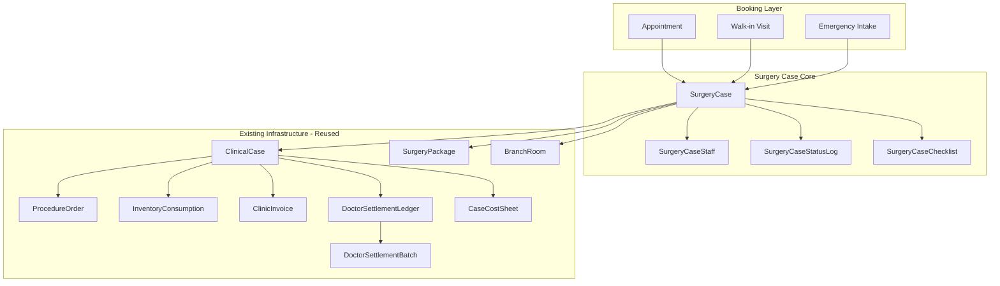
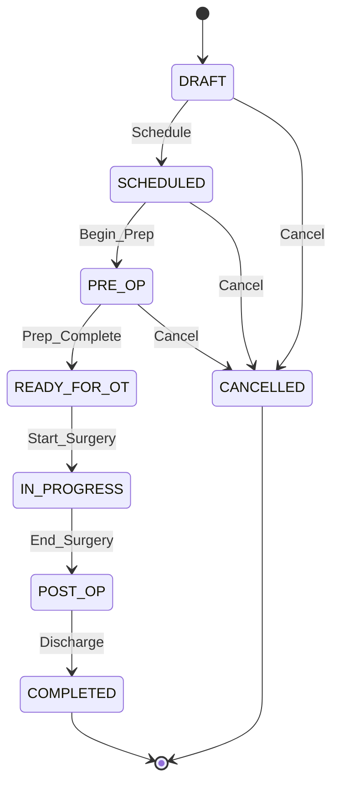

# BPA Enterprise Surgery Module - Architecture Plan

## 1. Existing Infrastructure Mapping

Your codebase already has extensive surgery-related models. The hybrid approach reuses these and adds surgery-specific entities on top.

### Reuse (no changes needed to these models)

| Your Proposed Entity | Existing Model | Status |
| -------------------- | -------------- | ------ |

- `services` -> `Service` - Already has `category: SURGERY`, `otRequired`, `inventoryLinked`, `packageAllowed`, `estimatedCostJson`, `allowedRoomTypes`
- `ot_rooms` -> `BranchRoom` - Already has `roomType: "SURGERY"`, `cleaningBufferMinutes`, `operationalStatus`, `allowedServiceIds`, `allowedPackageIds`
- `surgery_templates` -> `SurgeryPackageTemplate` - Already has `itemsJson`, `surgeryType`; extend with checklist/staff/postop fields
- `surgery_case_billing` -> `ClinicInvoice` + `InvoiceCostSheet` - Already has `doctorFeeAmount`, `clinicShareAmount`, `consumableCost`
- `surgery_case_payouts` -> `DoctorSettlementLedger` + `DoctorSettlementBatch` - Already has `caseId`, `packageId`, `doctorShare`, `clinicShare`, settlement workflow
- `surgery_case_consumables` -> `InventoryConsumption` + `ConsumptionItem` - Already has `PLANNED`/`ACTUAL` modes, `procedureOrderId`, `clinicalCaseId`
- `surgery_case_cost_items` -> `CaseCostSheet` - Already has `directCost`, `doctorShare`, `clinicShare`, `snapshotJson`
- `doctor_service_fee_rules` -> `DoctorContractRule` + `DoctorServiceFee` - Already has `rateType: SHARE_PCT/FIXED_FEE/PER_CASE`, per-service rules

### Link/Wrap (new SurgeryCase links to these)

- `ClinicalCase` - SurgeryCase will have `clinicalCaseId` FK; ClinicalCase handles charges/collection tracking
- `ProcedureOrder` - SurgeryCase will have its own status flow; ProcedureOrder remains for procedure-level tracking within a case
- `SurgeryPackage` - SurgeryCase links via `surgeryPackageId` for pricing template

---

## 2. New Models Required

### 2.1 `SurgeryCase` (NEW - core entity)

The central surgery lifecycle entity wrapping existing infrastructure.

```prisma
model SurgeryCase {
  id                Int       @id @default(autoincrement())
  orgId             Int
  branchId          Int
  clinicalCaseId    Int?      @unique  // links to existing ClinicalCase
  appointmentId     Int?      @unique
  visitId           Int?      @unique
  patientId         Int                // User.id (pet owner)
  petId             Int
  serviceId         Int
  surgeryPackageId  Int?               // links to existing SurgeryPackage for pricing
  roomId            Int?               // BranchRoom.id (OT room)
  primaryDoctorId   Int                // BranchMember.id

  caseNumber        String    @unique @db.VarChar(32)
  surgeryType       String?   @db.VarChar(64)
  priority          SurgeryCasePriority @default(NORMAL)
  status            SurgeryCaseStatus   @default(DRAFT)

  scheduledStartAt  DateTime?
  scheduledEndAt    DateTime?
  actualStartAt     DateTime?
  actualEndAt       DateTime?

  preopNotes        String?   @db.Text
  operativeNotes    String?   @db.Text
  postopNotes       String?   @db.Text
  complicationNotes String?   @db.Text
  dischargeNotes    String?   @db.Text
  followUpDate      DateTime? @db.Date

  pricingSnapshotJson  Json?  // locked pricing at case creation
  feeRuleSnapshotJson  Json?  // locked doctor fee rules at case creation

  estimatedAmount   Decimal?  @db.Decimal(12, 2)
  advancePaid       Decimal?  @db.Decimal(12, 2)

  createdByUserId   Int
  updatedByUserId   Int?
  createdAt         DateTime  @default(now())
  updatedAt         DateTime  @updatedAt

  // Relations
  org               Organization    @relation(fields: [orgId], references: [id])
  branch            Branch          @relation(fields: [branchId], references: [id])
  clinicalCase      ClinicalCase?   @relation(fields: [clinicalCaseId], references: [id])
  appointment       Appointment?    @relation(fields: [appointmentId], references: [id])
  visit             Visit?          @relation(fields: [visitId], references: [id])
  patient           User            @relation(fields: [patientId], references: [id])
  pet               Pet             @relation(fields: [petId], references: [id])
  service           Service         @relation(fields: [serviceId], references: [id])
  surgeryPackage    SurgeryPackage? @relation(fields: [surgeryPackageId], references: [id])
  room              BranchRoom?     @relation(fields: [roomId], references: [id])
  primaryDoctor     BranchMember    @relation(fields: [primaryDoctorId], references: [id])
  createdBy         User            @relation(fields: [createdByUserId], references: [id])
  updatedBy         User?           @relation(fields: [updatedByUserId], references: [id])

  staff             SurgeryCaseStaff[]
  statusLogs        SurgeryCaseStatusLog[]
  checklistItems    SurgeryCaseChecklist[]

  @@index([branchId, status])
  @@index([branchId, scheduledStartAt])
  @@index([primaryDoctorId])
  @@index([patientId])
  @@index([petId])
  @@map("surgery_cases")
}
```

### 2.2 `SurgeryCaseStaff` (NEW - multi-staff assignment)

```prisma
model SurgeryCaseStaff {
  id               Int       @id @default(autoincrement())
  surgeryCaseId    Int
  branchMemberId   Int       // BranchMember.id
  role             SurgeryStaffRole
  feeType          String?   @db.VarChar(16) // FIXED / PERCENTAGE / NONE
  feeValue         Decimal?  @db.Decimal(12, 2)
  payoutAmount     Decimal?  @db.Decimal(12, 2)
  attendanceStatus String?   @db.VarChar(16) // ASSIGNED / PRESENT / ABSENT
  notes            String?   @db.Text
  createdAt        DateTime  @default(now())
  updatedAt        DateTime  @updatedAt

  surgeryCase      SurgeryCase  @relation(fields: [surgeryCaseId], references: [id])
  branchMember     BranchMember @relation(fields: [branchMemberId], references: [id])

  @@unique([surgeryCaseId, branchMemberId])
  @@index([surgeryCaseId])
  @@map("surgery_case_staff")
}
```

### 2.3 `SurgeryCaseStatusLog` (NEW - audit trail)

```prisma
model SurgeryCaseStatusLog {
  id              Int       @id @default(autoincrement())
  surgeryCaseId   Int
  fromStatus      SurgeryCaseStatus?
  toStatus        SurgeryCaseStatus
  changedByUserId Int
  reason          String?   @db.Text
  createdAt       DateTime  @default(now())

  surgeryCase     SurgeryCase @relation(fields: [surgeryCaseId], references: [id])
  changedBy       User        @relation(fields: [changedByUserId], references: [id])

  @@index([surgeryCaseId])
  @@map("surgery_case_status_logs")
}
```

### 2.4 `SurgeryCaseChecklist` (NEW - pre-op/post-op checklists)

```prisma
model SurgeryCaseChecklist {
  id               Int       @id @default(autoincrement())
  surgeryCaseId    Int
  phase            String    @db.VarChar(16) // PRE_OP / INTRA_OP / POST_OP
  itemLabel        String    @db.VarChar(256)
  isCompleted      Boolean   @default(false)
  completedByUserId Int?
  completedAt      DateTime?
  notes            String?   @db.Text
  sortOrder        Int       @default(0)
  createdAt        DateTime  @default(now())
  updatedAt        DateTime  @updatedAt

  surgeryCase      SurgeryCase @relation(fields: [surgeryCaseId], references: [id])
  completedBy      User?       @relation(fields: [completedByUserId], references: [id])

  @@index([surgeryCaseId, phase])
  @@map("surgery_case_checklists")
}
```

### 2.5 New Enums

```prisma
enum SurgeryCaseStatus {
  DRAFT
  SCHEDULED
  PRE_OP
  READY_FOR_OT
  IN_PROGRESS
  POST_OP
  COMPLETED
  CANCELLED
}

enum SurgeryCasePriority {
  NORMAL
  URGENT
  EMERGENCY
}

enum SurgeryStaffRole {
  PRIMARY_SURGEON
  ASSISTANT_SURGEON
  ANESTHETIST
  OT_NURSE
  TECHNICIAN
}
```

---

## 3. Modifications to Existing Models

### 3.1 Extend `SurgeryPackageTemplate`

Add fields for checklist, staff roles, and post-op instructions:

```prisma
// Add to SurgeryPackageTemplate
preopChecklistJson     Json?    // [{ label, required }]
defaultStaffRolesJson  Json?    // [{ role, feeType, feeValue }]
postopInstructionsJson Json?   // [{ instruction, timing }]
```

### 3.2 Extend `ClinicInvoice`

Add surgery-specific charge breakdown:

```prisma
// Add to ClinicInvoice
surgeryCaseId    Int?     @unique
anesthesiaCharge Decimal? @db.Decimal(12, 2)
otCharge         Decimal? @db.Decimal(12, 2)
equipmentCharge  Decimal? @db.Decimal(12, 2)
labCharge        Decimal? @db.Decimal(12, 2)
billingStatus    String?  @db.VarChar(16) // ESTIMATE / PROFORMA / FINALIZED / VOID
```

### 3.3 Extend `DoctorSettlementLedger`

Add surgery case link:

```prisma
// Add to DoctorSettlementLedger
surgeryCaseId Int?
staffRole     String?  @db.VarChar(32)  // SurgeryStaffRole
```

### 3.4 Add relations on existing models

- `Appointment` -> optional `SurgeryCase`
- `Visit` -> optional `SurgeryCase`
- `BranchRoom` -> `SurgeryCase[]`
- `BranchMember` -> `SurgeryCaseStaff[]`
- `Service` -> `SurgeryCase[]`
- `SurgeryPackage` -> `SurgeryCase[]`
- `ClinicalCase` -> optional `SurgeryCase`

---

## 4. Data Flow Architecture



---

## 5. Status Transition Guard



Valid transitions enforced in backend:

```text
DRAFT -> SCHEDULED, CANCELLED
SCHEDULED -> PRE_OP, CANCELLED
PRE_OP -> READY_FOR_OT, CANCELLED
READY_FOR_OT -> IN_PROGRESS
IN_PROGRESS -> POST_OP
POST_OP -> COMPLETED
```

---

## 6. API Architecture

All APIs follow existing clinic pattern: `/api/v1/clinic/branches/:branchId/surgeries/...`

### 6.1 Surgery Case CRUD

- `POST /branches/:branchId/surgeries` - Create case (from appointment/walk-in/emergency)
- `GET /branches/:branchId/surgeries` - List with filters (date, status, doctor, service, payment)
- `GET /branches/:branchId/surgeries/:id` - Full detail with tabs data
- `PATCH /branches/:branchId/surgeries/:id` - Update case
- `POST /branches/:branchId/surgeries/:id/status` - Status transition (with guard)

### 6.2 Staff Management

- `POST /branches/:branchId/surgeries/:id/staff` - Assign staff
- `PATCH /branches/:branchId/surgeries/:id/staff/:staffId` - Update role/fee
- `DELETE /branches/:branchId/surgeries/:id/staff/:staffId` - Remove staff

### 6.3 Checklist

- `GET /branches/:branchId/surgeries/:id/checklist` - Get checklist by phase
- `POST /branches/:branchId/surgeries/:id/checklist` - Add checklist items
- `PATCH /branches/:branchId/surgeries/:id/checklist/:itemId` - Complete/update item

### 6.4 Consumables (reuses InventoryConsumption)

- `POST /branches/:branchId/surgeries/:id/consumables` - Plan consumables
- `POST /branches/:branchId/surgeries/:id/consumables/reserve` - Reserve from inventory
- `POST /branches/:branchId/surgeries/:id/consumables/consume` - Record actual usage
- `POST /branches/:branchId/surgeries/:id/consumables/reverse` - Reverse unused

### 6.5 Billing (reuses ClinicInvoice + Order)

- `POST /branches/:branchId/surgeries/:id/estimate` - Generate estimate
- `POST /branches/:branchId/surgeries/:id/finalize-bill` - Finalize billing
- `POST /branches/:branchId/surgeries/:id/payments` - Collect payment/advance
- `GET /branches/:branchId/surgeries/:id/billing` - View billing summary

### 6.6 Payouts (reuses DoctorSettlementLedger)

- `GET /branches/:branchId/surgeries/:id/payouts` - View payout breakdown
- `POST /branches/:branchId/surgeries/:id/payouts/generate` - Generate payout entries
- `POST /branches/:branchId/surgeries/:id/payouts/:payoutId/approve` - Finance approval
- `POST /branches/:branchId/surgeries/:id/payouts/:payoutId/pay` - Mark paid

### 6.7 Doctor Panel

- `GET /api/v1/doctor/surgeries` - Doctor's surgery list
- `GET /api/v1/doctor/surgeries/:id` - Surgery detail
- `PATCH /api/v1/doctor/surgeries/:id/notes` - Update operative/post-op notes
- `POST /api/v1/doctor/surgeries/:id/start` - Start surgery
- `POST /api/v1/doctor/surgeries/:id/complete` - Complete surgery

### 6.8 Reports

- `GET /branches/:branchId/reports/surgery-revenue` - Revenue by service/doctor
- `GET /branches/:branchId/reports/surgery-profitability` - Profit analysis
- `GET /branches/:branchId/reports/ot-utilization` - Room utilization
- `GET /branches/:branchId/reports/consumable-variance` - Planned vs actual

---

## 7. Permissions

New permissions to add to `BranchAccessProfile`:

```text
clinic.surgery.read         - View surgery list/details
clinic.surgery.create       - Create surgery cases
clinic.surgery.manage       - Update status, assign staff
clinic.surgery.notes.write  - Pre-op/post-op/operative notes
clinic.surgery.billing      - Estimate, finalize bill
clinic.surgery.payout       - Generate/approve payouts
clinic.surgery.reports      - View surgery reports
```

---

## 8. UI Routes (Frontend)

Following existing staff panel pattern: `/staff/(larkon)/branch/[branchId]/clinic/surgeries/...`

- `/clinic/surgeries` - Surgery Calendar/List page
- `/clinic/surgeries/new` - New Surgery Wizard (multi-step)
- `/clinic/surgeries/[id]` - Surgery Detail Workspace (tabbed: Overview, Team, Pre-op, Consumables, Billing, Notes, Post-op, Payouts, Timeline)
- `/clinic/reports/surgery-profitability` - Profitability report
- `/clinic/reports/ot-utilization` - OT utilization report

Doctor panel:

- `/doctor/(larkon)/surgeries` - Doctor surgery list
- `/doctor/(larkon)/surgeries/[id]` - Doctor surgery workspace

---

## 9. Backend Business Rules

1. **Pricing snapshot lock** - On case creation, `pricingSnapshotJson` captures current `SurgeryPackage` pricing; editable only with `clinic.surgery.manage` permission
2. **Fee rule snapshot** - `feeRuleSnapshotJson` captures `DoctorContractRule` at creation; prevents retroactive rule changes affecting old cases
3. **Inventory reserve vs consume** - Reserve at PRE_OP (InventoryConsumption with mode=PLANNED), consume at POST_OP/completion (mode=ACTUAL)
4. **Payout after bill finalized** - `DoctorSettlementLedger` entries only generated when `ClinicInvoice.billingStatus = FINALIZED`
5. **Doctor payout on service component only** - Percentage-based payouts calculated on `Service.price` only, not on consumables/lab/tax
6. **Status transition guard** - Invalid jumps blocked; each transition logged to `SurgeryCaseStatusLog`
7. **Case number generation** - Format: `SRG-{branchCode}-{YYMMDD}-{sequence}` (auto-generated)

---

## 10. Key Files to Create/Modify

### New Files (Backend)

- `prisma/migrations/YYYYMMDD_surgery_case/migration.sql` - Migration for new tables
- `src/api/v1/modules/clinic/surgery.service.ts` - Surgery business logic
- `src/api/v1/modules/clinic/surgery.controller.ts` - Surgery request handlers
- `src/api/v1/modules/clinic/surgeryBilling.service.ts` - Surgery billing/estimate logic
- `src/api/v1/modules/clinic/surgeryPayout.service.ts` - Surgery payout generation

### Modified Files (Backend)

- `prisma/schema.prisma` - New models + enum + relation updates
- `src/api/v1/modules/clinic/clinic.routes.ts` - New surgery routes
- `src/api/v1/modules/clinic/clinic.controller.ts` - Import surgery controller
- `src/api/v1/modules/doctor/doctor.routes.ts` - Doctor surgery endpoints
- `src/api/v1/modules/doctor/doctor.controller.ts` - Doctor surgery handlers

### New Files (Frontend)

- `app/staff/(larkon)/branch/[branchId]/clinic/surgeries/page.jsx` - Surgery list
- `app/staff/(larkon)/branch/[branchId]/clinic/surgeries/new/page.jsx` - New surgery wizard
- `app/staff/(larkon)/branch/[branchId]/clinic/surgeries/[id]/page.jsx` - Surgery workspace
- `app/doctor/(larkon)/surgeries/page.tsx` - Doctor surgery list
- `app/doctor/(larkon)/surgeries/[id]/page.tsx` - Doctor surgery detail

### Modified Files (Frontend)

- `src/lib/branchSidebarConfig.ts` - Add surgery nav item
- `lib/api.ts` - Add surgery API functions

---

## 11. Implementation Phases

### Phase 1 - Foundation

- `SurgeryCase`, `SurgeryCaseStaff`, `SurgeryCaseStatusLog` models
- CRUD APIs + status transition guard
- Surgery list page + detail workspace (Overview + Team tabs)
- Link from Appointment -> "Convert to Surgery Case"

### Phase 2 - Clinical Workflow

- `SurgeryCaseChecklist` model
- Pre-op/Post-op tabs with checklist
- Consumables planning + reserve/consume (reusing `InventoryConsumption`)
- Operative notes + complications
- OT room scheduling + conflict check

### Phase 3 - Financial

- Surgery billing estimate/finalize (extending `ClinicInvoice`)
- Payout generation (reusing `DoctorSettlementLedger`)
- Finance approval workflow
- Profitability + revenue reports

### Phase 4 - Advanced

- Surgery packages + templates
- Emergency surgery fast-track workflow
- Admission/ICU/recovery bed link
- Anesthesia protocol
- Consent/document upload
- Doctor earnings dashboard

