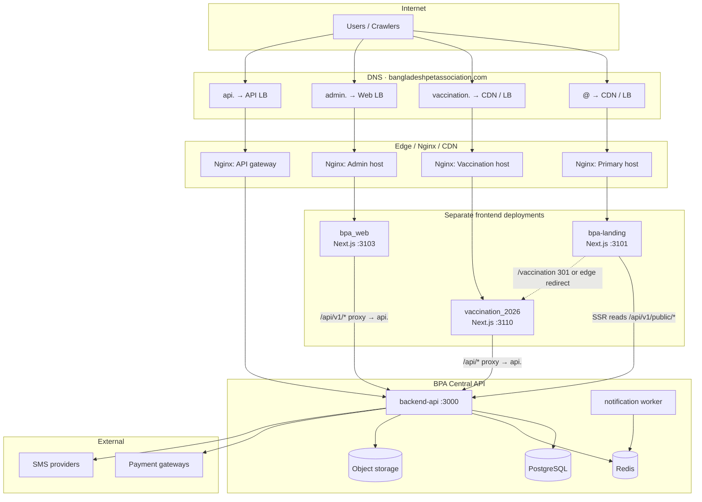

# BPA Vaccination Domain Strategy

**Status:** Planning + SEO implementation (see §6.6) + monitoring strategy (see docs/architecture/enterprise-monitoring-failover-strategy.md)  
**Date:** 2026-06-05  
**Owner:** BPA Platform Architecture  
**Repos:** `backend-api` · `bpa-landing` · `vaccination_2026` · `bpa_web` · `bpa_app`

---

## Executive summary

Bangladesh Pet Association (BPA) operates multiple frontends against one **Central API** (`backend-api`). This plan defines how to publish:

| Surface | Production URL | App | Dev port |
|---------|----------------|-----|----------|
| **Primary marketing** | `https://bangladeshpetassociation.com` | `bpa-landing` | 3101 |
| **Vaccination campaign** | `https://vaccination.bangladeshpetassociation.com` | `vaccination_2026` | 3110 |
| **SEO convenience path** | `https://bangladeshpetassociation.com/vaccination` | Redirect or edge route → campaign app | — |
| **Central API** | `https://api.bangladeshpetassociation.com` | `backend-api` | 3000 |
| **Admin / staff** | `https://admin.bangladeshpetassociation.com` (and staff path/host) | `bpa_web` | 3103+ |

**Non-negotiables**

- `bpa-landing` and `vaccination_2026` remain **separate deployable Next.js applications**.
- **Single source of truth** for bookings, payments, campaigns, clinics, and pet records: **PostgreSQL via `backend-api`** (Prisma).
- Architecture must be **enterprise-grade**, **multi-campaign ready**, **SEO-optimized**, and **PWA-compatible** (future installable web apps per domain).

---

## 1. Current-state analysis

### 1.1 Application map (as-built)

```
┌─────────────────────────────────────────────────────────────────────────────┐
│                           BPA Central API (backend-api)                      │
│                    https://api…/api/v1  ·  Port 3000  ·  Prisma/PostgreSQL   │
│  Campaign · Booking · Payment · OTP · Clinics (ops) · Pets · Community · SMS  │
└───────────────┬───────────────────────┬───────────────────────┬─────────────┘
                │                       │                       │
    ┌───────────▼──────────┐ ┌──────────▼─────────┐ ┌─────────▼──────────┐
    │     bpa-landing      │ │  vaccination_2026   │ │      bpa_web       │
    │  Marketing / SEO     │ │  Campaign + /book     │ │  Admin + Staff     │
    │  Port 3101           │ │  Port 3110            │ │  Ports 3100–3107   │
    │  Direct API axios    │ │  /api/* proxy rewrite │ │  /api/v1/* proxy   │
    └──────────────────────┘ └──────────────────────┘ └────────────────────┘
                │                       │
    ┌───────────▼──────────┐ ┌──────────▼─────────┐
    │       bpa_app        │ │  Infra: Redis,     │
    │  Flutter (optional)  │ │  MinIO, Worker     │
    └──────────────────────┘ └────────────────────┘
```

### 1.2 Integration patterns today

| App | API env var | Client pattern | Auth |
|-----|-------------|----------------|------|
| `bpa-landing` | `NEXT_PUBLIC_API_URL` (includes `/api/v1`) | Server-side axios, no Next proxy | None (public reads) |
| `vaccination_2026` | `NEXT_PUBLIC_API_BASE_URL` | Browser `/api/*` → API rewrite | OTP Bearer (sessionStorage) + express checkout |
| `bpa_web` | `NEXT_PUBLIC_API_BASE_URL` | Cookie-aware `/api/v1` proxy | JWT cookie (`access_token`) |
| `bpa_app` | `API_BASE_URL` | Direct HTTPS | JWT |

### 1.3 Data ownership (single source of truth)

| Domain entity | System of record | API module |
|---------------|------------------|------------|
| Campaigns, slots, locations | `backend-api` | `/api/v1/campaign/*` |
| Bookings, checkout sessions | `backend-api` | `/api/v1/campaign/public/checkout/*`, `/campaign/booking/*` |
| Payments | `backend-api` | `/api/v1/payments/*`, campaign payment callbacks |
| Pet records | `backend-api` | Owner/pet modules (app-authenticated) |
| Clinic operations | `backend-api` | `/api/v1/clinic/*` (staff; public listing TBD) |
| OTP / SMS logs | `backend-api` | Campaign SMS + shared SMS services |

Frontends **must not** persist booking or payment state locally beyond session/UI cache.

### 1.4 Gaps blocking production multi-domain

1. **No in-repo nginx/reverse-proxy config** — routing is undocumented at infra layer.
2. **Port collision locally:** `bpa-landing` and `bpa_web` shop both use **3101**.
3. **Stale docs (partially resolved):** `06-DEPLOYMENT-PLAN.md` previously referenced landing `:3001`; corrected to `:3110` / `:3101` in [PORT_AND_DOMAIN_MAP.md](../infrastructure/PORT_AND_DOMAIN_MAP.md).
4. **Landing API contracts:** Primary paths `/public/stats`, `/public/clinics`, `/campaigns/active` are **not implemented** on API — landing uses fallbacks.
5. **Inconsistent env naming** across apps (`NEXT_PUBLIC_API_URL` vs `NEXT_PUBLIC_API_BASE_URL`).
6. **Production CORS/cookie matrix** not codified for `bangladeshpetassociation.com` + subdomains.
7. **Three public-facing web surfaces** (`bpa-landing`, `vaccination_2026`, `bpa_web` public panel) — roles must be explicit in DNS/routing.

---

## 2. Target architecture

### 2.1 Architecture diagram (production)



### 2.2 Logical layering

| Layer | Responsibility |
|-------|----------------|
| **DNS** | Apex, subdomains, ACME, health checks |
| **Edge (CDN + WAF)** | TLS termination, caching static assets, bot filtering, rate limits |
| **Reverse proxy (Nginx)** | Host-based routing, security headers, upstream health, optional path redirect |
| **Frontends** | UI, SEO metadata, client session (OTP token only), no business persistence |
| **Central API** | Auth, validation, transactions, webhooks, PDF/certificate generation |
| **Data** | PostgreSQL (authoritative), Redis (queues/cache), object storage (media) |

### 2.3 Multi-campaign readiness

The API already supports **slug-based campaigns** (`GET /api/v1/campaign/public/campaigns/:slug`). Strategy:

| Phase | Campaign URL pattern | Config |
|-------|---------------------|--------|
| **Now (2026)** | `vaccination.bangladeshpetassociation.com` | `NEXT_PUBLIC_CAMPAIGN_SLUG=cat-flu-rabies-2026` |
| **Future** | `vaccination.bangladeshpetassociation.com/{slug}` or `2027.vaccination.…` | Per-deploy env or host→slug map in nginx/CDN |
| **Discovery** | `bangladeshpetassociation.com` links to active campaign | `GET /campaigns/active` or public list (API endpoint to implement) |

**Rule:** New campaigns = new env slug and/or path — **never** a second booking database or duplicate payment tables.

### 2.4 PWA compatibility (future)

Each public frontend is a **separate origin** → **separate PWA manifest and service worker scope**.

| App | Manifest host | Scope | Notes |
|-----|---------------|-------|-------|
| `bpa-landing` | `bangladeshpetassociation.com` | `/` | Already has `manifest.ts`; extend with icons/screenshots |
| `vaccination_2026` | `vaccination.bangladeshpetassociation.com` | `/` | Add `manifest.ts`; offline limited to shell + cached static |
| Cross-link | — | — | Do not share SW across subdomains |

API remains **non-PWA**; installable surfaces call API over HTTPS only.

---

## 3. DNS plan

### 3.1 Production records

| Host | Type | Target | Purpose |
|------|------|--------|---------|
| `bangladeshpetassociation.com` | `A` / `AAAA` or `CNAME` | CDN / LB IP | Primary landing (`bpa-landing`) |
| `www.bangladeshpetassociation.com` | `CNAME` | `bangladeshpetassociation.com` | Canonical redirect to apex |
| `vaccination.bangladeshpetassociation.com` | `CNAME` | CDN / LB (campaign pool) | Campaign app (`vaccination_2026`) |
| `api.bangladeshpetassociation.com` | `CNAME` | API LB | Central API |
| `admin.bangladeshpetassociation.com` | `CNAME` | Web LB | `bpa_web` admin mode |
| `staff.bangladeshpetassociation.com` | `CNAME` | Web LB (or path on admin) | Staff portal (optional separate vhost) |

**Optional (existing BPA panels):**

| Host | App |
|------|-----|
| `shop.bangladeshpetassociation.com` | `bpa_web` shop (3101) |
| `clinic.bangladeshpetassociation.com` | `bpa_web` clinic (3102) |

### 3.2 Staging (recommended mirror)

| Production | Staging |
|------------|---------|
| `bangladeshpetassociation.com` | `staging.bangladeshpetassociation.com` |
| `vaccination.…` | `vaccination-staging.…` |
| `api.…` | `api-staging.…` |
| `admin.…` | `admin-staging.…` |

Staging uses **separate** DB, Redis, payment sandbox, and SMS test sender IDs.

### 3.3 TLS

- **Wildcard cert:** `*.bangladeshpetassociation.com` + apex (Let's Encrypt DNS-01 or CDN-managed).
- **HSTS** enabled at edge after redirect rules verified (include subdomains when stable).
- **Certificate pinning:** not required; rely on modern TLS 1.2+ at edge.

### 3.4 Email / deliverability (operational)

| Record | Use |
|--------|-----|
| `SPF` | SMS/email providers, transactional mail |
| `DKIM` | Organization email |
| `DMARC` | Policy for `@bangladeshpetassociation.com` |

---

## 4. Nginx plan

### 4.1 Design principles

1. **Host-based routing** — one upstream per frontend app; no merging Next builds.
2. **API isolation** — `api.` vhost proxies only to `backend-api:3000`; no static frontend on API host.
3. **Security headers** at nginx (defense in depth with Next.js headers).
4. **Health endpoints** — `/health` on API; `/_next/static` long-cache at edge.
5. **No path-based merging** of two Next apps on one host (except explicit redirect for `/vaccination`).

### 4.2 Upstream definitions (example)

```nginx
upstream bpa_landing {
    server 127.0.0.1:3101;
    keepalive 32;
}

upstream bpa_vaccination {
    server 127.0.0.1:3110;
    keepalive 32;
}

upstream bpa_api {
    server 127.0.0.1:3000;
    keepalive 64;
}

upstream bpa_web_admin {
    server 127.0.0.1:3103;
    keepalive 32;
}
```

*Production: replace with container/service discovery addresses and multiple replicas.*

### 4.3 Server blocks

#### Primary — `bangladeshpetassociation.com`

```nginx
server {
    listen 443 ssl http2;
    server_name bangladeshpetassociation.com www.bangladeshpetassociation.com;

    # ssl_certificate …

    # SEO convenience route — RECOMMENDED: permanent redirect to campaign subdomain
    location = /vaccination {
        return 301 https://vaccination.bangladeshpetassociation.com/;
    }
    location ^~ /vaccination/ {
        return 301 https://vaccination.bangladeshpetassociation.com$request_uri;
    }

    # Optional: landing server-side API proxy (reduces CORS; aligns with vaccination_2026 pattern)
    location /api/v1/ {
        proxy_pass http://bpa_api/api/v1/;
        proxy_set_header Host $host;
        proxy_set_header X-Real-IP $remote_addr;
        proxy_set_header X-Forwarded-For $proxy_add_x_forwarded_for;
        proxy_set_header X-Forwarded-Proto $scheme;
    }

    location / {
        proxy_pass http://bpa_landing;
        proxy_http_version 1.1;
        proxy_set_header Upgrade $http_upgrade;
        proxy_set_header Connection "upgrade";
        proxy_set_header Host $host;
        proxy_set_header X-Forwarded-Proto $scheme;
    }
}
```

#### Campaign — `vaccination.bangladeshpetassociation.com`

```nginx
server {
    listen 443 ssl http2;
    server_name vaccination.bangladeshpetassociation.com;

    location /api/ {
        proxy_pass http://bpa_api/api/;
        proxy_set_header Host $host;
        proxy_set_header X-Real-IP $remote_addr;
        proxy_set_header X-Forwarded-For $proxy_add_x_forwarded_for;
        proxy_set_header X-Forwarded-Proto $scheme;
    }

    location / {
        proxy_pass http://bpa_vaccination;
        proxy_http_version 1.1;
        proxy_set_header Host $host;
        proxy_set_header X-Forwarded-Proto $scheme;
    }
}
```

#### API — `api.bangladeshpetassociation.com`

```nginx
server {
    listen 443 ssl http2;
    server_name api.bangladeshpetassociation.com;

    client_max_body_size 25m;

    location / {
        proxy_pass http://bpa_api;
        proxy_set_header Host $host;
        proxy_set_header X-Real-IP $remote_addr;
        proxy_set_header X-Forwarded-For $proxy_add_x_forwarded_for;
        proxy_set_header X-Forwarded-Proto $scheme;
    }
}
```

### 4.4 Redirect strategy for `/vaccination` (decision)

| Option | Pros | Cons | Recommendation |
|--------|------|------|----------------|
| **A. 301 to subdomain** | Simple; separate apps; clear canonical URL | URL changes in browser | **Default — use this** |
| **B. Reverse-proxy subpath** | URL stays on apex | Two Next apps on one path prefix; asset/`_next` conflicts; high complexity | Avoid |
| **C. Next.js redirect in landing** | No nginx change | Runs after landing boot; less ideal for crawlers | Acceptable fallback |
| **D. CDN edge redirect** | Fast; no origin load | Vendor-specific config | Good if using Cloudflare/Fastly |

**Canonical URL for campaign SEO:** always `https://vaccination.bangladeshpetassociation.com/…`

### 4.5 Caching

| Path | Cache |
|------|-------|
| `/_next/static/*` | `Cache-Control: public, max-age=31536000, immutable` |
| `/opengraph-image`, `/sitemap.xml`, `/robots.txt` | Short TTL (1h–24h) or revalidate |
| `/api/*` | **No cache** at edge (except `GET` public discovery with explicit short TTL if needed) |
| HTML documents | `s-maxage` via Next ISR where configured |

---

## 5. Routing plan

### 5.1 Public URL matrix

| URL | Application | Internal route | API calls |
|-----|-------------|----------------|-----------|
| `/` | `bpa-landing` | `src/app/page.tsx` | SSR: stats, clinics, campaign, community |
| `/privacy-policy`, `/terms`, `/help` | `bpa-landing` | legal pages | None |
| `/vaccination` | **Redirect** | → `vaccination.…/` | — |
| `vaccination.…/` | `vaccination_2026` | campaign landing | `/api/v1/campaign/public/campaigns/:slug` |
| `vaccination.…/book` | `vaccination_2026` | booking wizard | checkout, OTP, payment |
| `vaccination.…/book/payment/*` | `vaccination_2026` | payment return | payment verify |
| `vaccination.…/booking/*` | `vaccination_2026` | my bookings | OTP booking API |
| `vaccination.…/verify/certificate` | `vaccination_2026` | QR verify | public verify endpoint |
| `api.…/api/v1/campaign/*` | `backend-api` | campaign module | — |
| `admin.…/admin/campaigns/*` | `bpa_web` | admin UI | admin campaign API |

### 5.2 Cross-app navigation contract

| Source | CTA | Target URL |
|--------|-----|------------|
| `bpa-landing` hero / footer | Book vaccination | `https://vaccination.bangladeshpetassociation.com/book` |
| `bpa-landing` (optional SEO path) | Campaign overview | `https://bangladeshpetassociation.com/vaccination` → 301 → subdomain |
| `vaccination_2026` header/footer | BPA home | `https://bangladeshpetassociation.com` |
| Payment gateway return | Success/fail | `CAMPAIGN_LANDING_URL` + `/book/payment/...` |
| SMS deep links | Booking ref | `vaccination.…/booking/{ref}` |

**Env alignment:**

```env
# bpa-landing
NEXT_PUBLIC_SITE_URL=https://bangladeshpetassociation.com
NEXT_PUBLIC_CAMPAIGN_BOOK_URL=https://vaccination.bangladeshpetassociation.com/book
NEXT_PUBLIC_API_URL=https://api.bangladeshpetassociation.com/api/v1

# vaccination_2026
NEXT_PUBLIC_SITE_URL=https://vaccination.bangladeshpetassociation.com
NEXT_PUBLIC_API_BASE_URL=https://api.bangladeshpetassociation.com
NEXT_PUBLIC_CAMPAIGN_SLUG=cat-flu-rabies-2026

# backend-api
APP_URL=https://api.bangladeshpetassociation.com
API_PUBLIC_BASE_URL=https://api.bangladeshpetassociation.com
CAMPAIGN_LANDING_URL=https://vaccination.bangladeshpetassociation.com
CORS_ORIGINS=https://bangladeshpetassociation.com,https://www.bangladeshpetassociation.com,https://vaccination.bangladeshpetassociation.com,https://admin.bangladeshpetassociation.com
COOKIE_DOMAIN=.bangladeshpetassociation.com
```

### 5.3 Local development routing

| Service | URL | Notes |
|---------|-----|-------|
| Landing | `http://localhost:3101` | Resolve shop port conflict — run shop on different port when both needed |
| Campaign | `http://localhost:3110` | |
| API | `http://localhost:3000` | |
| Convenience redirect | `http://localhost:3101/vaccination` | Implement in landing `middleware.ts` or nginx dev config → `localhost:3110` |

---

## 6. SEO strategy

### 6.1 Canonical ownership

| Content type | Canonical host | Rationale |
|--------------|----------------|-----------|
| Brand, ecosystem, clinics, stats | `bangladeshpetassociation.com` | National platform positioning |
| Campaign landing, booking, certificates | `vaccination.bangladeshpetassociation.com` | Conversion-focused funnel |
| `/vaccination` on apex | **Bridge page** with canonical → subdomain | Avoid duplicate content while keeping short URL |

### 6.2 Metadata & structured data

**`bpa-landing` (apex)**

- Organization, WebSite, FAQ, MobileApplication JSON-LD (already partially implemented).
- `sitemap.xml`: `/`, legal pages; **do not** list campaign booking URLs as separate apex pages.
- `link rel=canonical` per page on apex only.

**`vaccination_2026` (subdomain)**

- Campaign-specific `WebPage`, `Event` or `MedicalBusiness` schema where appropriate.
- `sitemap.xml`: `/`, `/book`, `/verify/certificate`, static campaign pages.
- `robots.txt`: allow booking funnels; disallow internal API paths.

### 6.3 `/vaccination` SEO convenience route

**Purpose:** Short memorable URL on primary domain for marketing (print, TV, government partners).

**Implemented approach (2026-06-05):** lightweight **bridge page** on apex (`bpa-landing`) rather than a 301 redirect:

- HTML `rel=canonical` → `https://vaccination.bangladeshpetassociation.com`
- Open Graph / Twitter `og:url` → same primary URL
- JSON-LD: apex `WebPage` references primary `Event` by `@id` (`#campaign-event`); Event defined only on subdomain
- Book CTA links out to primary host (no embedded booking on apex)

**Alternative (infra):** nginx 301 from apex `/vaccination` → subdomain remains valid if marketing prefers URL bar change; canonical strategy on subdomain is unchanged.

**Full implementation guide:** `bpa-landing/docs/seo/vaccination-campaign-seo.md`

### 6.6 SEO implementation status

| Item | Primary (`vaccination_2026`) | Bridge (`bpa-landing`) |
|------|------------------------------|------------------------|
| Canonical | Self (`NEXT_PUBLIC_SITE_URL`) | Points to primary |
| Open Graph | `app/opengraph-image.tsx` + `lib/campaignSeo.ts` | Uses primary OG image URL |
| Twitter Cards | `summary_large_image` in layout + home | Aligned to primary |
| Structured data | Event, WebPage, WebSite, MedicalBusiness | WebPage + Breadcrumb only |
| Sitemap | `/`, `/book`, `/verify/certificate`, `/contact` | `/vaccination` at priority 0.6 |
| robots.txt | Disallow `/book/payment/` | Standard allow |

### 6.4 hreflang / locale

- Primary language: `en-BD`; future `bn` alternates on both apps.
- `hreflang` pairs when Bengali launches: same path on same host (not mixed across redirect boundary).

### 6.5 Performance (ranking signal)

- Maintain Lighthouse 95+ on `bpa-landing` (production `next start`, not dev).
- Campaign site: optimize LCP on hero; proxy API via same-origin `/api` to avoid CORS preflight on client calls.
- Preconnect from landing to `api.bangladeshpetassociation.com` when live API enabled.

### 6.6 Analytics

- Separate GA4 properties or one property with **hostname dimension**:
  - `bangladeshpetassociation.com` — awareness
  - `vaccination.bangladeshpetassociation.com` — conversion funnel
- Cross-domain linker for booking completion events.

---

## 7. Security plan

### 7.1 Threat model (summary)

| Threat | Mitigation |
|--------|------------|
| Cross-site booking fraud | Server-side checkout validation; rate limits on OTP/checkout |
| Payment webhook spoofing | HMAC secrets (`CAMPAIGN_PAYMENT_WEBHOOK_SECRET`); IP allowlist where provider supports |
| Session hijack (OTP Bearer) | Short TTL; HTTPS only; `sessionStorage` (not localStorage) on campaign site |
| Admin cookie leakage | `HttpOnly`, `Secure`, `SameSite=Lax`, `COOKIE_DOMAIN=.bangladeshpetassociation.com` |
| CORS abuse | Strict production `CORS_ORIGINS`; no `*` with credentials |
| SSRF via API proxy | Next rewrites only to configured `API_BASE_URL` |
| DDoS | CDN/WAF + nginx `limit_req` on `/api/v1/campaign/auth/request-otp` |

### 7.2 CORS policy (production)

```
Allowed origins:
  https://bangladeshpetassociation.com
  https://www.bangladeshpetassociation.com
  https://vaccination.bangladeshpetassociation.com
  https://admin.bangladeshpetassociation.com
  (+ staff host if separate)

credentials: true (for bpa_web cookie auth only)
```

`bpa-landing` SSR should prefer **server-to-server** API calls; if browser calls are added, origin must be in allowlist.

### 7.3 Authentication boundaries

| Surface | Token | Storage | API prefix |
|---------|-------|---------|------------|
| Public landing | None | — | Public read endpoints |
| Campaign booking (OTP) | Bearer OTP session | `sessionStorage` | `/campaign/booking/*` |
| Express checkout | Checkout session ID | Server + client state | `/campaign/public/checkout/*` |
| Admin/staff | JWT cookie | HttpOnly cookie | `/campaign/admin/*`, `/campaign/staff/*` |
| Mobile app | JWT | Secure storage | Standard `/api/v1/*` |

### 7.4 Secrets management

- Store in vault (not git): `JWT_SECRET`, payment keys, SMS tokens, `DATABASE_URL`, webhook secrets.
- Per-environment rotation schedule documented in `DISASTER-RECOVERY-PLAYBOOK.md`.
- **No** `API_SECRET_KEY` in client bundles.

### 7.5 Headers (nginx + Next)

```
Strict-Transport-Security: max-age=31536000; includeSubDomains
X-Content-Type-Options: nosniff
X-Frame-Options: SAMEORIGIN
Referrer-Policy: strict-origin-when-cross-origin
Permissions-Policy: camera=(), microphone=(), geolocation=(self)
Content-Security-Policy: (per-app; allow payment iframe domains explicitly)
```

### 7.6 Payment security

- All return URLs use `https://vaccination.bangladeshpetassociation.com/...` (must match `CAMPAIGN_LANDING_URL`).
- Webhooks hit `https://api.bangladeshpetassociation.com/api/v1/...` only — never frontends.
- Idempotent payment verification on return + webhook.

---

## 8. Deployment plan

### 8.1 Deployment topology

```
┌─────────────────────────────────────────────────────────┐
│ VM / K8s / PaaS                                          │
│  ┌─────────────┐ ┌─────────────┐ ┌─────────────┐        │
│  │ bpa-landing │ │ vaccination │ │  bpa_web    │        │
│  │  (PM2/k8s)  │ │  (PM2/k8s)  │ │  (PM2/k8s)  │        │
│  └─────────────┘ └─────────────┘ └─────────────┘        │
│  ┌─────────────────────────────────────────────┐        │
│  │ backend-api + worker (docker-compose/k8s)    │        │
│  └─────────────────────────────────────────────┘        │
│  ┌──────────┐ ┌────────┐ ┌────────┐                     │
│  │ Postgres │ │ Redis  │ │ MinIO  │                     │
│  └──────────┘ └────────┘ └────────┘                     │
└─────────────────────────────────────────────────────────┘
           ▲
           │ TLS
    ┌──────┴──────┐
    │ Nginx / CDN │
    └─────────────┘
```

### 8.2 Release order (production)

| Step | Component | Verification |
|------|-----------|--------------|
| 1 | DB backup + `prisma migrate deploy` | Schema current |
| 2 | `backend-api` + worker | `GET /api/v1/health` or campaigns list 200 |
| 3 | Configure payment/SMS webhooks to production API URLs | Test callback |
| 4 | `vaccination_2026` | `/`, `/book`, payment return smoke |
| 5 | `bpa-landing` | `/`, sitemap, `/vaccination` redirect |
| 6 | `bpa_web` admin/staff | Campaign admin smoke |
| 7 | DNS cutover (low TTL beforehand) | External monitoring |
| 8 | Activate campaign in admin | Public discovery shows ACTIVE |

### 8.3 CI/CD (recommended)

| Repo | Build | Artifact | Deploy target |
|------|-------|----------|---------------|
| `backend-api` | Docker image | `bpa-api:latest` | API cluster |
| `vaccination_2026` | `next build` | Node standalone or Docker | Campaign upstream :3110 |
| `bpa-landing` | `next build` | Node standalone or Docker | Landing upstream :3101 |
| `bpa_web` | `next build` per `SITE_MODE` | Separate images per mode | Admin :3103 |

### 8.4 Environment matrix

| Variable | Landing | Campaign | API |
|----------|---------|----------|-----|
| Public site URL | `NEXT_PUBLIC_SITE_URL` | `NEXT_PUBLIC_SITE_URL` | `CAMPAIGN_LANDING_URL` |
| API base | `NEXT_PUBLIC_API_URL` (with `/api/v1`) | `NEXT_PUBLIC_API_BASE_URL` | `APP_URL` |
| Campaign slug | — | `NEXT_PUBLIC_CAMPAIGN_SLUG` | DB + admin |
| Book CTA | `NEXT_PUBLIC_CAMPAIGN_BOOK_URL` | — | — |
| CORS | — | — | `CORS_ORIGINS` |
| Cookies | — | — | `COOKIE_DOMAIN` |

### 8.5 Rollback

- **API:** revert image tag; migrations are forward-only per `PRISMA_MIGRATION_NON_DESTRUCTIVE_POLICY.md`.
- **Frontends:** revert to previous container/PM2 release; DNS unchanged.
- **Campaign:** admin toggle campaign to `DRAFT` for instant funnel stop without undeploy.

---

## 9. Risk analysis

| ID | Risk | Likelihood | Impact | Mitigation |
|----|------|------------|--------|------------|
| R1 | Duplicate content (apex `/vaccination` vs subdomain) | Medium | SEO dilution | 301 to subdomain; single canonical |
| R2 | `CAMPAIGN_LANDING_URL` / `NEXT_PUBLIC_SITE_URL` mismatch | Medium | Payment return failures | Env checklist in deploy; automated smoke test |
| R3 | CORS blocks landing live API | Medium | Empty stats/clinics on apex | Add apex to `CORS_ORIGINS` or nginx API proxy on landing host |
| R4 | Missing public API endpoints for landing | High | Mock data in production | Implement `/public/stats`, `/public/clinics`, `/campaigns/active` on API |
| R5 | Port 3101 collision in local dev | High | Dev friction | Document: landing=3101, shop=alternate when both run |
| R6 | Cross-app env naming drift | Medium | Misconfiguration | Standardize on `NEXT_PUBLIC_API_BASE_URL` + path helpers (future refactor) |
| R7 | Webhook exposure on wrong host | Low | Critical | Webhooks only on `api.` subdomain |
| R8 | Cookie scope too broad | Low | Medium | `COOKIE_DOMAIN=.bangladeshpetassociation.com` only when all subdomains need auth |
| R9 | Campaign surge traffic | Medium | API saturation | CDN for static; rate limits; horizontal API scale; Redis OTP |
| R10 | Multi-campaign slug confusion | Medium | Wrong pricing/slots | Host→slug map documented; admin enforces one ACTIVE default per rollout phase |
| R11 | PWA cache stale booking UI | Low | User confusion | Versioned SW; `skipWaiting` policy; scope limited to campaign host |
| R12 | No nginx config in VCS | High | Ops knowledge silo | Add `infra/nginx/` templates in follow-up implementation phase |

---

## 10. Implementation backlog (future — not in scope now)

When moving from plan to execution, recommended sequence:

1. **Infra:** Production templates in `infra/nginx/` — see `docs/nginx-production-deployment.md`.
2. **API:** Implement landing public endpoints (`/public/stats`, `/public/clinics`, `/campaigns/active`, `/community/public-feed`).
3. **Landing:** `/vaccination` redirect (middleware or nginx); align `NEXT_PUBLIC_CAMPAIGN_BOOK_URL`.
4. **API env:** Production `CORS_ORIGINS`, `COOKIE_DOMAIN`, `CAMPAIGN_LANDING_URL`.
5. **DNS:** Staging mirror → UAT → production cutover with monitoring.
6. **Docs:** Update `PROJECT_CONTEXT.md` ports — **done**; see [infrastructure/PORT_AND_DOMAIN_MAP.md](../infrastructure/PORT_AND_DOMAIN_MAP.md).
7. **PWA:** Campaign `manifest.ts` + icons on `vaccination_2026`.
8. **Observability:** Uptime checks per host; payment callback alerts.

---

## 11. References

| Document | Path |
|----------|------|
| Project context (ports) | `docs/PROJECT_CONTEXT.md` |
| BPA standard | `docs/BPA_STANDARD.md` |
| Campaign deployment | `docs/vaccination-campaign-2026/06-DEPLOYMENT-PLAN.md` |
| Campaign API design | `docs/vaccination-campaign-2026/05-api-design.md` |
| Payment architecture | `docs/vaccination-campaign-2026/payment-gateway-architecture.md` |
| Security design | `docs/vaccination-campaign-2026/14-security-design.md` |
| Landing API contracts | `bpa-landing/src/config/api.ts` |
| Campaign rewrites | `vaccination_2026/next.config.js` |
| Prisma policy | `docs/PRISMA_MIGRATION_NON_DESTRUCTIVE_POLICY.md` |

---

## Appendix A — Quick reference diagram (DNS + routing)

```
bangladeshpetassociation.com          → bpa-landing
bangladeshpetassociation.com/vaccination → 301 → vaccination.bangladeshpetassociation.com
vaccination.bangladeshpetassociation.com → vaccination_2026
  └─ /api/*                             → backend-api (via Next rewrite or nginx)
api.bangladeshpetassociation.com      → backend-api (/api/v1/*)
admin.bangladeshpetassociation.com      → bpa_web (admin)
```

**Single source of truth:** All booking and payment records in **PostgreSQL** via **backend-api** only.
