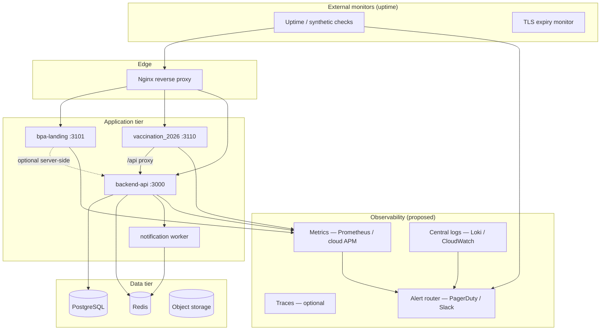
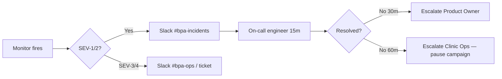
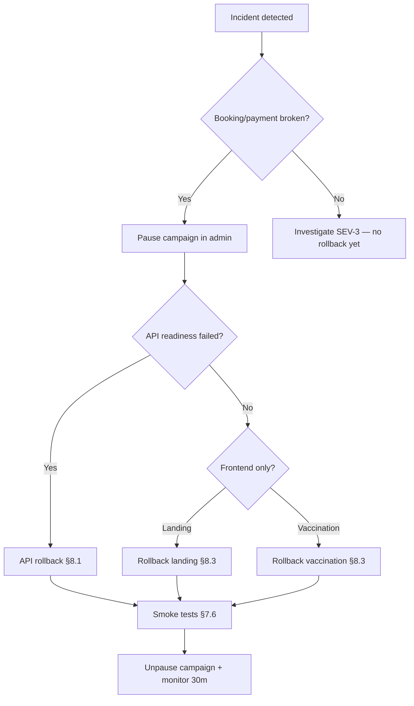

# Enterprise Monitoring & Failover Strategy

**Status:** 📋 **Planning only — do not implement until approved**  
**Date:** 2026-06-05  
**Owner:** Platform Engineering  
**Repos:** `backend-api` · `bpa-landing` · `vaccination_2026` · `bpa_web` · `bpa_app`  
**Related:** `DISASTER-RECOVERY-PLAYBOOK.md` · `docs/vaccination-campaign-2026/05-ROLLBACK-PLAN.md` · `docs/nginx-production-deployment.md` · `docs/architecture/bpa-vaccination-domain-strategy.md`

---

## 1. Executive summary

This document defines an **enterprise-grade monitoring, alerting, backup, and failover** strategy for the BPA public campaign stack:

| Surface | Production URL | App | Default port |
|---------|----------------|-----|--------------|
| Landing | `https://bangladeshpetassociation.com` | `bpa-landing` | 3101 |
| Vaccination | `https://vaccination.bangladeshpetassociation.com` | `vaccination_2026` | 3110 |
| Central API | `https://api.bangladeshpetassociation.com` | `backend-api` | 3000 |
| Database | Managed PostgreSQL (primary) | — | 5432 |

**Goals:**

1. Detect outages before users report them (synthetic + health probes).
2. Distinguish **liveness** (process up) vs **readiness** (can serve traffic).
3. Alert with clear severity, ownership, and runbook links.
4. Recover via **redeploy / failover / restore** — never destructive DB rollback after live bookings.
5. Roll back frontends in minutes; restore data from backups when needed.

**Out of scope until approved:** Terraform, vendor contracts, on-call rotation staffing, implementation PRs.

---

## 2. Monitoring architecture



### 2.1 Monitoring layers

| Layer | What it answers | Tool class (proposed) |
|-------|-----------------|---------------------|
| **Synthetic uptime** | Can a user reach HTTPS endpoints? | UptimeRobot, Better Stack, Grafana Cloud synthetic |
| **Health endpoints** | Is the app ready to serve? | HTTP probes on `/health`, `/health/ready` |
| **Infrastructure** | CPU, memory, disk, connections | Node exporter, cloud provider metrics |
| **APM / logs** | Why did it fail? 5xx rate, latency | Sentry, Datadog, or self-hosted Loki + Promtail |
| **Business** | Bookings/hour, payment success rate | Custom metrics from API + DB read replica |

---

## 3. Health endpoints

### 3.1 Design principles

| Principle | Rule |
|-----------|------|
| **Liveness** | Process running — never checks DB (fast, for orchestrator restarts) |
| **Readiness** | Dependencies OK — used by load balancer / nginx upstream checks |
| **No secrets** | Health JSON must not expose credentials, tokens, or PII |
| **Stable JSON** | `{ ok: boolean, service: string, checks?: object }` |
| **HTTP codes** | `200` = healthy/ready; `503` = not ready; `429` = rate-limited (edge only) |

### 3.2 As-built (backend-api)

| Endpoint | Method | Purpose | Status |
|----------|--------|---------|--------|
| `/health` | GET | API process alive | ✅ Implemented |
| `/health/redis` | GET | Redis connectivity + queue flags | ✅ Implemented |
| `/api/v1/auth/health` | GET | Auth module registered | ✅ Implemented |
| `/api/v1/campaign/public/sms/health` | GET | SMS + Redis infra (public) | ✅ Implemented |

### 3.3 Proposed (post-approval)

#### BPA API (`backend-api`)

| Endpoint | Type | Checks | Used by |
|----------|------|--------|---------|
| `/health/live` | Liveness | Process only | systemd, k8s livenessProbe |
| `/health/ready` | Readiness | PostgreSQL `SELECT 1`, Redis ping, migration version | nginx `max_fails`, synthetic monitor |
| `/health` | Legacy alias | Maps to `/health/live` or combined shallow check | Existing monitors |

**Readiness response shape (proposed):**

```json
{
  "ok": true,
  "service": "bpa_api",
  "version": "1.2.3",
  "checks": {
    "database": { "ok": true, "latencyMs": 4 },
    "redis": { "ok": true, "latencyMs": 2 },
    "migrations": { "ok": true, "pending": 0 }
  }
}
```

#### Landing (`bpa-landing`)

| Endpoint | Type | Checks |
|----------|------|--------|
| `/api/health` or `/health` | Readiness | Next.js server responding; optional HEAD to backend public stats |

```json
{ "ok": true, "service": "bpa_landing", "buildId": "…" }
```

#### Vaccination (`vaccination_2026`)

| Endpoint | Type | Checks |
|----------|------|--------|
| `/api/health` or `/health` | Readiness | Next.js server; optional lightweight `GET /api/v1/campaigns/active` via internal URL |

```json
{ "ok": true, "service": "bpa_vaccination", "buildId": "…" }
```

#### Database (external probe — not an HTTP route on Postgres)

| Check | Method | Frequency |
|-------|--------|-----------|
| Connection + `SELECT 1` | From API `/health/ready` | 30s |
| Replication lag | Exporter / cloud metric | 1m |
| Backup job success | Backup monitor script | Daily |
| Disk usage | Infrastructure monitor | 5m |

---

## 4. Uptime checks (synthetic monitoring)

### 4.1 Public HTTPS checks (required)

Run from **two external regions** (e.g. Singapore + Mumbai) plus one **internal** probe on the origin network.

| ID | Name | URL | Method | Expected | Interval | Timeout |
|----|------|-----|--------|----------|----------|---------|
| U1 | Landing home | `https://bangladeshpetassociation.com/` | GET | HTTP 200, body contains `BPA` or title | 1 min | 15s |
| U2 | Landing health | `https://bangladeshpetassociation.com/health` | GET | HTTP 200, `ok: true` | 1 min | 10s |
| U3 | Vaccination home | `https://vaccination.bangladeshpetassociation.com/` | GET | HTTP 200 | 1 min | 15s |
| U4 | Vaccination health | `https://vaccination.bangladeshpetassociation.com/health` | GET | HTTP 200, `ok: true` | 1 min | 10s |
| U5 | Vaccination book | `https://vaccination.bangladeshpetassociation.com/book` | GET | HTTP 200 | 5 min | 20s |
| U6 | API liveness | `https://api.bangladeshpetassociation.com/health` | GET | HTTP 200, `ok: true` | 1 min | 10s |
| U7 | API readiness | `https://api.bangladeshpetassociation.com/health/ready` | GET | HTTP 200, all checks ok | 1 min | 15s |
| U8 | API campaign public | `https://api.bangladeshpetassociation.com/api/v1/campaign/public/sms/health` | GET | HTTP 200 | 5 min | 15s |
| U9 | TLS cert expiry | All three hosts | SSL | > 14 days remaining | Daily | — |

### 4.2 Deep / transactional checks (optional, lower frequency)

| ID | Name | Flow | Interval | Notes |
|----|------|------|----------|-------|
| D1 | Campaign list | `GET /api/v1/campaigns/active` → 200 + JSON array | 15 min | Read-only |
| D2 | Booking smoke | Staging only — full OTP booking with test campaign | 1 hour | **Never** on production with real SMS/payment |
| D3 | Payment callback reachability | HEAD payment webhook path returns 405/401 not 502 | 15 min | API only |

### 4.3 Nginx upstream health (proposed)

Extend `infra/nginx/` with passive health:

```nginx
upstream bpa_landing {
    server 127.0.0.1:3101 max_fails=3 fail_timeout=30s;
    # server 127.0.0.1:3101 backup;  # secondary instance when HA approved
}
```

Active checks require a local sidecar or `health_check` (nginx plus) — document as Phase 2.

---

## 5. Alert strategy

### 5.1 Severity model

| Severity | Definition | Response target | Channel |
|----------|------------|-----------------|---------|
| **SEV-1 Critical** | Campaign booking/payment down; DB unreachable; total site outage | 15 min | PagerDuty / phone + Slack `#bpa-incidents` |
| **SEV-2 High** | Degraded — OTP delays, single app down, API 5xx > 5% | 30 min | Slack `#bpa-incidents` + email on-call |
| **SEV-3 Medium** | Non-blocking — landing only, admin UI, elevated latency | 4 hours | Slack `#bpa-ops` |
| **SEV-4 Low** | Informational — cert expiring in 30d, disk 70% | Next business day | Email / ticket |

### 5.2 Alert rules (proposed)

| Alert | Condition | Severity | Runbook |
|-------|-----------|----------|---------|
| `landing_down` | U1 or U2 fail ≥ 2 consecutive | SEV-2 | §7.1 |
| `vaccination_down` | U3 or U4 fail ≥ 2 consecutive | SEV-1 | §7.2 |
| `api_down` | U6 fail ≥ 2 consecutive | SEV-1 | §7.3 |
| `api_not_ready` | U7 fail ≥ 3 consecutive OR DB check false | SEV-1 | §7.3 + §7.4 |
| `db_backup_stale` | Last backup > 25 hours | SEV-2 | §6.2 |
| `db_disk_high` | Disk > 85% | SEV-2 | §7.4 |
| `redis_down` | `/health/redis` 503 ≥ 5 min | SEV-2 | `DISASTER-RECOVERY-PLAYBOOK.md` §Redis |
| `sms_unhealthy` | `sms/health` reports provider down | SEV-2 | `SMS-PRODUCTION-VALIDATION.md` |
| `payment_error_spike` | Payment failure rate > 10% (15 min window) | SEV-1 | Pause campaign + §8.2 |
| `5xx_rate_high` | API 5xx > 2% for 10 min | SEV-2 | §8.1 |
| `tls_expiring` | Cert < 14 days | SEV-3 | certbot renew |

### 5.3 Alert hygiene

- **No alert without owner** — each rule maps to Platform Engineering or Campaign Ops.
- **No alert without runbook link** — this document + linked playbooks.
- **Flap suppression** — 2–3 consecutive failures before page; 30 min auto-resolve notification.
- **Maintenance windows** — silence synthetic checks during planned deploys (max 30 min).

### 5.4 Escalation



### 5.5 Campaign-specific kill switch

Before infra failover, ops can **pause campaign** in admin (stops new bookings, preserves data):

1. Set campaign `status = PAUSED` in admin.
2. Post status on landing/vaccination via env banner (future) or manual comms.
3. Resume after smoke tests pass (§7.5).

---

## 6. Backup strategy

Consolidates and extends `DISASTER-RECOVERY-PLAYBOOK.md` §4.

### 6.1 Recovery objectives (campaign season)

| Component | RPO | RTO | Owner |
|-----------|-----|-----|-------|
| **PostgreSQL** | ≤ 1 hour | 30 min (failover) / 2–4 h (full restore) | DBA / Platform |
| **Redis** | ≤ 6 hours | 30 min | Platform |
| **Object storage** | ≤ 24 hours | 4 hours | Platform |
| **Landing / Vaccination builds** | 0 (git tags) | 30 min redeploy | Platform |
| **Secrets** | 0 (vault versions) | 15 min | Security |

### 6.2 PostgreSQL backup plan

| Job | Schedule | Retention | Verification |
|-----|----------|-----------|--------------|
| **Automated snapshot** | Hourly (managed) or daily `pg_dump -Fc` | 30 days | Console / backup log |
| **WAL / PITR** | Continuous (production managed Postgres) | 7–30 days | Quarterly restore drill |
| **Pre-deploy snapshot** | Manual trigger before prod migration | 7 days | Document snapshot ID in deploy ticket |
| **Logical export** | Weekly to encrypted cold storage | 90 days | `pg_restore` to `bpa_dr_test` |

**Monthly checklist:**

- [ ] Last backup age < 24 h
- [ ] Restore drill to isolated DB completed (count `campaign_bookings`)
- [ ] `DATABASE_URL` in vault, not single host file
- [ ] Migration integrity: `node scripts/check-migration-integrity.js`

**Never for production recovery:** `prisma migrate reset`, `db push`, or destructive down migrations after live bookings.

### 6.3 Application-state backups

| App | Stateful data | Backup approach |
|-----|---------------|-----------------|
| `bpa-landing` | None (SSR build) | Redeploy from git tag; env in vault |
| `vaccination_2026` | None (SSR); session in browser | Redeploy from git tag |
| `backend-api` | None in app layer | Redeploy image; env in vault |
| **Worker** | BullMQ jobs in Redis | Redis RDB; drain queue before restore |

### 6.4 Redis backup plan

| Job | Schedule | Notes |
|-----|----------|-------|
| RDB snapshot | Every 6 h (managed) | OTP re-auth acceptable after restore |
| Pre-campaign snapshot | Before go-live | Document in deploy ticket |

### 6.5 Object storage (MinIO / B2)

| Job | Schedule | Command reference |
|-----|----------|-------------------|
| Mirror to DR bucket | Daily | `mc mirror` per `DISASTER-RECOVERY-PLAYBOOK.md` §4.2 |

### 6.6 Configuration & secrets backup

| Item | Store | Backup |
|------|-------|--------|
| `.env` production | Vault / sealed secrets | Versioned, audited |
| Nginx / TLS | `/etc/letsencrypt`, `infra/nginx/` in git | Certbot + git |
| DNS | Provider | Export zone file quarterly |

---

## 7. Failover strategy

### 7.1 Landing app (`bpa-landing`)

| Scenario | Failover action | RTO |
|----------|-----------------|-----|
| Process crash | systemd/PM2 auto-restart | < 2 min |
| Bad deploy | Rollback previous build (§8.3) | 15 min |
| Origin unreachable | CDN cached static assets only — limited | 30 min |
| Full origin loss | Redeploy to standby VM from last tag | 30 min |

**No database failover** — landing is stateless. API calls are browser-side to `api.` host (CORS) or optional nginx `/api/v1` proxy.

### 7.2 Vaccination app (`vaccination_2026`)

| Scenario | Failover action | RTO |
|----------|-----------------|-----|
| Process crash | Auto-restart | < 2 min |
| Bad deploy | Rollback build (§8.3) | 15 min |
| API unreachable | Show maintenance on `/book`; informational pages may stay up | 15 min |
| Campaign logic bug | **Pause campaign** in admin + static maintenance page | 5 min |

Booking funnel depends on API + Redis + DB — vaccination app failover alone is insufficient if API is down.

### 7.3 BPA API (`backend-api`)

| Scenario | Failover action | RTO |
|----------|-----------------|-----|
| Single instance crash | Restart + health probe | < 5 min |
| Bad deploy | Rollback container/image (§8.1) | 15 min |
| Redis down | Restart Redis / failover replica; restart `worker:notifications` | 30 min |
| DB primary down | Promote read replica (managed) or restore snapshot | 30 min – 4 h |

**Active-active API** (multiple instances behind nginx) — proposed Phase 2; requires shared Redis + DB and sessionless API design (already mostly stateless).

### 7.4 Database (PostgreSQL)

| Scenario | Failover action | RTO |
|----------|-----------------|-----|
| Connection pool exhaustion | Scale connection limits; kill long queries | 15 min |
| Primary failure | Automatic failover (RDS/Cloud SQL) or manual replica promotion | 30 min |
| Corruption / ransomware | PITR restore to new instance; DNS update `DATABASE_URL` | 2–4 h |
| Migration failure mid-deploy | Stop deploy; forward-fix migration — **no down** | Variable |

### 7.5 Failover decision matrix



### 7.6 Recovery verification (smoke tests)

Run after any failover or rollback before declaring **resolved**:

| # | Test | Pass criteria |
|---|------|---------------|
| 1 | `GET /health/ready` (API) | 200, DB + Redis ok |
| 2 | `GET /api/v1/campaign/public/sms/health` | Redis enabled, provider configured |
| 3 | Landing + vaccination home | 200, < 3s TTFB |
| 4 | Staff QR check-in (staging ref) | Valid token scans |
| 5 | Certificate PDF generation | `GET /certificates/:token/pdf` 200 |
| 6 | Optional: staging booking E2E | Complete free test booking |

Full checklist: `DISASTER-RECOVERY-PLAYBOOK.md` §8.

---

## 8. Deployment rollback procedures

Aligns with `docs/vaccination-campaign-2026/05-ROLLBACK-PLAN.md`. **Planning reference only.**

### 8.1 Backend API rollback

**Triggers:** SEV-1/2 API errors, booking/payment 500s, readiness check failing after deploy.

| Step | Action | Owner |
|------|--------|-------|
| 1 | Announce incident in `#bpa-incidents` | On-call |
| 2 | **Pause campaign** (admin) if bookings affected | Campaign ops |
| 3 | Identify last good git tag / container image | On-call |
| 4 | Deploy previous artifact (`git checkout <tag>`, build, restart) | Platform |
| 5 | **Do not** run `prisma migrate down` | — |
| 6 | If migration caused issue: forward-fix migration in new deploy | Platform |
| 7 | Run smoke tests §7.6 | On-call |
| 8 | Unpause campaign; monitor 30 min | Campaign ops |

```bash
# Example — adjust for your process manager
cd /opt/bpa/backend-api
git fetch && git checkout <LAST_GOOD_TAG>
npm ci && npm run build
pm2 restart bpa-api bpa-worker
curl -sf https://api.bangladeshpetassociation.com/health/ready
```

### 8.2 Vaccination app rollback

| Step | Action |
|------|--------|
| 1 | Roll hosting platform to **previous deployment** (Vercel/PM2/git tag) |
| 2 | Verify `https://vaccination.bangladeshpetassociation.com/health` |
| 3 | Verify `/book` loads (does not require API regression) |
| 4 | If API also rolled back, coordinate order: **API first**, then frontend |

```bash
cd /opt/bpa/vaccination_2026
git checkout <LAST_GOOD_TAG>
npm ci && npm run build && pm2 restart bpa-vaccination
```

### 8.3 Landing app rollback

| Step | Action |
|------|--------|
| 1 | Deploy previous `bpa-landing` build |
| 2 | Verify apex home + `/vaccination` bridge |
| 3 | No API rollback needed for CSS-only landing issues |

```bash
cd /opt/bpa/bpa-landing
git checkout <LAST_GOOD_TAG>
npm ci && npm run build && pm2 restart bpa-landing
```

### 8.4 Database rollback (data recovery — not schema down)

| Situation | Procedure |
|-----------|-----------|
| Bad migration applied | Forward-fix only; restore from **pre-deploy snapshot** if data corrupted |
| Accidental data delete | PITR to timestamp before incident |
| Full loss | Restore latest snapshot + WAL to new instance; update `DATABASE_URL`; redeploy API |

```bash
# Illustrative — use provider console for managed Postgres
# 1. Create new instance from snapshot / PITR
# 2. Verify: psql -c "SELECT COUNT(*) FROM campaign_bookings;"
# 3. Update vault DATABASE_URL
# 4. Restart API + worker
# 5. node scripts/check-migration-integrity.js
```

### 8.5 Rollback triggers (quick reference)

| Trigger | Roll back |
|---------|-----------|
| 100% booking API 500 | API |
| Payment double-charge pattern | API + pause campaign |
| Landing layout broken only | Landing only |
| `/book` wizard broken, API healthy | Vaccination only |
| DB migration data corruption | Restore DB + API forward-fix |
| OTP/SMS down > 15 min | Redis/worker restart first; API rollback if code regression |

---

## 9. Recovery procedures (incident types)

### 9.1 Total site outage (all HTTPS checks fail)

1. Check origin server / cloud provider status.
2. SSH to origin: `systemctl status nginx`, `pm2 list`, disk space.
3. Restart nginx → apps → API → worker in order.
4. If origin compromised: activate DR snapshot (§6.2), DNS to standby (4 h RTO).
5. Post-mortem within 48 h.

### 9.2 API up, vaccination/landing down

1. Check upstream ports 3101 / 3110 locally: `curl -I http://127.0.0.1:3101/health`.
2. Review last frontend deploy; rollback §8.2 / §8.3.
3. Check nginx error logs: `/var/log/nginx/bpa-*.error.log`.

### 9.3 API down, frontends up

1. `curl https://api.bangladeshpetassociation.com/health/ready`
2. Check PostgreSQL + Redis; review API logs.
3. Rollback API §8.1 if deploy-correlated.
4. Pause campaign until readiness returns.

### 9.4 Database degraded

1. Check connection count, slow queries, replication lag.
2. Failover to replica (managed) or scale instance.
3. If corrupt: stop writes (pause campaign), PITR restore §8.4.
4. Notify clinic ops — paper backup forms if check-in down > 30 min.

### 9.5 Payment gateway failure

1. Do not rollback DB.
2. Pause paid bookings or switch campaign to FREE (admin workaround).
3. Monitor payment provider status page.
4. Communicate on vaccination landing.

**Detailed workflows:** `DISASTER-RECOVERY-PLAYBOOK.md` §5–§9.

---

## 10. Implementation plan (post-approval)

| Phase | Deliverable | Effort | Dependency |
|-------|-------------|--------|------------|
| **P0** | `/health/ready` on API (DB + Redis + migrations) | 1–2 d | Approval |
| **P0** | `/health` on landing + vaccination Next routes | 0.5 d | Approval |
| **P0** | Configure U1–U9 synthetic monitors | 0.5 d | Health routes |
| **P0** | Slack alert channel + on-call rotation doc | 0.5 d | — |
| **P1** | Prometheus + node exporter OR cloud APM | 2–3 d | Host access |
| **P1** | Sentry / structured logging aggregation | 2 d | — |
| **P1** | Nginx passive upstream `max_fails` | 0.5 d | `infra/nginx/` |
| **P2** | API horizontal scaling (2+ instances) | 3–5 d | Load balancer |
| **P2** | Staging DR restore drill automation | 2 d | — |
| **P2** | Business metrics dashboard (bookings/hour) | 3 d | Read replica |

### 10.1 Approval checklist

Before implementation, stakeholders must sign off on:

- [ ] RPO/RTO targets (§6.1)
- [ ] Alert severity + on-call coverage (§5)
- [ ] Monitoring vendor (UptimeRobot vs Grafana Cloud vs other)
- [ ] Paging vendor (PagerDuty vs Slack-only)
- [ ] Budget for managed Postgres HA + backups
- [ ] Health endpoint URLs exposed publicly (vs IP-restricted)
- [ ] Staging environment for D2 transactional smoke tests

---

## 11. Document index

| Document | Purpose |
|----------|---------|
| **This file** | Monitoring, failover, backup, rollback **strategy** |
| `DISASTER-RECOVERY-PLAYBOOK.md` | Operational DR + restore commands |
| `docs/vaccination-campaign-2026/05-ROLLBACK-PLAN.md` | Layer-specific rollback |
| `docs/nginx-production-deployment.md` | Edge routing + TLS |
| `docs/architecture/bpa-vaccination-domain-strategy.md` | Multi-domain architecture |
| `docs/PRISMA_MIGRATION_NON_DESTRUCTIVE_POLICY.md` | No destructive DB ops |

---

## 12. Revision history

| Date | Version | Change |
|------|---------|--------|
| 2026-06-05 | 0.1 | Initial planning document — **not implemented** |
