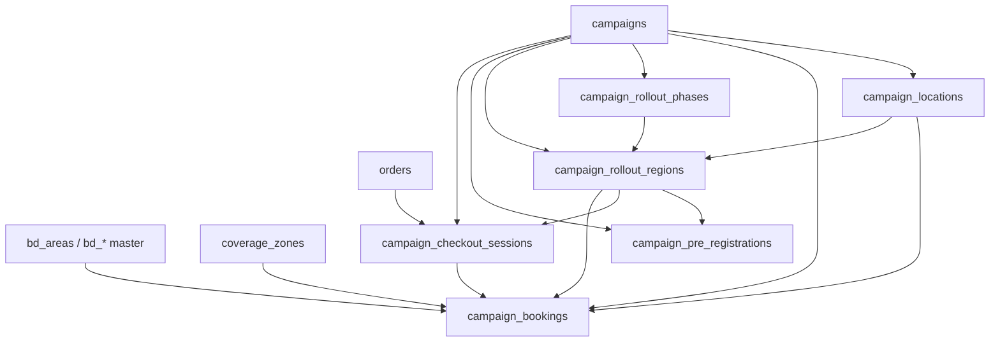
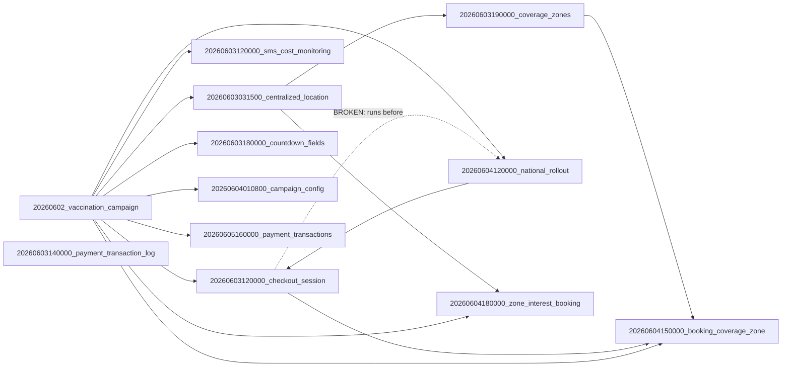

# Campaign Migration Dependency Analysis

**Date:** 2026-06-06  
**Project:** `backend-api`  
**Symptom:** `prisma migrate deploy` fails on `20260603120000_campaign_checkout_session` with:

```text
ERROR: relation "campaign_rollout_regions" does not exist
```

**Scope:** Audit of all `prisma/migrations/` files referencing six campaign tables. Analysis only — no migration files were modified as part of this audit.

---

## Executive Summary

Migration `20260603120000_campaign_checkout_session` alters and references `campaign_rollout_regions` **before** that table is created by `20260604120000_campaign_national_rollout`. Prisma applies migrations in **lexicographic folder-name order**, so checkout runs ~24 hours earlier in the sequence than national rollout. This is a **timestamp ordering bug**, not a missing migration.

**Required fix:** Re-order so `campaign_national_rollout` runs before `campaign_checkout_session` (rename folder timestamp). Optionally fold `bookedCount` into the national rollout `CREATE TABLE` and drop the redundant `ALTER TABLE` from checkout.

---

## Root Cause

Two migrations were authored on different days but given timestamps that invert their logical dependency:

| Migration | Timestamp (sort key) | Action on `campaign_rollout_regions` |
|-----------|---------------------|--------------------------------------|
| `20260603120000_campaign_checkout_session` | `20260603120000` | `ALTER TABLE … ADD COLUMN bookedCount`; FK references |
| `20260604120000_campaign_national_rollout` | `20260604120000` | `CREATE TABLE campaign_rollout_regions` |

The checkout migration was likely written assuming rollout tables already existed (matching `schema.prisma`), but national rollout was added later with a **later** timestamp. Fresh `migrate deploy` on production therefore executes checkout first and fails on the first DDL statement touching `campaign_rollout_regions`.

### First failing statement

From `20260603120000_campaign_checkout_session/migration.sql` line 5:

```sql
ALTER TABLE "campaign_rollout_regions" ADD COLUMN "bookedCount" INTEGER NOT NULL DEFAULT 0;
```

The table is not created until `20260604120000_campaign_national_rollout/migration.sql` lines 24–43.

---

## Broken Ordering (Current vs Correct)

### Current lexicographic order (broken)

```text
20260602_add_vaccination_campaign_2026          ← creates campaign_locations, campaign_bookings
20260603031500_centralized_location_system
20260603120000_campaign_checkout_session      ← FAIL: needs campaign_rollout_regions
20260603120000_campaign_sms_cost_monitoring
20260603140000_payment_transaction_log
20260603180000_campaign_countdown_fields
20260603190000_coverage_zones
20260604010800_add_campaign_config_tables
20260604120000_campaign_national_rollout        ← creates rollout tables (too late)
20260604150000_campaign_booking_coverage_zone
…
```

### Correct topological order (target tables)

```text
20260602_add_vaccination_campaign_2026          ← campaign_locations, campaign_bookings
20260603031500_centralized_location_system      ← bd_* master (for coverage_zones)
20260603120000_campaign_sms_cost_monitoring       ← no rollout dependency
20260603140000_payment_transaction_log
20260603180000_campaign_countdown_fields
20260603190000_coverage_zones
20260604010800_add_campaign_config_tables
20260604120000_campaign_national_rollout          ← campaign_rollout_phases/regions, pre_registrations
20260603120000_campaign_checkout_session          ← MUST move after national_rollout (rename timestamp)
20260604150000_campaign_booking_coverage_zone
20260604180000_zone_interest_booking
20260604190000_campaign_booking_zone_interest_reconcile
20260604210000_campaign_included_vaccines
20260604220000_campaign_pricing_breakdown
20260604230000_backfill_campaign_pricing_split
20260604240000_campaign_slot_session_fields
20260605120000_sms_logs
20260605140000_campaign_pet_ticket
20260605160000_payment_transactions
```

**Recommended rename:** `20260603120000_campaign_checkout_session` → `20260604130000_campaign_checkout_session` (after `04120000`, before `04150000`).

---

## Dependency Graph

### Table-level creation and dependency edges



### Migration-level graph (June 2026 campaign chain)



Solid arrows = valid dependency. Dotted arrow = **inverted order in current migration history** (checkout runs before national rollout).

---

## Migrations Referencing Target Tables

### `campaign_locations`

| Migration | Operation |
|-----------|-----------|
| `20260602_add_vaccination_campaign_2026` | **CREATE TABLE**; indexes; FK from `campaign_slots`, `campaign_staff`, `campaign_bookings` |
| `20260604120000_campaign_national_rollout` | FK: `campaign_rollout_regions.locationId` → `campaign_locations` |

**Creator:** `20260602_add_vaccination_campaign_2026`  
**Downstream dependents:** national rollout, all booking/slot flows.

---

### `campaign_bookings`

| Migration | Operation |
|-----------|-----------|
| `20260602_add_vaccination_campaign_2026` | **CREATE TABLE**; indexes; trigger on bookedCount; FKs to campaigns, locations, slots, users, orders |
| `20260603120000_campaign_checkout_session` | ADD `rolloutRegionId`, `checkoutSessionId`, `ownerAlternatePhone`; indexes; FKs to rollout_regions, checkout_sessions |
| `20260604150000_campaign_booking_coverage_zone` | ADD `coverageZoneId`, `bookingArea`; FK to `coverage_zones` |
| `20260604180000_zone_interest_booking` | ADD `CampaignBookingMode`, nullable `locationId`/`slotId`, `coverageZoneName`, `bdAreaId` |
| `20260604190000_campaign_booking_zone_interest_reconcile` | Idempotent duplicate of zone-interest changes |
| `20260605160000_payment_transactions` | FK: `payment_transactions.bookingId` → `campaign_bookings` |

**Creator:** `20260602_add_vaccination_campaign_2026`  
**Critical path:** checkout_session must run after national_rollout (rolloutRegionId FK).

---

### `campaign_rollout_phases`

| Migration | Operation |
|-----------|-----------|
| `20260604120000_campaign_national_rollout` | **CREATE TABLE**; enums; indexes; FK to `campaigns` |

**Creator:** `20260604120000_campaign_national_rollout`  
**Only migration** referencing this table.

---

### `campaign_rollout_regions`

| Migration | Operation |
|-----------|-----------|
| `20260603120000_campaign_checkout_session` | **ALTER** ADD `bookedCount`; FK refs from `campaign_bookings`, `campaign_checkout_sessions` |
| `20260604120000_campaign_national_rollout` | **CREATE TABLE**; indexes; FKs to phases, campaigns, locations; referenced by pre_registrations |

**Creator:** `20260604120000_campaign_national_rollout`  
**Conflict:** checkout_session **ALTER/FK** runs 10 migrations earlier in sort order than **CREATE**.

**Schema note:** `schema.prisma` defines `bookedCount` on `CampaignRolloutRegion` with `@default(0)`. It is cleaner to include `bookedCount` in the national rollout `CREATE TABLE` and remove the checkout `ALTER TABLE` (optional consolidation when implementing the fix).

---

### `campaign_pre_registrations`

| Migration | Operation |
|-----------|-----------|
| `20260604120000_campaign_national_rollout` | **CREATE TABLE**; indexes; FKs to campaigns, rollout_regions |

**Creator:** `20260604120000_campaign_national_rollout`  
**Only migration** referencing this table. No ordering conflict (depends on rollout_regions created in same migration).

---

### `campaign_checkout_sessions`

| Migration | Operation |
|-----------|-----------|
| `20260603120000_campaign_checkout_session` | **CREATE TABLE** `CampaignCheckoutStatus` enum; indexes; FKs to campaigns, rollout_regions, orders; referenced by `campaign_bookings.checkoutSessionId` |

**Creator:** `20260603120000_campaign_checkout_session`  
**Must run after:** `campaign_rollout_regions` exists (national rollout).

---

## Additional Ordering Notes

### Duplicate timestamp `20260603120000`

Two migrations share the same prefix:

- `20260603120000_campaign_checkout_session`
- `20260603120000_campaign_sms_cost_monitoring`

Prisma sorts by full folder name; **checkout runs before sms_cost** (`campaign_checkout_session` < `campaign_sms_cost_monitoring`). SMS cost monitoring only alters `campaign_sms_logs` and has **no dependency on rollout tables** — it is blocked today only because deploy stops at the failed checkout migration.

### Zone-interest duplicate migrations

`20260604180000_zone_interest_booking` and `20260604190000_campaign_booking_zone_interest_reconcile` apply the same booking columns; reconcile is idempotent for environments that already ran 041800. Not a deploy blocker.

### Coverage zone chain

`20260603190000_coverage_zones` depends on `bd_*` tables from `20260603031500_centralized_location_system`.  
`20260604150000_campaign_booking_coverage_zone` depends on both `campaign_bookings` and `coverage_zones`. Current order is valid once checkout is fixed.

---

## Impact Analysis

| Area | Impact |
|------|--------|
| **Production deploy** | Blocked at `20260603120000_campaign_checkout_session`; all subsequent June migrations pending |
| **Partial DDL** | Unlikely — failure occurs on first statement (`ALTER campaign_rollout_regions`); no checkout objects created |
| **Data loss risk** | None from the failure itself; DB remains at last successful migration |
| **Application features** | National rollout, checkout sessions, zone-interest booking, payment_transactions booking FK — all unavailable until chain completes |
| **Environments already past checkout** | If any host manually applied SQL out of order, needs per-DB inventory before reorder |
| **Checksum / integrity** | Renaming a **never-successfully-applied** migration folder is safe; do not rename migrations already recorded as applied in `_prisma_migrations` without governed reconcile |
| **Policy** | Per `docs/PRISMA_MIGRATION_NON_DESTRUCTIVE_POLICY.md`: do not edit applied migrations; fix forward or reorder only failed/pending migrations |

### Migrations blocked after failure (not yet applied on typical production)

```text
20260603120000_campaign_checkout_session        (failed)
20260603120000_campaign_sms_cost_monitoring
20260603140000_payment_transaction_log
20260603180000_campaign_countdown_fields
20260603190000_coverage_zones
20260604010800_add_campaign_config_tables
20260604120000_campaign_national_rollout
20260604150000_campaign_booking_coverage_zone
20260604180000_zone_interest_booking
20260604190000_campaign_booking_zone_interest_reconcile
20260604210000_campaign_included_vaccines
20260604220000_campaign_pricing_breakdown
20260604230000_backfill_campaign_pricing_split
20260604240000_campaign_slot_session_fields
20260605120000_sms_logs
20260605140000_campaign_pet_ticket
20260605160000_payment_transactions
```

---

## Required Fix Strategy

### Phase 1 — Recover from failed migration (production)

1. Confirm failed migration state:

   ```bash
   npx prisma migrate status
   ```

2. If `20260603120000_campaign_checkout_session` is recorded as failed (P3018):

   ```bash
   npx prisma migrate resolve --rolled-back 20260603120000_campaign_checkout_session
   ```

3. Verify no partial objects from checkout (expected empty):

   ```sql
   SELECT to_regclass('public.campaign_checkout_sessions');
   SELECT to_regclass('public.campaign_rollout_regions');
   SELECT typname FROM pg_type WHERE typname = 'CampaignCheckoutStatus';
   ```

### Phase 2 — Fix migration order (repo change; separate PR)

**Primary fix — rename folder:**

```text
prisma/migrations/20260603120000_campaign_checkout_session/
  → prisma/migrations/20260604130000_campaign_checkout_session/
```

Place after `20260604120000_campaign_national_rollout` and before `20260604150000_campaign_booking_coverage_zone`.

**Optional consolidation (recommended in same PR):**

- Add `"bookedCount" INTEGER NOT NULL DEFAULT 0` to `CREATE TABLE "campaign_rollout_regions"` in national rollout (matches `schema.prisma`).
- Remove `ALTER TABLE "campaign_rollout_regions" ADD COLUMN "bookedCount"` from checkout migration (avoids redundant DDL).

**Do not:**

- Edit `20260604120000_campaign_national_rollout` if it is already applied on any environment (not the case on typical blocked production).
- Use `migrate reset` or `db push` on production-like DB.

### Phase 3 — Verify and deploy

```bash
node scripts/check-migration-integrity.js
npx prisma migrate deploy
node scripts/check-migration-integrity.js
npx prisma migrate status
```

---

## Safest Production Fix (Step-by-Step)

This is the lowest-risk path for a production-like DB where checkout **failed** and national rollout **was never applied**:

1. **Backup** — `pg_dump` before any metadata or deploy change.

2. **Resolve failed migration** — `migrate resolve --rolled-back 20260603120000_campaign_checkout_session` so Prisma clears the P3018 lock.

3. **Deploy fix from repo** — merge PR that renames checkout to `20260604130000_campaign_checkout_session` (and optional `bookedCount` consolidation).

4. **Run deploy** — `npx prisma migrate deploy` applies pending migrations in corrected order:
   - sms_cost, payment_log, countdown, coverage_zones, config, **national_rollout**, **checkout_session**, coverage_zone booking, etc.

5. **Post-deploy checks** — integrity script, `migrate status`, smoke-test campaign checkout API if available.

### If checkout was ever marked applied on a host (edge case)

Do **not** rename without inventory. Query:

```sql
SELECT migration_name, finished_at, applied_steps_count, logs
FROM _prisma_migrations
WHERE migration_name LIKE '%checkout%' OR migration_name LIKE '%national_rollout%';
```

Use forward reconciliation migration or manual `resolve` only after comparing live schema to expected DDL.

### If national rollout was manually applied early (edge case)

If `campaign_rollout_regions` exists but checkout migration is still pending under the old name:

- Renaming checkout folder is still correct.
- Skip or idempotent-wrap the `bookedCount` ALTER if column already exists (consolidation into CREATE avoids this).

---

## Correct Migration Order (Target Tables Only)

| Order | Migration | Tables affected |
|------:|-----------|-----------------|
| 1 | `20260602_add_vaccination_campaign_2026` | Creates `campaign_locations`, `campaign_bookings` |
| 2 | `20260604120000_campaign_national_rollout` | Creates `campaign_rollout_phases`, `campaign_rollout_regions`, `campaign_pre_registrations` |
| 3 | `20260604130000_campaign_checkout_session` *(renamed)* | Creates `campaign_checkout_sessions`; extends `campaign_bookings`, `campaign_rollout_regions` |
| 4 | `20260604150000_campaign_booking_coverage_zone` | Alters `campaign_bookings` |
| 5 | `20260604180000_zone_interest_booking` | Alters `campaign_bookings` |
| 6 | `20260605160000_payment_transactions` | FK to `campaign_bookings` |

---

## References

- `prisma/migrations/20260603120000_campaign_checkout_session/migration.sql`
- `prisma/migrations/20260604120000_campaign_national_rollout/migration.sql`
- `prisma/migrations/20260602_add_vaccination_campaign_2026/migration.sql`
- `prisma/schema.prisma` — `CampaignRolloutRegion`, `CampaignCheckoutSession`, `CampaignBooking`
- `docs/PRISMA_MIGRATION_NON_DESTRUCTIVE_POLICY.md`
- `prisma/migrations/MIGRATION_RESOLVE_P3018.md` — prior P3018 recovery pattern

---

## Next Steps (Implementation — Not Done in This Audit)

1. Open PR: rename checkout migration + optional `bookedCount` consolidation.
2. Production: backup → `migrate resolve --rolled-back` → deploy from fixed branch.
3. Add CI check: detect migration SQL references to tables created in later-timestamp migrations (optional guardrail).
