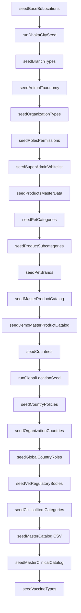

# Prisma Seed System Audit

**Date:** 2026-06-06  
**Repository:** `backend-api`  
**Scope:** Analysis only — no code changes  
**Entry point:** `prisma/seed.ts` (via `package.json` → `"prisma"."seed"`)

---

## 1. Executive summary

| Finding | Status |
|---------|--------|
| Main seed chain (`prisma/seed.ts`) | **Complete** — 27 steps, all direct imports resolve |
| Broken imports in main chain | **None** (verified by loading `prisma/seed.ts` with ts-node) |
| Coverage zone seeders | **Exist** under `prisma/seeders/coverage/` but **not** in main `seed.ts` chain |
| Legacy seed runners | **Present** (`prisma/seed.js`, `seed_location.js`) — **not** wired to `npm run seed` |
| Super Admin **user** creation | **Not** in Prisma seed — requires `npm run admin:bootstrap` |
| Production deploy path | `npm run db:deploy` → `migrate deploy` + `db seed` |

---

## 2. Entry points and package.json scripts

### 2.1 Canonical Prisma seed

```json
"prisma": {
  "seed": "node -r ts-node/register prisma/seed.ts"
}
```

| Script | Command | Role |
|--------|---------|------|
| `npm run seed` | `node scripts/run-local-prisma.cjs db seed` | Runs `prisma/seed.ts` |
| `npm run db:seed` | same | Alias |
| `npm run db:deploy` | `migrate deploy && db seed` | **Production fresh DB** |
| `npm run db:reset` | `migrate reset --force` | Destructive dev reset + seed |

### 2.2 Standalone seed scripts (outside main chain)

| Script | File | Purpose |
|--------|------|---------|
| `seed:location-master` | `scripts/seed-location-master.ts` | BD divisions/districts/upazilas/areas only |
| `seed:dhaka-city` | `scripts/seed-dhaka-city.ts` | DNCC/DSCC `BdArea` courier tree |
| `seed:dhaka-metro` | `scripts/seed-dhaka-metro.ts` | Dhaka BdArea + metro `CoverageZone` |
| `seed:coverage-zones` | `scripts/seed-coverage-zones.ts` | Full coverage pipeline (auto-runs dhaka-city if needed) |
| `seed:clinic-vaccine-items` | `scripts/seed-clinic-vaccine-items.ts` | Per-org clinical vaccine items (`ORG_ID` required) |
| `seed:campaign-checkout-anchor` | `scripts/seed-campaign-checkout-anchor.ts` | Campaign checkout anchor data |
| `admin:bootstrap` | `scripts/bootstrap-super-admin.ts` | Creates Super Admin **user** + whitelist |
| `admin:verify` | `scripts/verify-super-admin.ts` | Verifies bootstrap result |

### 2.3 Legacy runners (obsolete for production)

| File | Status |
|------|--------|
| `prisma/seed.js` | Legacy — only calls `seedLocationsDhaka` (CityCorporation model) |
| `prisma/seed_location.js` | Legacy duplicate of `seedBaseBdLocations` logic |
| `prisma/seed_all.js` | Wrapper → `prisma/seed.js` |

These are **not** invoked by `npm run seed`.

---

## 3. Main seed chain (`prisma/seed.ts`)

Execution order with file references:

| Step | Seeder | File(s) |
|------|--------|---------|
| 1 | Bangladesh base locations | `seeders/seedBaseBdLocations.ts` |
| 2 | Dhaka city BdArea hierarchy | `seeders/index.ts` → `dhaka/runDhakaCitySeed.ts` → `dhaka/seedDhakaNorthCityBdAreas.ts`, `dhaka/seedDhakaSouthCityBdAreas.ts` → `dhaka/seedDhakaCityCorporations.ts`, `seedDhakaCityZones.ts`, `seedDhakaCityAreas.ts` |
| 3 | Fundraising payout catalog | `seeders/seedFundraisingPayoutCatalog.ts` |
| 4 | Branch types | `seeders/seedBranchTypes.ts` |
| 4.1 | Animal taxonomy | `seeders/seedAnimalTaxonomy.ts` |
| 5 | Organization types | `seeders/seedOrganizationTypes.ts` |
| 6 | Roles & permissions (ORG/BRANCH scope) | `seeders/seedRolesPermissions.ts` |
| 7 | Super Admin whitelist | `seeders/seedSuperAdminWhitelist.ts` |
| 8 | Membership backfill | `seeders/seedMembershipBackfill.ts` |
| 9 | Products master data | `seeders/seedProductsMasterData.ts` |
| 10 | Pet categories | `seeders/seedPetCategories.ts` |
| 11 | Product subcategories | `seeders/seedProductSubcategories.ts` |
| 12 | Pet brands | `seeders/seedPetBrands.ts` |
| 13 | Master product catalog | `seeders/seedMasterProductCatalog.ts` |
| 13.1 | Demo master product catalog | `seeders/seedDemoMasterProductCatalog.ts` |
| 14 | Countries (BD, IN, US) | `seeders/seedCountries.ts` |
| 14.0 | Global location system | `seeders/location/index.ts` → `seedGlobalCountries.ts`, `seedGlobalStates.ts`, `seedGlobalCities.ts`, `seedGlobalSubDistricts.ts` |
| 14.x | Country policies | `seeders/seedCountryPolicies.ts` |
| 14.1 | Organization country backfill | `seeders/seedOrganizationCountries.ts` |
| 15 | Global + country roles | `seeders/seedGlobalCountryRoles.ts` |
| 16 | Vet regulatory bodies | `seeders/seedVetRegulatoryBodies.ts` |
| 17 | Clinical item categories (per org) | `seeders/seedClinicalItemCategories.ts` |
| 18 | Master catalog from CSV | `seeds/seed-master-catalog.ts` |
| 19 | Master clinical catalog (TS data) | `seeders/seedMasterClinicalCatalog.ts` |
| 20 | Vaccine types | `seeders/seedVaccineTypes.ts` |
| 21 | Inbound receive QA fixtures | `seeders/seedInboundReceiveQaFixtures.ts` (no-op unless `SEED_INBOUND_RECEIVE_QA=true`) |
| 22 | Warehouse phase 1 demo | `seeders/seedWarehousePhase1Minimal.ts` (only if `SEED_WAREHOUSE_PHASE1=true`) |

**Not in main chain:** `runCoverageZoneSeed` (`seeders/index.ts`) — requires `npm run seed:coverage-zones`.

---

## 4. Coverage zone sub-chain (standalone)

Invoked via `seeders/index.ts` → `runCoverageZoneSeed()`:

| Order | File | Depends on |
|-------|------|------------|
| 1 | `coverage/seedCoverageZones.ts` | `coverage/data/dhaka-metro-coverage.ts`, `coverage/lib/upsertCoverageZone.ts`, `coverage/lib/resolveBdArea.ts` |
| 2 | `coverage/seedDhakaNorthCity.ts` | `coverage/data/dncc-coverage-mapping.ts`, existing `AREA-DNCC-*` BdArea rows |
| 3 | `coverage/seedDhakaSouthCity.ts` | `coverage/data/dscc-coverage-mapping.ts`, existing `AREA-DSCC-*` BdArea rows |
| 4 | `coverage/seedBusinessCoverageReadiness.ts` | `coverage/data/business-coverage-readiness.ts` |

**Prerequisite:** `seed:location-master` (or step 1–2 of main seed) + `seed:dhaka-city` (or main seed step 2).

Recommended standalone order (from `docs/coverage-zones/01-analysis.md`):

```bash
npm run prisma:migrate:deploy
npm run seed:location-master
npm run seed:coverage-zones    # auto-runs dhaka-city if CC-DNCC missing
npm run verify:coverage-zones
```

---

## 5. File inventory

### 5.1 Seed files referenced by main chain — **all exist**

| Category | Files |
|----------|-------|
| Entry | `prisma/seed.ts` |
| Index | `prisma/seeders/index.ts` (Dhaka only; coverage exported separately) |
| Location BD | `seedBaseBdLocations.ts`, `dhaka/*` (6 files), `location/*` (5 files) |
| Masters | `seedBranchTypes.ts`, `seedOrganizationTypes.ts`, `seedFundraisingPayoutCatalog.ts` |
| RBAC | `seedRolesPermissions.ts`, `seedSuperAdminWhitelist.ts`, `seedGlobalCountryRoles.ts` |
| Products | `seedProductsMasterData.ts`, `seedPetCategories.ts`, `seedProductSubcategories.ts`, `seedPetBrands.ts`, `seedMasterProductCatalog.ts`, `seedDemoMasterProductCatalog.ts` |
| Countries | `seedCountries.ts`, `seedCountryPolicies.ts`, `seedOrganizationCountries.ts` |
| Clinical | `seedClinicalItemCategories.ts`, `seeds/seed-master-catalog.ts`, `seedMasterClinicalCatalog.ts`, `seedVaccineTypes.ts` |
| Other | `seedAnimalTaxonomy.ts`, `seedVetRegulatoryBodies.ts`, `seedMembershipBackfill.ts`, `seedInboundReceiveQaFixtures.ts`, `seedWarehousePhase1Minimal.ts` |
| Data (TS) | `seeders/data/masterClinicalCatalogCategories.ts`, `masterClinicalCatalogItems.ts`, `masterClinicalCatalogTemplates.ts`, `defaultClinicalVaccineItems.ts` |
| Data (JSON/CSV) | `prisma/seed-data/bd.divisions.json`, `bd.districts.json`, `bd.upazilas.json`, `bd.areas.json`, `complete_veterinary_master_catalog.csv` |
| Utils | `seeders/_utils/modelResolver.ts` |

### 5.2 Coverage chain files — **all exist**

```
prisma/seeders/coverage/
├── seedCoverageZones.ts
├── seedDhakaNorthCity.ts
├── seedDhakaSouthCity.ts
├── seedBusinessCoverageReadiness.ts
├── data/
│   ├── dhaka-metro-coverage.ts
│   ├── dncc-coverage-mapping.ts
│   ├── dscc-coverage-mapping.ts
│   └── business-coverage-readiness.ts
└── lib/
    ├── upsertCoverageZone.ts
    └── resolveBdArea.ts
```

### 5.3 Orphan / legacy files (exist, **not** in main chain)

| File | Notes |
|------|-------|
| `prisma/seed.js` | Legacy CityCorporation Dhaka seed |
| `prisma/seed_location.js` | Duplicate BD JSON loader |
| `prisma/seed_all.js` | Calls legacy `seed.js` |
| `prisma/seeders/seedLocationsDhaka.js` | Legacy `CityCorporation` + `Area` models |
| `prisma/seeders/seedCityCorporationsAndAreas.js` | Legacy |
| `prisma/seeders/seedAnimalTypesAndBreeds.ts` | Superseded by `seedAnimalTaxonomy.ts` |
| `prisma/seeders/seedClinicalVaccineItems.ts` | Used only by `seed:clinic-vaccine-items` (per-org) |
| `prisma/seeders/data/bd_pet_products_master_catalog.csv` | API download / generator output; not loaded by `seed.ts` |
| `prisma/schema_final_clean/seed.phase0.ts`, `seed_all.js` | Archived schema bundle; not production entry |

### 5.4 Missing files

| Expected by | Path | Status |
|-------------|------|--------|
| Main `seed.ts` chain | — | **No missing imports** |
| Coverage sub-chain | `prisma/seeders/coverage/**` | **Present** (10 files) |
| Master catalog CSV | `prisma/seed-data/complete_veterinary_master_catalog.csv` | **Present** |
| BD location JSON | `prisma/seed-data/bd.*.json` | **Present** (4 files) |

### 5.5 Broken imports

| Chain | Result |
|-------|--------|
| `prisma/seed.ts` direct imports | **None broken** |
| `runCoverageZoneSeed` dynamic imports | **None broken** |
| `scripts/seed-dhaka-metro.ts` → `coverage/seedCoverageZones` | **Resolves** |
| `seedLocationsDhaka.js` self-require path `./seeders/seedLocationsDhaka` | **Broken if run directly** (wrong relative path from inside `seeders/`); file is legacy/unused |

### 5.6 Stale documentation

| Document | Issue |
|----------|-------|
| `docs/coverage-zones/01-analysis.md` §7 | Claims full `npm run seed` runs legacy `seedLocationsDhaka` — **false** for current `prisma/seed.ts` |
| `README.md` (repo root) | References `node prisma/seed.js` — superseded by `npm run seed` |

---

## 6. Critical seeders for production startup

### 6.1 API process boot (`npm start`)

The API **does not** run seeds on startup. It requires:

1. `prisma migrate deploy` (schema)
2. Reference data seed (below) on **fresh** databases
3. Optional bootstrap for first admin user

### 6.2 Fresh production database (`npm run db:deploy`)

| Priority | Domain | Seeder(s) | Critical? |
|----------|--------|-----------|-----------|
| P0 | Schema | Migrations | **Yes** |
| P0 | Roles & permissions (ORG/BRANCH) | `seedRolesPermissions` | **Yes** — RBAC for owner/staff/producer |
| P0 | Global/country roles | `seedGlobalCountryRoles` | **Yes** — includes `SUPER_ADMIN` role definition |
| P0 | Branch types | `seedBranchTypes` | **Yes** — branch creation dropdowns |
| P0 | Organization types | `seedOrganizationTypes` | **Yes** — org registration |
| P0 | Countries | `seedCountries` + `runGlobalLocationSeed` | **Yes** — multi-country features |
| P0 | Country policies | `seedCountryPolicies` | **Yes** — BD ACTIVE policy |
| P1 | Bangladesh locations | `seedBaseBdLocations` | **Yes** — address/location pickers |
| P1 | Dhaka BdArea tree | `runDhakaCitySeed` | **Yes** for Dhaka courier-style addressing |
| P1 | Animal taxonomy | `seedAnimalTaxonomy` | **Yes** — pet registration, common API |
| P2 | Product catalog stack | steps 9–13.1 | **Yes** for shop/master catalog features |
| P2 | Clinical catalog | steps 17–19 + CSV | **Yes** for clinic catalog installer |
| P2 | Vaccine types | `seedVaccineTypes` | **Yes** for vaccination module |
| P2 | Vet regulatory bodies | `seedVetRegulatoryBodies` | **Yes** for doctor verification |
| P3 | Super Admin whitelist | `seedSuperAdminWhitelist` | **Only if** `SUPER_ADMIN_WHITELIST_*` env set |
| P3 | Demo products | `seedDemoMasterProductCatalog` | **No** — demo data (~200 products) |
| P3 | Membership backfill | `seedMembershipBackfill` | **No** on empty DB (no-op) |
| P3 | Clinical categories per org | `seedClinicalItemCategories` | **No** on empty DB (no orgs) |
| — | Coverage zones | `seed:coverage-zones` | **Required** for campaign metro booking / coverage UI — **not** in `db:deploy` seed |
| — | Super Admin user | `admin:bootstrap` | **Required** for first admin login — **separate** from Prisma seed |

### 6.3 Super Admin — three layers

| Layer | Mechanism | Creates user? |
|-------|-----------|---------------|
| Whitelist gate | `seedSuperAdminWhitelist` (env emails/phones) | No |
| Role definition | `seedGlobalCountryRoles` (`SUPER_ADMIN`, `global.admin` permission) | No |
| User + credentials | `npm run admin:bootstrap` (`SUPER_ADMIN_EMAIL`, `SUPER_ADMIN_PASSWORD`, etc.) | **Yes** |

`seedRolesPermissions` does **not** define `SUPER_ADMIN` (ORG/BRANCH scoped roles only).

---

## 7. Required execution order by domain

### 7.1 Super Admin

```
1. prisma migrate deploy
2. npm run db:seed
   └── step 6:  seedRolesPermissions        (ORG/BRANCH RBAC foundation)
   └── step 7:  seedSuperAdminWhitelist     (optional; needs env)
   └── step 15: seedGlobalCountryRoles      (SUPER_ADMIN role + PLATFORM_ADMIN assignment if env)
3. npm run admin:bootstrap                   (creates User + UserGlobalRole SUPER_ADMIN)
4. npm run admin:verify                    (optional)
```

### 7.2 Roles & Permissions

```
seedRolesPermissions          (step 6 — ORG/BRANCH permissions matrix)
        ↓
seedGlobalCountryRoles        (step 15 — GLOBAL/COUNTRY/STATE roles; includes SUPER_ADMIN)
```

`seedMembershipBackfill` (step 8) runs after roles but only affects existing org owners.

### 7.3 Countries

```
seedCountries                 (step 14 — BD, IN, US)
        ↓
runGlobalLocationSeed         (step 14.0 — extends to LK, MY, SG + states/cities/sub-districts)
        ↓
seedCountryPolicies           (step 14 — BD ACTIVE policy)
        ↓
seedOrganizationCountries     (step 14.1 — backfill org.countryCode)
        ↓
seedGlobalCountryRoles        (step 15 — country-scoped roles)
```

### 7.4 Bangladesh Locations

```
seedBaseBdLocations           (step 1 — divisions, districts, upazilas, unions/areas from JSON)
        ↓
runDhakaCitySeed              (step 2 — CC-DNCC/DSCC, zones, neighbourhoods on BdArea)
```

Standalone equivalent:

```bash
npm run seed:location-master
npm run seed:dhaka-city
```

### 7.5 Coverage Zones

**Not included in `npm run db:seed`.**

```
seedBaseBdLocations           (or seed:location-master)
        ↓
runDhakaCitySeed              (or seed:dhaka-city)
        ↓
runCoverageZoneSeed           (seed:coverage-zones)
   ├── seedCoverageZones      (metro parent + 5 directional zones)
   ├── seedDhakaNorthCity     (DNCC CoverageZone)
   ├── seedDhakaSouthCity     (DSCC CoverageZone)
   └── seedBusinessCoverageReadiness
```

### 7.6 Organization Types

```
seedOrganizationTypes         (step 5 — standalone; no upstream deps)
```

### 7.7 Branch Types

```
seedBranchTypes               (step 4 — standalone; no upstream deps)
```

### 7.8 Product Catalog

```
seedProductsMasterData          (step 9 — categories, units, flavors)
        ↓
seedPetCategories               (step 10)
        ↓
seedProductSubcategories        (step 11)
        ↓
seedPetBrands                   (step 12)
        ↓
seedMasterProductCatalog        (step 13 — requires brands/categories from above)
        ↓
seedDemoMasterProductCatalog    (step 13.1 — optional demo volume)
```

### 7.9 Clinical Catalog

```
seedClinicalItemCategories      (step 17 — per existing orgs only; safe no-op on empty DB)
        ↓
seedMasterCatalog               (step 18 — CSV; **destructive**: clears master clinical categories/items)
        ↓
seedMasterClinicalCatalog       (step 19 — TS templates; merges with CSV categories by slug)
```

**Warning:** Step 18 deletes all `MasterClinicalCatalogItem` and `MasterClinicalCatalogCategory` rows before re-inserting from CSV. Step 19 then upserts additional categories/items/templates from TypeScript data files.

### 7.10 Vaccine Catalog

```
seedVaccineTypes                (step 20 — global VaccineType master rows)
```

Per-organization clinical vaccine **items** (not in main seed):

```bash
ORG_ID=<orgId> npm run seed:clinic-vaccine-items
```

Requires existing org + master catalog slug `vaccines` (from step 18/19).

---

## 8. Dependency diagram (main seed)



---

## 9. schema.prisma notes

- Single merged schema: `prisma/schema.prisma`
- Seed-related models include: `BdDivision`, `BdArea`, `CoverageZone`, `BranchType`, `OrganizationType`, `Role`, `Permission`, `SuperAdminWhitelist`, `Country`, `MasterProductCatalog`, `MasterClinicalCatalog*`, `VaccineType`, animal taxonomy models
- No `seed` configuration inside schema file; seed command lives in `package.json` only
- Archived copy under `prisma/schema_final_clean/` — not used by production `run-local-prisma.cjs`

---

## 10. Validation performed

| Check | Method | Result |
|-------|--------|--------|
| Import graph | `node -r ts-node/register -e "require('./prisma/seed.ts')"` | **Pass** — full seed executed against local DB |
| Coverage files | Filesystem listing `prisma/seeders/coverage/` | **10 files present** |
| BD JSON data | `prisma/seed-data/bd.*.json` | **4 files present** |
| Master catalog CSV | `prisma/seed-data/complete_veterinary_master_catalog.csv` | **Present** |

---

## 11. Recommendations (documentation / ops only)

1. **Add coverage zones to deploy runbook** — `db:deploy` does not seed `CoverageZone`; run `npm run seed:coverage-zones` after main seed for campaign/location features.
2. **Document admin bootstrap** — first production admin requires `admin:bootstrap` after `db:seed`.
3. **Clarify stale docs** — update `docs/coverage-zones/01-analysis.md` §7 and root `README.md` to reference `prisma/seed.ts`, not `prisma/seed.js`.
4. **Consider orphan cleanup** (future code change) — `seedAnimalTypesAndBreeds.ts`, `seedLocationsDhaka.js`, `prisma/seed.js` create confusion; not blocking production.
5. **Demo catalog** — `seedDemoMasterProductCatalog` adds ~200 demo products; evaluate skipping in production via env flag (not implemented today).

---

## 12. Related documents

| Path | Topic |
|------|-------|
| `prisma/seed-data/README.md` | Master catalog CSV |
| `docs/coverage-zones/01-analysis.md` | Coverage zone design |
| `docs/dhaka-metro-coverage/README.md` | Dhaka metro mapping |
| `docs/CLINIC_MASTER_CATALOG.md` | Clinical catalog seed |
| `docs/PRISMA_MIGRATION_NON_DESTRUCTIVE_POLICY.md` | Migration policy |
