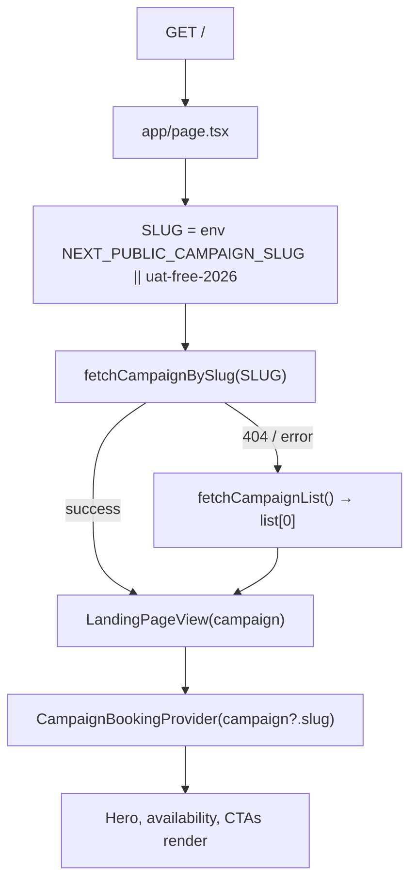
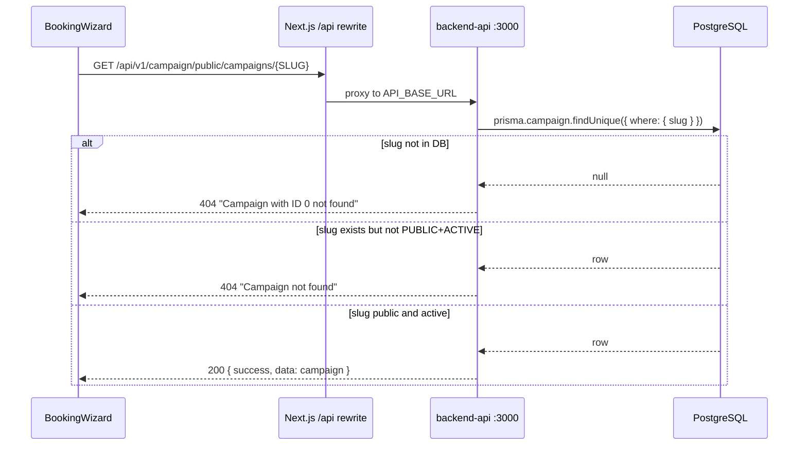

# Campaign Booking Flow Audit: "Campaign with ID 0 not found"

**Date:** 2026-06-07  
**Scope:** Analysis only — no code changes  
**Projects:** `vaccination_2026` (public booking site), `backend-api` (campaign public API), `furtail-landing` (Book Now bridge), `bpa_web` (admin campaign creation)

---

## Executive summary

The booking page error **"Campaign with ID 0 not found"** is **not** caused by a numeric `campaignId` becoming `0` on the client. It is the backend’s fixed error text when a **slug lookup finds no row in the database**.

The booking flow has a **slug resolution split**:

| Surface | How campaign is chosen |
|---------|------------------------|
| Landing page (`/`) | `NEXT_PUBLIC_CAMPAIGN_SLUG` → fallback to first ACTIVE+PUBLIC campaign from list API |
| Booking page (`/book`) | **`NEXT_PUBLIC_CAMPAIGN_SLUG` only** (code default `uat-free-2026`) — **ignores URL query params** |
| Landing “Book Now” CTAs | Mostly link to `/book` with **no slug**; some append `?campaign={slug}` which **`/book` does not read** |

**Root cause:** `/book` requests a slug that is missing from the database (typically the env default `uat-free-2026` or an unset/misaligned `NEXT_PUBLIC_CAMPAIGN_SLUG`), while the landing page may successfully show a *different* campaign via list fallback.

---

## 1. End-to-end flow trace

### 1.1 Campaign landing page



| Step | File | Line(s) | Behavior |
|------|------|---------|----------|
| Route | `vaccination_2026/app/page.tsx` | 36–45 | Server component home page |
| Slug constant | `vaccination_2026/app/page.tsx` | 8 | `process.env.NEXT_PUBLIC_CAMPAIGN_SLUG \|\| "uat-free-2026"` |
| Primary load | `vaccination_2026/app/page.tsx` | 39 | `fetchCampaignBySlug(SLUG)` |
| Fallback load | `vaccination_2026/app/page.tsx` | 41–42 | `fetchCampaignList()` → `list[0]` |
| Context slug | `vaccination_2026/components/landing/LandingPageView.tsx` | 39 | `CampaignBookingProvider campaignSlug={campaign?.slug}` |
| Countdown fetch | `vaccination_2026/components/landing/CampaignBookingContext.tsx` | 7, 21, 29 | Uses resolved slug for countdown API |

**Important:** The landing page can display campaign **B** (from list fallback) while env still points at slug **A** (missing or non-public).

---

### 1.2 “Book Now” button → navigation

| CTA location | File | Line(s) | href |
|--------------|------|---------|------|
| Hero primary | `components/landing/v2/HeroSection.tsx` | 22–23, 72 | `/book` (no query) |
| Availability primary | `components/landing/v2/CampaignAvailabilitySection.tsx` | 189 | `/book` |
| Availability slot row | `components/landing/v2/CampaignAvailabilitySection.tsx` | 294 | `/book?slot={slotId}` |
| Upcoming campaign row | `components/landing/v2/CampaignAvailabilitySection.tsx` | 331 | `/book?campaign={slug}` |
| Schedule events | `components/landing/CampaignScheduleSection.tsx` | 329, 361 | `/book?campaign={slug}&location={id}` |
| Locator map pins | `components/landing/CampaignLocatorSection.tsx` | 159 | `/book?campaign={slug}&location={id}` |
| Site header | `components/SiteHeader.tsx` | 74, 81, 110 | `/book` |
| Sticky mobile CTA | `components/landing/StickyMobileCta.tsx` | 51 | `/book` |
| furtail-landing promo | `furtail-landing/src/components/vaccination/vaccination-campaign-promo.tsx` | 167–168 | `getCampaignBookingUrl()` → `{origin}/book` (no slug) |

**None of the plain `/book` links pass the campaign slug.** Several links *do* append `?campaign=…`, but the booking page never consumes that parameter (see §1.3).

---

### 1.3 Booking page route

| Step | File | Line(s) | Behavior |
|------|------|---------|----------|
| Route | `vaccination_2026/app/book/page.tsx` | 10–26 | Client page at `/book` |
| Slug constant | `vaccination_2026/app/book/page.tsx` | 8 | Same env + `uat-free-2026` fallback |
| Hero prefetch | `vaccination_2026/app/book/page.tsx` | 13–16 | `fetchCampaignBySlug(SLUG)` (errors swallowed) |
| Wizard mount | `vaccination_2026/components/booking/BookingWizard.tsx` | 25, 94–97 | **Authoritative** campaign load |
| Error display | `vaccination_2026/components/booking/BookingWizard.tsx` | 213–216 | Shows API `error.message` in alert |

**Booking page does not use:**

- `useSearchParams()` for `campaign`, `location`, or `slot`
- `useParams()` (no dynamic segment on `/book`)
- `campaign?.slug` from landing context (wizard is outside provider tree on `/book`)

**Search confirmed:** `searchParams.get('campaign')` — **zero matches** in `vaccination_2026` booking path. Only payment/success pages read `ref` / `checkoutId`.

---

### 1.4 Booking API call



| Layer | File | Line(s) | Detail |
|-------|------|---------|--------|
| Client fetch | `vaccination_2026/lib/campaignApi.ts` | 235–237 | `fetchCampaignBySlug(slug)` |
| Error parsing | `vaccination_2026/lib/api.ts` | 16–27 | Surfaces `j.error.message` to UI |
| API proxy | `vaccination_2026/next.config.js` | 14–25 | `/api/*` → `API_BASE_URL` (default `http://localhost:3000`) |
| Route | `backend-api/src/api/v1/modules/campaign/campaign.routes.ts` | 208 | `GET /public/campaigns/:slug` |
| Handler | `backend-api/src/api/v1/modules/campaign/campaign.controller.ts` | 61–98 | `getPublicCampaignBySlugHandler` |
| DB lookup | `backend-api/src/api/v1/modules/campaign/campaign.service.ts` | 142–169 | `getCampaignBySlug(slug)` |
| Checkout init (post-load) | `vaccination_2026/lib/campaignApi.ts` | 656 | `POST /public/checkout/init` with `campaignSlug: SLUG` |
| Checkout resolver | `backend-api/src/api/v1/modules/campaign/checkout.service.ts` | 241–244 | `resolveCampaignId({ campaignSlug })` |

---

## 2. Identifier generation and expectations

### 2.1 Where `campaignId` is generated

| Location | File | Line(s) | Mechanism |
|----------|------|---------|-----------|
| Schema | `backend-api/prisma/schema.prisma` | 13955–13956 | `id Int @id @default(autoincrement())` |
| Create service | `backend-api/src/api/v1/modules/campaign/campaign.service.ts` | 47–71 | `prisma.campaign.create` — ID assigned by DB |
| Admin UI | `bpa_web/app/admin/(larkon)/campaigns/new/page.tsx` | 26–30 | Creates via API; navigates to `/admin/campaigns/{id}` |
| Admin detail routes | `bpa_web/app/admin/(larkon)/campaigns/[id]/*` | various | `Number(params?.id)` — **admin only**, not used on public `/book` |

The public booking site **never generates** `campaignId`. It only receives `id` inside the campaign payload after a successful slug fetch.

### 2.2 Where `campaignSlug` is generated

| Location | File | Line(s) | Mechanism |
|----------|------|---------|-----------|
| Admin form (manual) | `bpa_web/src/furtail/campaign/admin/CampaignForm.tsx` | 110–117 | Operator-entered; lowercased/sanitized |
| API validation | `backend-api/src/api/v1/modules/campaign/campaign.validation.ts` | 31 | Regex `^[a-z0-9-]+$`, 3–100 chars |
| Create service | `backend-api/src/api/v1/modules/campaign/campaign.service.ts` | 50 | Stored as `input.slug` (required at create) |
| Utility (optional) | `backend-api/src/api/v1/modules/campaign/campaign.utils.ts` | 246–251 | `generateSlug(text)` — **not auto-applied** on create |
| Seeds | `backend-api/scripts/uat-campaign-setup.ts` | 102 | e.g. `slug: "uat-free-2026"` |
| Env example | `vaccination_2026/.env.example` | 13 | `NEXT_PUBLIC_CAMPAIGN_SLUG=cat-flu-rabies-2026` |
| Code fallback | `BookingWizard.tsx`, `app/book/page.tsx`, `app/page.tsx` | 25 / 8 / 8 | **`uat-free-2026`** (conflicts with `.env.example`) |

### 2.3 What the booking page expects

| Expected by design | Actual implementation |
|--------------------|----------------------|
| Campaign **slug** (string) | Yes — but only from `NEXT_PUBLIC_CAMPAIGN_SLUG` |
| URL `?campaign=` query param | **No** — param is ignored |
| URL `?location=` / `?slot=` | **No** — ignored on current wizard |
| Numeric `campaignId` in route | **No** — `/book` has no `[id]` segment |
| Dynamic “latest ACTIVE campaign” | **No** on `/book` (exists in backend `resolveCampaignId` for checkout when slug omitted, but wizard always sends slug) |

---

## 3. Search index (requested terms)

### `campaignId`

| Project | File | Line | Notes |
|---------|------|------|-------|
| vaccination_2026 | `lib/campaignApi.ts` | 253–255 | `fetchAvailability(campaignId, …)` — numeric ID in URL path (legacy availability endpoint) |
| vaccination_2026 | `components/landing/CampaignAvailabilitySection.tsx` | 60 | Discovery API uses `campaign.id` from loaded campaign |
| backend-api | `campaign.service.ts` | 165–166 | **`NOT_FOUND(0)`** — slug miss uses literal `0` |
| backend-api | `rollout.service.ts` | 21–36 | `resolveCampaignId` — checkout/discovery backend |
| bpa_web | `app/admin/(larkon)/campaigns/[id]/*` | various | Admin numeric ID routes only |

### `campaignSlug`

| Project | File | Line | Notes |
|---------|------|------|-------|
| vaccination_2026 | `components/booking/BookingWizard.tsx` | 159 | Sent to checkout as `campaignSlug: SLUG` |
| vaccination_2026 | `components/landing/CampaignBookingContext.tsx` | 10, 54 | Context exposes slug to landing |
| backend-api | `checkout.service.ts` | 241–243 | Resolves slug → numeric ID for booking |
| backend-api | `discovery.service.ts` | 268–270, 516–518 | Public discovery queries |

### `params.id`

| Project | File | Line | Notes |
|---------|------|------|-------|
| bpa_web | `app/admin/(larkon)/campaigns/[id]/bookings/page.tsx` | 26 | Admin only |
| vaccination_2026 | `app/booking/[ref]/page.tsx` | 10 | Booking **ref**, not campaign ID |
| vaccination_2026 | — | — | **`/book` does not use `params.id`** |

### `searchParams` / `useSearchParams`

| Project | File | Line | Param read |
|---------|------|------|------------|
| vaccination_2026 | `app/book/payment/page.tsx` | 10–12 | `ref` |
| vaccination_2026 | `app/book/success/page.tsx` | 10–11 | `checkoutId` |
| vaccination_2026 | `lib/analytics/components/AnalyticsPageView.tsx` | 11, 17 | `ref` (analytics) |
| vaccination_2026 | **`app/book/page.tsx`** | — | **Not used** |
| vaccination_2026 | **`BookingWizard.tsx`** | — | **Not used** |

### `useParams`

| Project | File | Line | Notes |
|---------|------|------|-------|
| vaccination_2026 | `app/booking/[ref]/page.tsx` | 10 | Booking lookup by ref |
| vaccination_2026 | `app/book/confirm/[ref]/page.tsx` | 11 | Confirm page |

### `router.push`

| Project | File | Line | Target |
|---------|------|------|--------|
| vaccination_2026 | `app/booking/page.tsx` | 33 | `/booking/{bookingRef}` |
| vaccination_2026 | `app/book/payment/page.tsx` | 33 | `/book/payment/success?ref=…` |

### `Book Now`

| Project | File | Line | Link target |
|---------|------|------|-------------|
| vaccination_2026 | `components/landing/v2/HeroSection.tsx` | 73 | `/book` |
| vaccination_2026 | `components/landing/v2/CampaignAvailabilitySection.tsx` | 112, 189 | `/book` |
| furtail-landing | `vaccination-campaign-promo.tsx` | 175 | External `/book` |

### Booking page

| Project | File | Route |
|---------|------|-------|
| vaccination_2026 | `app/book/page.tsx` | `/book` |
| vaccination_2026 | `components/booking/BookingWizard.tsx` | Embedded wizard |

### Campaign public API

| Method | Path | Handler file | Line |
|--------|------|--------------|------|
| GET | `/api/v1/campaign/public/campaigns` | `campaign.controller.ts` | 41–54 |
| GET | `/api/v1/campaign/public/campaigns/:slug` | `campaign.controller.ts` | 61–98 |
| GET | `/api/v1/campaign/public/campaigns/:slug/countdown` | `campaign.controller.ts` | 101–112 |
| POST | `/api/v1/campaign/public/checkout/init` | `checkout.controller.ts` | 51–58 |

---

## 4. Root cause analysis

### 4.1 Why the message says “ID 0”

The literal `0` is **hardcoded** when slug lookup fails:

```165:167:backend-api/src/api/v1/modules/campaign/campaign.service.ts
  if (!campaign) {
    throw CampaignErrors.NOT_FOUND(0);
  }
```

Error factory:

```25:26:backend-api/src/api/v1/modules/campaign/campaign.errors.ts
  NOT_FOUND: (id: number) =>
    new CampaignError("CAMPAIGN_NOT_FOUND", `Campaign with ID ${id} not found`, 404),
```

There is **no client-side `campaignId = 0`**. The UI displays whatever the API returns via `lib/api.ts` `parseError()`.

### 4.2 Two different 404 messages (do not conflate)

| Condition | HTTP | `error.message` | Where |
|-----------|------|-----------------|-------|
| Slug **not in database** | 404 | **`Campaign with ID 0 not found`** | `getCampaignBySlug` → `NOT_FOUND(0)` |
| Slug **exists** but `visibility !== PUBLIC` **or** `status !== ACTIVE` | 404 | **`Campaign not found`** | `campaign.controller.ts` lines 71–74 |

User report matches the **first** row → requested slug has **no DB row**.

### 4.3 Primary root cause

**Slug mismatch between landing and booking, compounded by ignored URL params and conflicting defaults.**

1. **`/book` always loads** `process.env.NEXT_PUBLIC_CAMPAIGN_SLUG || "uat-free-2026"` (`BookingWizard.tsx:25`, `app/book/page.tsx:8`).
2. **Landing may show a different campaign** when env slug fails but `fetchCampaignList()[0]` succeeds (`app/page.tsx:41–42`).
3. **CTAs that include `?campaign={slug}` are discarded** — booking page never reads the query string.
4. **Default slug inconsistency:**
   - Code fallback: `uat-free-2026`
   - `.env.example`: `cat-flu-rabies-2026`
   - Production docs: `cat-flu-rabies-2026`
5. If the resolved slug (`uat-free-2026` or unset env) **does not exist** in the current database (fresh prod, UAT-only seeds, renamed slug), API returns **`Campaign with ID 0 not found`**.

### 4.4 Contributing factors

| Factor | Evidence |
|--------|----------|
| Duplicate fetch on `/book` | `app/book/page.tsx:14` and `BookingWizard.tsx:95` both call `fetchCampaignBySlug(SLUG)` |
| furtail-landing sends users to bare `/book` | `furtail-landing/src/config/campaign.ts:44–45` — no slug in URL |
| No `.env.local` in repo | Only `.env.example` tracked; local env may be missing → code default used |
| Admin ACTIVE campaign ≠ env slug | Documented in `docs/debug/campaign-not-found-analysis.md` for `uat-paid-2026` vs `uat-free-2026` |

### 4.5 Ruled out

| Hypothesis | Verdict |
|------------|---------|
| Client parses `campaignId` as `0` | Ruled out — client never sends numeric ID on load |
| `CampaignConfig` missing | Ruled out for this message — config loads after successful slug + gate |
| Wrong API host / proxy | Unlikely if landing list/countdown work on same host |
| Admin `params.id = 0` | Ruled out — unrelated to public `/book` |

---

## 5. Exact root cause (single statement)

**The booking wizard requests a campaign by a hardcoded/env slug (`NEXT_PUBLIC_CAMPAIGN_SLUG` or fallback `uat-free-2026`) that does not exist in the database; the backend slug lookup fails and throws `CampaignErrors.NOT_FOUND(0)`, producing the user-visible string "Campaign with ID 0 not found". The landing page and several CTAs may reference a different, valid slug that `/book` never uses.**

| Role | File | Line |
|------|------|------|
| **Client slug source (fault)** | `vaccination_2026/components/booking/BookingWizard.tsx` | **25, 94–97** |
| **Ignored query param (fault)** | `vaccination_2026/app/book/page.tsx` | **8–16** (no `searchParams`) |
| **Landing fallback masks misconfig** | `vaccination_2026/app/page.tsx` | **41–42** |
| **Error origin** | `backend-api/src/api/v1/modules/campaign/campaign.service.ts` | **165–166** |
| **Error text template** | `backend-api/src/api/v1/modules/campaign/campaign.errors.ts` | **25–26** |

---

## 6. Implementation plan

**Priority order — no code has been applied in this audit.**

### Phase A — Immediate operational fix (no deploy)

1. Identify the ACTIVE + PUBLIC campaign slug in admin (`bpa_web` → Campaigns) or DB: `SELECT id, slug, status, visibility FROM campaigns WHERE status = 'ACTIVE';`
2. Set `NEXT_PUBLIC_CAMPAIGN_SLUG` in `vaccination_2026/.env.local` (and production env) to that **exact** slug.
3. Restart Next dev server (`npm run dev` on port **3110**).
4. Verify: `GET /api/v1/campaign/public/campaigns/{slug}` returns `200` before loading `/book`.

### Phase B — Frontend slug resolution (recommended)

| Task | Touch points | Acceptance |
|------|--------------|------------|
| B1. Shared slug resolver | New `lib/resolveCampaignSlug.ts`; used by `app/page.tsx`, `app/book/page.tsx`, `BookingWizard.tsx` | Single resolution order documented in code |
| B2. Read URL `campaign` param | `app/book/page.tsx`, `BookingWizard.tsx` | `/book?campaign=uat-paid-2026` loads that campaign |
| B3. Pass slug from all CTAs | `HeroSection`, `CampaignAvailabilitySection`, `SiteHeader`, `StickyMobileCta`, furtail-landing `getCampaignBookingUrl()` | All Book Now links include `?campaign={slug}` when slug known |
| B4. Align code fallback with `.env.example` | `BookingWizard.tsx:25`, `app/book/page.tsx:8`, `app/page.tsx:8`, `CampaignBookingContext.tsx:7` | Change default `uat-free-2026` → `cat-flu-rabies-2026` **or** remove fallback and fail loudly if env unset |
| B5. Propagate `location` / `slot` query params | `BookingWizard` draft init | Pre-select location/slot when linked from availability section |

**Suggested resolution order for B1:**

```
searchParams.campaign
→ NEXT_PUBLIC_CAMPAIGN_SLUG
→ fetchCampaignList()[0]?.slug
→ (optional) hard failure with user-friendly message
```

### Phase C — Backend clarity (optional but recommended)

| Task | Touch points | Acceptance |
|------|--------------|------------|
| C1. Slug-specific not-found error | `campaign.errors.ts`, `getCampaignBySlug` | Message: `Campaign with slug '{slug}' not found` instead of `ID 0` |
| C2. Same for countdown | `getCampaignCountdownBySlug` line 186 | Consistent error text |

### Phase D — Configuration & deploy checklist

| Environment | Variable | Must match |
|-------------|----------|------------|
| vaccination_2026 | `NEXT_PUBLIC_CAMPAIGN_SLUG` | DB campaign slug, PUBLIC + ACTIVE |
| vaccination_2026 | `API_BASE_URL` | backend-api origin (port **3000**) |
| backend-api | `CORS_ORIGINS` | `http://localhost:3110` (dev) / production campaign host |

### Phase E — Verification matrix

| Step | Action | Expected |
|------|--------|----------|
| E1 | Open `/` | Landing shows campaign name/pricing |
| E2 | Click hero Book Now → `/book` | Wizard loads; no error alert |
| E3 | Open `/book?campaign={valid-slug}` | Loads specified campaign |
| E4 | Open `/book?campaign=nonexistent-slug` | Clear error (after C1: mentions slug) |
| E5 | Submit booking | `POST /checkout/init` succeeds with same slug |
| E6 | Network tab on `/book` | `GET .../public/campaigns/{expected-slug}` → 200 |

---

## 7. Related documentation

- `backend-api/docs/debug/campaign-not-found-analysis.md` — related slug/env mismatch (`Campaign not found` gate path)
- `backend-api/docs/architecture/furtail-vaccination-domain-strategy.md` — domain + env strategy
- `backend-api/docs/deployment/BPA_DEPLOYMENT_READINESS_AUDIT.md` — notes env criticality

---

## 8. File touch-point summary

| Role | Path |
|------|------|
| Landing slug + fallback | `vaccination_2026/app/page.tsx:8,39–42` |
| Book page | `vaccination_2026/app/book/page.tsx:8,13–16` |
| Booking wizard slug + fetch | `vaccination_2026/components/booking/BookingWizard.tsx:25,94–97,159,213–216` |
| API client | `vaccination_2026/lib/campaignApi.ts:235–237,656` |
| Error surfacing | `vaccination_2026/lib/api.ts:16–27` |
| API proxy | `vaccination_2026/next.config.js:14–25` |
| Public route | `backend-api/src/api/v1/modules/campaign/campaign.routes.ts:208` |
| Visibility gate (different 404) | `backend-api/src/api/v1/modules/campaign/campaign.controller.ts:71–74` |
| Slug DB lookup + **ID 0 throw** | `backend-api/src/api/v1/modules/campaign/campaign.service.ts:142–167` |
| Error template | `backend-api/src/api/v1/modules/campaign/campaign.errors.ts:25–26` |
| Campaign ID schema | `backend-api/prisma/schema.prisma:13955–13958` |
| Slug admin entry | `bpa_web/src/furtail/campaign/admin/CampaignForm.tsx:110–117` |
| furtail-landing Book Now | `furtail-landing/src/config/campaign.ts:44–45` |
