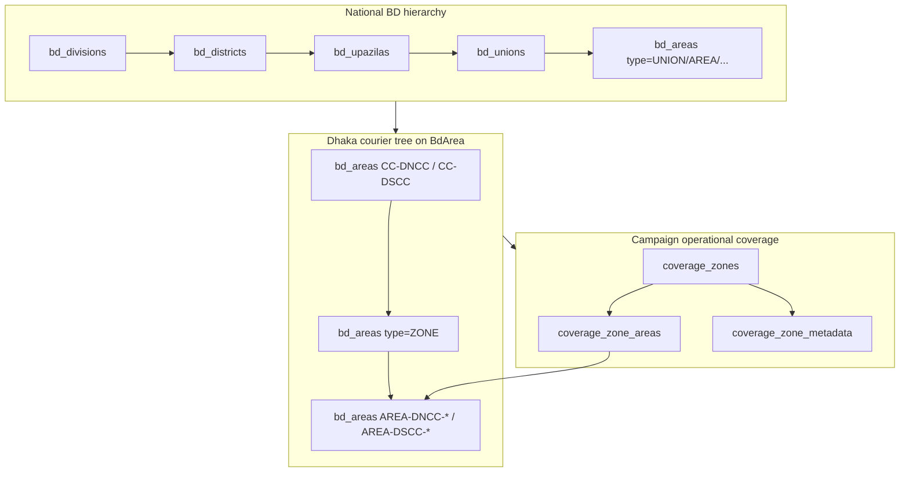

# Location & Coverage Zone Seed Audit

**Date:** 2026-06-07  
**Repository:** `backend-api` (primary), with consumer references in `bpa_web`, `bpa_app`, `vaccination_2026`  
**Scope:** Analysis only — **no code changes**

---

## 1. Executive summary

| Question | Answer |
|----------|--------|
| Why is the **Coverage Zone** dropdown empty in production? | **Most likely:** `coverage_zones` has **no rows**. Coverage seeders exist but are **not** in the main `prisma/seed.ts` chain and are **not** run by `bootstrap:deploy` (migrate-only). Production deploy docs explicitly require a **separate** `npm run seed:coverage-zones` after location seeds. |
| Are seed scripts missing? | **No.** Full coverage seed chain lives under `prisma/seeders/coverage/` with npm script `seed:coverage-zones`. |
| Is a migration missing? | **Unlikely** if the API returns `{ success: true, data: [] }` (empty array). Tables are created by migration `20260603190000_coverage_zones`. A missing migration would typically cause **500** errors, not an empty dropdown. |
| Does production already have BD location master data? | **Unknown without DB query.** Divisions/districts/upazilas are seeded by `seed:location-master` or step 1 of full `db:seed`. Dhaka courier tree (`CC-DNCC`, `AREA-DNCC-*`) requires `seed:dhaka-city`. Coverage mappings depend on those BdArea codes. |
| What should operators run? | See **§8 Production-safe command sequence** — Phase 1 location, then Phase 2 coverage, then verify. |

---

## 2. Architecture — three location layers

BPA uses **three related but distinct** location concepts:



| Layer | Purpose | Primary tables | Seeded by |
|-------|---------|----------------|-----------|
| **National BD master** | Division → District → Upazila → Union → Area pickers (owner, org, staff) | `bd_divisions`, `bd_districts`, `bd_upazilas`, `bd_unions`, `bd_areas` | `seedBaseBdLocations` via `seed:location-master` or `db:seed` step 1 |
| **Dhaka BdArea tree** | DNCC/DSCC → Zone → neighbourhood areas; campaign booking resolution | Same `bd_areas` with `type` = `CITY_CORPORATION` / `ZONE` / leaf codes | `runDhakaCitySeed` via `seed:dhaka-city` or `db:seed` step 2 |
| **Coverage zones** | Campaign admin location editor, analytics by metro zone, checkout zone-interest | `coverage_zones`, `coverage_zone_areas`, `coverage_zone_metadata` | `runCoverageZoneSeed` via **`seed:coverage-zones` only** |

**Legacy (parallel, not used for Coverage Zone dropdown):**

| Table | Purpose | Seeder | API |
|-------|---------|--------|-----|
| `city_corporations`, `areas` | Old DNCC/DSCC demo tree | `prisma/seeders/seedCityCorporationsAndAreas.js` (legacy; **not** in main `seed.ts`) | `GET /api/v1/locations/city-corporations`, `/locations/areas` |

Modern mobile/web BD pickers use **`bd_areas`** via `/api/v1/common/bd/*` or `/api/v1/location-master/*`, not the legacy `areas` table.

---

## 3. Database tables & Prisma models

### 3.1 National Bangladesh hierarchy

| Table | Prisma model | Key fields |
|-------|--------------|------------|
| `bd_divisions` | `BdDivision` | `code`, `nameEn`, `nameBn` |
| `bd_districts` | `BdDistrict` | `code`, `divisionId`, lat/lng |
| `bd_upazilas` | `BdUpazila` | `code`, `districtId` |
| `bd_unions` | `BdUnion` | `code`, `upazilaId` (migration `20260603031500_centralized_location_system`) |
| `bd_areas` | `BdArea` | `code`, `type`, `unionId`, `upazilaId`, `districtId`, `parentId` (tree) |

**Schema:** `prisma/schema.prisma` (models ~L1855–L1956)

**Seed JSON sources:** `prisma/seed-data/bd.divisions.json` (8 divisions), `bd.districts.json` (64 districts), `bd.upazilas.json`, `bd.areas.json`

### 3.2 Coverage zone system

| Table | Prisma model | Key fields |
|-------|--------------|------------|
| `coverage_zones` | `CoverageZone` | `name`, `slug` (unique), `city`, `zoneType`, `isActive`, `sortOrder` |
| `coverage_zone_areas` | `CoverageZoneArea` | `coverageZoneId`, `bdAreaId`, optional district/upazila/union refs |
| `coverage_zone_metadata` | `CoverageZoneMetadata` | Pet/clinic shop estimates per zone |

**Enum:** `CoverageZoneType` = `METRO` | `CITY_CORPORATION` | `OPERATIONAL` | `BUSINESS_READINESS`

**Migration:** `prisma/migrations/20260603190000_coverage_zones/migration.sql`

### 3.3 Campaign location linkage

| Table | Field | Notes |
|-------|-------|-------|
| `campaign_locations` | `addressJson.coverageZoneId`, `addressJson.bdAreaId` | Admin editor stores IDs in JSON |
| `campaign_bookings` | `coverageZoneId`, `coverageZoneName`, `bdAreaId` | Booking/checkout |

### 3.4 Global location (non-BD)

| Tables | Seeder | Notes |
|--------|--------|-------|
| `location_countries`, states, cities, sub-districts | `prisma/seeders/location/*` via `runGlobalLocationSeed` | Step 14 in full `db:seed`; separate one-liner in production plan |

---

## 4. Seed files inventory

### 4.1 Main Prisma seed chain (`prisma/seed.ts`)

| Step | Seeder | Populates | Coverage zones? |
|------|--------|-----------|-----------------|
| 1 | `seedBaseBdLocations` | Divisions, districts, upazilas, unions, base `bd_areas` from JSON | No |
| 2 | `runDhakaCitySeed` | DNCC/DSCC BdArea tree (`CC-DNCC`, zones, `AREA-DNCC-*`) | No |
| 3–20 | RBAC, catalogs, countries, clinical, etc. | Other master data | No |

**Critical:** `runCoverageZoneSeed` is **exported** from `prisma/seeders/index.ts` but **never called** from `prisma/seed.ts`.

### 4.2 Location master (standalone)

| File | npm script | Action |
|------|------------|--------|
| `scripts/seed-location-master.ts` | `npm run seed:location-master` | Runs `seedBaseBdLocations` only |
| `scripts/seed-dhaka-city.ts` | `npm run seed:dhaka-city` | Runs `runDhakaCitySeed` (requires Dhaka division `DIV-6` / district `DIS-47`) |
| `scripts/seed-dhaka-metro.ts` | `npm run seed:dhaka-metro` | Dhaka city + **partial** coverage (`seedCoverageZones` only — skips DNCC/DSCC corp mappings + business readiness) |

### 4.3 Coverage zone seed chain (standalone — **required for dropdown**)

**Entry:** `scripts/seed-coverage-zones.ts` → `runCoverageZoneSeed(prisma)`

| Order | File | Creates |
|-------|------|---------|
| 0 (auto) | `runDhakaCitySeed` if `CC-DNCC` missing | Prerequisite BdArea rows |
| 1 | `prisma/seeders/coverage/seedCoverageZones.ts` | Metro root `dhaka-metro` + 5 directional zones (`dhaka-metro-north` … `south`) + metadata |
| 2 | `prisma/seeders/coverage/seedDhakaNorthCity.ts` | `dncc` CoverageZone → all DNCC BdArea codes |
| 3 | `prisma/seeders/coverage/seedDhakaSouthCity.ts` | `dscc` CoverageZone → all DSCC BdArea codes |
| 4 | `prisma/seeders/coverage/seedBusinessCoverageReadiness.ts` | Business-readiness zone types (no BdArea mappings) |

**Supporting data:**

| Path | Role |
|------|------|
| `coverage/data/dhaka-metro-coverage.ts` | Metro zone → `AREA-DNCC-*` / `AREA-DSCC-*` code lists |
| `coverage/data/dncc-coverage-mapping.ts` | DNCC corporation zone |
| `coverage/data/dscc-coverage-mapping.ts` | DSCC corporation zone |
| `coverage/lib/upsertCoverageZone.ts` | Idempotent upsert by `slug`; links BdArea via `coverage_zone_areas` |
| `coverage/lib/resolveBdArea.ts` | Resolves BdArea by `code`; warns if missing |

**Dhaka BdArea detail seeders** (called from `runDhakaCitySeed`):

| File | Role |
|------|------|
| `dhaka/seedDhakaCityCorporations.ts` | `CC-DNCC`, `CC-DSCC` |
| `dhaka/seedDhakaCityZones.ts` | `ZONE-DNCC-*`, `ZONE-DSCC-*` |
| `dhaka/seedDhakaCityAreas.ts` | `AREA-DNCC-*`, `AREA-DSCC-*` |
| `dhaka/seedDhakaNorthCityBdAreas.ts` | Orchestrates DNCC chain |
| `dhaka/seedDhakaSouthCityBdAreas.ts` | Orchestrates DSCC chain |

### 4.4 Legacy / unused paths (do not use on production)

| File | Issue |
|------|-------|
| `prisma/seeders/seedCityCorporationsAndAreas.js` | Legacy `city_corporations` / `areas` demo — not in main chain |
| `prisma/seed_all.js` | **Broken** — missing `seed_social.js` |
| `prisma/seed.js` | Legacy JS entry |
| Full `npm run db:seed` | **Dangerous on populated DB** — step 18 deletes all master clinical catalog |

---

## 5. npm / Prisma scripts

| Command | Safe on populated prod? | Populates coverage zones? |
|---------|-------------------------|---------------------------|
| `npm run bootstrap:deploy` | **Yes** (migrate only) | No |
| `npm run prisma:migrate:deploy` | **Yes** | No |
| `npm run db:deploy` | **No** — runs full seed after migrate | Yes *if* seed completes, but **wipes clinical catalog** at step 18 |
| `npm run db:seed` / `npm run seed` | **No** on populated prod | No (coverage not in chain) |
| `npm run seed:location-master` | **Yes** (upsert) | No |
| `npm run seed:dhaka-city` | **Yes** (upsert) | No |
| `npm run seed:coverage-zones` | **Yes** (upsert) | **Yes — primary fix** |
| `npm run seed:dhaka-metro` | **Yes** but incomplete | Partial (metro only) |
| `npm run verify:location-master` | Read-only | — |
| `npm run verify:coverage-zones` | Read-only | Validates counts + integrity |

**Prisma seed config:** `package.json` → `"seed": "node -r ts-node/register prisma/seed.ts"` (via `scripts/run-local-prisma.cjs db seed`)

---

## 6. API endpoints used by dropdowns

### 6.1 Coverage Zone dropdown (campaign admin)

| Consumer | Endpoint | Backend handler |
|----------|----------|-----------------|
| `bpa_web` — `CampaignLocationEditor.tsx` | `GET /api/v1/campaign/admin/coverage-zones` | `listAdminCoverageZones()` in `coverageAdmin.service.ts` |
| `bpa_web` — area sub-dropdown | `GET /api/v1/campaign/admin/coverage-zones/:zoneId/bd-areas?q=` | `listBdAreasForCoverageZone()` |
| `vaccination_2026` — public booking | `GET /api/v1/campaign/public/coverage-zones` | Same `listAdminCoverageZones()` |
| `vaccination_2026` — areas by zone | `GET /api/v1/campaign/public/coverage-zones/:zoneId/bd-areas` | Same |
| `bpa_app` (mobile) | Uses Dhaka corp flow: `/campaign/public/dhaka/city-corporations` | `dhakaBooking.service.ts` (not coverage dropdown) |

**Query logic for zones** (`coverageAdmin.service.ts`):

```typescript
prisma.coverageZone.findMany({
  where: {
    isActive: true,
    OR: [
      { city: { equals: "Dhaka", mode: "insensitive" } },
      { zoneType: "METRO" },
      { slug: { startsWith: "dhaka" } },
    ],
  },
  orderBy: [{ sortOrder: "asc" }, { name: "asc" }],
});
```

Returns **empty array** when `coverage_zones` has no matching rows — UI shows empty dropdown with no error.

**Area sub-dropdown** requires both:

1. Selected zone exists in `coverage_zones`
2. Rows in `coverage_zone_areas` linking zone → `bdAreaId`

If zones exist but mappings failed (missing BdArea codes), zone dropdown works but **area list is empty**.

### 6.2 National location pickers (Division / District / Upazila / BdArea)

| Consumer | Endpoint pattern | Backend |
|----------|------------------|---------|
| `bpa_web` `LocationPicker.jsx` | `/api/v1/locations/divisions`, `/districts?divisionId=`, `/upazilas?districtId=`, `/bd-areas?upazilaId=` | `locations.routes.ts` → `locations.controller.ts` → `locations.service.ts` |
| `bpa_app` | `/api/v1/common/bd/divisions`, `/districts`, `/upazilas`, `/areas` | `common.controller.ts` |
| `bpa_app` (Dhaka CC tree) | `/api/v1/common/bd/city-corporations`, `/zones`, `/cc-areas` | `common.controller.ts` (queries `bd_areas` by `type`) |
| `bpa_app` (alt) | `/api/v1/location-master/divisions`, etc. | `src/modules/location/location.routes.ts` |

### 6.3 Campaign public Dhaka booking (no coverage zone UI)

| Endpoint | Purpose |
|----------|---------|
| `GET /api/v1/campaign/public/dhaka/city-corporations` | DNCC / DSCC list |
| `GET /api/v1/campaign/public/dhaka/city-corporations/:code/booking-areas` | Locality areas under corp |

Checkout resolves corp + `bdAreaId` → internal `coverageZoneId` via `dhakaBooking.service.ts` (hidden from customer UI).

---

## 7. Root cause analysis — empty Coverage Zone dropdown

### 7.1 Primary cause (expected on production)

**Coverage zone rows were never seeded.**

Evidence:

1. `prisma/seed.ts` steps 1–20 do **not** call `runCoverageZoneSeed`.
2. Production deploy standard is `npm run bootstrap:deploy` (migrate only) — documented in `docs/audits/PRODUCTION_DEPLOY_AND_SEED_MASTER_REPORT.md`.
3. That document states explicitly: *"Coverage zones are not in the main seed chain. After deploy, run `npm run seed:coverage-zones` when coverage features are needed."*
4. API returns `{ success: true, data: [] }` when table is empty — frontend shows empty `<select>`.

### 7.2 Secondary causes (check if primary fix insufficient)

| Cause | Symptom | Check |
|-------|---------|-------|
| Migration `20260603190000_coverage_zones` not applied | API **500**, not empty dropdown | `npm run prisma:migrate:status` |
| `coverage_zones` rows exist but `isActive = false` | Empty dropdown | `SELECT * FROM coverage_zones WHERE "isActive" = false` |
| Zones seeded, areas empty | Zone dropdown OK, area dropdown empty | `npm run verify:coverage-zones`; check `[coverage] BdArea not found` warnings during seed |
| Dhaka BdArea tree missing | Coverage seed runs but mappings sparse | `SELECT COUNT(*) FROM bd_areas WHERE code LIKE 'AREA-DNCC-%'` |
| Wrong API / auth failure | Error toast, not silent empty | Network tab: non-200 on `/campaign/admin/coverage-zones` |

### 7.3 Not the cause

| Ruled out | Why |
|-----------|-----|
| Frontend wrong path | `bpa_web` calls `/api/v1/campaign/admin/coverage-zones` correctly |
| Missing seed **files** | `prisma/seeders/coverage/*` present (10 files) |
| Filter excludes all seeded zones | Metro zones have `city: 'Dhaka'`, `zoneType: METRO`, `slug` starts with `dhaka` — all match filter |

---

## 8. Production-safe command sequence

Run from **`backend-api`** root with `DATABASE_URL` pointing at production. **Take a backup first.**

### Phase 0 — Pre-flight

```powershell
cd D:\BPA_Data\backend-api
npm run setup:prisma
node scripts/check-migration-integrity.js
npm run prisma:migrate:status
```

Ensure migration `20260603190000_coverage_zones` is applied. If not:

```powershell
npm run bootstrap:deploy
```

### Phase 1 — Location prerequisites (if not already populated)

```powershell
npm run seed:location-master
npm run seed:dhaka-city
npm run verify:location-master
```

**Expected after Phase 1:**

| Check | Expected |
|-------|----------|
| `bd_divisions` | 8 |
| `bd_districts` | 64 |
| `bd_areas` code `CC-DNCC` | 1 row |
| `bd_areas` code like `AREA-DNCC-%` | Hundreds (exact count varies by seed version) |

### Phase 2 — Coverage zones (**fixes empty dropdown**)

```powershell
npm run seed:coverage-zones
npm run verify:coverage-zones
```

**Expected after Phase 2:**

| Check | Expected |
|-------|----------|
| `coverage_zones` | ≥ 6 metro zones + `dncc` + `dscc` + business readiness rows |
| Slugs | `dhaka-metro`, `dhaka-metro-north`, … `dhaka-metro-south`, `dncc`, `dscc` |
| `coverage_zone_areas` | > 0; no orphan BdArea refs per verify script |
| API smoke test | `GET /api/v1/campaign/admin/coverage-zones` → non-empty `data` array |

### Phase 3 — Application smoke test

1. Admin → Campaign → Locations → open location editor.
2. Coverage Zone dropdown shows North/West/Central/East/South Zone (and optionally DNCC/DSCC).
3. Select a zone → Area dropdown populates.

**Do not run** on populated production:

- `npm run db:seed`
- `npm run db:deploy`
- `npm run db:reset`

Full details: `docs/plans/PRODUCTION_SEED_EXECUTION_PLAN.md`

---

## 9. How to verify whether data already exists (production DB)

Run read-only SQL (or use verify scripts against prod `DATABASE_URL`):

```sql
-- National hierarchy
SELECT 'bd_divisions' AS t, COUNT(*) FROM bd_divisions
UNION ALL SELECT 'bd_districts', COUNT(*) FROM bd_districts
UNION ALL SELECT 'bd_upazilas', COUNT(*) FROM bd_upazilas
UNION ALL SELECT 'bd_areas', COUNT(*) FROM bd_areas;

-- Dhaka courier tree
SELECT COUNT(*) AS dncc_areas FROM bd_areas WHERE code LIKE 'AREA-DNCC-%';
SELECT COUNT(*) AS dscc_areas FROM bd_areas WHERE code LIKE 'AREA-DSCC-%';
SELECT id, code FROM bd_areas WHERE code IN ('CC-DNCC', 'CC-DSCC');

-- Coverage zones (dropdown source)
SELECT COUNT(*) AS zones FROM coverage_zones WHERE "isActive" = true;
SELECT slug, name, "zoneType", city FROM coverage_zones ORDER BY "sortOrder";
SELECT COUNT(*) AS mappings FROM coverage_zone_areas;

-- Migration applied?
SELECT migration_name, finished_at FROM _prisma_migrations
WHERE migration_name LIKE '%coverage_zones%';
```

**Or from repo (with prod `DATABASE_URL` in `.env`):**

```powershell
npm run verify:location-master
npm run verify:coverage-zones
```

Interpretation:

| `coverage_zones` count | Dropdown state |
|------------------------|----------------|
| 0 | **Empty** — run Phase 2 |
| ≥ 6, mappings > 0 | Should work — investigate API/auth if still empty |
| Zones > 0, mappings = 0 | Zones visible, areas empty — re-run `seed:coverage-zones` after `seed:dhaka-city` |

---

## 10. Migration vs seed status

| Component | Migration | Seed |
|-----------|-----------|------|
| `bd_divisions` … `bd_areas` (base) | Early migrations + `20260603031500_centralized_location_system` | `seed:location-master` |
| Dhaka BdArea tree | Uses existing `bd_areas` | `seed:dhaka-city` |
| `coverage_zones` + mappings | **`20260603190000_coverage_zones`** | **`seed:coverage-zones` only** |
| Legacy `city_corporations` / `areas` | Original schema | Legacy JS seeder (optional demo) |

**Neither migration nor seed is "missing" in the repository.** The gap is **operational**: production likely received the migration via deploy but not the **post-deploy seed phase**.

---

## 11. Consumer-specific notes

| App | Location UX | Coverage source |
|-----|-------------|-----------------|
| **bpa_web** admin campaigns | Coverage Zone + BdArea in `CampaignLocationEditor` | Admin coverage API |
| **bpa_web** owner org forms | Division → District → Upazila → BdArea via `LocationPicker` | `/api/v1/locations/*` |
| **vaccination_2026** | Public booking uses corp + area OR legacy zone picker | Public coverage API + Dhaka corp API |
| **bpa_app** | `bdDivisions` / corp / zone / cc-area providers | `/api/v1/common/bd/*` + location-master |

---

## 12. Optional future improvements (not implemented — plan only)

Existing docs (`docs/plans/SEED_RECOVERY_PLAN.md`) recommend but **have not** implemented:

1. Call `runCoverageZoneSeed(prisma)` from `prisma/seed.ts` when `SEED_COVERAGE_ZONES=true` (opt-in env flag).
2. Document coverage as mandatory post-deploy step in CI/CD checklist.
3. Add health endpoint exposing `coverage_zones` count for ops monitoring.

**No new seed implementation is required** — files and scripts already exist. Approval would only be needed if changing `seed.ts` or deploy automation.

---

## 13. Related documentation

| Document | Topic |
|----------|-------|
| `docs/plans/PRODUCTION_SEED_EXECUTION_PLAN.md` | Phased prod seed order |
| `docs/audits/PRODUCTION_DEPLOY_AND_SEED_MASTER_REPORT.md` | Deploy + seed classification |
| `docs/audits/MIGRATION_AND_SEED_DEPENDENCY_AUDIT.md` | Migration → seed dependencies |
| `docs/audits/SEED_SYSTEM_AUDIT.md` | Full seed chain inventory |
| `docs/audits/REPOSITORY_SEED_CONSISTENCY_AUDIT.md` | Coverage not in main chain |
| `docs/dhaka-metro-coverage/README.md` | Metro zone design |
| `docs/location-system-migration/*` | Centralized location migration |

---

## 14. Conclusion

| Item | Status |
|------|--------|
| Seed scripts for coverage zones | **Exist** — `npm run seed:coverage-zones` |
| Seed scripts for BD locations | **Exist** — `seed:location-master`, `seed:dhaka-city` |
| Migrations | **Exist** — `20260603031500_*`, `20260603190000_coverage_zones` |
| Empty Coverage Zone dropdown root cause | **`coverage_zones` table not populated on production** |
| Recommended fix | Run **Phase 1** (if needed) then **Phase 2** from §8 — no code changes required |
