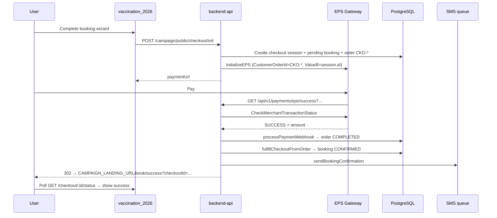

# EPS Payment Success Callback — Root Cause Analysis

**Date:** 2026-06-07  
**Incident:** Production EPS success callback returns error JSON; SMS not sent; confirmation page not shown  
**Sample URL:**

```
GET /api/v1/payments/eps/success?Status=Success&MerchantTransactionId=CKO-EZTUBGCU&EPSTransactionId=260607071504083ZQ
```

**Observed API response:**

```json
{
  "success": false,
  "message": "Request failed with status code 404",
  "code": "ERR_BAD_REQUEST"
}
```

**Scope:** Root-cause analysis (2026-06-07). **Fix implemented** 2026-06-07 — see §14.

---

## Executive summary

Payment completes at the EPS customer gateway, but the **backend success callback aborts before fulfillment** because `verifyEpsTransaction()` issues an outbound `axios` call to EPS `CheckMerchantTransactionStatus` that returns **HTTP 404**. The thrown axios error is not caught inside the EPS callback pipeline; it bubbles to the global Express error handler, which returns the JSON above.

Because `processPaymentWebhook()` never runs:

- The checkout order stays `PENDING`
- `fulfillCheckoutFromOrder()` / `fulfillCheckoutSession()` never run
- `sendBookingConfirmation()` is never invoked
- No browser redirect to the vaccination landing occurs (error path always returns JSON)

Even if verification succeeded, the current redirect builder would still send users to `/book/success` **without** `checkoutId`, so the express-checkout success page would not poll or show booking details. The `/book/confirm/[ref]` page is a **legacy OTP flow** and is not the target of the EPS success redirect.

**Primary root cause:** Uncaught axios 404 from EPS status verification on the success callback path.  
**Secondary root causes:** Missing `checkoutId`/`bookingRef` in EPS browser callback query params; redirect/confirm-page mismatch with express checkout design.

---

## 1. End-to-end flow (intended vs actual)

### 1.1 Intended express-checkout flow



### 1.2 Actual production flow (this incident)

```mermaid
sequenceDiagram
  participant User
  participant EPS as EPS Gateway
  participant API as backend-api
  participant DB as PostgreSQL

  User->>EPS: Pay (SUCCESS at gateway)
  EPS->>API: GET /api/v1/payments/eps/success?Status=Success&MerchantTransactionId=CKO-EZTUBGCU&EPSTransactionId=260607071504083ZQ
  API->>EPS: POST /v1/Auth/GetToken (likely OK — payment was initiated)
  API->>EPS: GET /v1/EPSEngine/CheckMerchantTransactionStatus?...
  EPS-->>API: HTTP 404
  Note over API: axios throws ERR_BAD_REQUEST
  API-->>User: 500 JSON { success:false, message:"Request failed with status code 404", code:"ERR_BAD_REQUEST" }
  Note over DB: Order/booking unchanged; SMS not queued
```

---

## 2. Route → controller → service map

| Layer | File | Symbol | Role |
|-------|------|--------|------|
| Mount | `src/api/v1/routes.ts` | `mountWith503("/payments/eps", …)` | Registers `/api/v1/payments/eps/*` |
| Route | `src/api/v1/modules/payment/eps/eps.routes.ts` | `GET /success` | `requireEpsConfigured` → `epsCallbackHandler("success")` |
| Controller | `src/api/v1/modules/payment/eps/eps.controller.ts` | `epsCallbackHandler` | Calls `handleEpsCallback`; on success redirects to `CAMPAIGN_LANDING_URL` + path; on error `next(error)` |
| Service | `src/api/v1/modules/payment/eps/eps.service.ts` | `handleEpsCallback` | Delegates to `handleEpsWebhook`, builds redirect path |
| Service | `src/api/v1/modules/payment/eps/eps.service.ts` | `handleEpsWebhook` | Normalizes query → `verifyEpsTransaction` → `dispatchPaymentWebhook` |
| Gateway | `src/api/v1/modules/payment/eps/eps.gateway.ts` | `verifyEpsTransaction` | Outbound EPS HTTP (GetToken + CheckMerchantTransactionStatus) |
| Campaign | `src/api/v1/modules/campaign/payment.service.ts` | `processPaymentWebhook` | Order lookup, payment completion, triggers fulfillment + SMS |
| Checkout | `src/api/v1/modules/campaign/checkout.service.ts` | `fulfillCheckoutFromOrder` | Marks session PAID, runs `fulfillCheckoutSession` |
| SMS | `src/api/v1/modules/campaign/sms.service.ts` | `sendBookingConfirmation` | `PAYMENT_SUCCESS` template after confirmed booking |

**Redirect helper** (`eps.controller.ts`):

```typescript
function landingRedirect(res: Response, path: string) {
  const base = process.env.CAMPAIGN_LANDING_URL || process.env.APP_URL || "";
  const url = base ? `${base.replace(/\/+$/, "")}${path}` : path;
  return res.redirect(302, url);
}
```

---

## 3. HTTP requests executed after EPS success callback

Only **outbound** HTTP in this path are EPS gateway calls inside `eps.gateway.ts`. There are **no** internal axios/fetch calls to the campaign API or vaccination frontend.

| Step | Method | URL | When | Outcome in incident |
|------|--------|-----|------|---------------------|
| 1 | `POST` | `{EPS_BASE_URL}/v1/Auth/GetToken` | `verifyEpsTransaction` → `getEpsAuthToken` | Assumed OK (payment had been initialized on same base URL) |
| 2 | `GET` | `{EPS_BASE_URL}/v1/EPSEngine/CheckMerchantTransactionStatus?merchantTransactionId=CKO-EZTUBGCU&EPSTransactionId=260607071504083ZQ` | `verifyEpsTransaction` | **HTTP 404 → axios throw** |
| 3 | — | Prisma DB reads/writes | `upsertPaymentTransaction`, `processPaymentWebhook`, etc. | **Never reached** |
| 4 | — | SMS enqueue (`sendCampaignSms`) | After `sendBookingConfirmation` | **Never reached** |
| 5 | `302` | `{CAMPAIGN_LANDING_URL}{redirectPath}` | `landingRedirect` on success | **Never reached** (error path) |

**Inbound request:** Browser/EPS → `GET /api/v1/payments/eps/success?...`

---

## 4. Which request returns 404?

The **404 is not** “route not found” on `backend-api` (that route is registered at `eps.routes.ts` line 37). The route exists and executes.

The 404 originates from the **outbound EPS verify call**:

```170:176:src/api/v1/modules/payment/eps/eps.gateway.ts
  const res = await axios.get<EpsVerifyResponse>(`${endpoints.verify}?${params.toString()}`, {
    headers: {
      "x-hash": hash,
      Authorization: `Bearer ${token}`,
    },
    timeout: cfg.timeoutMs,
  });
```

Axios default behavior throws on HTTP 4xx/5xx. The thrown error has:

- `message`: `"Request failed with status code 404"`
- `code`: `"ERR_BAD_REQUEST"`

The global error handler serializes these fields:

```93:98:src/api/v1/middlewares/errors.ts
  const payload: any = { success: false, message };
  if (e?.details !== undefined) payload.details = e.details;
  if (typeof e?.code === "string" && e.code.length > 0) payload.code = e.code;
  ...
  res.status(status).json(payload);
```

`status` defaults to **500** (axios errors do not set `statusCode` on the Error object), even though the **upstream** EPS response was 404.

### 4.1 Why verification is mandatory on success callback

`handleEpsWebhook` always calls `verifyEpsTransaction` before `dispatchPaymentWebhook`:

```241:260:src/api/v1/modules/payment/eps/eps.service.ts
  const verified = await verifyEpsTransaction({
    merchantTransactionId: merchantTransactionId || undefined,
    epsTransactionId: epsTransactionId || undefined,
    customerOrderId: customerOrderId || undefined,
  });

  const event = verified || parseEpsCallbackQuery(record);
  if (!event) {
    return { success: false, error: "Webhook verification failed" };
  }
  ...
  return dispatchPaymentWebhook(toVerifiedPaymentEvent(event));
```

**Critical gap:** `parseEpsCallbackQuery` is only used when verify **returns `null`** (EPS body error fields). It is **not** used when verify **throws** (HTTP 404). The callback query already contains `Status=Success` and would be sufficient for a fallback path, but the throw prevents that branch.

### 4.2 Plausible EPS-side causes for verify 404

Payment succeeded at the gateway UI, so `InitializeEPS` and GetToken previously worked. Verify 404 still commonly indicates:

1. **Wrong verify query contract** — EPS may expect only one identifier, different parameter casing, or a path variant not matching production docs.
2. **Environment mismatch** — Live payment on production EPS host but verify pointed at sandbox base URL (or stale `EPS_BASE_URL` after process start). Less likely if init and callback share the same running process config.
3. **MerchantTransactionId semantics** — Checkout uses `CKO-EZTUBGCU` (order number) as `merchantTransactionId` because `referenceId.length >= 10`. EPS may index verify by internal numeric id while still echoing `CKO-*` in the browser redirect.
4. **Timing / propagation** — Rare race if verify is called before EPS indexes the transaction (usually returns a business error in body, not HTTP 404).

**Recommended production check (ops, not code):**

```bash
# After obtaining a fresh EPS token, call the same verify URL the API uses:
GET {EPS_BASE_URL}/v1/EPSEngine/CheckMerchantTransactionStatus?merchantTransactionId=CKO-EZTUBGCU&EPSTransactionId=260607071504083ZQ
```

Compare with `scripts/verify-eps-endpoint.js` / `scripts/test-eps-connection.ts`.

---

## 5. Order and transaction identity (CKO-EZTUBGCU)

| Artifact | Value / pattern | Source |
|----------|-----------------|--------|
| Order number | `CKO-EZTUBGCU` | `CKO-${session.id.slice(-8).toUpperCase()}` in `createCheckoutPaymentIntent` |
| EPS `CustomerOrderId` at init | `CKO-EZTUBGCU` | `initializeEpsPayment` sets `CustomerOrderId: req.referenceId` |
| EPS `ValueB` at init | checkout session UUID | `ValueB: req.referenceId` — **note:** `referenceId` passed to gateway is `orderNumber`, not session id (see `createUnifiedPayment` → `referenceId: input.orderNumber`) |
| Browser callback query | `MerchantTransactionId=CKO-EZTUBGCU`, **no** `CustomerOrderId`, **no** `ValueB` | EPS redirect strips custom fields |
| `payment_transactions` row | Often keyed by EPS `TransactionId` from initialize, not `CKO-*` | `createUnifiedPayment` stores `result.providerPaymentId` |

`findOrderForPaymentWebhook` would resolve the order by `orderNumber: CKO-EZTUBGCU` **if** `processPaymentWebhook` ran with `transactionId: CKO-EZTUBGCU` (from verify response or `parseEpsCallbackQuery` fallback).

---

## 6. Why booking reference does not reach `/book/confirm/[ref]`

Three separate breaks apply.

### 6.1 Callback never completes (primary)

Fulfillment and redirect never run because verify throws before `handleEpsCallback` returns.

### 6.2 Redirect path does not target `/book/confirm/[ref]`

On success, `handleEpsCallback` builds:

```275:293:src/api/v1/modules/payment/eps/eps.service.ts
  const merchantTxn =
    record.merchantTransactionId || record.MerchantTransactionId || "";
  const checkoutId = record.ValueB || record.checkoutId || "";
  const bookingRef = record.CustomerOrderId || record.ref || "";

  const basePath =
    kind === "success"
      ? bookingRef
        ? `/book/payment/success?ref=${encodeURIComponent(bookingRef)}`
        : checkoutId
          ? `/book/success?checkoutId=${encodeURIComponent(checkoutId)}`
          : "/book/success"
```

EPS success query for this incident:

| Param | Present? | Used as |
|-------|----------|---------|
| `CustomerOrderId` | No | `bookingRef` → empty |
| `ValueB` | No | `checkoutId` → empty |
| `MerchantTransactionId` | `CKO-EZTUBGCU` | **Not used** for redirect |

Resulting redirect: **`/book/success`** (no query string), even on a fully successful webhook.

Express checkout expects **`/book/success?checkoutId={sessionUuid}`** (appended server-side at init in `checkout.service.ts` lines 442–444), but that `checkoutId` is **not** echoed back by EPS in the browser callback.

### 6.3 `/book/confirm/[ref]` is legacy OTP flow

`vaccination_2026/app/book/confirm/[ref]/page.tsx`:

- Requires `getSessionToken()` (OTP session)
- Calls `getBookingByRef(ref)` with Bearer auth
- Intended for **legacy** `/book/payment/success?ref={bookingRef}` flow

Express checkout canonical UX is `app/book/success/page.tsx`, which polls `getCheckoutStatus(checkoutId)` when `?checkoutId=` is present.

`/book/payment/success` links to confirm with `ref` as **booking ref**, but EPS would supply `CKO-*` (order number) if `CustomerOrderId` were present — not the human booking ref (e.g. `BPA-XXXX`).

**Conclusion:** `/book/confirm/[ref]` is unreachable in this incident because (a) callback fails, (b) redirect never fires, (c) even a working redirect would not land on confirm with the correct `ref`, and (d) express flow is designed for `/book/success?checkoutId=`, not confirm.

---

## 7. Why SMS is not triggered

SMS is sent only after a confirmed booking id exists post-payment.

| Trigger location | Condition | Reached? |
|------------------|-----------|----------|
| `payment.service.ts` → `sendBookingConfirmation(confirmedBookingId)` | `processPaymentWebhook` SUCCESS + `confirmedBookingId` from booking update or `fulfillCheckoutFromOrder` | **No** — webhook not dispatched |
| `checkout.service.ts` → `finalizeFulfilledBooking` → `sendBookingConfirmation` | `fulfillCheckoutSession` completes | **No** — fulfillment not called |

Pending booking rows may exist (`createPendingBookingForCheckout` sets `paymentStatus: PENDING`), but they are only finalized inside `fulfillCheckoutSession` after order `COMPLETED`.

No SMS fallback runs on raw EPS browser callback params.

---

## 8. Failure chain (ordered)

1. User completes EPS payment → EPS redirects to `/api/v1/payments/eps/success?...`.
2. `epsCallbackHandler("success")` invokes `handleEpsCallback`.
3. `handleEpsWebhook` calls `verifyEpsTransaction` with `merchantTransactionId=CKO-EZTUBGCU`, `epsTransactionId=260607071504083ZQ`.
4. EPS `CheckMerchantTransactionStatus` responds **HTTP 404**.
5. Axios throws; **no try/catch** in `verifyEpsTransaction` / `handleEpsWebhook`.
6. `epsCallbackHandler` catch → `next(error)` → global `errorHandler`.
7. Client receives `{ success: false, message: "Request failed with status code 404", code: "ERR_BAD_REQUEST" }`.
8. `dispatchPaymentWebhook` → `processPaymentWebhook` **skipped**.
9. Order remains `PENDING`; checkout session not `FULFILLED`; booking stays `PENDING` payment.
10. `sendBookingConfirmation` **skipped**.
11. `landingRedirect` **skipped** — user never reaches landing success or confirm pages.

---

## 9. Secondary risks (if verify 404 were fixed)

| Risk | Detail |
|------|--------|
| Redirect without `checkoutId` | User lands on bare `/book/success`; page shows generic wizard, no poll (`app/book/success/page.tsx` line 21: `if (!checkoutId) return`) |
| `parseEpsCallbackQuery` amount = 0 | Fallback event sets `amount: 0`; `processPaymentWebhook` rejects SUCCESS when `amountsMatch(0, orderTotal)` fails |
| Duplicate SMS | Both `payment.service` and `finalizeFulfilledBooking` can send confirmation SMS on checkout path (benign but noisy) |
| `CAMPAIGN_LANDING_URL` unset | Redirect becomes relative `/book/success` on API host (wrong origin) |

---

## 10. Touch-point file index

| File | Relevance |
|------|-----------|
| `src/api/v1/modules/payment/eps/eps.routes.ts` | `GET /success` route registration |
| `src/api/v1/modules/payment/eps/eps.controller.ts` | Callback handler, redirect, error propagation |
| `src/api/v1/modules/payment/eps/eps.service.ts` | `handleEpsCallback`, `handleEpsWebhook`, redirect path logic |
| `src/api/v1/modules/payment/eps/eps.gateway.ts` | EPS GetToken + CheckMerchantTransactionStatus (404 source) |
| `src/api/v1/modules/campaign/payment.service.ts` | `processPaymentWebhook`, order lookup, SMS hook |
| `src/api/v1/modules/campaign/checkout.service.ts` | Init return URL with `checkoutId`, fulfillment |
| `src/api/v1/modules/campaign/sms.service.ts` | `sendBookingConfirmation` |
| `src/api/v1/middlewares/errors.ts` | Serializes axios error to production JSON |
| `vaccination_2026/app/book/success/page.tsx` | Express success + polling |
| `vaccination_2026/app/book/confirm/[ref]/page.tsx` | Legacy confirm + OTP |
| `vaccination_2026/app/book/payment/success/page.tsx` | Legacy payment success → link to confirm |

---

## 11. Root cause statement

| # | Finding | Severity |
|---|---------|----------|
| **RC-1** | EPS `CheckMerchantTransactionStatus` returns HTTP 404 during success callback; axios exception is uncaught and aborts the entire callback | **Critical** — blocks payment fulfillment, SMS, and redirect |
| **RC-2** | EPS browser callback omits `CustomerOrderId` / `ValueB`; redirect logic ignores `MerchantTransactionId`, so even a successful callback would redirect to `/book/success` without `checkoutId` | **High** — broken express post-payment UX |
| **RC-3** | `/book/confirm/[ref]` requires OTP session and booking ref; not wired to EPS express checkout return path | **Medium** — architectural mismatch, not the direct production error |

**Single-line root cause:** Production payment succeeds at EPS, but the API success handler **hard-fails on outbound EPS transaction verification (HTTP 404)**, preventing webhook processing, booking fulfillment, SMS, and landing redirect; separately, redirect construction cannot recover `checkoutId` or booking ref from the EPS callback query shape.

---

## 12. Verification checklist (operations)

After deploy/config review (no code changes required for diagnosis):

- [ ] Call production success URL with sample params; confirm whether response is still axios 404 JSON.
- [ ] Manually call EPS `CheckMerchantTransactionStatus` with the same ids against production `EPS_BASE_URL`.
- [ ] Confirm `EPS_BASE_URL`, `EPS_SANDBOX`, and credentials match the environment where payment was taken.
- [ ] Confirm `CAMPAIGN_LANDING_URL` points to `vaccination_2026` production host.
- [ ] After a test payment, inspect DB: `orders.paymentStatus`, `campaign_checkout_sessions.status`, `campaign_bookings.paymentStatus`, `campaign_sms_logs`.
- [ ] Confirm notification worker running if SMS uses queue (`REDIS_ENABLED=true`).

---

## 13. Related internal docs

- `docs/campaign-v2/campaign-payment-production-readiness-audit.md` — documents missing `checkoutId` on EPS redirect (§1.3, §1.7).
- `docs/debug/eps-payment-integration-analysis.md` — EPS base URL / DNS issues.
- `docs/reports/vaccination-production-validation.md` — production env and callback URL checklist.
- `docs/payment/eps-gateway-setup.md` — callback URL registration.

---

---

## 14. Fix implementation (2026-06-07)

| RC | Fix | Files |
|----|-----|-------|
| RC-1 | EPS verify no longer throws on HTTP 4xx; retries single-id lookups; callback query fallback + order amount enrichment | `eps.gateway.ts`, `eps.service.ts` |
| RC-2 | Redirect resolved from DB via `CKO-*` / `CAMP-*` merchant txn → checkout session + booking ref | `eps.redirectResolver.ts`, `eps.service.ts` |
| SMS | Checkout fulfillment sends SMS once (`finalizeFulfilledBooking`); `payment.service` skips duplicate when `fulfillCheckoutFromOrder` ran | `payment.service.ts` |
| Amount | Skip amount mismatch when callback fallback reports `amount: 0` | `payment.service.ts` |
| Init | EPS `ValueB` now stores `checkoutSessionId` for future gateway echo | `eps.gateway.ts`, `payment.service.ts` |
| Ops | Structured `[EPS callback]` / `[EPS verify]` logging; browser callbacks redirect on unhandled errors | `eps.controller.ts`, `eps.service.ts` |

**Deployment notes:** `docs/audits/payment-success-callback-deployment.md`

---

*Initial report: static code trace. Fix pass: `backend-api` only.*
