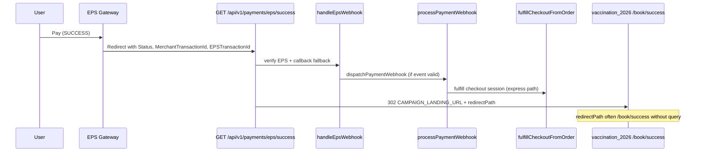

# Production Payment Success Bug — Analysis

**Date:** 2026-06-07  
**Symptom:** EPS payment completes; user lands on `/book/success` (no query string); page shows **"No campaign was selected"**.  
**Expected:** `/book/success?checkoutId={sessionUuid}` with polling → booking confirmation (or legacy `/book/payment/success?ref={bookingRef}`).  
**Scope:** Analysis (2026-06-07). **Implementation completed** 2026-06-07 — see §10.

---

## Executive summary

The production UX break is a **redirect parameter gap**, not an EPS payment failure.

| Layer | What happens |
|-------|----------------|
| EPS gateway | Payment succeeds; browser hits API success callback |
| API redirect | User sent to `CAMPAIGN_LANDING_URL` + **`/book/success`** (no `checkoutId`) |
| Landing `/book/success` | No `?checkoutId=` → no status polling → renders empty `BookingWizard` |
| `BookingWizard` | No `campaignSlug` prop → shows `MISSING_CAMPAIGN_SLUG_MESSAGE` |

`campaignSlug` is **never** part of the EPS post-payment redirect chain. Express checkout only needs `checkoutId` on the success URL.

**Most likely production state:** Pre-fix `backend-api` is deployed (redirect ignores `MerchantTransactionId`; EPS omits `ValueB` / `CustomerOrderId` in browser callback). A partial fix exists in the **repo** (`eps.redirectResolver.ts`, etc.) but may not be live in production yet.

---

## 1. EPS success callback flow



### Route map

| Step | File | Symbol |
|------|------|--------|
| Mount | `src/api/v1/routes.ts` | `mountWith503("/payments/eps", …)` |
| Route | `src/api/v1/modules/payment/eps/eps.routes.ts` | `GET /success` → `epsCallbackHandler("success")` |
| Controller | `src/api/v1/modules/payment/eps/eps.controller.ts` | `landingRedirect(CAMPAIGN_LANDING_URL + path)` |
| Callback | `src/api/v1/modules/payment/eps/eps.service.ts` | `handleEpsCallback` → `handleEpsWebhook` |
| Verify | `src/api/v1/modules/payment/eps/eps.gateway.ts` | `verifyEpsTransaction` / `parseEpsCallbackQuery` |
| Fulfillment | `src/api/v1/modules/campaign/payment.service.ts` | `processPaymentWebhook` |
| Checkout | `src/api/v1/modules/campaign/checkout.service.ts` | `fulfillCheckoutFromOrder` → `fulfillCheckoutSession` |

### Alternate path (misconfiguration risk)

`GET /api/v1/payments/webhook/redirect/success` (`payment.controller.ts` → `sslRedirectHandler`) **always** redirects to `/book/success` with **no** `checkoutId`. If EPS or env points here instead of `/payments/eps/success`, the same symptom appears.

---

## 2. Where the redirect URL is generated

### 2.1 Primary path (EPS module)

```32:36:src/api/v1/modules/payment/eps/eps.controller.ts
function landingRedirect(res: Response, path: string) {
  const base = process.env.CAMPAIGN_LANDING_URL || process.env.APP_URL || "";
  const url = base ? `${base.replace(/\/+$/, "")}${path}` : path;
  return res.redirect(302, url);
}
```

`path` comes from `handleEpsCallback` → `buildEpsLandingRedirectPath` (`eps.redirectPaths.ts`).

### 2.2 Redirect decision tree (`buildEpsLandingRedirectPath`)

| Priority | Condition | Path |
|----------|-----------|------|
| 1 | `checkoutId` present (query `ValueB` / `checkoutId` or DB-resolved) | `/book/success?checkoutId=…` |
| 2 | `bookingRef` present (legacy `CAMP-*` or session booking) | `/book/payment/success?ref=…` |
| 3 | Fallback | **`/book/success`** ← **production symptom** |

### 2.3 Pre-fix vs current repo behavior

**Pre-fix (likely production):** `handleEpsCallback` only read EPS query params:

- `bookingRef` ← `CustomerOrderId` / `ref` (EPS does **not** echo these on browser redirect)
- `checkoutId` ← `ValueB` / `checkoutId` (EPS does **not** echo these)
- `MerchantTransactionId` (`CKO-*`) was **ignored** for redirect

→ Always fell through to `/book/success`.

**Current repo (2026-06-07 fix, may not be deployed):** `resolveEpsRedirectContext(merchantTxn)` looks up order by `CKO-*`, parses `campaign_checkout:{sessionId}` from order notes, returns `checkoutId`.

### 2.4 Error fallback (still bare `/book/success`)

```134:137:src/api/v1/modules/payment/eps/eps.controller.ts
      if (!wantsJson) {
        const fallbackPath =
          kind === "success" ? "/book/success" : "/book/payment/failed";
        return landingRedirect(res, fallbackPath);
```

Unhandled exceptions in the callback handler also send users to bare `/book/success`.

---

## 3. `checkoutId`, `bookingRef`, `campaignSlug` propagation

### 3.1 At checkout init

| Field | Set where | Value |
|-------|-----------|-------|
| `checkoutId` | `checkout.service.ts` `initCheckout` | `campaignCheckoutSession.id` (cuid) |
| Order number | `createCheckoutPaymentIntent` | `CKO-${session.id.slice(-8).toUpperCase()}` |
| Order notes | `buildCheckoutOrderNotes` | `campaign_checkout:{sessionId}\|idempotency:…` |
| `returnUrl` (server) | `checkout.service.ts` | `{landing}/book/success?checkoutId={session.id}` |
| `returnUrl` (client) | `campaignApi.initCheckout` | `siteUrl("/book/success")` — **without** `checkoutId`; server appends it |
| EPS `successUrl` | `eps.gateway.ts` | `API_PUBLIC_BASE_URL/api/v1/payments/eps/success` (API callback, not landing) |
| EPS `CustomerOrderId` | `eps.gateway.ts` | `orderNumber` (`CKO-*`) |
| EPS `ValueB` | `eps.gateway.ts` (repo fix) | `checkoutSessionId` if metadata present, else `orderNumber` |
| `campaignSlug` | `BookingWizard` → `initCheckout` | Stored in checkout **session** via `campaignId`; **not** in EPS redirect |

### 3.2 EPS browser callback query (observed production shape)

```
Status=Success
MerchantTransactionId=CKO-EZTUBGCU
EPSTransactionId=260607071504083ZQ
```

**Absent:** `CustomerOrderId`, `ValueB`, `checkoutId`, `ref`, `campaign`.

### 3.3 DB resolution (`resolveEpsRedirectContext`)

```24:36:src/api/v1/modules/payment/eps/eps.redirectResolver.ts
  const order = await prisma.order.findFirst({
    where: {
      OR: [{ orderNumber: key }, { notes: { contains: key } }],
    },
    orderBy: { id: "desc" },
  });
  ...
  const checkoutId = parseCheckoutSessionIdFromOrderNotes(order.notes) ?? undefined;
```

Parser:

```36:39:src/api/v1/modules/campaign/campaign.paymentGuards.ts
export function parseCheckoutSessionIdFromOrderNotes(notes?: string | null): string | null {
  const match = notes.match(/campaign_checkout:([a-z0-9]+)/i);
  return match ? match[1] : null;
}
```

Works for cuid session ids. **Fails** if notes format changes or order row is missing.

### 3.4 `campaignSlug` on success page

`/book/success` does **not** read `?campaign=`. It only uses `checkoutId`:

```81:84:vaccination_2026/app/book/success/page.tsx
  return (
    <div className="container py-4 py-lg-5">
      <BookingWizard />
    </div>
  );
```

Without `checkoutId`, `BookingWizard` renders with `campaignSlug = null`:

```253:258:vaccination_2026/components/booking/BookingWizard.tsx
  if (!activeSlug) {
    return (
      <div className="booking-alert booking-alert--danger" role="alert">
        {MISSING_CAMPAIGN_SLUG_MESSAGE}
      </div>
    );
  }
```

Message text from `lib/campaignSlug.ts` → **"No campaign was selected…"**

**Note:** `sessionStorage` (`bpa_booking_draft_v7`) may still hold `checkoutId` from pre-redirect draft, but the success page **does not read it**.

---

## 4. Why redirect becomes `/book/success` without query params

### Root cause chain (ordered)

| # | Cause | Effect |
|---|--------|--------|
| **RC-A** | EPS browser callback omits `ValueB`, `CustomerOrderId`, `checkoutId` | Query-only redirect logic has no ids |
| **RC-B** | Pre-prod code ignored `MerchantTransactionId` for redirect | No DB lookup → fallback `/book/success` |
| **RC-C** | Repo fix not deployed to production | Production still behaves as RC-B |
| **RC-D** | `resolveEpsRedirectContext` returns empty (order not found, wrong DB, notes parse fail) | Even fixed code → fallback `/book/success` |
| **RC-E** | Callback handler catch block | Exception → hardcoded `/book/success` |
| **RC-F** | Wrong success URL (`/payments/webhook/redirect/success`) | `sslRedirectHandler` → always bare `/book/success` |
| **RC-G** | `CAMPAIGN_LANDING_URL` unset | Relative redirect (wrong host); query still omitted |

### What does **not** cause this symptom

- Missing `campaignSlug` on redirect (slug is only needed for empty wizard fallback).
- User completing payment at EPS (payment can succeed while redirect is wrong).

---

## 5. SMS trigger conditions

SMS is **downstream of booking finalization**, not the redirect.

| Trigger | File | Condition |
|---------|------|-----------|
| Express checkout | `checkout.service.ts` → `finalizeFulfilledBooking` | After `fulfillCheckoutSession` succeeds |
| Legacy booking | `payment.service.ts` | `confirmedBookingId` set and `!fulfilledViaCheckout` |
| Zone interest | `sms.service.ts` → `sendZoneInterestConfirmation` | `bookingMode === ZONE_INTEREST` |

`sendBookingConfirmation` requires a **confirmed booking row** (`campaignBooking.id`).

**Blocked when:**

1. `handleEpsWebhook` never runs (verify threw — pre-fix RC-1).
2. `processPaymentWebhook` fails (order not found, amount mismatch with `amount > 0`).
3. `fulfillCheckoutFromOrder` not called (no `checkoutSessionId` in order notes).
4. `SMS_ENABLED=false` or provider misconfigured (separate ops issue).

**Repo fix:** SMS sent once via `finalizeFulfilledBooking`; `payment.service` skips duplicate when `fulfilledViaCheckout === true`.

---

## 6. Booking finalization conditions

### Express checkout path

```
processPaymentWebhook SUCCESS
  → order.paymentStatus = COMPLETED
  → fulfillCheckoutFromOrder(order.id)
      → parseCheckoutSessionIdFromOrderNotes(order.notes)
      → session.status = PAID
      → fulfillCheckoutSession(sessionId)
          → update/create campaignBooking (CONFIRMED / PENDING_ASSIGNMENT)
          → session.status = FULFILLED
          → finalizeFulfilledBooking → SMS
```

### Idempotency

| Guard | Location |
|-------|----------|
| Replay key | `dispatchPaymentWebhook` → `isPaymentEventReplay` |
| Duplicate COMPLETED order | `processPaymentWebhook` early return + `fulfillCheckoutFromOrder` on `FULFILLED` session |
| Duplicate `orderPayment` | `orderPayment.findFirst` by `reference` |

### Finalization can succeed while redirect fails

Webhook processing and redirect building are **loosely coupled** in `handleEpsCallback`: redirect context is resolved **before** webhook, but if DB lookup fails, user still gets bare `/book/success` even when payment later completes.

---

## 7. Exact code changes required

### 7.1 Backend — deploy existing fix (if not live)

These changes exist in the **repo** (see `docs/audits/payment-success-callback-root-cause.md` §14) and should be **deployed to production**:

| File | Change |
|------|--------|
| `eps.gateway.ts` | Verify: no throw on HTTP 404; retry single-id; `ValueB = checkoutSessionId` |
| `eps.redirectResolver.ts` | **New** — order lookup from `CKO-*` → `checkoutId` / `bookingRef` |
| `eps.redirectPaths.ts` | **New** — redirect priority: `checkoutId` > `bookingRef` > fallback |
| `eps.service.ts` | DB redirect context + callback logging + amount enrichment |
| `eps.controller.ts` | Structured logging; browser redirect on errors |
| `payment.service.ts` | `amount === 0` callback tolerance; `checkoutSessionId` in EPS metadata; SMS dedup |

### 7.2 Backend — additional changes still recommended

| # | File | Change | Why |
|---|------|--------|-----|
| 1 | `eps.controller.ts` | In `catch`, call `resolveEpsRedirectContext(merchantTxn)` before fallback `/book/success` | RC-E |
| 2 | `payment.controller.ts` | `sslRedirectHandler("success")` reuse `buildEpsLandingRedirectPath` + resolver | RC-F |
| 3 | `eps.redirectResolver.ts` | Fallback: `campaignCheckoutSession.findFirst({ where: { orderId } })` | RC-D if notes parse fails |
| 4 | `campaign.paymentGuards.ts` | Broaden regex to `campaign_checkout:([a-zA-Z0-9_-]+)` | Future-proof session ids |
| 5 | `eps.redirectPaths.ts` | After webhook success, prefer `result.checkoutId` from `handleEpsCallback` return; add `?bookingRef=` on express success as secondary param | UX recovery |
| 6 | `handleEpsCallback` | If `kind === "success"` && `!checkoutId` && `result.bookingId`, resolve `bookingRef` post-fulfillment and redirect to `/book/success?checkoutId=` or show ref | Late binding after webhook |

### 7.3 Frontend — `vaccination_2026` (required for defense in depth)

| # | File | Change | Why |
|---|------|--------|-----|
| 1 | `app/book/success/page.tsx` | If no `?checkoutId=`, read `checkoutId` from `sessionStorage` (`DRAFT_STORAGE_KEY`) | User draft survives EPS round-trip |
| 2 | `app/book/success/page.tsx` | When no `checkoutId` anywhere, show **"Confirming payment…"** + link to My booking — **not** bare `BookingWizard` | Prevents "No campaign was selected" |
| 3 | `app/book/success/page.tsx` | Optional: accept `?ref=` (booking ref) and poll booking status API | Fallback if only booking ref known |
| 4 | `lib/campaignApi.ts` | Optional: pass `returnUrl` with placeholder; server already appends `checkoutId` | No client change strictly required |

### 7.4 Operations (no code)

| Item | Action |
|------|--------|
| Deploy | Ship latest `backend-api` to production API host |
| EPS dashboard | Confirm success URL = `/api/v1/payments/eps/success` (not `/webhook/redirect/success`) |
| Env | `CAMPAIGN_LANDING_URL` = vaccination production origin |
| Recovery | Replay success URL for stuck `CKO-*` orders (idempotent) |
| Verify | Logs `[EPS callback]` → `redirectPath` includes `checkoutId` |

---

## 8. Verification matrix (post-fix)

| Check | Pass criteria |
|-------|----------------|
| Redirect | `Location: …/book/success?checkoutId=cl…` |
| Success page | Polls `GET /campaign/public/checkout/:id/status` |
| DB | `orders.payment_status = COMPLETED`, session `FULFILLED`, booking `CONFIRMED` |
| SMS | `campaign_sms_logs` row or queue job for `PAYMENT_SUCCESS` |
| Idempotent replay | Second callback → no duplicate booking/SMS |
| UX | **No** "No campaign was selected" after paid express checkout |

---

## 9. Related documents

- `docs/audits/payment-success-callback-root-cause.md` — original 404 / verify failure analysis + repo fix table
- `docs/audits/payment-success-callback-deployment.md` — deploy steps
- `docs/campaign-v2/campaign-payment-production-readiness-audit.md` — §1.3 missing `checkoutId` gap (pre-fix)

---

---

## 10. Implementation status (2026-06-07)

| Area | Change |
|------|--------|
| Backend | `resolveEpsRedirectContext` + `orderId` session fallback; `resolvePaymentLandingRedirectPath` shared by EPS + ssl redirect handlers; post-fulfillment `checkoutId` binding |
| Backend | Error-path redirect uses resolver (`eps.controller.ts` catch) |
| Frontend | `/book/success` reads `checkoutId` from URL + `sessionStorage`; recovery UI instead of bare `BookingWizard` |
| SMS | Single dispatch via `finalizeFulfilledBooking`; `payment.service` logs `sms_skip_duplicate` |
| Logging | `[EPS redirect]`, `[CampaignPayment]`, `[checkout]` structured logs |
| Deploy | `docs/audits/payment-success-production-deploy.md` |

---

*Initial pass: analysis only. Implementation follow-up in same release train.*
