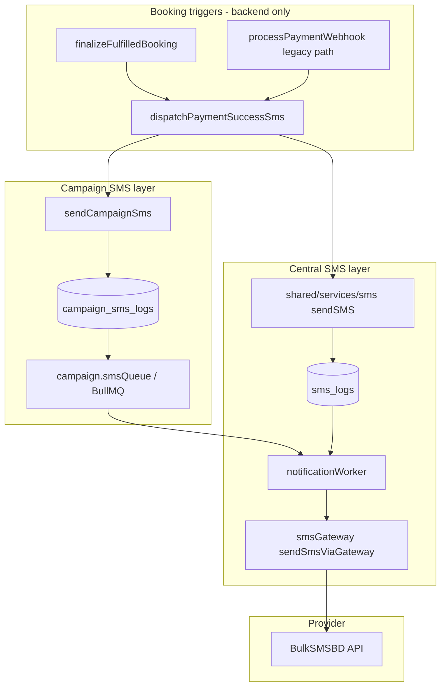

# SMS Delivery Verification Audit — BPA Vaccination 2026

**Date:** 2026-06-07  
**Scope:** Campaign booking SMS (payment success, OTP, reminders) and central BPA SMS gateway  
**Repos:** `backend-api` (primary), workers, `bpa_web` (admin SMS UI)

---

## Executive conclusion

| Question | Answer |
|----------|--------|
| **Is SMS actually being sent?** | **Yes, when configured** — code paths exist and execute after fulfillment. Delivery depends on env credentials, Redis worker, and BulkSMSBD reachability. |
| **Which API sends campaign booking SMS?** | Indirect: `dispatchPaymentSuccessSms` → `sendSMS` / `sendCampaignSms` — not a public REST “send booking SMS” endpoint. |
| **Which provider?** | **BulkSMSBD** (default via `SMS_PROVIDER=bulksmsbd`), with SSL Wireless and mock fallbacks. |
| **Are credentials configured?** | **Environment-dependent** — check `SMS_API_KEY`, `SMS_SENDER_ID`, `SMS_ENABLED` on deployment host. |
| **Are messages queued?** | **Yes when Redis available** — BullMQ `smsQueue` + legacy `notif_sms`. |
| **Are failures logged?** | **Yes** — `campaign_sms_logs`, central `sms_logs`, `[PAYMENT_SUCCESS_SMS]` structured logs. |
| **Bugs preventing delivery?** | **No code blocker found** in current repo. Historical EPS verify 404 blocked fulfillment (fixed). Frontend never sends SMS. |

---

## 1. Provider configuration

### Active provider selection

| File | Mechanism |
|------|-----------|
| `src/integrations/sms/smsGateway.service.ts` | `getPrimarySmsProvider()` |
| `src/shared/services/sms/sms.constants.ts` | `getSmsProviderName()`, validation |
| `src/integrations/sms/smsProvider.bootstrap.ts` | Startup log + readiness |

**Default:** BulkSMSBD (`src/integrations/sms/bulkSmsBd.provider.ts`)

### Environment variables (checklist)

| Variable | Purpose |
|----------|---------|
| `SMS_ENABLED` | Master switch (`false` → mock/disabled path) |
| `SMS_PROVIDER` | `bulksmsbd` / `sslwireless` / `mock` |
| `SMS_API_KEY` / `BULKSMSBD_API_KEY` / `BULKSMSBD_API_TOKEN` | Gateway auth |
| `SMS_SENDER_ID` / `BULKSMSBD_SENDER_ID` | Sender ID |
| `SMS_API_URL` / `BULKSMSBD_BASE_URL` | API endpoint |
| `SMS_ALLOW_MOCK` | Dev bypass when creds missing |
| `SMS_IP_WHITELIST_ENABLED` | Requires server IP whitelisted in BulkSMSBD panel |
| `REDIS_URL` | Required for queued delivery |

**MSISDN formatting:** `src/integrations/sms/phone.ts` → `formatBdMsisdn()` (gateway expects `8801…`)

**Storage normalization:** `campaign.utils.normalizePhone()` → `01XXXXXXXXX` in DB

---

## 2. SMS service architecture

### Key modules

| Module | Role |
|--------|------|
| `payment-success-sms.service.ts` | Idempotent post-payment SMS (`smsSentAt` guard) |
| `sms.service.ts` (campaign) | Templates, `sendCampaignSms`, queue fallback |
| `sms.service.ts` (shared) | Central send, BullMQ enqueue, `sms_logs` |
| `smsGateway.service.ts` | Provider abstraction |
| `notificationWorker.ts` | Processes `smsQueue` + `notif_sms` jobs |
| `campaign.smsQueue.ts` | Campaign-specific enqueue |

---

## 3. Payment success SMS flow (vaccination booking)

| Step | Location | Action |
|------|----------|--------|
| 1 | `fulfillCheckoutSession` | Session → `FULFILLED`, booking → `COMPLETED` |
| 2 | `finalizeFulfilledBooking` | Calls `dispatchPaymentSuccessSms(bookingId)` |
| 3 | `dispatchPaymentSuccessSms` | Checks `smsSentAt`, eligibility, claims send |
| 4 | `sendSMS` + `campaign_sms_logs` | Queue or direct gateway |
| 5 | Worker | Delivers via BulkSMSBD |
| 6 | Audit | `PAYMENT_SUCCESS_SMS_SENT` / `_FAILED` |

**Not triggered by:**
- `/book/success` page load or refresh
- `getCheckoutStatus` polling
- EPS callback retries (idempotent via `smsSentAt`)

**Duplicate prevention:** `payment.service.ts` skips webhook SMS when `fulfilledViaCheckout === true`.

---

## 4. Queue, retry, error handling

### Queue

| Queue | Worker | Concurrency |
|-------|--------|-------------|
| `smsQueue` | `notificationWorker.ts` | `SMS_WORKER_CONCURRENCY` (default 5) |
| `notif_sms` (legacy) | Same worker | Same |

If Redis unavailable: **direct send fallback** in `sendCampaignSms` and `sendSMS`.

### Retry

| Layer | Retry |
|-------|-------|
| BullMQ jobs | Default 3 attempts, 5s backoff (`SMS_DEFAULT_ATTEMPTS`) |
| Admin | `POST /admin/sms/retry/:id` |
| Payment success SMS | **No auto-retry** after claim — failed send leaves `smsSentAt` set; manual resend needs ops procedure |

### Error handling

| Failure | Behavior |
|---------|----------|
| Provider not configured | `503` on admin send routes; bootstrap warns at startup |
| Gateway error | `campaign_sms_logs.status = FAILED`, `errorMessage` stored |
| Queue failure | Falls back to direct send |
| Dev mock | `SMS_ALLOW_DEV_FAKE_SENT=true` marks SENT in campaign logs |

### Logging

| Log prefix | Content |
|------------|---------|
| `[PAYMENT_SUCCESS_SMS]` | `bookingId`, `checkoutId`, `phone`, `providerResponse` |
| `[CampaignSms]` | Queue/direct fallback |
| `[SMS]` | Bootstrap provider status |
| `[NotificationWorker]` | Job completed/failed |

---

## 5. Admin / test endpoints

| Endpoint | Auth | Purpose |
|----------|------|---------|
| `POST /api/v1/notifications/sms/test` | Admin JWT | Test message to one phone |
| `POST /api/v1/notifications/sms/send` | Admin | Single SMS |
| `POST /api/v1/admin/sms/send` | Admin | Admin center single send |
| `GET /api/v1/admin/sms/logs` | Admin | Paginated delivery logs |
| `GET /api/v1/admin/sms/balance` | Admin | Provider balance |
| `POST /api/v1/admin/sms/retry/:id` | Admin | Retry failed log |

**bpa_web UI:** `CampaignOperationsCenter` → SMS tab (bulk send + logs). **No dedicated “test SMS” button** in UI today — API exists.

---

## 6. Delivery logging tables

| Table | Fields |
|-------|--------|
| `campaign_sms_logs` | `phone`, `templateCode`, `message`, `status`, `externalId`, `provider`, `sentAt`, `errorMessage`, `bookingId` |
| `campaign_bookings` | `smsSentAt`, `smsReference` (payment success idempotency) |
| Central `sms_logs` | Shared service audit trail |

---

## 7. Known issues & historical bugs

| Issue | Status |
|-------|--------|
| EPS verify 404 prevented fulfillment → no SMS | **Fixed** (eps.gateway resilient verify) |
| Duplicate SMS from webhook + finalize | **Fixed** (`sms_skip_duplicate` / `smsSentAt`) |
| Frontend success page showing wrong UI | **Fixed** (`PostCheckoutSuccess`) — unrelated to SMS send |
| User enters `+880` on form → claim fails client-side | **Open** — Task 1 in mobile fix plan |
| SMS fails silently for user | **Mitigation planned** — booking PDF download (Task 2) |

---

## 8. Production verification steps

1. **Startup logs:** `[SMS] Active provider: bulksmsbd | configured: yes`
2. **Balance:** `GET /api/v1/admin/sms/balance` (admin token)
3. **Test send:** `POST /api/v1/notifications/sms/test` with `{ "phone": "017XXXXXXXX" }`
4. **Complete paid booking** → check `campaign_bookings.smsSentAt` populated
5. **Check logs:** `campaign_sms_logs` row with `templateCode` `PAYMENT_SUCCESS_SMS` or `PAYMENT_SUCCESS`
6. **Worker running:** Redis connected; `[NotificationWorker] SMS job … completed`

---

## 9. SMS status conclusion

**The SMS system is architecturally sound and backend-only.** Campaign payment confirmation SMS is sent once after checkout fulfillment when:

1. `SMS_ENABLED` is true (or mock allowed in dev)
2. BulkSMSBD credentials are valid and server IP whitelisted (if required)
3. Redis worker is running (or direct fallback succeeds)
4. Phone in DB is valid `01…` format (normalization happens server-side)

**Primary operational risks are configuration and worker availability, not missing application code.** The planned **booking PDF** feature addresses user impact when SMS delivery fails.

---

## Related documents

- `docs/payment-success-sms.md`
- `docs/sms/bulksmsbd-setup.md`
- `docs/sms/bulksmsbd-audit.md`
- `docs/plans/vaccination-download-pdf-and-mobile-fix.md`
