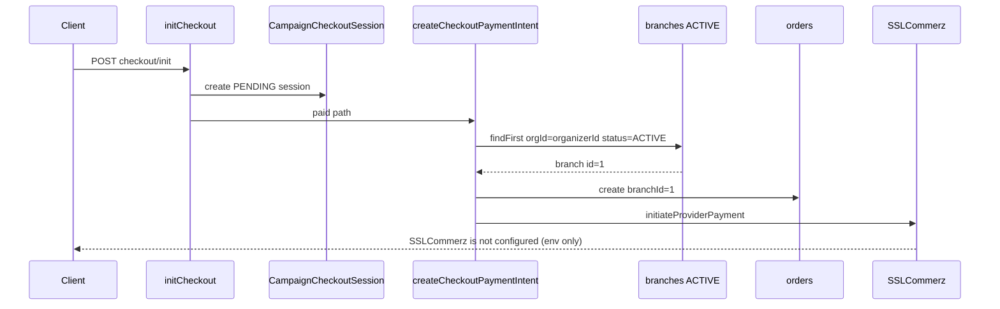

# Campaign checkout anchor — production configuration report

**Date:** 2026-06-04  
**Scope:** BPA campaign paid checkout (branch validation preserved)

## Root cause (resolved)

`createCheckoutPaymentIntent` resolves an **ACTIVE** branch for `campaign.organizerId`. With zero organizations/branches and `campaign.organizerId = null`, `prisma.branch.findFirst` returned null and surfaced:

> `Campaign payment setup not configured`

This is **not** an SSLCommerz misconfiguration; gateway errors occur only **after** branch resolution succeeds.

## Fix (data + idempotent seed)

Production-ready configuration uses **lookup by name/code** (no hardcoded IDs in application code):

| Artifact | Script | npm |
|----------|--------|-----|
| Seed anchor | `scripts/seed-campaign-checkout-anchor.ts` | `npm run seed:campaign-checkout-anchor` |
| Verify anchor | `scripts/verify-campaign-checkout-anchor.ts` | `npm run verify:campaign-checkout-anchor` |

Optional env overrides:

- `CAMPAIGN_ORGANIZER_ORG_NAME` (default: `Bangladesh Pet Association`)
- `CAMPAIGN_CHECKOUT_BRANCH_CODE` (default: `BPA-CAMPAIGN-CHECKOUT`)
- `CAMPAIGN_CHECKOUT_BRANCH_NAME` (default: `BPA Campaign Operations (Central)`)

### What the seed does

1. Ensures **APPROVED** BPA organization (creates or updates; does not delete data).
2. Ensures **ACTIVE** branch under that org (`BPA-CAMPAIGN-CHECKOUT`).
3. Sets `campaign.organizerId` for any campaign still unlinked.

Re-run is safe (idempotent).

## Configuration snapshot (local `bpa_pet_db`)

| Field | Value |
|-------|--------|
| **Organization** | Bangladesh Pet Association |
| **Organization ID** | `1` |
| **Organization status** | `APPROVED` |
| **Branch** | BPA Campaign Operations (Central) |
| **Branch ID** | `1` |
| **Branch code** | `BPA-CAMPAIGN-CHECKOUT` |
| **Branch status** | `ACTIVE` |
| **Branch orgId** | `1` |

### Campaigns

| Campaign ID | Slug | organizerId | pricingType |
|-------------|------|-------------|-------------|
| `1` | `uat-free-2026` | `1` | `PAID` |
| `2` | `uat-paid-2026` | `1` | `PAID` |

Note: `uat-free-2026` slug is historical; both campaigns use **PAID** pricing and the paid checkout path.

## Checkout flow verification

### Verification results (`npm run verify:campaign-checkout-anchor`)

| Check | Result |
|-------|--------|
| Organization exists & APPROVED | Pass |
| ACTIVE branch for BPA org | Pass |
| All campaigns have `organizerId` = org | Pass |
| Checkout session created | Pass |
| Order linked to session | Pass |
| Order `branchId` = active branch | Pass |
| No "Campaign payment setup not configured" | Pass |
| Payment intent / gateway | **Expected fail locally:** `SSLCommerz is not configured` |

Branch validation in `payment.service.ts` was **not** removed or bypassed.

## Deploy / ops checklist

1. `npm run seed:campaign-checkout-anchor` on each environment that runs campaign checkout.
2. `npm run verify:campaign-checkout-anchor` — must exit `0` with `gatewayEnvOnly: true` or full payment URL if gateway env is set.
3. For end-to-end payment redirect, configure:
   - `API_PUBLIC_BASE_URL`
   - `SSLCOMMERZ_STORE_ID` / `SSLCOMMERZ_STORE_PASSWORD` (or active `PAYMENT_PROVIDER`)
4. Restart API after env changes.

## Related docs

- `docs/debug/campaign-checkout-payment-setup-report.md` — original branch-gate analysis
- `docs/debug/campaign-booking-bookingMode-schema-report.md` — `bookingMode` migration
