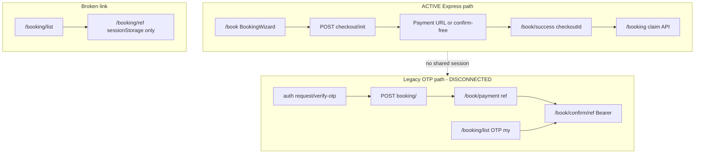

# Campaign Legacy Code — Cleanup Plan

**Version:** 1.0 (analysis only)  
**Date:** 2026-06-04  
**Status:** Planning — **no code removed** in this document  
**Workspaces:** `backend-api`, `bpa_web`, `vaccination_2026`  
**Authority:** Aligns with `docs/campaign-v2/master-architecture-plan.md` §3.2–3.4

**Related shipped V2 docs:** `admin-v2-report.md`, `booking-v2-report.md`, `operations-center-report.md`

---

## 1. Purpose

Inventory legacy campaign surfaces after V2 admin shell, express checkout, location-based booking, and Operations Center. Each item is classified so a later cleanup pass can proceed without breaking production paths.

**This document does not delete or gate code.** It is the decision record for a phased cleanup program.

---

## 2. Classification legend

| Class | Meaning |
|-------|---------|
| **ACTIVE** | In the current product path; keep until explicitly replaced. |
| **SAFE_TO_REMOVE** | No inbound imports / no live navigation; removal is low risk after a short grep audit. |
| **REQUIRES_MIGRATION** | Still referenced or needed for back-compat; retire only after redirect, API gate, or UI replacement. |

---

## 3. Executive summary

| Area | Legacy surface | Canonical V2 |
|------|----------------|--------------|
| Public booking | OTP 7-step wizard components (orphaned) | `BookingWizard` → `checkout/init` |
| Public booking | `/book/payment`, `/book/confirm/[ref]` (OTP session) | `/book/success?checkoutId=` + `claim` |
| Public booking | `/booking/list` (OTP “my bookings”) | `/booking` claim + sessionStorage |
| Backend | `POST /campaign/booking/` (OTP create) | `POST /campaign/public/checkout/init` |
| Backend | `GET …/booking-areas` (geo) | `GET …/campaigns/:slug/locations` |
| Admin | `CampaignNav` 18 tabs | `CampaignSidebar` + `campaignAdminNavConfig` |
| Admin | Redirect-only routes (statistics, sms, …) | Merged hubs (reports, operations, demand) |
| Admin | `SmsCenterPanel` (standalone) | `CampaignOperationsCenter` |
| Admin | Synthetic audit page | `CampaignAuditLog` API (not wired) |

**Critical disconnect:** Express bookings fulfill via checkout, but several pages still assume **OTP Bearer session** (`lib/session.ts`) and **booking ref payment** (`createPaymentIntent(ref)`), which express users never create.

---

## 4. Public site (`vaccination_2026`)

### 4.1 Routes and pages

| Path | Class | Notes |
|------|-------|-------|
| `/book` | **ACTIVE** | Canonical express entry; `BookingWizard` (mobile → location → date → cats → pay). |
| `/book/success` | **ACTIVE** | Polls `GET …/checkout/:id/status`; free confirm via wizard. |
| `/booking` | **ACTIVE** | Claim form → `POST …/public/booking/claim` → `/booking/[ref]`. |
| `/booking/[ref]` | **REQUIRES_MIGRATION** | Reads **sessionStorage only** (`bpa_claim_${ref}`); no server refetch. List page links here without claim → dead end. |
| `/verify/certificate` | **ACTIVE** | Public verify UI. |
| `/` (landing) | **ACTIVE** | Links to `/book` and `/booking`. |
| `/book/payment` | **REQUIRES_MIGRATION** | OTP payment for `createPaymentIntent(ref)`; expects `getSessionToken()`. Not used by express wizard. |
| `/book/payment/success` | **REQUIRES_MIGRATION** | Legacy ref payment success → links to `/book/confirm/[ref]`. |
| `/book/payment/failed` | **REQUIRES_MIGRATION** | Legacy cancel URL helper in `campaignApi.createPaymentIntent`. |
| `/book/confirm/[ref]` | **REQUIRES_MIGRATION** | OTP session + `getBookingByRef` (Bearer). Express should not land here. |
| `/booking/list` | **REQUIRES_MIGRATION** | `GET /campaign/booking/my` (OTP). No OTP step in live wizard → unreachable in practice. |

### 4.2 Legacy OTP booking (7-step wizard)

**Status:** Components exist; **no parent imports** — wizard was replaced.

| File | Class | Notes |
|------|-------|-------|
| `components/booking/steps/StepOtp.tsx` | **SAFE_TO_REMOVE** | Orphaned. |
| `components/booking/steps/StepOwner.tsx` | **SAFE_TO_REMOVE** | Orphaned. |
| `components/booking/steps/StepClinic.tsx` | **SAFE_TO_REMOVE** | Orphaned. |
| `components/booking/steps/StepQuickStart.tsx` | **SAFE_TO_REMOVE** | Geo Division/District; orphaned. |
| `components/booking/steps/StepSchedule.tsx` | **ACTIVE** | Reused by V2 wizard (date/slot). |
| `components/booking/steps/StepCats.tsx` | **SAFE_TO_REMOVE** | Superseded by `StepCatsCount.tsx`. |
| `components/booking/steps/StepPayment.tsx` | **SAFE_TO_REMOVE** | Orphaned. |
| `components/booking/steps/StepConfirm.tsx` | **SAFE_TO_REMOVE** | Links to `/book/confirm/[ref]` (legacy). |
| `components/booking/steps/StepDetailsLight.tsx` | **SAFE_TO_REMOVE** | Orphaned. |
| `components/booking/steps/StepContactArea.tsx` | **SAFE_TO_REMOVE** | Geo picker; deprecated comment; orphaned. |
| `components/booking/BookingSummary.tsx` | **SAFE_TO_REMOVE** | No imports. |
| `components/booking/steps/StepMobile.tsx` | **ACTIVE** | V2 step. |
| `components/booking/steps/StepLocationSelect.tsx` | **ACTIVE** | V2 step. |
| `components/booking/steps/StepCatsCount.tsx` | **ACTIVE** | V2 step. |
| `components/booking/steps/StepPayDirect.tsx` | **ACTIVE** | V2 step. |
| `components/booking/steps/StepSuccess.tsx` | **ACTIVE** | V2 step. |
| `components/booking/BookingWizard.tsx` | **ACTIVE** | Orchestrator. |
| `components/booking/LocationPicker.tsx` | **ACTIVE** | V2 location cards. |

### 4.3 Client APIs (`lib/campaignApi.ts`)

| Function | Class | Used by |
|----------|-------|---------|
| `initCheckout`, `confirmFreeCheckout`, `getCheckoutStatus` | **ACTIVE** | Express wizard + `/book/success`. |
| `claimBooking` | **ACTIVE** | `/booking` claim. |
| `fetchCampaignLocations` | **ACTIVE** | Location picker. |
| `fetchLocationSlots` | **ACTIVE** | Schedule step. |
| `requestOtp`, `verifyOtp` | **REQUIRES_MIGRATION** | Only if OTP flow restored; no live wizard caller. |
| `createBooking` | **REQUIRES_MIGRATION** | OTP `POST /campaign/booking/`; no live wizard caller. |
| `getBookingByRef` | **REQUIRES_MIGRATION** | `/book/confirm/[ref]` (Bearer). |
| `getMyBookings` (via raw `apiGet` in list page) | **REQUIRES_MIGRATION** | `/booking/list`. |
| `createPaymentIntent(ref)` | **REQUIRES_MIGRATION** | `/book/payment`. |
| `getPaymentStatus(ref)` | **REQUIRES_MIGRATION** | `/book/payment/success`. |
| `fetchBookingAreas` | **SAFE_TO_REMOVE** (client) | **No TSX imports** after geo removal; API still exists. |

### 4.4 Session helper

| File | Class | Notes |
|------|-------|-------|
| `lib/session.ts` (`bpa_campaign_session`) | **REQUIRES_MIGRATION** | OTP Bearer token storage; used by legacy payment/confirm pages only. |

### 4.5 Landing / discovery (geo — not booking)

| Surface | Class | Notes |
|---------|-------|-------|
| `LocationSelectorFields`, pre-reg, locator, schedule | **ACTIVE** | Intentional BD geo for **pre-registration** and **discovery**, not express `/book`. |

---

## 5. Admin (`bpa_web`)

### 5.1 Sidebar (V2)

**Source:** `campaignAdminNavConfig.ts` — **ACTIVE**

| Sidebar item | Route |
|--------------|-------|
| Campaign Overview | `…/` |
| Configuration | `…/configuration` |
| Locations / Slots / Bookings / Payments | respective routes |
| Operations Center | `…/operations-center` |
| Demand Intelligence | `…/demand-intelligence` |
| Verification | `…/verification` |
| Reports | `…/reports` |
| Audit | `…/audit` |

**Not in sidebar but routable:** `…/staff`, `…/rollout` (linked from Demand hub).

### 5.2 Unused / deprecated admin UI

| Asset | Class | Notes |
|-------|-------|-------|
| `CampaignNav.tsx` (18 horizontal tabs) | **SAFE_TO_REMOVE** | `@deprecated`; zero imports in app routes. |
| `SmsCenterPanel.tsx` | **SAFE_TO_REMOVE** | Superseded by `CampaignOperationsCenter`; sms route redirects. |

### 5.3 Redirect-only routes (bookmark compatibility)

Thin `redirect()` pages — **ACTIVE** (keep until external links updated).

| Legacy path | Redirect target |
|-------------|-----------------|
| `…/edit`, `…/pricing` | `…/configuration` |
| `…/statistics`, `…/exports`, `…/vaccinations` | `…/reports` |
| `…/analytics`, `…/sms`, `…/certificates` | `…/operations-center?tab=*` |
| `…/rollout-reports`, `…/pre-registrations` | `…/demand-intelligence?tab=*` |

**REQUIRES_MIGRATION:** After 1–2 release cycles, redirects can remain indefinitely (low cost) or be removed from sitemap/docs.

### 5.4 Overlapping ACTIVE pages (consolidation debt)

| Page | Class | Overlap |
|------|-------|---------|
| `…/operations-center` | **ACTIVE** | Analytics, export, SMS, certificates. |
| `…/reports` + `CampaignReportsPanel` | **ACTIVE** | Stats KPIs + exports duplicate Operations / Reports intent. |
| `…/bookings` | **ACTIVE** | Table + export buttons duplicate Operations export tab. |
| `…/verification` | **ACTIVE** | Separate from Operations certificates tab. |
| `…/audit` | **REQUIRES_MIGRATION** | **Synthetic** events from bookings/staff; `CampaignAuditLog` table exists, **no list API** wired. |

### 5.5 Staff route

| `…/staff` | **ACTIVE** (hidden) | Full page exists; not in sidebar. Either add nav entry or document as rollout sub-route only. |

---

## 6. Backend API (`backend-api`)

### 6.1 Canonical V2 (ACTIVE)

| Module / route | Role |
|----------------|------|
| `POST /api/v1/campaign/public/checkout/init` | Express booking start |
| `POST /api/v1/campaign/public/checkout/confirm-free` | Free fulfillment |
| `GET /api/v1/campaign/public/checkout/:id/status` | Payment return polling |
| `POST /api/v1/campaign/public/booking/claim` | Post-booking lookup |
| `GET /api/v1/campaign/public/campaigns/:slug/locations` | Location picker |
| `GET /api/v1/campaign/public/locations/:id/slots` | Slot selection |
| `checkout.service` + `fulfillCheckoutFromOrder` | Payment webhooks → express sessions |
| `assignment.service` `resolveAssignmentByLocation` | V2 assignment |
| `analytics.service`, `export.service`, `smsAdmin.service` | Operations Center |
| `claim.service` | Claim API |
| Admin CRUD, rollout, demand-intelligence, config | Admin V2 |

### 6.2 Legacy OTP booking APIs

| Route | Handler | Class | Notes |
|-------|---------|-------|-------|
| `POST /api/v1/campaign/auth/request-otp` | `requestOtp` | **REQUIRES_MIGRATION** | Gate with env before removal. |
| `POST /api/v1/campaign/auth/verify-otp` | `verifyOtp` | **REQUIRES_MIGRATION** | Same. |
| `POST /api/v1/campaign/booking/` | `createBooking` | **REQUIRES_MIGRATION** | Full OTP booking; **no `CAMPAIGN_LEGACY_BOOKING_ENABLED` flag shipped yet** (planned in master plan). |
| `GET /api/v1/campaign/booking/my` | `getMyBookingsHandler` | **REQUIRES_MIGRATION** | OTP session. |
| `GET /api/v1/campaign/booking/:ref` | `getBookingHandler` | **REQUIRES_MIGRATION** | OTP session for view. |
| `POST /api/v1/campaign/booking/:ref/payment` | inline | **REQUIRES_MIGRATION** | Per-booking payment (not checkout session). |
| `GET /api/v1/campaign/booking/:ref/payment-status` | inline | **REQUIRES_MIGRATION** | Legacy payment success page. |
| `POST /api/v1/campaign/booking/:ref/cancel` | `cancelBookingPublicHandler` | **ACTIVE** | May still be needed for claimed bookings. |

**Services (keep until routes gated):** `otp.service.ts`, `booking.service.ts` `createBooking`, `payment.service.ts` booking-intent paths.

### 6.3 Legacy geo / demand (booking context)

| Route | Class | Notes |
|-------|-------|-------|
| `GET …/public/campaigns/:slug/booking-areas` | **REQUIRES_MIGRATION** | `listBookableAreas`; replace with `/locations`; deprecate after client removal. |
| `checkout/init` `area` object (division/district/upazila) | **REQUIRES_MIGRATION** | Back-compat branch in `checkout.service`; gate when `locationId` is standard. |
| `POST …/rollout/area-check`, divisions/districts/upazilas | **ACTIVE** | Pre-reg / locator — **not** legacy for removal. |

### 6.4 Admin APIs — duplicate or unused

| Route | Class | Notes |
|-------|-------|-------|
| `GET …/rollout/reports/demand` | **REQUIRES_MIGRATION** | Duplicate of `demand-intelligence`; Demand hub still callable. |
| `requireCampaignAdminOrStaff` middleware | **SAFE_TO_REMOVE** or **REQUIRES_MIGRATION** | Exported, **not mounted** on any route (wire or delete). |
| `CampaignAuditLog` + `logCampaignAudit` | **ACTIVE** (write) / **REQUIRES_MIGRATION** (read UI) | Logs written; admin audit page does not query table. |

### 6.5 Other modules (ACTIVE, out of scope)

| Module | Notes |
|--------|-------|
| `campaignLink.routes` (`/api/v1/campaign-link`) | Separate marketing/link API — not campaign booking legacy. |
| `discovery.service` public routes | Landing — ACTIVE. |
| Staff router `/api/v1/campaign/staff` | Venue ops — ACTIVE. |

---

## 7. Disconnected booking flows (diagram)



**User-visible gaps:**

1. Express user completes at `/book/success` — does **not** populate `bpa_claim_*` or OTP token → `/booking/[ref]` without claim fails.  
2. `/booking/list` assumes OTP session never created by current wizard.  
3. Paid express users return via gateway to `/book/success?checkoutId=` — correct; legacy `/book/payment/success?ref=` is unrelated.

---

## 8. Recommended cleanup phases (no code yet)

### Phase A — Documentation & flags (low risk)

1. Add env flags (per master plan): `CAMPAIGN_LEGACY_BOOKING_ENABLED`, `CAMPAIGN_LEGACY_UI` (optional).  
2. Mark historical docs under `vaccination_2026/docs/` with **HISTORICAL** banner.  
3. Add sitemap/robots note for redirect-only admin routes.

### Phase B — Public disconnect repair (**REQUIRES_MIGRATION**)

1. After express success, deep-link to claim or server-backed `/booking/[ref]`.  
2. Redirect `/book/payment`, `/book/confirm/*`, `/book/payment/*` → `/book/success` or `/booking`.  
3. Remove or repurpose `/booking/list` (claim-only list).  
4. Delete orphaned step components + `BookingSummary` + unused `fetchBookingAreas` client.

### Phase C — API gates (**REQUIRES_MIGRATION**)

1. `POST /campaign/booking/` → 410 when legacy flag off.  
2. Deprecate `GET booking-areas` (sunset header).  
3. Remove `checkout/init` geo `area` branch after access log review.

### Phase D — Admin cleanup

1. Delete `CampaignNav.tsx`, `SmsCenterPanel.tsx` (after grep).  
2. Merge Reports vs Operations export duplication (product decision).  
3. Wire `GET …/campaigns/:id/audit-logs` → replace synthetic audit page.  
4. Optionally add Staff to sidebar or fold into Rollout.

### Phase E — **SAFE_TO_REMOVE** batch

Only after Phases B–C verified in staging:

- Orphan TSX steps (§4.2 table)  
- `CampaignNav.tsx`  
- `SmsCenterPanel.tsx`  
- `fetchBookingAreas` in client if API deprecated  

---

## 9. Inventory tables by classification

### 9.1 SAFE_TO_REMOVE (candidate — verify with `rg` before delete)

| ID | Location |
|----|----------|
| SR-01 | `bpa_web/src/bpa/campaign/admin/CampaignNav.tsx` |
| SR-02 | `bpa_web/src/bpa/campaign/admin/SmsCenterPanel.tsx` |
| SR-03 | `vaccination_2026/components/booking/steps/StepOtp.tsx` |
| SR-04 | `StepOwner.tsx`, `StepClinic.tsx`, `StepQuickStart.tsx` |
| SR-05 | `StepCats.tsx`, `StepPayment.tsx`, `StepConfirm.tsx`, `StepDetailsLight.tsx` |
| SR-06 | `StepContactArea.tsx` |
| SR-07 | `vaccination_2026/components/booking/BookingSummary.tsx` |
| SR-08 | `fetchBookingAreas` in `vaccination_2026/lib/campaignApi.ts` (if API deprecated) |

### 9.2 REQUIRES_MIGRATION (must not delete without replacement)

| ID | Location | Migration target |
|----|----------|------------------|
| RM-01 | `/book/payment`, `/book/confirm/[ref]`, payment success/failed | Redirect to express success / claim |
| RM-02 | `/booking/list` | Claim-based list or remove |
| RM-03 | `/booking/[ref]` session-only view | `claimBooking` or public read API |
| RM-04 | `lib/session.ts` OTP token | Remove when legacy pages gone |
| RM-05 | `POST /campaign/booking/` + OTP auth routes | Env gate 410 |
| RM-06 | `createPaymentIntent(ref)` flow | Checkout-session payment only |
| RM-07 | `GET …/booking-areas` | Use `/locations` only |
| RM-08 | `checkout/init` `area` geo branch | `locationId` only + flag |
| RM-09 | Admin `audit/page.tsx` synthetic | `CampaignAuditLog` list API |
| RM-10 | `GET …/rollout/reports/demand` | Demand intelligence only |
| RM-11 | Reports vs Operations duplicate exports | Single export hub |
| RM-12 | `requireCampaignAdminOrStaff` | Wire routes or delete export |

### 9.3 ACTIVE (keep)

| ID | Location |
|----|----------|
| AC-01 | Express booking wizard + checkout/claim APIs |
| AC-02 | `/book`, `/book/success`, `/booking` claim |
| AC-03 | Admin sidebar V2 + Operations Center + Demand + Configuration |
| AC-04 | Redirect-only admin legacy URLs |
| AC-05 | Rollout geo APIs + pre-reg + discovery |
| AC-06 | Staff + public staff/booking ops routes |
| AC-07 | Payment webhooks + `fulfillCheckoutFromOrder` |
| AC-08 | Certificates verify (public + admin Operations tab) |

---

## 10. Verification commands (pre-delete checklist)

Run from repo roots before any **SAFE_TO_REMOVE** deletion:

```bash
# Orphan step components (expect only self-match)
rg "StepOtp|StepOwner|StepClinic|StepQuickStart|StepPayment|StepConfirm|StepContactArea" vaccination_2026 --glob "*.{tsx,ts}"

# CampaignNav / SmsCenterPanel (expect no app imports)
rg "CampaignNav|SmsCenterPanel" bpa_web/app bpa_web/src

# Legacy public pages still linked from landing
rg 'href="/book/(payment|confirm)' vaccination_2026/components

# API usage
rg "createBooking|requestOtp|fetchBookingAreas|getBookingByRef" vaccination_2026 --glob "*.{tsx,ts}"
```

---

## 11. References

- `docs/campaign-v2/master-architecture-plan.md` — §3.2 Legacy modules, D2/D3 decisions  
- `docs/campaign-redesign/master-plan.md` — Phase audits  
- `docs/campaign-redesign/location-migration-report.md` — geo vs location picker  
- `docs/campaign-v2/booking-v2-report.md` — current express flow  
- `docs/campaign-v2/admin-v2-report.md` — sidebar + redirects  
- `docs/campaign-v2/operations-center-report.md` — merged ops hub  

---

## 12. Sign-off criteria (cleanup complete)

Cleanup can be considered done when:

1. Single public booking path: `/book` → checkout → success/claim.  
2. No user-facing links to OTP payment/confirm/list without migration.  
3. Legacy booking API returns 410 in production (flag on).  
4. Admin has no duplicate export/SMS/analytics surfaces without intent.  
5. Audit UI reads `campaign_audit_logs`.  
6. **SAFE_TO_REMOVE** inventory deleted with green CI and grep checks above.
