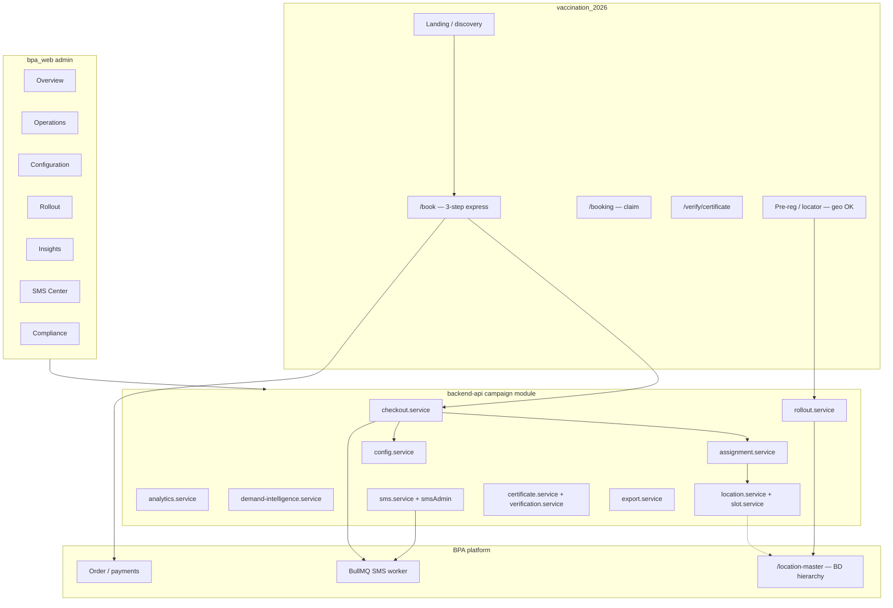
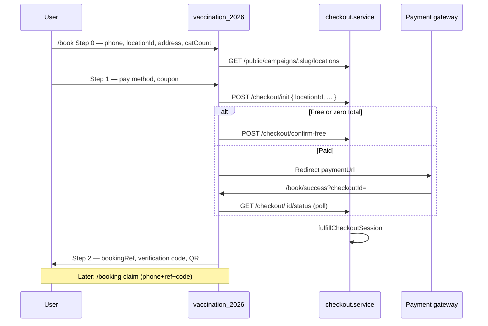

# BPA Vaccination Campaign V2 — Master Architecture Plan

**Version:** 2.0 (architecture only)  
**Date:** 2026-06-04  
**Status:** Planning — **no implementation** in this document  
**Authority:** Canonical target-state architecture; supersedes fragmented V1 IA where this doc is explicit.

**Workspaces:**

| Role | Path |
|------|------|
| Backend API | `D:\BPA_Data\backend-api` |
| Admin Web (WowDash) | `D:\BPA_Data\bpa_web` |
| Public site & booking | `D:\BPA_Data\vaccination_2026` |

**Standards:** `docs/BPA_STANDARD.md` — fixed ports (API 3000, Next.js 3100–3105), WowDash patterns, non-destructive Prisma, update-only patches when executing.

---

## 0. Reference corpus (read order)

| Pack | Path | Role in V2 |
|------|------|------------|
| Campaign audit & phases | `docs/campaign-redesign/master-plan.md` | V1 problems, R1–R6 phases, capacity options |
| Admin sidebar IA | `docs/campaign-redesign/admin-redesign-report.md` | Target admin navigation |
| Booking location picker | `docs/campaign-redesign/location-migration-report.md` | V2 public Step 1 |
| Analytics / exports / SMS (partial ship) | `docs/campaign-redesign/analytics-export-report.md` | V1.5 baseline; V2 completes gaps |
| Config engine | `docs/campaign-config/implementation-plan.md`, `implementation-report.md` | Settings source of truth |
| Location platform audit | `docs/location-rollout/01-location-audit.md`, `location-usage-matrix.md` | BD geo vs campaign site vs inventory |
| Location master migration | `docs/location-system-migration/*` | `location-master`, `CoverageZone`, coverage assignments |
| Vaccination design (historical) | `docs/vaccination-campaign-2026/*` | Business reqs; mark OTP 7-step as HISTORICAL |

---

## 1. Executive summary

### 1.1 What V2 is

V2 is **not a greenfield rewrite**. The 2026 campaign module is **functionally complete** for a Bangladesh pilot. V2 **consolidates duplicate surfaces**, **retires legacy paths behind flags**, **unifies capacity and location semantics**, and **finishes partially wired lifecycles** (SMS, audit, stats, exports) so nationwide operations do not drift.

### 1.2 V2 north-star

```text
One booking path  ·  One config brain  ·  One demand hub  ·  One insights layer
One SMS pipeline  ·  One certificate surface  ·  One export center  ·  One venue model
```

### 1.3 Current maturity (V1 snapshot)

| Area | Maturity | V2 action |
|------|----------|-----------|
| Express checkout (3-step) | Shipped | **Canonical**; gate legacy OTP |
| Campaign config engine | Shipped (`CampaignConfig`) | **Canonical**; merge Campaign duplicate fields |
| National rollout + pre-reg | Shipped | Keep; fold duplicate demand UIs |
| Demand intelligence API | Shipped | **Canonical** demand analytics |
| Admin analytics + exports (CSV/XLSX/PDF) | Partial (see analytics-export-report) | Extend + unify under Insights |
| SMS Center + bulk SMS | Partial | Complete lifecycle + budget |
| Certificates + verify | Partial | Merge admin UI; harden PDF delivery |
| Location picker (public) | Planned only | **Implement** per location-migration-report |
| Legacy OTP booking + 7-step UI | Dormant / routed | **Retire** (410 when flag off) |
| Reports JSON dump / 18 admin tabs | Shipped but poor UX | **Merge / retire** per §4 |

### 1.4 Strategic decisions (must lock before build)

| # | Decision | Recommendation |
|---|----------|----------------|
| D1 | Capacity model | **Option C (hybrid):** slot/region `bookedCount` += `petCount`; walk-ins count toward slot; flag `CAMPAIGN_CAPACITY_MODEL=pet-aware` |
| D2 | Canonical booking API | **Express only** (`checkout/init` → pay/confirm-free → fulfill); legacy `POST /campaign/booking/` gated |
| D3 | Public location selection | **`locationId` on checkout**; geo dropdowns removed from `/book` Step 1; rollout geo kept for pre-reg/locator only |
| D4 | “Coverage zone” in analytics | Rename UI to **Rollout regions** until `CoverageZone` wired; optional phase-2 grouping |
| D5 | Admin shell | **Left sidebar** + `campaigns/[id]/layout.tsx`; deprecate `CampaignNav` tabs |
| D6 | Payment routing | Per-request `paymentMethod` → provider strategy; env default as fallback |
| D7 | Country scope | Add nullable `Campaign.countryId`; BD remains default; align with Global-Ready principle |

---

## 2. System context (V2)



---

## 3. Module analysis

### 3.1 Duplicate modules (same data, multiple surfaces)

| Duplicate cluster | V1 locations | V2 resolution |
|-------------------|--------------|---------------|
| **Operational KPIs** | Dashboard, Statistics, Reports (`/stats`, `/vaccination-stats`) | **Insights › Overview** — single loader; Reports tab = formatted views + export actions |
| **Demand geography** | `demand-intelligence`, `rollout-reports`, pre-reg “Area demand” JSON, analytics “coverage zone” (rollout regions) | **Rollout › Demand map** (canonical API: `demand-intelligence`); retire rollout-reports route |
| **Location booking counts** | `getCampaignStats.byLocation`, `analytics.getBookingsByLocation`, `location.getLocationStats` | **analytics.service** for dashboards; stats service delegates or drops duplicate |
| **Revenue / payments** | Analytics `paymentAnalytics`, Pricing page estimate, Reports JSON | **Analytics › Revenue** only; pricing fields live in **Settings** |
| **Certificate lookup** | `certificates/page`, `verification/page` | **Operations › Certificates** (tabs: Issued · Verify · Logs) |
| **Campaign settings** | `edit`, `pricing`, `Campaign` fields + `CampaignConfig` | **Configuration › Settings / Slug / Booking controls**; sync policy in §6.1 |
| **BD geo reads** | `location-master`, `/common/bd/*`, `/locations/*`, `/campaign/public/rollout/divisions…` | Campaign **admin rollout** uses **location-master** labels; booking uses **location list API**; rollout CRUD keeps IDs |
| **SMS logging** | `CampaignSmsLog` vs `NotificationDelivery` | **Keep both** — campaign SMS stays on `CampaignSmsLog`; do not route campaign OTP/booking through generic Notification model |
| **Success / view booking** | `StepSuccess`, `/book/confirm/[ref]`, `/booking/[ref]` session | **Canonical:** wizard success + **server claim** API for `/booking/[ref]`; retire OTP confirm for express |
| **Payment fulfillment** | `fulfillCheckoutFromOrder` vs legacy webhook booking path | Express path only for new bookings |

### 3.2 Legacy modules (keep code, remove from product path)

| Module / route | Path | V2 status |
|----------------|------|-----------|
| OTP 7-step wizard components | `vaccination_2026/components/booking/steps/StepOtp`, `StepClinic`, … | **RETIRE** from nav; code behind `CAMPAIGN_LEGACY_UI=false` |
| `POST /api/v1/campaign/booking/` | `booking.service.createBooking` | **RETIRE** default off (`CAMPAIGN_LEGACY_BOOKING_ENABLED=false` → 410) |
| `/book/payment`, `/book/confirm/[ref]` | vaccination_2026 | **RETIRE** for express; redirect to `/book/success?checkoutId=` |
| `/booking/list` (OTP my bookings) | vaccination_2026 | **RETIRE** or bridge after account linking phase |
| Admin `/statistics`, `/rollout-reports`, `/pricing`, `/verification` | bpa_web | **REDIRECT** to V2 routes (§4) |
| Admin `/vaccinations` | bpa_web | **RETIRE** redirect (already → statistics) |
| `CampaignNav` 18 tabs | bpa_web | **RETIRE** after sidebar ships |
| `requireCampaignAdminOrStaff` unused middleware | backend | **WIRE** to staff export/report routes or remove export |
| Synthetic audit page | bpa_web `audit/page` | **REPLACE** with `CampaignAuditLog` API |
| Docs: `PREMIUM-NATIONAL-CAMPAIGN-EXPERIENCE`, 7-step BOOKING-FLOW-REPORT | vaccination_2026 docs | **HISTORICAL** banners |

### 3.3 Modules to merge

| Merge into | Absorb from | Outcome |
|------------|-------------|---------|
| **Insights hub** | Statistics + Reports + Dashboard KPI strip | One `/insights` with sub-tabs; dashboard = overview only |
| **Exports center** | Reports JSON download + per-page export buttons | `/exports` + shared `campaignExportActions`; audit on export |
| **SMS Center** | Static `smsTemplates.ts` + scattered admin SMS routes | Tabs: Templates · Log · Cost · Bulk · Health |
| **Certificates** | certificates + verification pages | Single route, two modes |
| **Configuration** | edit + pricing + config form fields | `settings`, `settings/slug`, `settings/booking` |
| **Venues** | locations + slots pages | Optional unified page with slot drawer; or sidebar siblings (V2 keeps siblings) |
| **Demand** | demand-intelligence + rollout-reports + pre-reg area JSON | demand-intelligence UI + pre-reg/waiting tabs only |
| **assignment.service** | Inline geo resolve in checkout when `locationId` set | Thin wrapper: `locationId` → region → slot |

### 3.4 Modules to retire (product-facing)

| Retire | Replacement |
|--------|-------------|
| Admin horizontal `CampaignNav` | `CampaignSidebar` + `campaignAdminNavConfig.ts` |
| `GET .../rollout/reports/demand` as primary UI | `GET .../demand-intelligence` |
| Reports page raw `<pre>` JSON | Insights tables + Exports |
| Division/District/Upazila on `/book` Step 1 | `GET .../public/campaigns/:slug/locations` + `LocationPicker` |
| Client-only `/booking/[ref]` | `GET` booking by claim token or ref+code session |
| `Pricing` admin route | Settings › Commercial |
| `Statistics` admin route | Insights › Trends |
| Fundraising/Pricing/Recall “Campaign” naming in user docs | Glossary disambiguation in admin UI labels only |

### 3.5 Modules to keep (canonical V2)

| Module | Responsibility |
|--------|----------------|
| `checkout.service` + `checkout.controller` | Payment-first booking |
| `claim.service` | Post-booking lookup |
| `config.service` | Runtime toggles + history |
| `analytics.service` | Payment, location, rollout-region aggregates |
| `demand-intelligence.service` | Forecasting, heatmaps, capacity guidance |
| `rollout.service` | Phases, regions, pre-reg, notify |
| `location.service` + `slot.service` | Venue CRUD, capacity, slots |
| `export.service` | CSV/XLSX/PDF downloads |
| `sms.service` + `smsAdmin.service` | Templates, queue, bulk, cost |
| `certificate.service` + `verification.service` | Cert data, PDF, public verify |
| `vaccination.service` | Record vax, stats, completion SMS |
| `staff.service` | Venue RBAC |
| `discovery.service` | Locator, schedule, live stats (non-booking) |
| `campaign.smsQueue` + gateway integrations | Delivery |

---

## 4. Target information architecture (admin)

### 4.1 Global admin

Unchanged: single **Campaigns** entry in `permissionMenu.ts` → list → enter campaign workspace.

### 4.2 Campaign workspace (V2 routes)

**12 primary routes** (down from 21), with **legacy redirects**.

```text
/admin/campaigns/[id]/
├── (layout: CampaignSidebar + CampaignShellHeader)
├── page.tsx                          → Overview
├── insights/
│   ├── page.tsx                      → KPIs + trends (absorbs statistics)
│   ├── daily/page.tsx                → Daily summary (optional sub-route)
│   └── vaccinations/page.tsx         → Vaccine mix / pet status
├── analytics/page.tsx                → Revenue, payment split, locations, regions
├── exports/page.tsx                  → Download center (all resources × formats)
├── operations/
│   ├── bookings/page.tsx               → List + detail + export
│   ├── staff/page.tsx
│   └── certificates/page.tsx         → Issue | Verify | Logs
├── configuration/
│   ├── settings/page.tsx             → Campaign + commercial fields
│   ├── settings/slug/page.tsx
│   ├── settings/booking/page.tsx     → CampaignConfig + history
│   ├── locations/page.tsx            → Location management
│   └── slots/page.tsx                → Slot management
├── rollout/
│   ├── phases/page.tsx               → Phases + regions (merge current rollout)
│   ├── pre-registrations/page.tsx
│   └── demand/page.tsx               → demand-intelligence (rename from demand-intelligence path)
├── sms/page.tsx                      → SMS Center (tabs)
└── audit/page.tsx                    → CampaignAuditLog
```

### 4.3 Redirect map (V1 → V2)

| V1 path | V2 path |
|---------|---------|
| `/edit`, `/pricing` | `/configuration/settings` |
| `/statistics` | `/insights` |
| `/reports` | `/insights` + `/exports` |
| `/demand-intelligence` | `/rollout/demand` |
| `/rollout-reports` | `/rollout/demand` |
| `/verification` | `/operations/certificates?tab=verify` |
| `/vaccinations` | `/insights/vaccinations` |

### 4.4 Target navigation (sidebar)

Aligned with `admin-redesign-report.md`:

| Group | Items | Icon intent |
|-------|-------|-------------|
| *(top)* | Overview | Dashboard |
| **Operations** | Bookings, Staff, Certificates | Ops |
| **Configuration** | Campaign Settings, Slug Editor, Booking Controls, Locations, Slots | Settings / map / clock |
| **Rollout** | Phases & regions, Pre-registrations, Demand map | Globe / users / chart |
| **Insights** | Analytics, Insights (KPIs), Exports | Chart / report / download |
| **Communications** | SMS Center | Message |
| **Compliance** | Audit log | History |

**Rules:**

- No duplicate top-level entries for Statistics, Reports, Pricing, Rollout demand, Verification.
- Export actions may appear on Bookings and Analytics pages but call **shared export helpers** (same endpoints).
- `campaignAdminGetConfig` loaded only on **Booking Controls**; general settings PATCH updates `Campaign` row.

---

## 5. Target booking flow (public)

### 5.1 Canonical journey (V2)



### 5.2 Step contract

| Step | UI | Required fields | API |
|------|-----|-----------------|-----|
| 0 — Details | `LocationPicker` + contact | `phone`, `locationId`, `fullAddress`, `catCount` | `GET .../locations`; config from `GET .../campaigns/:slug` |
| 1 — Pay | `StepPayDirect` | `paymentMethod` if paid; coupon | `POST .../checkout/init` |
| 2 — Done | `StepSuccess` | — | `confirm-free` or poll status |

**Removed from Step 0:** `divisionId`, `districtId`, `upazilaId` dropdowns.

**Still uses BD geo (intentionally):** pre-reg (`PreRegisterSection`), locator, schedule — not checkout.

### 5.3 Server selection rules (`locationId`)

When `locationId` present on `checkout/init`:

1. Validate location belongs to campaign and `isActive`.
2. Resolve `rolloutRegionId` from location’s linked region or `addressJson` match.
3. `checkAreaActive` uses region, not user-picked upazila.
4. `findNextAvailableSlot(locationId)` — no auto-pick alternate venue without admin policy.
5. Persist `ownerAddressJson` with `locationId`, `locationName`, optional legacy geo for back-compat.

When `area` legacy payload sent (flag period): ignore if `locationId` set; else current assignment path.

### 5.4 Post-booking

| Flow | V2 behavior |
|------|-------------|
| Claim | `POST /public/booking/claim` — **canonical** “my booking” |
| Deep link | `GET /public/booking/:ref` with short-lived claim session or signed token (new) |
| OTP my bookings | Retired unless legacy flag on |
| Payment retry | Resume via `checkoutId` on `/book/success` (new); deprecate `/book/payment?ref=` |

### 5.5 Config-driven UX (from `CampaignConfig`)

Public UI reads merged config on campaign payload:

- `bookingEnabled`, `bookingStartAt` / `bookingEndAt`, `countdownEnabled`
- `onlinePaymentEnabled`, `payAtVenueEnabled`
- `maxCatsPerBooking`, `showRemainingSlots`
- `slotRequired` (express still auto-assigns slot server-side)

### 5.6 Documentation reconciliation

| Document | V2 status |
|----------|-----------|
| `booking-flow-simplification-plan.md` | **Canonical** |
| `location-migration-report.md` | **Canonical** for Step 1 |
| `PREMIUM-NATIONAL-CAMPAIGN-EXPERIENCE.md` | **HISTORICAL** |
| vaccination_2026 `BOOKING-FLOW-REPORT.md` (7-step) | **HISTORICAL** |
| Landing copy mentioning “SMS OTP” for booking | Update to “verification code” / express |

---

## 6. Target campaign admin structure

### 6.1 Configuration layer (single brain)

| Layer | Store | Admin UI | Consumers |
|-------|-------|----------|-----------|
| **Identity & schedule** | `Campaign` row | Settings | Public slug, dates, status, visibility |
| **Commercial** | `Campaign.pricingType`, `priceAmount` | Settings | checkout, analytics |
| **Runtime rules** | `CampaignConfig` | Booking Controls | checkout, booking, staff |
| **History** | `CampaignConfigHistory` | Booking Controls › History table | Audit |
| **Venues** | `CampaignLocation`, `CampaignSlot` | Locations, Slots | assignment, analytics |
| **Rollout** | `CampaignRolloutPhase`, `CampaignRolloutRegion` | Rollout | area gating, demand |
| **National demand** | Pre-reg + bookings + intelligence service | Demand map | ops planning |

**Sync policy (V2):** On `PATCH /campaigns/:id`, mirror defined fields into `CampaignConfig` where duplicated (`maxPetsPerBooking` ↔ `maxCatsPerBooking`, walk-in flags). On create, keep current auto-config seed.

### 6.2 Operations layer

| Surface | V2 capabilities |
|---------|-----------------|
| Bookings | Filters (status, date, location), pagination, row → detail drawer, export CSV/XLSX/PDF |
| Staff | User picker (new), role matrix, location scope |
| Certificates | List from bookings, verify panel, PDF download, verification audit |

### 6.3 RBAC (V2 target)

| Actor | Access |
|-------|--------|
| Platform admin | `campaign.manage` — full workspace |
| Campaign staff | `requireCampaignStaff(permission)` per route; **`canExportData`** enforced on export endpoints |
| Read-only admin | Implement `campaign.view` (design doc) — Insights + Demand read-only |

---

## 7. Target analytics structure

### 7.1 Layering (avoid duplicate loaders)

```text
Insights (operational)          Analytics (commercial + geographic)     Demand (predictive)
─────────────────────         ─────────────────────────────────      ───────────────────
GET /stats                    GET /analytics                         GET /demand-intelligence
GET /vaccination-stats        paymentAnalytics                       heatmaps, forecast
GET /daily-summary              bookingsByLocation                     capacity guidance
  show rate, walk-ins, queue      bookingsByRolloutRegion*             pre-reg funnel
  byDay vaccinations (fix stubs)  topLocations, paymentSplit
```

\*Rename in API/UI from `bookingsByCoverageZone` → `bookingsByRolloutRegion` in V2.1 to reduce confusion with `CoverageZone` table.

### 7.2 Analytics page sections (V2)

| Section | Metrics | Source |
|---------|---------|--------|
| **Revenue** | Expected revenue, collected revenue, revenue (alias) | `paymentAnalytics` |
| **Payment split** | ONLINE / VENUE / PENDING counts & BDT | `paymentSplit[]` |
| **Bookings by location** | Bookings, cats, daily capacity | `bookingsByLocation` |
| **Bookings by rollout region** | Division/district/city, target vs booked | `bookingsByCoverageZone` → rename |
| **Top venues** | Bookings, cats, vaccinations | `topLocations` |
| **Export** | CSV, XLSX, PDF | `GET .../analytics/export` |

### 7.3 Insights hub sections (merged Statistics + Dashboard)

| Tab | Content |
|-----|---------|
| **Overview** | KPI widgets, booking trend (Apex), today snapshot |
| **Trends** | `CampaignTrendChart` + period selector (new) |
| **Daily** | `GET /daily-summary?date=` — table + export |
| **Vaccinations** | Donut + by-type table (`vaccination-stats`) |

**Fix in V2:** Implement stub fields in `getCampaignStats` / `getDailySummary` (walk-ins, queue, byDay vax, show rate).

### 7.4 Demand intelligence (separate product surface)

Keep **`demand-intelligence.service`** as the **only** forecasting/heatmap engine.

| UI block | Data |
|----------|------|
| Summary KPIs | Pre-reg, bookings, projected demand |
| Heatmap | District/city (area text-only until coords) |
| District ranking | Scores, gaps |
| Capacity recommendations | Top 20 districts |
| Export | XLSX multi-sheet (V2 phase) |

Do **not** duplicate in rollout-reports or raw JSON tabs.

---

## 8. Target SMS structure

### 8.1 Single pipeline (no second system)

```text
sms.service (templates + sendCampaignSms)
  → campaign.smsQueue → BullMQ notif_sms → gateway (SSL / BulkSMS / mock)
  → CampaignSmsLog (+ cost on log)
```

OTP **must** write `CampaignSmsLog` in V2 (template `CAMPAIGN_OTP`).

### 8.2 SMS Center (admin)

| Tab | Backend | V2 enhancements |
|-----|---------|-----------------|
| **Templates** | `CampaignSmsTemplate` CRUD + system defaults | Editor, test send, version note |
| **Delivery log** | `GET .../sms/logs` | Filters, pagination |
| **Cost** | `GET .../sms/cost-summary` | Budget bar vs `CampaignConfig.smsMonthlyBudgetBdt` (new field) |
| **Bulk** | `POST .../sms/bulk` | Audience filters, dry-run, cap 500/recipient |
| **Health** | `GET /public/sms/health`, recover-stuck | Link + ops runbook |

### 8.3 Event matrix (V2 — all wired)

| Template | Trigger |
|----------|---------|
| `BOOKING_CONFIRMED` | fulfill / legacy webhook (legacy gated) |
| `VACCINATION_COMPLETE` | per pet completed |
| `BOOKING_CANCELLED` | cancel handlers |
| `NO_SHOW` | markNoShow |
| `REMINDER_24H`, `REMINDER_2H` | BullMQ cron |
| `BOOKING_RESCHEDULED` | reschedule (new) |
| `ANNOUNCEMENT` | bulk + admin broadcast |
| `CAMPAIGN_OTP` | OTP request (logged) |
| Pre-reg open | `CampaignSmsTemplate` lookup (not hardcoded) |

### 8.4 Retire / avoid

- Hardcoded-only admin template page (`smsTemplates.ts` as sole source).
- Pre-reg SMS bypassing template service.
- Parallel admin “notification” composer for campaign messages.

---

## 9. Target certificate structure

### 9.1 Data model (unchanged tables, clearer roles)

| Artifact | Storage | Purpose |
|----------|---------|---------|
| `CampaignBooking.qrToken` | Booking | Venue check-in QR |
| `bookingRef` + verification code | Derived from qrToken | Claim / SMS |
| `CampaignPet.certificateToken` | Per pet | Short cert URL |
| `Vaccination.certificateToken` | Permanent clinical record | BPA app history |

### 9.2 Public surfaces

| Route | V2 behavior |
|-------|-------------|
| `GET /public/certificates/:token` | JSON + QR base64 |
| `GET /public/certificates/:token/pdf` | **`Content-Type: application/pdf`** attachment (V2 — today often base64 JSON) |
| `GET /public/verify/:token` | Human-friendly verify page contract (V2 web) |

### 9.3 Admin Certificates (merged)

| Tab | Function |
|-----|----------|
| **Issued** | Search completed bookings, PDF links |
| **Verify** | Token lookup via verify API |
| **Logs** | `CampaignAuditLog` + verification stats endpoint (wire `getVerificationStats`) |

### 9.4 V2 enhancements

- Revocation flag on `CampaignPet` / audit event (schema additive).
- Reissue certificate admin action.
- Bengali PDF template (phase).
- Single verify URL constant across sms, pdf, qr services.
- Validate QR HMAC on scan (defense in depth).

### 9.5 Retire

- Duplicate PDF routes confusion (`campaignLink` vs `campaign.routes`) — document one canonical path.
- `/book/confirm/[ref]` OTP certificate view for express users.

---

## 10. Target exports structure

### 10.1 Export center (admin)

| Resource | Formats | Endpoint pattern |
|----------|---------|------------------|
| Bookings | CSV, XLSX, PDF | `GET .../bookings/export` |
| Analytics bundle | CSV, XLSX, PDF | `GET .../analytics/export` |
| Vaccinations | CSV, XLSX | `GET .../vaccinations/export` (V2) |
| SMS logs | CSV | `GET .../sms/export` (V2) |
| Audit log | CSV | `GET .../audit/export` (V2) |
| Pre-registrations | CSV, XLSX | `GET .../pre-registrations/export` (V2) |
| Demand intelligence | XLSX multi-sheet | `GET .../demand-intelligence/export` (V2) |
| Payments | CSV | `GET .../payments/export` (V2) |

### 10.2 Cross-cutting rules

- Shared **`campaignExportFormats`** utility (CSV UTF-8 BOM, ExcelJS, PDF summary).
- **`canExportData`** or `campaign.manage` on all export routes.
- **`CampaignAuditLog`** entry on each export (`entityType: Export`).
- Async job for >25k rows → MinIO + email link (V2.2).

### 10.3 Retire

- Reports page JSON `<pre>` as primary operator output.
- Client-side-only “export” from certificate list without audit.

---

## 11. Target demand intelligence structure

### 11.1 Canonical service

**`demand-intelligence.service.ts`** — only engine for:

- District/city/area demand scores
- 7-day velocity, 30-day projection
- Capacity gap recommendations
- Public heatmap subset (`discovery`)

### 11.2 Feeds

| Input | Use |
|-------|-----|
| `CampaignPreRegistration` | Pre-reg counts, waiting list |
| `CampaignBooking` + `ownerAddressJson` | Booking geo (string match to BD master) |
| `CampaignRolloutRegion` | Targets, `bookedCount` |
| `Campaign.pricing` | Revenue projection |

### 11.3 Retire as standalone UI

- `rollout-reports` page
- Pre-registrations “Area demand” raw JSON tab → table components from same API as demand map

### 11.4 Future (location-system-migration)

- Wire **`CoverageZone`** for grouping locations in picker badges and demand filters (phase 2).
- Use **`location-master`** for admin rollout region labels (replace duplicate `listBdDivisions` in campaign module).

---

## 12. Target rollout & location management

### 12.1 Concepts (disambiguation)

| Concept | Model | Admin | Public booking |
|---------|-------|-------|----------------|
| **BD hierarchy** | `bd_divisions` … `bd_areas` | Rollout region picker (via location-master) | Pre-reg, locator only |
| **Campaign location (venue)** | `CampaignLocation` | Locations CRUD | **LocationPicker** |
| **Rollout region** | `CampaignRolloutRegion` | Rollout phases/regions | Gates booking via region capacity |
| **Coverage zone (platform)** | `coverage_zones` | Future: zone admin | Optional badge on location cards |
| **Inventory location** | `InventoryLocation` | **Not campaign** — rename in docs |

### 12.2 Location management (admin)

| Capability | V2 |
|------------|-----|
| CRUD venues | Keep `location.service` |
| Link region ↔ location | `rolloutRegion.locationId` + picker |
| Per-location stats | Row action → `GET /locations/:id/stats` drawer |
| Slot management | Sibling route or drawer; bulk create, close |
| Map / coords | Optional `lat/lng` on location (existing fields) |

### 12.3 Rollout management (admin)

| Capability | V2 |
|------------|-----|
| Create phase | Wire `POST /rollout/phases` (missing in V1 UI) |
| Region CRUD | Keep; geo from location-master |
| Notify pre-reg | Template-based SMS |
| Demand map | demand-intelligence route under `/rollout/demand` |

### 12.4 Public location API (new)

```
GET /api/v1/campaign/public/campaigns/:slug/locations
→ [{ id, name, address, remainingCapacity, bookingCount, nextSlot?, isActive }]
```

Implementation per `location-migration-report.md` phases L1–L4.

---

## 13. Backend module map (V2)

| File / area | V2 role |
|-------------|---------|
| `checkout.service.ts` | Canonical booking creation |
| `assignment.service.ts` | `locationId`-first assignment |
| `booking.service.ts` | Staff ops, walk-in; legacy create gated |
| `claim.service.ts` | Public claim + future account link |
| `config.service.ts` | Config brain |
| `analytics.service.ts` | Commercial + geographic analytics |
| `export.service.ts` | All file exports |
| `demand-intelligence.service.ts` | Demand only |
| `rollout.service.ts` | Rollout + pre-reg (no duplicate demand reports) |
| `location.service.ts` / `slot.service.ts` | Venues |
| `sms.service.ts` / `smsAdmin.service.ts` | SMS |
| `certificate.service.ts` / `verification.service.ts` | Certs |
| `campaign.service.ts` | CRUD + stats (stubs fixed) |
| `otp.service.ts` | Legacy + OTP logged to SMS log |
| `payment.service.ts` | Per-method routing (V2) |
| `discovery.service.ts` | Marketing only |

**New / thin modules (V2):**

- `campaignLocations.public.service.ts` — bookable location list (optional extract from rollout/location).
- `campaignAudit.service.ts` — list/filter audit log.
- `sms.broadcast.service.ts` — generalize bulk SMS filters.

---

## 14. Frontend map (V2)

### 14.1 bpa_web

| Area | V2 |
|------|-----|
| `campaigns/[id]/layout.tsx` | Sidebar shell |
| `campaignAdminNavConfig.ts` | IA config |
| `CampaignSidebar`, `CampaignShellHeader` | Nav |
| Split `CampaignForm` | Settings / slug / booking field groups |
| `Insights/*`, `exports`, `SmsCenterPanel` | Consolidated surfaces |
| Deprecate `CampaignNav` | Redirects |

### 14.2 vaccination_2026

| Area | V2 |
|------|-----|
| `LocationPicker.tsx` | New Step 0 |
| `BookingWizard.tsx` | `locationId` in init payload |
| Remove geo from `StepContactArea` | |
| `/book/success` | Canonical return |
| `/booking/[ref]` | Server-backed fetch |
| Archive legacy steps | Feature flag |
| i18n pass on booking/payment/verify | Bangla-first |

---

## 15. Data & platform alignment

### 15.1 Schema additions (additive only)

| Change | Purpose |
|--------|---------|
| `Campaign.countryId` nullable FK | Global-ready |
| `CampaignConfig.smsMonthlyBudgetBdt` | SMS budget |
| Optional `CampaignPet.revokedAt` | Cert revocation |
| Indexes: partial open slots, phone+date | Performance |
| `campaign_bookings_archive` | Retention (later) |

### 15.2 Capacity triggers

Migrate triggers to **pet-aware** counts when D1 = Option C; run `scripts/reconcile-campaign-counts.ts` before cutover.

### 15.3 Location platform

Campaign module **consumes** `location-master` for admin geo labels; does **not** duplicate BD hierarchy APIs long term.

`CoverageZone` integration per `location-system-migration/coverage-area-design.md` — phase 2 for campaign.

---

## 16. V2 phased delivery

Aligned with `master-plan.md` R1–R6; grouped for architecture communication.

| Phase | Name | Outcomes |
|-------|------|----------|
| **V2.0** | Foundation | Capacity flag, legacy booking 410, audit log API, cron checkout expiry + SMS reminders, Redis rate limits |
| **V2.1** | Admin shell | Sidebar layout, redirects, Settings/Slug/Booking split, Insights merge, real audit page |
| **V2.2** | Booking location | Public locations API, LocationPicker, `locationId` checkout, docs updated |
| **V2.3** | SMS complete | Lifecycle events, template CRUD, budget, bulk filters, OTP logging |
| **V2.4** | Exports & insights | Stub stats fixed, all export endpoints, async large exports, PDF cert attachment |
| **V2.5** | Demand & rollout | Retire rollout-reports, location-master labels, create-phase UI, demand export |
| **V2.6** | Payments & hardening | Per-method gateway, refunds admin, pay-at-venue staff, webhooks, claim persistence |

**Already landed (treat as V1.5):** Config engine, analytics API, booking/analytics export, SMS Center tabs, bulk SMS basic — see `analytics-export-report.md`.

---

## 17. Success criteria (V2 complete)

- [ ] One active public booking path; legacy OTP returns 410 by default.
- [ ] Admin campaign workspace ≤12 primary routes with sidebar; no Statistics/Reports/Pricing/Verification duplicates.
- [ ] Public Step 1 uses LocationPicker; no Div/Dist/Upz on `/book`.
- [ ] `CampaignConfig` is loaded and edited on Booking Controls; history visible.
- [ ] Analytics + Insights + Exports each have distinct role; no duplicate `/stats` loaders on one page.
- [ ] SMS cancel/no-show/reminders fire; OTP in `CampaignSmsLog`; bulk SMS with audit.
- [ ] Certificates admin merged; PDF downloads as attachment; verify route stable.
- [ ] Demand map is sole demand dashboard; rollout-reports redirected.
- [ ] `canExportData` enforced; exports write audit rows.
- [ ] Capacity model documented and reconciled; walk-ins counted.
- [ ] Canonical docs: this plan + simplification plan + location migration; historical banners on OTP docs.

---

## 18. Risk register (architecture level)

| Risk | Mitigation |
|------|------------|
| Production booking break on location migration | `locationId` optional + `area` back-compat; feature flag `CAMPAIGN_LOCATION_PICKER_REQUIRED` |
| Capacity migration miscounts | Read-only reconcile script; phased flag |
| Multi-instance rate limits | Redis-backed limits (V2.0) |
| Operator confusion during redirect | 30-day dual URLs + in-app notice |
| `Campaign` vs `CampaignConfig` drift | PATCH sync policy + validation single source in services |
| Naming collision with FundraisingCampaign | Admin UI always says “Vaccination Campaign” |

---

## 19. Document governance

| Document | After V2 plan |
|----------|---------------|
| **`docs/campaign-v2/master-architecture-plan.md`** | **This file — canonical V2 architecture** |
| `docs/campaign-redesign/master-plan.md` | V1 audit + R phases; reference for bug IDs |
| `docs/campaign-redesign/admin-redesign-report.md` | Admin UI implementation spec |
| `docs/campaign-redesign/location-migration-report.md` | Public booking implementation spec |
| `docs/campaign-config/*` | Config engine as-built |
| `docs/location-rollout/*` | Platform geo audit (cross-cutting) |
| `docs/location-system-migration/*` | BD master + CoverageZone future |

When V2 phases ship, update `docs/vaccination-campaign-2026/IMPLEMENTATION_PROGRESS.md` with phase checklist tied to §16.

---

*End of master architecture plan — planning only, no code modified.*
