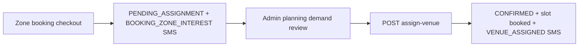

# Zone-Interest Booking — Implementation Report

**Date:** 2026-06-04  
**Projects:** `backend-api`, `vaccination_2026`, `bpa_web`

---

## Summary

Vaccination booking is converted from **venue-first** (campaign location + date + slot) to **zone-interest** (coverage zone + BdArea/booking area). Venue, date, and time are assigned later by BPA staff; customers are notified by **SMS**.

**Campaign locations are not removed** — they remain in Location Master for admin assignment and legacy venue-based flows.

---

## Business rule

| Phase | Customer | BPA |
|-------|----------|-----|
| Booking | Select **zone** + **area**, cats, mobile, payment | Collect demand |
| Planning | — | View zone/area demand (analytics only; no auto-venues) |
| Assignment | — | Pick existing **location** + **slot** |
| Notification | Receive SMS with venue, date, time | `VENUE_ASSIGNED` template |

Bookings close before campaign scheduling; scheduling happens after interest collection.

---

## Phase 1 — Booking flow (vaccination_2026)

| Before | After |
|--------|--------|
| `LocationPicker` + date/slot | `ZoneAreaPicker` (zone + BdArea chips) |
| `campaignLocationId` + `slotId` checkout | `coverageZoneId` + `bdAreaId` + `bookingArea` |
| Draft `bpa_booking_draft_v5` | `bpa_booking_draft_v6` |

**Touch points:**

- `components/booking/ZoneAreaPicker.tsx` (new)
- `components/booking/steps/StepBookingDetails.tsx`
- `components/booking/BookingWizard.tsx`
- `components/booking/steps/StepSuccess.tsx` — pending-assignment copy
- `lib/bookingTypes.ts`, `lib/bookingValidation.ts`, `lib/campaignApi.ts`

**Public APIs used:**

- `GET /api/v1/campaign/public/coverage-zones`
- `GET /api/v1/campaign/public/coverage-zones/:zoneId/bd-areas`
- `POST /api/v1/campaign/public/checkout/init` (zone path)

---

## Phase 2 — Booking data (backend-api)

**Schema** (`prisma/migrations/20260604180000_zone_interest_booking/`):

| Field / enum | Purpose |
|--------------|---------|
| `CampaignBookingMode` (`VENUE`, `ZONE_INTEREST`) | Booking type |
| `CampaignBookingStatus.PENDING_ASSIGNMENT` | Awaiting venue |
| `locationId`, `slotId` nullable | No venue at interest time |
| `coverageZoneName`, `bdAreaId` | Denormalized zone/area |
| Existing `coverageZoneId`, `bookingArea` | Retained |

**Checkout persist** (`checkout.service.ts` → `fulfillCheckoutSession`):

- `coverageZoneId`, `coverageZoneName`, `bdAreaId`, `bookingArea`
- `petCount` (cats), `ownerPhone` (mobile), `paymentMethod` in session
- `bookingMode: ZONE_INTEREST`, `status: PENDING_ASSIGNMENT`
- `locationId` / `slotId` null until assignment

**Validation:** `zoneInterest.service.ts` + `coverageAdmin.service.ts` (`isBdAreaInCoverageZone`).

---

## Phase 3 — Admin analytics

**Service:** `analytics.service.ts`

| Metric | Function |
|--------|----------|
| Bookings by zone | `getBookingsByCoverageZone` |
| Bookings by area | `getBookingsByBdArea` (new) |
| Cats by zone / area | Derived in `getCampaignAnalyticsDashboard` |
| Revenue by zone / area | Same dashboard |

**UI:** `CampaignOperationsCenter.tsx` — added BdArea table; existing zone table retained.

**API:** `GET /api/v1/campaign/admin/campaigns/:campaignId/analytics`

---

## Phase 4 — Campaign planning (analytics only)

**Service:** `planning.service.ts` → `getCampaignPlanningDashboard`

- Top zones, top areas, demand ranking
- Expected cats / expected revenue (unit price × cats)
- **Does not** create venues or slots

**API:** `GET /api/v1/campaign/admin/campaigns/:campaignId/planning`

---

## Phase 5 — SMS assignment workflow

| Step | Endpoint / function |
|------|---------------------|
| Interest SMS | `sendZoneInterestConfirmation` — template `BOOKING_ZONE_INTEREST` |
| Assign venue | `POST /api/v1/campaign/admin/bookings/:bookingId/assign-venue` |
| Assignment SMS | `sendVenueAssignmentSms` — template `VENUE_ASSIGNED` |

**Service:** `zoneAssignment.service.ts`

---

## Phase 6 — Admin UI

| Route | Component |
|-------|-----------|
| `/admin/campaigns/[id]/planning` | `CampaignPlanningPanel.tsx` |
| Nav | `campaignAdminNavConfig.ts` — “Campaign Planning” |

Shows: pending assignment count, top zones/areas, assign-venue form (location + slot ID + date).

Locations page **unchanged** — venues still managed there.

---

## Phase 7 — Validation (no duplicate systems)

| System | Role |
|--------|------|
| `CoverageZone` + `CoverageZoneArea` + `BdArea` | Reused (same as location editor) |
| `CampaignLocation` | Kept for assignment targets only |
| Express checkout | Single path; zone branch added (venue branch preserved) |
| OTP `POST /booking/` | Unchanged (venue+slot); not used by vaccination wizard |
| Rollout pre-register | Unchanged (national geo); separate from metro zones |

---

## Deploy steps

1. Review migration SQL: `prisma/migrations/20260604180000_zone_interest_booking/migration.sql`
2. `node scripts/check-migration-integrity.js` (before/after)
3. `npx prisma migrate deploy`
4. `npx prisma generate`
5. Restart API (3000), vaccination app, admin (3103)

---

## Apply checklist

- [ ] Migration deployed on target DB
- [ ] Public coverage zone endpoints reachable from vaccination app
- [ ] Test zone checkout (free + paid)
- [ ] Confirm `BOOKING_ZONE_INTEREST` SMS
- [ ] Assign venue from planning page; confirm `VENUE_ASSIGNED` SMS
- [ ] Operations Center shows zone + area analytics

---

## Files changed (reference)

**backend-api:** `schema.prisma`, migration, `checkout.service.ts`, `zoneInterest.service.ts`, `zoneAssignment.service.ts`, `planning.service.ts`, `analytics.service.ts`, `campaign.validation.ts`, `campaign.routes.ts`, `booking.service.ts`, `sms.service.ts`, `campaign.types.ts`

**vaccination_2026:** `ZoneAreaPicker.tsx`, `BookingWizard.tsx`, `StepBookingDetails.tsx`, `StepSuccess.tsx`, `bookingTypes.ts`, `bookingValidation.ts`, `campaignApi.ts`

**bpa_web:** `campaignApi.ts`, `CampaignOperationsCenter.tsx`, `CampaignPlanningPanel.tsx`, `planning/page.tsx`, `campaignAdminNavConfig.ts`
