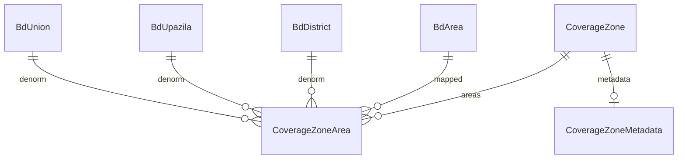

# Phase 2 — Coverage Zone Schema Design

**Migration:** `20260603190000_coverage_zones`  
**Prisma models:** `CoverageZone`, `CoverageZoneArea`, `CoverageZoneMetadata`  
**Enum:** `CoverageZoneType`

---

## 1. `CoverageZone`

| Field | Type | Notes |
|-------|------|-------|
| `id` | `Int` PK | autoincrement |
| `name` | `String` | Display name |
| `slug` | `String` | **Unique** — stable seeder key |
| `description` | `String?` | |
| `city` | `String?` | e.g. `Dhaka` |
| `zoneType` | `CoverageZoneType` | METRO, CITY_CORPORATION, OPERATIONAL, BUSINESS_READINESS |
| `sortOrder` | `Int` | Default 0 |
| `isActive` | `Boolean` | Default true |
| `createdAt` / `updatedAt` | `DateTime` | |

**Table:** `coverage_zones`

---

## 2. `CoverageZoneArea`

| Field | Type | Notes |
|-------|------|-------|
| `id` | `Int` PK | |
| `coverageZoneId` | `Int` FK | → `coverage_zones`, cascade delete |
| `bdAreaId` | `Int?` FK | → `bd_areas`, set null on delete |
| `bdUnionId` | `Int?` FK | Denormalized from `BdArea` at seed time |
| `bdUpazilaId` | `Int?` FK | |
| `bdDistrictId` | `Int?` FK | |

**Unique:** `(coverageZoneId, bdAreaId)` — prevents duplicate mappings.

**Table:** `coverage_zone_areas`

No new `bd_*` columns on master tables except inverse relations for Prisma ergonomics.

---

## 3. `CoverageZoneMetadata`

| Field | Type |
|-------|------|
| `id` | `Int` PK |
| `coverageZoneId` | `Int` **unique** FK |
| `estimatedPetPopulation` | `Int?` |
| `estimatedClinicCount` | `Int?` |
| `estimatedPetShopCount` | `Int?` |
| `estimatedVolunteerCount` | `Int?` |

**Table:** `coverage_zone_metadata`

Used for Dhaka Metro parent estimates; optional on child zones.

---

## 4. `CoverageZoneType` values

| Value | Usage |
|-------|-------|
| `METRO` | Dhaka Metro + North/West/Central/East/South |
| `CITY_CORPORATION` | DNCC, DSCC aggregate zones |
| `OPERATIONAL` | Reserved for future regional ops |
| `BUSINESS_READINESS` | Doctor/Clinic/Volunteer/Rescue/Vaccination/Shop templates |

---

## 5. Relationship to `location_coverage_assignments`

```
bd_* master (seed:location-master + seed:dhaka-city)
    ↑
CoverageZone / CoverageZoneArea  ← operational geography (this phase)
    ↑
location_coverage_assignments    ← per-entity business coverage (existing API)
```

---

## 6. Pre-creation duplicate check

Before adding migration, codebase search confirmed:

- No existing `CoverageZone` model
- No `coverage_zones` table in applied migrations
- Safe to add without renaming conflicting objects

---

## 7. ER diagram


