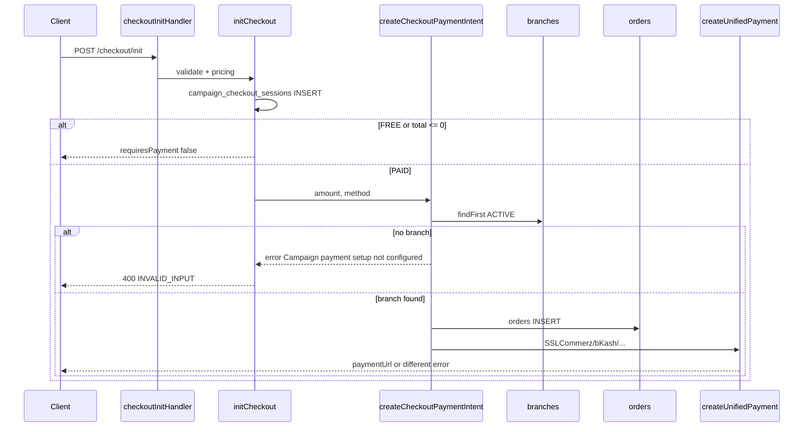

# Campaign checkout — "Campaign payment setup not configured"

**Error surfaced to client:** `INVALID_INPUT` — `"Campaign payment setup not configured"`  
**Typical path:** `POST /api/v1/campaign/public/checkout/init`  
**Inspected DB:** `bpa_pet_db` (local `.env`)

---

## A. Exact validation that throws this message

This string is returned only from **`payment.service.ts`** in two places (same condition, same message):

| Location | Function | Lines |
|----------|----------|-------|
| **Checkout (express flow)** | `createCheckoutPaymentIntent` | **374–375** |
| Legacy booking payment | `createPaymentIntent` | **219–220** |

**Condition (both):**

```typescript
const defaultBranch = await prisma.branch.findFirst({
  where: {
    orgId: campaign.organizerId ?? undefined,
    status: "ACTIVE",
  },
});

if (!defaultBranch) {
  return { success: false, error: "Campaign payment setup not configured" };
}
```

**Surfaced to HTTP** in `checkout.service.ts` **376–381**:

```typescript
if (!payment.success) {
  await prisma.campaignCheckoutSession.update({ where: { id: session.id }, data: { status: "FAILED" } });
  throw ValidationErrors.INVALID_INPUT(payment.error || "Payment could not be started");
}
```

There is **no** separate validator named “payment setup”; the message is a **misleading label** for “no suitable `branches` row found.”

---

## B. Table queried

| Table (Prisma model) | Purpose in this step |
|----------------------|----------------------|
| **`branches`** (`Branch`) | Must find one row with `status = 'ACTIVE'` and optionally `orgId = campaigns.organizerId` |

**Also read earlier in the same flow (not the source of this error):**

| Table | When |
|-------|------|
| `campaigns` | Load campaign, pricing, `organizerId` |
| `campaign_configs` | Optional booking/payment flags |
| `campaign_checkout_sessions` | Create PENDING session **before** payment step |
| `orders` | Only **after** a branch exists (create/update checkout order) |

**Not used for this error:**

- No `campaign_payment_*` mapping table
- No DB table for SSLCommerz / bKash / Nagad credentials (env + strategy registry only)
- `payment_transaction_logs` — only after `createUnifiedPayment` runs

---

## C. Missing configuration record

On inspected local DB:

| Record | Expected | Actual |
|--------|----------|--------|
| **`branches` with `status = 'ACTIVE'`** | ≥ 1 (any org if `organizerId` null) | **0 rows** |
| `campaigns.organizerId` for `uat-free-2026` | Often set to BPA org | **`null`** |
| `campaign_configs.onlinePaymentEnabled` | `true` for paid checkout | **`true`** (not blocking) |

So the **missing record** is: **at least one active branch** used as `orders.branchId` for campaign checkout orders.

If `organizerId` were set (e.g. `5`), the query would require:

```sql
SELECT * FROM branches WHERE "orgId" = 5 AND status = 'ACTIVE' LIMIT 1;
```

---

## D. Campaign fields required (full checkout init path)

### Phase 1 — `initCheckout` (`checkout.service.ts`)

| Check | Field / table | Notes |
|-------|----------------|-------|
| Campaign exists & bookable | `campaigns.status`, dates, `bookingStartAt` / `bookingEndAt` | `validateCampaignForBooking` — **no payment check** |
| Config (if row exists) | `campaign_configs.bookingEnabled`, `onlinePaymentEnabled`, `payAtVenueEnabled` | Fails with *"No payment method available — booking disabled"* if all payment off |
| Pricing path | `campaigns.pricingType`, `priceAmount`, `catCount` | If `pricingType === 'FREE'` or `total <= 0`, returns early **without** calling payment service |
| Location | `cityCorporationCode` + `bdAreaId` or zone/venue | Zone-interest path; no branch yet |

### Phase 2 — Paid checkout only (`pricing.total > 0` and not `FREE`)

| Step | File | Requirement |
|------|------|-------------|
| `createCheckoutPaymentIntent` | `payment.service.ts:322+` | Session `PENDING`, `amount > 0` |
| **Branch lookup** | `payment.service.ts:367–375` | **`branches` ACTIVE** ← **current failure** |
| Create `orders` row | `payment.service.ts:381–395` | `branchId = defaultBranch.id` |
| Gateway | `initiateProviderPayment` → `createUnifiedPayment` | Env + `PAYMENT_PROVIDER` (see below) |

**Important:** Slug `uat-free-2026` has `pricingType = 'PAID'` and `priceAmount = 600` — so the **paid** path always runs despite the name.

---

## E. Issue classification

| Hypothesis | Applies? | Evidence |
|------------|----------|----------|
| **Missing payment configuration (branch anchor)** | **Yes — primary** | Zero `ACTIVE` branches; error text only emitted when `defaultBranch` is null |
| Missing gateway assignment (DB) | No | No campaign↔gateway table; `PAYMENT_PROVIDER` env only |
| Missing campaign-payment mapping | No | Mapping is implicit: `campaign.organizerId` → `branches.orgId` |
| **Missing environment variables** | **Yes — secondary** | After branch exists, `SSLCOMMERZ_*`, `API_PUBLIC_BASE_URL` missing; startup logs `NOT ready` (would **not** produce this exact message) |
| Disabled payment provider | Partial | Dev: warns only (`paymentProvider.bootstrap.ts`); does not block before branch check |

**bKash / Nagad:** Not involved unless `PAYMENT_PROVIDER=bkash|nagad`. Default is `sslcommerz`. Checkout `paymentMethod: "BKASH"` on the session is mapped to Prisma `PaymentMethod` on `orders`; the **active gateway** still comes from `PAYMENT_PROVIDER` env via `getActivePaymentStrategy()`.

---

## Complete checkout initialization flow



---

## SSLCommerz / bKash / Nagad (after branch exists)

Configured in `src/api/v1/providers/paymentProvider.config.ts`:

| Provider | Env keys | Active when |
|----------|----------|-------------|
| **sslcommerz** (default) | `SSLCOMMERZ_STORE_ID`, `SSLCOMMERZ_STORE_PASSWORD` | `PAYMENT_PROVIDER` unset or `sslcommerz` |
| bKash | `BKASH_APP_KEY`, `BKASH_APP_SECRET`, `BKASH_USERNAME`, `BKASH_PASSWORD` | `PAYMENT_PROVIDER=bkash` |
| Nagad | `NAGAD_MERCHANT_ID`, `NAGAD_PUBLIC_KEY`, `NAGAD_PRIVATE_KEY` | `PAYMENT_PROVIDER=nagad` |

Also required for callbacks: `API_PUBLIC_BASE_URL` or `BACKEND_PUBLIC_URL` or `APP_URL`.

Startup (`paymentProvider.bootstrap.ts`) on local dev:

```text
[Payment] Active provider "sslcommerz" NOT ready: Set API_PUBLIC_BASE_URL ...; Missing SSLCOMMERZ_STORE_ID; Provider not fully configured
```

That produces a **different** error message from `createUnifiedPayment` / strategy — **not** `"Campaign payment setup not configured"`.

---

## Campaign config API (admin)

| Route | Service |
|-------|---------|
| `GET/PUT /api/v1/campaign/admin/campaigns/:id/config` | `config.service.ts` — `campaign_configs` |

Relevant flags for checkout:

- `onlinePaymentEnabled` — must be true (with paid campaign) or init throws *"No payment method available"*
- Does **not** configure branches or gateway credentials

Public campaign payload may include config via `getCampaignConfigOrNull` in `campaign.controller.ts` (read-only for UI).

---

## Safest fix (no `migrate reset`, preserve data)

### Step 1 — Fix branch anchor (fixes **this** error)

**Option A (recommended):** Link campaign to BPA org and ensure an active branch:

1. Set `campaigns.organizerId` to the correct `organizations.id`.
2. Ensure at least one row in `branches` with `status = 'ACTIVE'` and matching `orgId`.

**Option B:** If `organizerId` stays `null`, create **any** `ACTIVE` branch (query does not filter `orgId` when `organizerId` is null):

```sql
-- Example only — pick a real orgId from organizations
INSERT INTO branches ("orgId", name, status, "capabilitiesJson", "featuresJson", location, "clinicSettingsJson", "createdAt", "updatedAt")
VALUES (<orgId>, 'Campaign Checkout (system)', 'ACTIVE', '{}', '{}', '{}', '{}', NOW(), NOW());
```

Use Prisma/seed conventions in your environment; verify org exists.

### Step 2 — Gateway env (fixes **next** error after Step 1)

In `.env`:

```env
API_PUBLIC_BASE_URL=http://localhost:3000
PAYMENT_PROVIDER=sslcommerz
SSLCOMMERZ_STORE_ID=...
SSLCOMMERZ_STORE_PASSWORD=...
SSLCOMMERZ_SANDBOX=true
```

Restart API after changes.

### Step 3 — Optional product fixes (code — out of scope here)

- Set `uat-free-2026` to `pricingType = FREE` if it should skip payment.
- Improve error message: *"No active branch for campaign organizer"* vs generic *"payment setup not configured"*.
- Dedicated `CAMPAIGN_CHECKOUT_BRANCH_ID` env to avoid org/branch coupling.

### Step 4 — Verify

```bash
node scripts/verify-checkout-init-direct.ts
# or POST /api/v1/campaign/public/checkout/init
```

Expect: session created → order created → `paymentUrl` (if SSLCommerz configured) or clear gateway error.

---

## Verification snapshot (local, 2026-06-04)

| Item | Value |
|------|-------|
| Campaigns | `uat-free-2026` PAID ৳600, `organizerId` null |
| `campaign_configs` | `onlinePaymentEnabled: true` for both campaigns |
| `branches` ACTIVE | **0** |
| Env SSLCommerz | Not set |
| Error reproduced | `"Campaign payment setup not configured"` at branch gate |

---

## Files reference

| File | Role |
|------|------|
| `checkout.controller.ts:51–58` | HTTP entry |
| `checkout.service.ts:160–392` | Init + session + payment call |
| `payment.service.ts:322–431` | Checkout payment + **branch check** |
| `payment.service.ts:450–480` | Gateway initiation |
| `paymentProvider.config.ts` | SSLCommerz / bKash / Nagad env |
| `config.service.ts` | `campaign_configs` CRUD |
| `campaign.service.ts:528–558` | Booking eligibility only |
