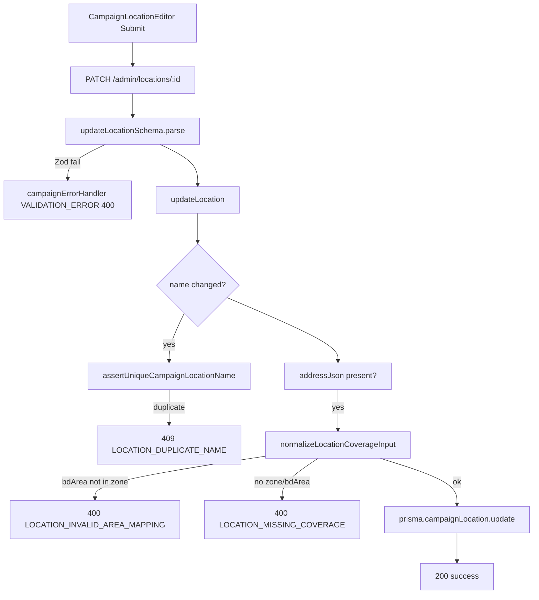

# Root Cause Analysis: Campaign Location Edit — `Request failed (400)`

**Date:** 2026-06-04  
**Scope:** Analysis only — no code changes  
**Page:** `bpa_web` → `/admin/campaigns/2/locations`  
**Location:** Pet And Bird Care (campaign id `2`)

---

## Executive summary

Saving an edited location issues **`PATCH /api/v1/campaign/admin/locations/:id`** with an `addressJson` coverage payload. The backend validates coverage in **`normalizeLocationCoverageInput`** before update. A **400** is expected when:

1. **`coverageZoneId` and `bdAreaId` are both sent but the BdArea is not in `coverage_zone_areas` for that zone** → `LOCATION_INVALID_AREA_MAPPING` (most likely for legacy sites like Pet And Bird Care after picking a zone + BdArea).
2. **Neither zone nor resolvable BdArea** → `LOCATION_MISSING_COVERAGE`.
3. **Invalid `contactPhone` format** (Zod, before service) → `VALIDATION_ERROR`.
4. **Deactivate with future bookings** → `LOCATION_HAS_BOOKINGS` (only if status → inactive).

The UI text **`Request failed (400)`** is often the **generic client fallback** because `bpa_web` `parseError` reads only top-level `message`, while the campaign router returns errors under **`error.message`** (nested). The real API message may be present in the response body but **not shown** in the editor alert.

**Duplicate name** validation returns **409**, not 400 — unlikely the reported status unless the UI normalizes all errors to “400”.

---

## A. Exact endpoint called

| Layer | Value |
|-------|--------|
| HTTP method | `PATCH` |
| Path | `/api/v1/campaign/admin/locations/:id` |
| Full URL (browser) | Same-origin `/api/v1/campaign/admin/locations/{locationId}` → Next rewrite → `API_BASE_URL` |
| Route registration | `backend-api/src/api/v1/modules/campaign/campaign.routes.ts` **890–899** |
| Admin base | `bpa_web/lib/campaignApi.ts` **42** — `const admin = "/api/v1/campaign/admin"` |
| Client call | `campaignAdminUpdateLocation(id, body)` → `apiPatch` **354–356** |
| Trigger | `CampaignLocationEditor.handleSubmit` **168–169** |

Example for campaign `2` and location id `{id}`:

```http
PATCH /api/v1/campaign/admin/locations/{id}
Content-Type: application/json
Cookie: (admin session)
```

---

## B. Exact request payload (built by UI)

Produced by `buildPayload` in `bpa_web/src/bpa/campaign/admin/CampaignLocationEditor.tsx` **50–65**, sent on edit at **167–169**.

```json
{
  "campaignId": 2,
  "name": "Pet And Bird Care",
  "address": "<trimmed address or omitted>",
  "contactPhone": "<trimmed or omitted>",
  "dailyCapacity": 100,
  "isActive": true,
  "addressJson": {
    "coverageZoneId": <number | omitted>,
    "bdAreaId": <number | omitted>,
    "bookingArea": "<trimmed label or omitted>"
  }
}
```

Notes:

- `campaignId` is included in the body but **stripped** by Zod (`updateLocationSchema` omits `campaignId` — `campaign.validation.ts` **83–85**).
- `JSON.stringify` omits keys whose values are `undefined`; empty optional fields are typically absent.
- On **edit**, initial values come from `formFromLocation` **37–47** using list row fields `coverageZoneId`, `bookingArea`, `bdAreaId` returned by `GET .../campaigns/2/locations?includeInactive=true`.

---

## C. Exact validation failure (backend path)

### Order of validation on `PATCH`

```
campaign.routes.ts:893  updateLocationSchema.parse(req.body)     [Zod]
        ↓
location.service.ts:164 assertUniqueCampaignLocationName(...)     [if name changed, 409 if duplicate]
        ↓
location.service.ts:169 if (input.addressJson !== undefined)
location.service.ts:170   parseLocationAddressJson(input.addressJson)
location.service.ts:171-175 normalizeLocationCoverageInput({...})   [coverage / BdArea / zone]
location.service.ts:176-179 mergeLocationAddressJson(...)
        ↓
location.service.ts:197 prisma.campaignLocation.update(...)
```

### Zod layer (`updateLocationSchema`)

File: `campaign.validation.ts` **60–85**

| Field | Rule | 400 if |
|-------|------|--------|
| `name` | `min(2).max(200)` | Too short name |
| `contactPhone` | `phoneSchema.optional()` — regex `^(\+?880)?01[3-9]\d{8}$` | Non-empty invalid BD phone |
| `dailyCapacity` | `int().min(1).max(10000)` | Not integer / out of range |
| `addressJson.coverageZoneId` / `bdAreaId` | `number().int().optional()` | Non-integer (unlikely from UI `Number()`) |

Zod failures are handled by `campaignErrorHandler` (`campaign.controller.ts` **332–340**):

```json
{
  "success": false,
  "error": {
    "code": "VALIDATION_ERROR",
    "message": "Invalid request data",
    "details": [ "... Zod issues ..." ]
  }
}
```

### Coverage layer (`normalizeLocationCoverageInput`)

File: `coverageAdmin.service.ts` **124–171**

| Step | Lines | Failure | HTTP | Code |
|------|-------|---------|------|------|
| BdArea row missing | 143–145 | `INVALID_AREA_MAPPING` | 400 | `LOCATION_INVALID_AREA_MAPPING` |
| BdArea + zone: not in `coverage_zone_areas` | 148–150 | `INVALID_AREA_MAPPING` | 400 | `LOCATION_INVALID_AREA_MAPPING` |
| BdArea only: no zone mapping in DB | 152–154 | `MISSING_COVERAGE_MAPPING` | 400 | `LOCATION_MISSING_COVERAGE` |
| No zone and no BdArea | 157–159 | `MISSING_COVERAGE_MAPPING` | 400 | `LOCATION_MISSING_COVERAGE` |
| Zone id inactive / missing | 162–167 | `MISSING_COVERAGE_MAPPING` | 400 | `LOCATION_MISSING_COVERAGE` |

**Failing condition (BdArea ↔ zone mismatch) — exact code:**

```148:150:backend-api/src/api/v1/modules/campaign/coverageAdmin.service.ts
    if (coverageZoneId) {
      const ok = await isBdAreaInCoverageZone(coverageZoneId, bdAreaId);
      if (!ok) throw LocationErrors.INVALID_AREA_MAPPING();
```

`isBdAreaInCoverageZone` (`coverageAdmin.service.ts` **91–99**) queries `coverage_zone_areas` for `(coverageZoneId, bdAreaId)`.

### Duplicate name

File: `coverageAdmin.service.ts` **102–121**, invoked from `location.service.ts` **164–166**

- Case-insensitive match on `campaignId` + `name`, excluding current `id` on update.
- Failure: **409** `LOCATION_DUPLICATE_NAME` — **not 400**.

### Deactivate with bookings

`location.service.ts` **183–194** — only when `isActive: false` and future bookings exist → **400** `LOCATION_HAS_BOOKINGS`.

---

## D. Exact backend file

Primary failure surface for coverage edits:

| File | Role |
|------|------|
| `src/api/v1/modules/campaign/coverageAdmin.service.ts` | Coverage + BdArea validation |
| `src/api/v1/modules/campaign/location.service.ts` | `updateLocation` orchestration |
| `src/api/v1/modules/campaign/campaign.routes.ts` | `PATCH` handler |
| `src/api/v1/modules/campaign/campaign.validation.ts` | Zod schema |
| `src/api/v1/modules/campaign/campaign.errors.ts` | Error definitions **71–76**, **78–83** |

---

## E. Exact line numbers (failing conditions)

| Failure | File | Line(s) |
|---------|------|---------|
| PATCH handler | `campaign.routes.ts` | **890–899** |
| Zod parse | `campaign.routes.ts` | **893** |
| Trigger coverage validation | `location.service.ts` | **169–175** |
| **BdArea ∉ zone (primary suspect)** | `coverageAdmin.service.ts` | **148–150** |
| Missing coverage | `coverageAdmin.service.ts` | **157–159** |
| Invalid phone (Zod) | `campaign.validation.ts` | **14**, **79** |
| Duplicate name (409) | `coverageAdmin.service.ts` | **119–120** |
| Error JSON shape | `campaign.controller.ts` | **320–328** (`CampaignError`) |

---

## F. Whether BdArea ↔ zone mismatch exists

**Highly plausible** for Pet And Bird Care when:

1. Admin list enriches `coverageZoneId` as `meta.coverageZoneId ?? cov?.coverageZoneId` (`location.service.ts` **145**).
2. Legacy `addressJson` may have **no** `coverageZoneId` / `bdAreaId` (only `division` / `district` / `upazila` / `area` — see migration doc example for Mirpur-style sites).
3. Operator selects a **coverage zone** in the dropdown and a **BdArea** (e.g. Mirpur 10) from that zone’s list.
4. If the stored or selected **zone id does not match** the `coverage_zone_areas` row for that BdArea (wrong zone selected, or stale `coverageZoneId` in `addressJson` preferred over resolved zone), **`isBdAreaInCoverageZone` returns false** → 400.

Example conflict pattern:

| Field | Value |
|-------|--------|
| UI `coverageZoneId` | North zone (user selection or stale meta) |
| UI `bdAreaId` | `AREA-DNCC-MIRPUR-10` (West zone mapping) |
| `coverage_zone_areas` | Mirpur 10 ↔ West only |
| Result | **400** at `coverageAdmin.service.ts:150` |

BdArea dropdown is correctly filtered by zone (`listBdAreasForCoverageZone`, **48–88**), but **`bdAreaId` can remain set from `formFromLocation`** until the user changes zone (`handleZoneChange` clears `bdAreaId` only on zone **change** — **131–133**). If list row had a **stale `bdAreaId`** inconsistent with displayed zone, mismatch occurs on save.

---

## G. Whether duplicate validation is triggered

| Question | Answer |
|----------|--------|
| Is duplicate check run on edit? | **Yes**, when `input.name` is truthy (`location.service.ts` **164–166**) |
| HTTP status if triggered? | **409**, not 400 |
| UI message if 409? | Still likely **`Request failed (409)`** (same `parseError` gap) unless name equals another location |

**Conclusion (G):** Duplicate validation is **unlikely** to explain a **400** for unchanged name “Pet And Bird Care”. If the user renamed the location to an existing name, expect **409**.

---

## UI: Why the alert shows `Request failed (400)`

`CampaignLocationEditor` **175–176**:

```typescript
setError(err instanceof Error ? err.message : 'Could not save location')
```

`bpa_web/lib/api.ts` **11–19** (`parseError`):

```typescript
let msg = `Request failed (${res.status})`;
if (j?.message) msg = j.message;
```

Campaign module error handler (`campaign.controller.ts` **320–328**):

```json
{
  "success": false,
  "error": {
    "code": "LOCATION_INVALID_AREA_MAPPING",
    "message": "Selected BdArea is not mapped to the chosen coverage zone"
  }
}
```

There is **no top-level `message`**, so the editor shows the generic **`Request failed (400)`** even when the API returns a specific nested `error.message`.

**To confirm in browser:** Network tab → PATCH response body → read `error.message` and `error.code`.

---

## Example response payloads

### Most likely — BdArea / zone mismatch (400)

```json
{
  "success": false,
  "error": {
    "code": "LOCATION_INVALID_AREA_MAPPING",
    "message": "Selected BdArea is not mapped to the chosen coverage zone",
    "details": null
  }
}
```

### Missing coverage (400)

```json
{
  "success": false,
  "error": {
    "code": "LOCATION_MISSING_COVERAGE",
    "message": "Select a coverage zone or a BdArea that maps to a zone"
  }
}
```

### Invalid phone (400, Zod)

```json
{
  "success": false,
  "error": {
    "code": "VALIDATION_ERROR",
    "message": "Invalid request data",
    "details": [ { "path": ["contactPhone"], "message": "Invalid Bangladesh phone number" } ]
  }
}
```

### Duplicate name (409 — not 400)

```json
{
  "success": false,
  "error": {
    "code": "LOCATION_DUPLICATE_NAME",
    "message": "A campaign location named \"Pet And Bird Care\" already exists"
  }
}
```

---

## Validation path diagram



---

## Investigation checklist (requested areas)

| # | Area | Finding |
|---|------|---------|
| 1 | `CampaignLocationEditor` | Builds payload **50–65**; shows `err.message` only — misses nested API error |
| 2 | Location update API | `PATCH` **routes 890–899** → `updateLocation` **156+** |
| 3 | Coverage validation | `normalizeLocationCoverageInput` **124–171** |
| 4 | BdArea validation | `isBdAreaInCoverageZone` **91–99**; invalid BdArea id **143–145** |
| 5 | Zone mapping | `coverage_zone_areas` join; mismatch at **148–150** |
| 6 | Duplicate validation | **409** at **119–120** — not 400 |
| 7 | Request payload | See section B |
| 8 | API response | Nested `error.message`; top-level `message` absent |

---

## Recommended verification (no code)

1. Browser DevTools → Network → failed `PATCH` → copy response JSON (`error.code`, `error.message`).
2. If `LOCATION_INVALID_AREA_MAPPING`: clear BdArea, save with zone + booking area only; or re-select zone then pick a suggested BdArea chip.
3. If `VALIDATION_ERROR` on `contactPhone`: fix phone to `01XXXXXXXXX` or clear field.
4. If `LOCATION_MISSING_COVERAGE`: ensure coverage zone selected (or valid BdArea).
5. Compare `GET /admin/campaigns/2/locations` row for Pet And Bird Care: `coverageZoneId`, `bdAreaId`, `addressJson` vs form selections.

---

## Related docs

- `docs/campaign-v2/location-management-ui-report.md`
- `docs/campaign-redesign/location-migration-report.md` (legacy `addressJson` shape for Mirpur-style locations)
