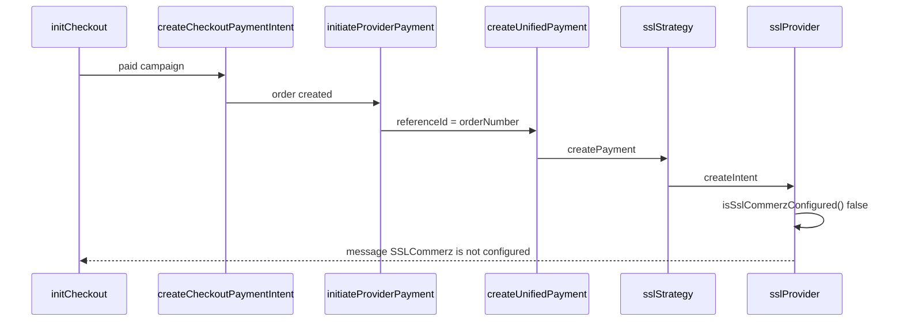

# SSLCommerz is not configured — investigation report

**Date:** 2026-06-04  
**Scope:** Analysis only (no code changes)  
**Symptom:** Campaign checkout fails after branch/order setup with message: `SSLCommerz is not configured`

---

## Executive summary

Checkout now passes **branch validation** and creates an **order**, then calls the **unified payment orchestrator** with the active provider from `PAYMENT_PROVIDER` (default: `sslcommerz`). Payment creation fails because **`SSLCOMMERZ_STORE_ID` and `SSLCOMMERZ_STORE_PASSWORD` are not set** in the environment. The exact user-facing string is returned from `sslcommerz.provider.ts` when `isSslCommerzConfigured()` is false.

**`API_PUBLIC_BASE_URL` (or fallbacks) is also missing** — startup logs this and `validateActivePaymentProviderConfig()` fails — but that check does **not** produce the string `SSLCommerz is not configured`. It would still block a healthy production setup (callback URLs would be relative paths like `/api/v1/payments/webhook`).

---

## 1. Required environment variables

### Active provider selection

| Variable | Required? | Default / behavior |
|----------|-----------|-------------------|
| `PAYMENT_PROVIDER` | Optional | Defaults to **`sslcommerz`** if unset or invalid |

### SSLCommerz credentials (required for this error to clear)

| Variable | Required? | Used by |
|----------|-----------|---------|
| `SSLCOMMERZ_STORE_ID` | **Yes** | `isSslCommerzConfigured()`, session API |
| `SSLCOMMERZ_STORE_PASSWORD` | **Yes** | `isSslCommerzConfigured()`, session API |

### Public API base (required for startup validation & correct callback URLs)

| Variable | Required? | Precedence |
|----------|-----------|------------|
| `API_PUBLIC_BASE_URL` | **Yes** (one of three) | First choice |
| `BACKEND_PUBLIC_URL` | Alternative | Second |
| `APP_URL` | Alternative | Third |

Used to build: `{base}/api/v1/payments/webhook`, redirect success/fail/cancel, IPN.

**Not used for the `SSLCommerz is not configured` gate** — only for URL construction and `validateActivePaymentProviderConfig()`.

### SSLCommerz sandbox / overrides (optional)

| Variable | Default when unset | Purpose |
|----------|-------------------|---------|
| `SSLCOMMERZ_SANDBOX` | **`true`** (`!== "false"`) | Sandbox vs live gateway hosts |
| `SSLCOMMERZ_SESSION_URL` | Auto from sandbox flag | Session create endpoint |
| `SSLCOMMERZ_VALIDATION_URL` | Auto from sandbox flag | Transaction validation |
| `SSLCOMMERZ_SUCCESS_URL` | `{prefix}/webhook/redirect/success` | Gateway redirect |
| `SSLCOMMERZ_FAIL_URL` | `{prefix}/webhook/redirect/fail` | Gateway redirect |
| `SSLCOMMERZ_CANCEL_URL` | `{prefix}/webhook/redirect/cancel` | Gateway redirect |
| `SSLCOMMERZ_IPN_URL` | `{prefix}/webhook` | IPN |

### Campaign UX (optional for checkout error; used elsewhere)

| Variable | Purpose |
|----------|---------|
| `CAMPAIGN_LANDING_URL` | User return/cancel URLs in `checkout.service.ts` (not SSLCommerz credential gate) |
| `PAYMENT_WEBHOOK_SECRET` | Optional webhook header validation |
| `CAMPAIGN_PAYMENT_WEBHOOK_SECRET` | Alias for webhook secret |

---

## 2. Current values detected (local dev, 2026-06-04)

Audit: `dotenv/config` loaded from `backend-api/.env`. Grep confirms **no** `PAYMENT_PROVIDER`, `API_PUBLIC_BASE_URL`, `BACKEND_PUBLIC_URL`, `APP_URL`, or `SSLCOMMERZ_*` keys in `.env`.

| Variable | Set? | Detected value |
|----------|------|----------------|
| `PAYMENT_PROVIDER` | No | (empty → active provider **`sslcommerz`**) |
| `API_PUBLIC_BASE_URL` | No | (empty) |
| `BACKEND_PUBLIC_URL` | No | (empty) |
| `APP_URL` | No | (empty) |
| `SSLCOMMERZ_STORE_ID` | No | (empty) |
| `SSLCOMMERZ_STORE_PASSWORD` | No | (empty) |
| `SSLCOMMERZ_SANDBOX` | No | **Defaults to sandbox `true`** in code |
| `CAMPAIGN_LANDING_URL` | No | (empty) |

Derived when base URL empty (misleading for gateway, but code still runs config check first):

| Derived | Value |
|---------|--------|
| `getApiPublicBaseUrl()` | `""` |
| `sessionUrl` (sandbox default) | `https://sandbox.sslcommerz.com/gwprocess/v4/api.php` |
| `successUrl` / `ipnUrl` | `/api/v1/payments/webhook/...` (relative — invalid for SSLCommerz IPN) |

**Running server log** (`npm run dev`, terminal 9):

```
[Payment] Active provider "sslcommerz" NOT ready: Set API_PUBLIC_BASE_URL (or BACKEND_PUBLIC_URL / APP_URL) for payment callback URLs; Missing required env: SSLCOMMERZ_STORE_ID (active provider: sslcommerz); Missing required env: SSLCOMMERZ_STORE_PASSWORD (active provider: sslcommerz); Provider "sslcommerz" is not fully configured
```

| Check | Result |
|-------|--------|
| `isSslCommerzConfigured()` | `false` |
| `isProviderConfigured('sslcommerz')` | `false` |
| `isActiveProviderReady()` | `false` |
| `validateActivePaymentProviderConfig().ok` | `false` |

---

## 3. Missing values

| Priority | Missing | Blocks |
|----------|---------|--------|
| **P0** | `SSLCOMMERZ_STORE_ID` | Exact error `SSLCommerz is not configured` |
| **P0** | `SSLCOMMERZ_STORE_PASSWORD` | Same |
| **P1** | `API_PUBLIC_BASE_URL` (or `BACKEND_PUBLIC_URL` / `APP_URL`) | Startup NOT ready; invalid callback URLs if credentials added without base URL |
| **P2** | `CAMPAIGN_LANDING_URL` | Relative user return URLs in checkout (not this error) |

---

## 4. Which validation throws this error

### Exact throw site (runtime checkout)

| File | Line | Condition |
|------|------|-----------|
| `src/api/v1/providers/sslcommerz.provider.ts` | **11–12** | `if (!isSslCommerzConfigured()) return { success: false, message: "SSLCommerz is not configured" };` |

### Configuration predicate

| File | Line | Logic |
|------|------|--------|
| `src/api/v1/providers/paymentProvider.config.ts` | **60–61** | `isSslCommerzConfigured(): Boolean(SSLCOMMERZ_STORE_ID && SSLCOMMERZ_STORE_PASSWORD)` |

### Strategy wrapper (no extra gate)

| File | Line | Behavior |
|------|------|----------|
| `src/api/v1/payments/strategies/sslcommerz.strategy.ts` | **14** | `createPayment: ssl.createIntent` |

### Unified payment service (propagates message)

| File | Line | Behavior |
|------|------|----------|
| `src/api/v1/payments/paymentOrchestrator.service.ts` | **90, 108–114** | `strategy.createPayment(input)` → returns `result.message` on failure |

### Campaign checkout path

| File | Line | Behavior |
|------|------|----------|
| `src/api/v1/modules/campaign/payment.service.ts` | **403–414, 454–472** | `initiateProviderPayment` → `createUnifiedPayment` |
| `src/api/v1/modules/campaign/payment.service.ts` | **424–429** | `error: paymentResult.error` (= `SSLCommerz is not configured`) |
| `src/api/v1/modules/campaign/checkout.service.ts` | **362–381** | `createCheckoutPaymentIntent` → `throw ValidationErrors.INVALID_INPUT(payment.error)` |

### Startup validation (different messages — does NOT throw this string)

| File | Line | Behavior |
|------|------|----------|
| `src/api/v1/providers/paymentProvider.config.ts` | **179–201** | `validateActivePaymentProviderConfig()` — lists missing keys / base URL |
| `src/api/v1/payments/paymentProvider.bootstrap.ts` | **20–41** | Logs warning in dev; **throws in production** with combined error string |
| `src/index.ts` | **57–64** | Calls `bootstrapPaymentProvider()` on boot |

### Registry readiness (not used at createIntent gate)

| File | Line | Behavior |
|------|------|----------|
| `src/api/v1/payments/paymentProvider.registry.ts` | **35–37** | `isActiveProviderReady()` → `isProviderConfigured(active)` |



**Note:** Checkout body `paymentMethod: "BKASH"` does **not** switch the gateway. `createUnifiedPayment` always uses `getActivePaymentStrategy()` → env `PAYMENT_PROVIDER` (default SSLCommerz). `paymentMethod` only affects the **Order** row’s `paymentMethod` field mapping.

---

## 5. Sandbox mode

**Supported.** `getSslCommerzConfig()` (`paymentProvider.config.ts` **117–138**):

- `SSLCOMMERZ_SANDBOX !== "false"` → **sandbox** (default when env unset).
- Sandbox session URL: `https://sandbox.sslcommerz.com/gwprocess/v4/api.php`
- Live when `SSLCOMMERZ_SANDBOX=false`: `https://securepay.sslcommerz.com/gwprocess/v4/api.php`

Use **sandbox store id/password** from SSLCommerz merchant panel when `SSLCOMMERZ_SANDBOX=true`.

---

## 6. API_PUBLIC_BASE_URL vs BACKEND_PUBLIC_URL vs APP_URL

| Question | Answer |
|----------|--------|
| Required for **`SSLCommerz is not configured`**? | **No** — only store id + password |
| Required for **startup `validateActivePaymentProviderConfig()`**? | **Yes** — at least one of the three |
| Required for **valid gateway IPN/redirect URLs**? | **Yes** — without base, URLs are relative (`/api/v1/payments/...`) |
| Precedence | `API_PUBLIC_BASE_URL` → `BACKEND_PUBLIC_URL` → `APP_URL` |

Recommended local example:

```env
API_PUBLIC_BASE_URL=http://localhost:3000
SSLCOMMERZ_STORE_ID=<sandbox_store_id>
SSLCOMMERZ_STORE_PASSWORD=<sandbox_store_password>
SSLCOMMERZ_SANDBOX=true
PAYMENT_PROVIDER=sslcommerz
CAMPAIGN_LANDING_URL=http://localhost:5173
```

Use a **publicly reachable** URL for real IPN testing (ngrok, staging host), not `0.0.0.0`.

---

## 7. Required restart steps

1. Add variables to `backend-api/.env` (see `.env.example` lines 73–132).
2. **Stop** the running API (`npm run dev` / process on port **3000**).
3. **Start** again so `dotenv` and `bootstrapPaymentProvider()` reload env.
4. Confirm boot log: `[Payment] Active provider: sslcommerz | webhook: http://localhost:3000/api/v1/payments/webhook | configured: yes`
5. Re-run checkout: `npm run verify:campaign-checkout-anchor` or vaccination app booking flow.
6. If IPN must hit your machine, expose `API_PUBLIC_BASE_URL` via tunnel and register IPN URL in SSLCommerz dashboard.

**No migration or branch seed required** for this failure — data anchor is already fixed.

---

## 8. What happens after credentials are set

If store credentials are valid but gateway rejects session, the message changes to e.g. `SSLCommerz session failed` or `failedreason` from gateway (`sslcommerz.provider.ts` **43–44**) — not `SSLCommerz is not configured`.

If credentials are set but `API_PUBLIC_BASE_URL` is still missing, `isSslCommerzConfigured()` becomes **true** and checkout may proceed to the HTTP call with **invalid relative callback URLs** — fix base URL before production.

---

## Reference files

| Area | Path |
|------|------|
| Config & validation | `src/api/v1/providers/paymentProvider.config.ts` |
| SSLCommerz HTTP | `src/api/v1/providers/sslcommerz.provider.ts` |
| Strategy | `src/api/v1/payments/strategies/sslcommerz.strategy.ts` |
| Orchestrator | `src/api/v1/payments/paymentOrchestrator.service.ts` |
| Registry / readiness | `src/api/v1/payments/paymentProvider.registry.ts` |
| Boot validation | `src/api/v1/payments/paymentProvider.bootstrap.ts` |
| Campaign bridge | `src/api/v1/modules/campaign/payment.service.ts` |
| Checkout throw | `src/api/v1/modules/campaign/checkout.service.ts` |
| Env template | `.env.example` |
