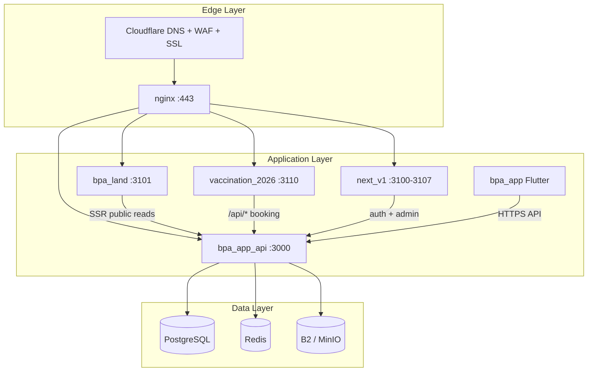

# BPA Ecosystem Deployment Readiness Audit

**Audit date:** 2026-06-05  
**Scope:** All Bangladesh Pet Association production repositories  
**Type:** Read-only audit — no code changes  
**Auditor:** Automated ecosystem scan + repository inspection

---

## Executive Summary

| Repository | Risk Level | Deployment Status | Primary Blocker |
|---|---|---|---|
| **bpa_app_api** | **Medium** | Conditionally ready | No PM2/CI; Docker dev-only; shallow health checks |
| **next_v1** | **Medium** | Conditionally ready | No container/PM2 config; incomplete prod env |
| **vaccination_2026** | **Medium** | Conditionally ready | Campaign slug env; LCP/a11y follow-ups |
| **bpa_app** | **High** | Not store-ready | Placeholder bundle IDs, debug signing, Firebase |
| **bpa_land** | **Critical** | Not deployable | Application code not pushed to GitHub |

**Ecosystem verdict:** The **web/API/campaign stack** can proceed to production server deployment after resolving `bpa_land` git push and completing server-side PM2/systemd + env configuration. The **Flutter mobile app** requires a separate pre-store remediation track and is not part of the initial server `git clone` deployment.

**Production domain:** `bangladeshpetassociation.com` (Cloudflare → nginx → loopback apps)

---

## Audit Dimensions (Cross-Ecosystem)

| Dimension | Status | Notes |
|---|---|---|
| 1. Repository health | **4/5 pass** | `bpa_land` remote has only README |
| 2. Branch status | **5/5 on `main`** | All git repos on `main`, synced with origin |
| 3. Release readiness | **3/5 ready** | API + Next apps ready; mobile + landing blocked |
| 4. Environment configuration | **Partial** | `.env.example` exists; prod values not in VCS |
| 5. PM2 configuration | **Missing** | Referenced in docs only; no `ecosystem.config.js` in any repo |
| 6. Docker readiness | **Partial** | `backend-api` only; dev-oriented, not production profile |
| 7. Deployment scripts | **Partial** | Patch-zip scripts exist; no automated deploy scripts |
| 8. Backup strategy | **Documented** | Strong DR docs; no automated backup scripts |
| 9. SSL/domain readiness | **Planned** | nginx configs in VCS; certbot + Cloudflare documented |
| 10. Security audit | **Gaps** | CORS defaults, JWT fallback, no CI gates, mobile cleartext |

---

## Per-Repository Audit

### 1. bpa_app_api (backend-api)

| Field | Value |
|---|---|
| **Local path** | `D:\BPA_Data\backend-api` |
| **GitHub URL** | https://github.com/balagpetcare/bpa_app_api.git |
| **Branch** | `main` |
| **Last commit** | `5cad431` — chore: sync push summary final hash (2026-06-05) |
| **Package version** | `10.0.0.6` |
| **Sync with origin** | In sync (0 ahead / 0 behind) |
| **Working tree** | Clean |
| **Risk level** | **Medium** |

#### Build Status

| Check | Result |
|---|---|
| `npm run build` (`tsc` → `dist/`) | **Prior build exists** (`dist/` present locally) |
| `npm run verify` (migration + typecheck) | Available; not run in CI |
| Prisma generate | Runs on `postinstall` / `prebuild` |
| CI/CD pipeline | **None** (no `.github/workflows/`) |

#### Deployment Status

| Component | Status |
|---|---|
| Production start command | `npm start` → `node dist/index.js` on port **3000** |
| Notification worker | `npm run worker:notifications` (required for OTP/SMS) |
| Email worker | `npm run worker:email` (optional per feature) |
| Database migrations | ~271 migrations; `prisma migrate deploy` + integrity check |
| nginx upstream | `bpa_api` → `127.0.0.1:3000` (config in `infra/nginx/`) |
| Docker production | **Not ready** — compose runs `npm run dev`; `dockerfile` vs `Dockerfile` case mismatch |
| PM2 | **Not configured** — docs reference `pm2 restart bpa-api bpa-worker` |

#### Environment Configuration

| File | Status |
|---|---|
| `.env.example` | Present — 80+ variables documented |
| `.env.production.example` | Present — storage vars only (incomplete) |
| Required prod vars | `PORT=3000`, `NODE_ENV`, `DATABASE_URL`, `REDIS_URL`, `JWT_SECRET`, `CORS_ORIGINS`, `COOKIE_DOMAIN`, `API_PUBLIC_BASE_URL`, payment/SMS secrets |

**Issue:** `.env.example` sets `PORT=8080` — conflicts with fixed port 3000 rule.

#### PM2 Configuration

**Status: Missing.** No `ecosystem.config.js` in repository. Documented process names:

- `bpa-api` — main API on `:3000`
- `bpa-worker` — notification worker

#### Docker Readiness

| Item | Status |
|---|---|
| `docker-compose.yml` | Dev-only (hot-reload, `npm run dev`) |
| `dockerfile` | Multi-stage build exists; migration `|| true` swallows failures |
| `.env.docker` | Referenced in compose but **not in repo** |
| Production profile | **Not implemented** |

#### Deployment Scripts

| Script | Purpose |
|---|---|
| `scripts/db-deploy.ps1` | migrate deploy + seed |
| `scripts/check-migration-integrity.js` | Mandatory pre/post migration check |
| `scripts/run-local-prisma.cjs` | Pinned Prisma CLI |
| `scripts/sms-production-check.ts` | SMS/Redis health CLI |
| `scripts/make-patch-zip.sh` | Patch packaging |

#### Backup Strategy

| Component | RPO | Documentation |
|---|---|---|
| PostgreSQL | ≤ 1 hour | `DISASTER-RECOVERY-PLAYBOOK.md`, `PRODUCTION_DEPLOYMENT_GUIDE.md` §9 |
| Redis | ≤ 6 hours | Documented |
| Object storage | ≤ 24 hours | B2/MinIO mirror documented |
| Automated scripts | **None** | Manual `pg_dump` / managed snapshots |

#### SSL/Domain Readiness

| Host | Purpose | nginx config |
|---|---|---|
| `api.bangladeshpetassociation.com` | Central API | Proposed in deployment guide §3.5 (add to VCS) |
| Cert strategy | Let's Encrypt SAN or Cloudflare Origin CA | `infra/nginx/snippets/ssl-letsencrypt.conf` |
| Cloudflare | Full (strict), WAF, rate limits | Documented in `PRODUCTION_DEPLOYMENT_GUIDE.md` |

#### Security Audit

| Check | Status | Risk |
|---|---|---|
| Helmet (CSP) | Enabled | Low — allows `unsafe-inline` |
| CORS | Allowlist from `CORS_ORIGINS` | **High** — empty allowlist = allow all |
| Rate limiting | Per-route limiters | **Medium** — `generalLimiter` never mounted |
| JWT secret | Defaults to `"super-secret-key"` if unset | **Critical** if env missing |
| Auth middleware | JWT + token version check | Good |
| `/health` | Shallow (no DB probe) | Medium |
| Secrets in VCS | None tracked | Good |
| `node_modules` committed | None | Good |
| Socket.IO CORS | `origin: "*"` | Medium |

#### Missing Requirements

1. PM2 or systemd unit files for API + worker
2. CI/CD pipeline (`npm run verify` + tests on merge)
3. Production Docker profile (or explicit bare-metal deploy path)
4. `/health/ready` endpoint with DB probe
5. Complete `.env.production.example`
6. Fix `.env.example` PORT to 3000
7. `api.bangladeshpetassociation.com.conf` nginx site in VCS
8. Automated backup scripts or managed DB confirmation

---

### 2. next_v1 (bpa_web)

| Field | Value |
|---|---|
| **Local path** | `D:\BPA_Data\bpa_web` |
| **GitHub URL** | https://github.com/balagpetcare/next_v1.git |
| **Branch** | `main` |
| **Last commit** | `740835a` — updated Vaccination updare BPA (2026-06-05) |
| **Package version** | `0.1.0` |
| **Sync with origin** | In sync (0 ahead / 0 behind) |
| **Working tree** | Clean |
| **Risk level** | **Medium** |

#### Build Status

| Check | Result |
|---|---|
| `npm run build` (`next build`) | **Prior build exists** (`.next/` present; documented success in `FRESH_CLEAN_COPY_REPORT.md`) |
| Next.js version | 16.1.6 |
| Static pages | ~159 documented |
| CI/CD | **None** |

#### Deployment Status

| Component | Status |
|---|---|
| Architecture | Single Next.js app, 8 logical panels via `SITE_MODE` |
| Dev ports | 3100–3107 (per panel) |
| Production model | **One instance** on `:3100` (or per-subdomain if split) |
| `npm start` | `next start -p 3100` only |
| nginx | Not in repo; expected external reverse proxy |
| PM2/Docker | **None** |

**Note:** For initial campaign deployment, `bpa_web` admin panel (`:3103`) is needed for campaign operations but is **not in the three-host production guide** (landing + vaccination + API). Admin deployment is a Phase 2 item.

#### Environment Configuration

| File | Status |
|---|---|
| `.env.example` | 5 vars only |
| Missing from example | `NEXT_PUBLIC_APP_URL`, `SITE_MODE`, feature flags, `COOKIE_DOMAIN` coordination |
| Production API | `NEXT_PUBLIC_API_BASE_URL=https://api.bangladeshpetassociation.com` |

#### PM2 / Docker

**Status: Missing** in repository. Expected: `pm2 start npm --name bpa-web -- start` or systemd equivalent.

#### Deployment Scripts

| Script | Purpose |
|---|---|
| `scripts/make-patch-zip.ps1/.sh` | Patch packaging |
| `scripts/check-landing-isolation.mjs` | QA check |
| `scripts/check-ui-standards.mjs` | UI standards |

No `deploy.sh` or rollback automation.

#### Backup Strategy

Stateless frontend — redeploy from git tag. No data backup required.

#### SSL/Domain Readiness

| Planned host | Port | Status |
|---|---|---|
| `admin.bangladeshpetassociation.com` | 3103 | Documented in `PORT_AND_DOMAIN_MAP.md` |
| Other panels | 3100–3107 | Subdomains planned, nginx not in VCS |

**Issue:** `images.remotePatterns` in `next.config.js` allows only `localhost:3000` — production image hosts not configured.

#### Security Audit

| Check | Status |
|---|---|
| Auth proxy (`proxy.ts`) | Cookie-based auth guard on protected routes |
| Security headers | **None in Next config** — relies on nginx |
| API proxy | `app/api/v1/[[...path]]/route.js` — forwards cookies, `Secure` in prod |
| Open redirect protection | `lib/authRedirect.ts` — localhost ports allowlisted |
| Secrets in VCS | None |

#### Missing Requirements

1. PM2/systemd config for production `next start`
2. Production `images.remotePatterns` for API file URLs
3. Complete `.env.example` with all production vars
4. `output: 'standalone'` for Docker-friendly builds (optional)
5. Security headers in Next config or confirmed nginx coverage
6. `npm run typecheck` script (referenced in docs but not in `package.json`)
7. CI/CD with lint + E2E gates
8. nginx vhost configs for admin/staff panels

---

### 3. vaccination_2026

| Field | Value |
|---|---|
| **Local path** | `D:\BPA_Data\vaccination_2026` |
| **GitHub URL** | https://github.com/balagpetcare/vaccination_2026.git |
| **Branch** | `main` |
| **Last commit** | `a3a22fe` — feat: landing page CTA system and card refinements (2026-06-05) |
| **Package version** | `0.1.0` |
| **Sync with origin** | In sync (0 ahead / 0 behind) |
| **Working tree** | Clean |
| **Risk level** | **Medium** |

#### Build Status

| Check | Result |
|---|---|
| `npm run build` | **Prior build exists** (`.next/` present) |
| Next.js version | 16.1.6 |
| Lighthouse (prod audit) | LCP 4.3s, a11y 87 — conditional GO per `FINAL_PRODUCTION_UI_REVIEW.md` |
| CI/CD | **None** |

#### Deployment Status

| Component | Status |
|---|---|
| Production port | **3110** (fixed) |
| Start command | `npm run start` → `next start -p 3110` |
| nginx upstream | `bpa_vaccination` → `127.0.0.1:3110` |
| nginx vhost | `infra/nginx/sites-available/vaccination.bangladeshpetassociation.com.conf` |
| API proxy | `/api/*` → `backend-api:3000` via nginx + Next.js rewrite |
| PM2/Docker | **None in repo** |

#### Environment Configuration

| Variable | Required | Notes |
|---|---|---|
| `NEXT_PUBLIC_API_BASE_URL` | Yes | `https://api.bangladeshpetassociation.com` |
| `NEXT_PUBLIC_CAMPAIGN_SLUG` | **Critical** | Must set explicitly (`cat-flu-rabies-2026`); code fallback is `uat-free-2026` |
| `NEXT_PUBLIC_SITE_URL` | Yes | `https://vaccination.bangladeshpetassociation.com` |
| `NEXT_PUBLIC_ANALYTICS_*` | Optional | GA4, Meta Pixel, Clarity |

#### PM2 / Docker

**Status: Missing.** Documented process name: `bpa-vaccination`.

#### Deployment Scripts

**None.** E2E validation script exists (`scripts/e2e-landing-validation.mjs`) but Playwright not in `package.json`.

#### Backup Strategy

Stateless — redeploy from git. Campaign data lives in `backend-api` PostgreSQL.

#### SSL/Domain Readiness

| Host | Config |
|---|---|
| `vaccination.bangladeshpetassociation.com` | nginx vhost in VCS; SSL via Let's Encrypt |
| Security headers | nginx `security-headers.conf` (HSTS, CSP) |
| `/book/payment/*` | `Cache-Control: no-store` in nginx |

#### Security Audit

| Check | Status |
|---|---|
| `poweredByHeader` | Disabled |
| App-level CSP/HSTS | None (nginx handles) |
| `robots.ts` | Disallows `/book/payment/` |
| Secrets in VCS | None |
| `.env.local` on disk | Gitignored |

#### Missing Requirements

1. PM2/systemd config
2. Explicit `NEXT_PUBLIC_CAMPAIGN_SLUG` in production env
3. `/health` Next.js route (recommended, not implemented)
4. LCP optimization (4.3s exceeds 2.5s target)
5. Analytics IDs + consent banner
6. CI/CD pipeline

---

### 4. bpa_app (Flutter Mobile)

| Field | Value |
|---|---|
| **Local path** | `D:\BPA_Data\bpa_app` |
| **GitHub URL** | https://github.com/balagpetcare/bpa_app.git |
| **Branch** | `main` |
| **Last commit** | `9255aa8` — feat: vaccination campaign booking, UI standardization, and deployment prep (2026-06-05) |
| **App version** | `10.0.0+7` |
| **Sync with origin** | In sync (0 ahead / 0 behind) |
| **Working tree** | 1 untracked file (`app_v7.zip` — excluded artifact) |
| **Risk level** | **High** |

#### Build Status

| Check | Result |
|---|---|
| `flutter build apk --release` | **Prior build exists** (`build/` present) |
| Release signing | **Debug keys only** — not store-ready |
| Firebase | Placeholder configs |
| CI/CD | **None** |

#### Deployment Status

| Component | Status |
|---|---|
| Deployment model | **App Store / Play Store** — not server `git clone` |
| API endpoint | `env/prod.json` has `YOUR_DOMAIN` placeholders |
| Default fallback | `http://192.168.10.111:3000` (LAN HTTP) |
| PM2/Docker | N/A (mobile client) |

#### Environment Configuration

| File | Status |
|---|---|
| `.env.example` | `API_BASE_URL`, `API_HOST` only |
| `env/prod.json` | Placeholder URLs — **not filled** |
| `env/dev.json` | LAN HTTP defaults |

#### Store Readiness

| Platform | Status | Blocker |
|---|---|---|
| Android | **Not ready** | `com.example.bpa_app`, debug signing, placeholder Firebase |
| iOS | **Not ready** | `com.example.bpaApp`, no `DEVELOPMENT_TEAM`, no `GoogleService-Info.plist` |
| App Links | **Not deployed** | `assetlinks.json` / AASA examples only |
| Privacy policy | **Missing** from repo |

#### Security Audit

| Check | Status | Risk |
|---|---|---|
| Cleartext HTTP | Enabled in Android manifest | **Critical** for production |
| JWT storage | `SharedPreferences` (plaintext) | **High** |
| Deep link auth | No auth guard | Medium |
| Contacts permissions | Declared but unused | Play policy risk |
| Firebase secrets | Placeholder only | High |

#### Missing Requirements

1. Final bundle IDs (aligned Android/iOS/Firebase)
2. `flutterfire configure` — real Firebase configs
3. Android release keystore + Play App Signing
4. iOS provisioning + `DEVELOPMENT_TEAM`
5. HTTPS-only `env/prod.json`
6. Disable cleartext in release builds
7. Secure token storage migration
8. Host `assetlinks.json` and AASA on production domains
9. Store metadata (screenshots, privacy policy, Data safety)
10. CI/CD for release builds with placeholder detection

**Note:** Internal UX readiness is 89% (`final_production_readiness_report.md`) but **infrastructure/security readiness is not met** for public store release.

---

### 5. bpa_land (bpa-landing)

| Field | Value |
|---|---|
| **Local path** | `D:\BPA_Data\bpa-landing` |
| **GitHub URL** | https://github.com/balagpetcare/bpa_land.git |
| **Branch** | `main` |
| **Last commit (remote)** | `4ffed88` — first commit (README only) |
| **Package version** | `0.1.0` (local, untracked) |
| **Sync with origin** | In sync for tracked files; **16 untracked application files** |
| **Risk level** | **Critical** |

#### Build Status

| Check | Result |
|---|---|
| `npm run build` | **Prior build exists** (`.next/` present locally) |
| `npm run typecheck` | Available |
| `npm run lighthouse` | Available (localhost) |
| Remote build | **Impossible** — no application code on GitHub |

#### Deployment Status

| Component | Status |
|---|---|
| Production port | **3101** (fixed) |
| Production host | `bangladeshpetassociation.com` |
| nginx upstream | `bpa_landing` → `127.0.0.1:3101` |
| nginx vhost | `infra/nginx/sites-available/bangladeshpetassociation.com.conf` |
| Remote deploy | **BLOCKED** — `git clone` yields README only |

#### Untracked Local Files (Not on GitHub)

```
.env.example, .gitignore, package.json, package-lock.json, next.config.ts,
tsconfig.json, src/, public/, docs/, scripts/, components.json, eslint.config.mjs,
postcss.config.mjs, lighthouse-report.json, AGENTS.md, CLAUDE.md
```

#### Environment Configuration

| Variable | Production value |
|---|---|
| `NEXT_PUBLIC_SITE_URL` | `https://bangladeshpetassociation.com` |
| `NEXT_PUBLIC_API_URL` | `https://api.bangladeshpetassociation.com/api/v1` |
| `NEXT_PUBLIC_CAMPAIGN_SITE_URL` | `https://vaccination.bangladeshpetassociation.com` |
| `NEXT_PUBLIC_ANALYTICS_*` | Required per production audit |

#### PM2 / Docker

**Status: Missing.** Documented process name: `bpa-landing`.

#### Security Audit

| Check | Status |
|---|---|
| Direct API calls | Cross-origin to `api.bangladeshpetassociation.com` — CORS required on API |
| Analytics consent | **Missing** per `BPA_LANDING_PRODUCTION_AUDIT.md` |
| Security headers | nginx only (not in Next config) |

#### Missing Requirements

1. **Commit and push entire application to `bpa_land` remote** — P0 blocker
2. PM2/systemd config
3. Production analytics IDs + cookie consent
4. Live API integration vs mock fallback decision
5. Play Store URL for schema CTAs
6. `/health` route (recommended)
7. HTTPS Lighthouse re-run on production URL

---

## Cross-Repository Dependency Map



---

## Risk Matrix Summary

| Risk | Repositories Affected | Severity | Mitigation |
|---|---|---|---|
| `bpa_land` code not on GitHub | bpa_land | **Critical** | Commit + push before server clone |
| No PM2/systemd configs | All server apps | **High** | Create on server during deploy |
| No CI/CD | All repos | **High** | Manual `verify` + smoke tests pre-deploy |
| JWT/CORS defaults | bpa_app_api | **High** | Enforce prod env vars before start |
| Campaign slug mismatch | vaccination_2026 | **High** | Set `NEXT_PUBLIC_CAMPAIGN_SLUG` explicitly |
| Mobile not store-ready | bpa_app | **High** | Separate track; not blocking web deploy |
| Docker not production-ready | bpa_app_api | **Medium** | Use bare-metal PM2 path |
| Shallow health checks | bpa_app_api | **Medium** | Add `/health/ready` post-deploy |
| Port 3101 dev conflict | bpa_land + next_v1 shop | **Low** (prod) | Separate containers in production |
| Pre-existing tracked zips | bpa_app | **Low** | Do not add new artifacts |

---

## Deployment Readiness Scorecard

| Repository | Repo Health | Branch | Release | Env Config | PM2 | Docker | Scripts | Backup | SSL | Security | **Overall** |
|---|---|---|---|---|---|---|---|---|---|---|---|
| bpa_app_api | ✅ | ✅ | ⚠️ | ⚠️ | ❌ | ⚠️ | ⚠️ | ⚠️ | ✅ | ⚠️ | **65%** |
| next_v1 | ✅ | ✅ | ⚠️ | ⚠️ | ❌ | ❌ | ⚠️ | ✅ | ⚠️ | ⚠️ | **55%** |
| vaccination_2026 | ✅ | ✅ | ⚠️ | ⚠️ | ❌ | ❌ | ❌ | ✅ | ✅ | ⚠️ | **60%** |
| bpa_app | ✅ | ✅ | ❌ | ❌ | N/A | N/A | ❌ | N/A | ⚠️ | ❌ | **30%** |
| bpa_land | ❌ | ✅ | ❌ | ⚠️ | ❌ | ❌ | ⚠️ | ✅ | ✅ | ⚠️ | **25%** |

**Legend:** ✅ Ready · ⚠️ Partial / documented · ❌ Missing / blocker

---

## Recommended Pre-Deploy Actions (Priority Order)

1. **P0:** Commit and push `bpa-landing` application code to `bpa_land` GitHub remote
2. **P0:** Provision production server with Node 20+, PostgreSQL, Redis, nginx
3. **P0:** Configure production `.env` files from vault (never commit)
4. **P1:** Create PM2 ecosystem file on server for all processes
5. **P1:** Deploy nginx configs from `backend-api/infra/nginx/`
6. **P1:** Issue Let's Encrypt SAN certificate for all hosts
7. **P1:** Run `check-migration-integrity.js` + `prisma migrate deploy` on staging
8. **P2:** Add CI/CD workflows to all repos
9. **P2:** Complete mobile store readiness (parallel track)
10. **P2:** Add `/health` routes to Next.js apps

---

## Related Documentation

| Document | Path |
|---|---|
| Production deployment guide | `docs/deployment/PRODUCTION_DEPLOYMENT_GUIDE.md` |
| Port and domain map | `docs/infrastructure/PORT_AND_DOMAIN_MAP.md` |
| nginx configs | `infra/nginx/` |
| Disaster recovery | `DISASTER-RECOVERY-PLAYBOOK.md` |
| Git audit (prior) | `docs/git/GIT_REPOSITORY_AUDIT.md` |
| Mobile production readiness | `bpa_app/docs/mobile/production_readiness.md` |
| Landing production audit | `bpa-landing/docs/audits/BPA_LANDING_PRODUCTION_AUDIT.md` |
| Vaccination UI review | `vaccination_2026/docs/reports/FINAL_PRODUCTION_UI_REVIEW.md` |
