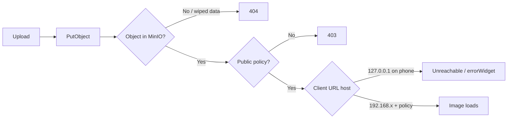

# BPA Image Storage Audit Report

**Date:** 2026-06-05  
**Scope:** `backend-api` (MinIO/S3, media API, posts feed) + `bpa_app` (Flutter image loading)

---

## Executive summary

Feed images showed broken placeholders due to **three compounding issues**:

1. **MinIO bucket had no public read policy** → HTTP **403** on direct object URLs.
2. **`MINIO_PUBLIC_URL` pointed at `127.0.0.1`** → URLs stored in PostgreSQL were not reachable from phones on the LAN.
3. **Objects missing in MinIO** (empty `bpa-pets` bucket) while DB still referenced old keys → HTTP **404** after policy was fixed.

Code and configuration fixes are in place. **Existing feed posts with missing objects must be re-created** (re-upload the same photo once; hash-based dedup will repair the `media` row in storage).

---

## 1. MinIO configuration

| Setting | Value (your `.env`) | Notes |
|--------|---------------------|-------|
| `AWS_ENDPOINT` | `http://192.168.10.111:9000` | API → MinIO (correct for host dev) |
| `MINIO_PUBLIC_URL` | ~~`http://127.0.0.1:9000`~~ → **`http://192.168.10.111:9000`** | Must match a host phones can reach |
| `AWS_BUCKET_NAME` | `bpa-pets` | Consistent across API, init script, Flutter `MEDIA_BASE_URL` path |
| `AWS_ACCESS_KEY_ID` | `minioadmin` | Matches running MinIO instance |
| `AWS_FORCE_PATH_STYLE` | `true` | Required for MinIO path-style URLs |

MinIO process (verified running):

- API: `http://192.168.10.111:9000` / `http://127.0.0.1:9000`
- Console: `:9001`
- Data dir: `D:\minio\data`

**Action applied:** `npm run minio:init` — public read policy on `bpa-pets`.

---

## 2. Bucket name consistency

| Layer | Bucket |
|-------|--------|
| `appConfig.storage.bucketName` | `bpa-pets` |
| `scripts/init-minio.ts` | `bpa-pets` |
| `presign.service.ts` fallback | `AWS_BUCKET_NAME` / `MINIO_BUCKET` |
| Flutter `MEDIA_BASE_URL` | No bucket in host; path is `/bpa-pets/<key>` |
| DB `media.url` | `…/bpa-pets/BD/media/…` |

**Consistent.** No bucket name mismatch found.

---

## 3. Upload API

| Item | Detail |
|------|--------|
| Route | `POST /api/v1/media/upload` |
| Auth | Bearer JWT |
| Handler | `media.controller.ts` → `media.processor` → `media.service.uploadAndCreateMedia` |
| Storage | `PutObject` to `bpa-pets` |
| DB | `media` row: `url`, `key`, `hash`, `type`, … |

Upload test after policy fix: **200 OK** for new object  
`BD/media/0/test_*.txt`.

---

## 4. Image save process

1. Client multipart `file` → API buffer  
2. Optional sharp resize (`media.processor.ts`)  
3. Key: `{country}/media/{userId}/{timestamp}_{rand}.jpg` (e.g. `BD/media/2/…`)  
4. `PutObject` → `buildPublicMediaUrl(key)` → `media.create`

**Dedup fix:** If `hash` exists but object is missing in MinIO, the row is **re-uploaded and updated** instead of returning a broken URL.

---

## 5. Database image URL storage

Sample rows (after repair script):

| id | key | url (canonical) |
|----|-----|-----------------|
| 1 | `BD/media/2/1780346714709_3fda3f2c2fa8a8eac40d.jpg` | `http://192.168.10.111:9000/bpa-pets/BD/media/2/…` |
| 2 | `BD/media/2/1780346829965_27147ff04b10ff45b541.jpg` | `http://192.168.10.111:9000/bpa-pets/BD/media/2/…` |

**HTTP HEAD on these URLs: 404** — files are not in the current MinIO data directory (likely wiped when MinIO was re-pointed to `D:\minio\data`).

Repair URLs in DB:

```bash
node scripts/repair-media-urls.mjs
```

---

## 6. Image retrieval API

| Endpoint | Behavior |
|----------|----------|
| `GET /api/v1/posts/feed` | Returns nested `media[].media.url` |
| `GET /api/v1/media/my` | Lists owner media |

**Fix:** Feed responses now rewrite URLs via `resolveClientMediaUrl()` using `media.key` + `MINIO_PUBLIC_URL` (`posts.service.ts`).

---

## 7. Presigned URL generation

| Module | Use |
|--------|-----|
| `src/services/presign.service.ts` | KYC / owner documents (`getPresignedGetUrl`) |
| Feed post images | **Direct public GET** (not presigned) |

Presigned flow is separate from feed images. Feed requires `npm run minio:init` public policy (or presigned URLs would need a follow-up product change).

---

## 8. Flutter image loading

| Component | URL handling |
|-----------|----------------|
| `PostMediaModel.fromJson` | `MediaUrl.normalize()` |
| `FitWidthNetworkImage` / `BpaCachedImage` | `CachedNetworkImage` |
| `AppConfig.mediaBaseUrl` | `env/dev.json` → `http://192.168.10.111:9000` |

Android cleartext: `network_security_config.xml` updated for LAN + emulator hosts.

---

## 9. Root cause (broken feed placeholders)



**Primary:** Missing objects (404) + missing bucket policy (403).  
**Secondary:** Wrong `MINIO_PUBLIC_URL` (127.0.0.1) in stored URLs.

---

## 10. Fixes applied

### Configuration

- `.env`: `MINIO_PUBLIC_URL=http://192.168.10.111:9000`
- `.env.example`: MinIO section + `npm run minio:init` note

### Backend code

- `src/shared/storage/publicMediaUrl.ts` — canonical client URLs from `key`
- `posts.service.ts` — rewrite media + avatar URLs on feed/single post/gallery
- `media.service.ts` — dedup repair for orphan DB rows; remove debug ingest calls; resolve URLs on upload/list

### Flutter

- `network_security_config.xml` — cleartext for LAN/emulator/localhost

### Ops scripts

- `scripts/audit-media-urls.mjs` — DB samples + HTTP HEAD
- `scripts/repair-media-urls.mjs` — sync `media.url` from `key`
- `scripts/list-minio-objects.mjs` — bucket listing

---

## 11. What you must do locally

1. **Restart the API** so it picks up `.env` and code changes.
2. **Ensure MinIO policy** (once per fresh data dir):  
   `npm run minio:init`
3. **Re-upload feed images** for posts that still 404:
   - Create a new post with the same image, **or**
   - Edit post and re-attach media (re-upload triggers orphan repair via hash).
4. **Flutter run** with env file:  
   `flutter run --dart-define-from-file=env/dev.json`
5. If your PC LAN IP changes, update **both** `MINIO_PUBLIC_URL` and `env/dev.json` `MEDIA_BASE_URL`, then run `node scripts/repair-media-urls.mjs`.

---

## 12. Verification checklist

- [ ] `npm run minio:init` succeeds  
- [ ] `node scripts/audit-media-urls.mjs` → new uploads return HTTP **200**  
- [ ] `GET /api/v1/posts/feed` → `media[].media.url` host is `192.168.10.111` (not `127.0.0.1`)  
- [ ] Flutter feed shows images after re-upload  
- [ ] MinIO console shows objects under `bpa-pets/BD/media/…`
