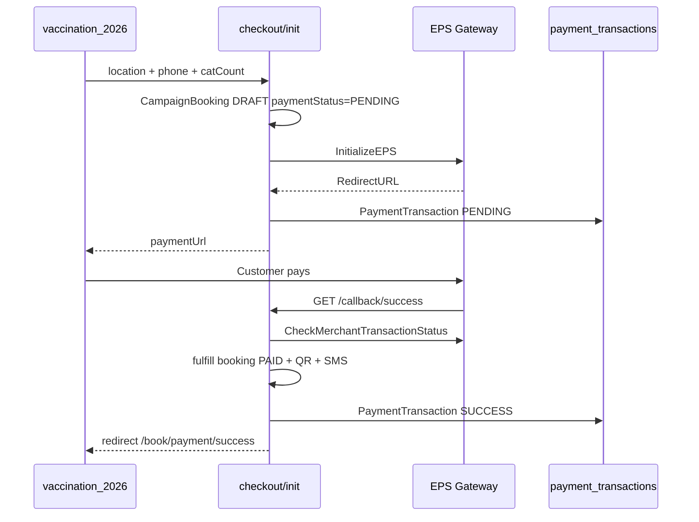

# EPS Bangladesh Payment Gateway — BPA Integration

Production-ready EPS integration for campaign booking checkout. Credentials are read **only** from environment variables — never hardcoded.

## Environment variables

| Variable | Required | Description |
|----------|----------|-------------|
| `PAYMENT_PROVIDER` | Yes (for EPS) | Set to `eps` |
| `API_PUBLIC_BASE_URL` | Yes | Public HTTPS API host for EPS callbacks |
| `EPS_MERCHANT_ID` | Yes | Merchant UUID from EPS panel |
| `EPS_STORE_ID` | Yes | Store UUID from EPS panel |
| `EPS_USERNAME` | Yes | Merchant username (email) |
| `EPS_PASSWORD` | Yes | Merchant password |
| `EPS_HASH_KEY` | Yes | Base64 HMAC hash key (`EPS_HASH` accepted as legacy alias) |
| `EPS_BASE_URL` | Recommended | Sandbox: `https://sandboxpgapi.eps.com.bd` — Live: `https://pgapi.eps.com.bd` |
| `EPS_SANDBOX` | Optional | Default `true` when unset |
| `CAMPAIGN_LANDING_URL` | Recommended | User-facing site for post-payment redirect |
| `PAYMENT_WEBHOOK_SECRET` | Optional | Protects `POST /payment/eps/webhook` |

### Example (sandbox)

```env
PAYMENT_PROVIDER=eps
API_PUBLIC_BASE_URL=https://api-staging.bpa.com.bd
CAMPAIGN_LANDING_URL=https://vaccination-staging.bpa.com.bd

EPS_BASE_URL=https://sandboxpgapi.eps.com.bd
EPS_USERNAME=your_sandbox_username
EPS_PASSWORD=your_sandbox_password
EPS_HASH_KEY=your_base64_hash_key
EPS_MERCHANT_ID=your-merchant-uuid
EPS_STORE_ID=your-store-uuid
EPS_SANDBOX=true
```

## Module layout

```
src/api/v1/modules/payment/
  paymentTransaction.service.ts   # payment_transactions table
  eps/
    eps.config.ts                   # env-only credentials
    eps.gateway.ts                  # GetToken, Initialize, Verify
    eps.service.ts                  # initiate / validate / webhook
    eps.controller.ts
    eps.routes.ts
```

Unified strategy entry (backward compatible): `src/api/v1/payments/` + `PAYMENT_PROVIDER=eps`.

## API endpoints

Base: `/api/v1/payment/eps`

| Method | Path | Purpose |
|--------|------|---------|
| `POST` | `/initiate` | Create EPS payment session |
| `POST` | `/validate` | Server-side transaction verification |
| `POST` / `GET` | `/webhook` | Webhook + verification |
| `GET` | `/callback/success` | EPS success redirect |
| `GET` | `/callback/fail` | EPS fail redirect |
| `GET` | `/callback/cancel` | EPS cancel redirect |
| `GET` | `/callback-urls` | URLs to register in EPS merchant panel |

Campaign checkout (primary UI flow):

| Method | Path | Purpose |
|--------|------|---------|
| `POST` | `/api/v1/campaign/public/checkout/init` | Creates pending booking + EPS session |
| `GET` | `/api/v1/campaign/public/checkout/:id/status` | Poll booking after payment |

## Booking flow



## Security

- Callbacks re-verify with EPS `CheckMerchantTransactionStatus` before fulfilling orders.
- `payment_transactions` unique `(gateway, transactionId)` prevents duplicate processing.
- Redis replay guard (`paymentReplay.guard`) when `REDIS_ENABLED=true`.
- Optional `PAYMENT_WEBHOOK_SECRET` on webhook POST.
- All gateway responses stored in `rawResponse`.

## Database

Table: `payment_transactions`

| Column | Type | Notes |
|--------|------|-------|
| `id` | serial | PK |
| `bookingId` | int? | Linked after fulfillment |
| `transactionId` | varchar | EPS merchant transaction id |
| `gateway` | varchar | `eps` |
| `amount` | decimal | BDT |
| `status` | enum | PENDING / SUCCESS / FAILED / CANCELLED |
| `rawResponse` | jsonb | Full gateway payload |
| `createdAt` / `updatedAt` | timestamp | |

Migration: `20260605160000_payment_transactions`

## Verification

```bash
# Unit tests
npm test -- --testPathPattern="eps.utils|paymentProvider.config"

# EPS DNS + GetToken smoke (needs .env credentials)
node scripts/verify-eps-endpoint.js

# Callback URL list
curl http://localhost:3000/api/v1/payment/eps/callback-urls

# Migration integrity
node scripts/check-migration-integrity.js
```

## Live go-live checklist

1. Set live `EPS_*` credentials in secrets manager (not in git).
2. `EPS_BASE_URL=https://pgapi.eps.com.bd` and `EPS_SANDBOX=false`.
3. Register callback URLs from `GET /api/v1/payment/eps/callback-urls` in EPS merchant panel.
4. Enable Redis + `PAYMENT_WEBHOOK_SECRET` in production.
5. Smoke test: checkout → pay → confirm booking `paymentStatus=COMPLETED`.

## Postman

Import: `docs/postman/eps-payment.postman_collection.json`
