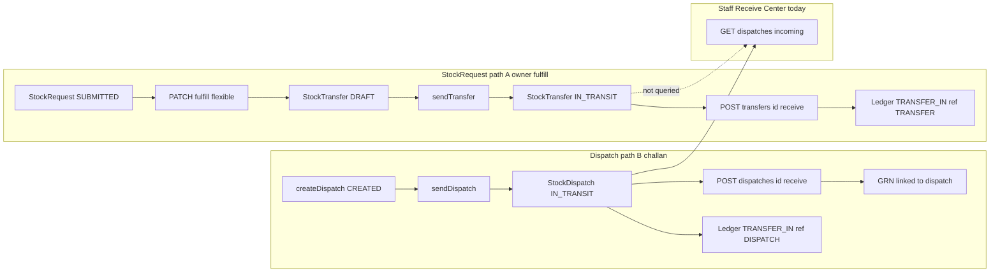

# Inventory Receive Center — root-cause audit and implementation plan

**Target doc file:** `docs/inventory-receive-center-root-cause-plan.md` (this file)

**Assumptions:**

- “Central warehouse fulfills stock requests” means the **owner** flow: `PATCH /api/v1/stock-requests/:id/fulfill` from `bpa_web/app/owner/(larkon)/inventory/stock-requests/[id]/page.tsx`, not only pick-list / direct-dispatch side flows.
- Staff user can open Receive Center (has `inventory.receive`) and sees the **empty state** (not a 403 banner), so `getIncomingDispatches` succeeds with `data: []`.
- Branch URL `branchId` matches `InventoryLocation.branchId` on the destination location chosen at fulfill time.

---

## 1. Problem summary

Staff **Receive Center** promises “incoming dispatches” from warehouse fulfillment, but the **dominant stock-request fulfillment path** persists **transfers** (`stock_transfers`), not **dispatch documents** (`stock_dispatches`). The page only queries the latter, so the list is empty even when stock is legitimately in transit to the branch.

---

## 2. Current observed symptom

- Route: `/staff/branch/[branchId]/inventory/receive`
- Copy: “Dispatches in transit…” / empty state “No incoming dispatches” / hint linking to Stock Requests
- User context: clinic branch manager–style role with `inventory.receive`

---

## 3. Expected enterprise behavior

One coherent **inbound queue** at the destination branch for “warehouse fulfilled my requisition”: staff with **receive** permission sees all receivable inbound movements (whether implemented as dispatch challan or internal transfer), can open detail, confirm receive, and ledger/GRN behavior stays auditable and consistent with org policy.

---

## 4. End-to-end flow map

**Narrative:** Stock Request → owner fulfill → **Transfer created + sent** → **IN_TRANSIT on `StockTransfer`** → branch staff must receive via **transfer receive** → inventory updates via ledger (`refType: TRANSFER`).

**Parallel path:** Pick handoff / direct-dispatch → **`StockDispatch` CREATED** → **`sendDispatch`** → **IN_TRANSIT** → Receive Center **can** show row → **`receiveDispatch`** → GRN + ledger (`refType: DISPATCH`).

---

## 5. Root causes (confirmed vs suspected)

| Priority | Finding | Status |
| -------- | ------- | ------ |
| **P0** | Fulfillment writes **StockTransfer**, Receive Center reads **StockDispatch** | **Confirmed** |
| **P1** | Dispatch documents start **CREATED**; incoming API only lists **IN_TRANSIT** | **Confirmed** |
| **P2** | In-transit **transfers** are surfaced on **Transfers** UI, gated by **`inventory.transfer`** | **Confirmed architecture** |
| **P3** | `toLocation.branchId` mismatch would empty dispatch list | **Suspected** when dispatch path is used |
| **P4** | Silent empty array if response shape wrong | **Low** |

---

## 6. Implementation delivered (this change set)

- **GET** `/api/v1/inventory/receipts/incoming-unified?branchId=` — normalized rows: `kind` `DISPATCH` | `TRANSFER`, `receivable`, line summaries; includes **PACKED** + **IN_TRANSIT** dispatches and **SENT** + **IN_TRANSIT** transfers to the branch (scoped by org when available).
- Staff **Receive Center** consumes this endpoint and routes **Receive** to dispatch vs transfer APIs.
- **Transfers** `POST /:id/receive` middleware now lists `inventory.receive` explicitly; controller enforces destination branch access for receivers.

---

## 7. Exact API endpoints

| Purpose | Method / path |
| ------- | -------------- |
| Incoming unified queue | `GET /api/v1/inventory/receipts/incoming-unified?branchId=` |
| Incoming dispatches only (legacy) | `GET /api/v1/inventory/dispatches/incoming?branchId=` |
| Receive dispatch | `POST /api/v1/inventory/dispatches/:id/receive` |
| Receive transfer | `POST /api/v1/transfers/:id/receive` |

---

## 8. Status enums (reference)

- **StockTransfer:** `DRAFT`, `SENT`, `IN_TRANSIT`, …
- **StockDispatch:** `CREATED`, `PACKED`, `IN_TRANSIT`, `DELIVERED`, …

---

## 9. Risk notes

- **Double ledger** if both transfer and dispatch are created for the same movement (do not emit both without design).
- **GRN parity:** `receiveDispatch` creates GRN; `receiveTransfer` does not.

---

## 10. Regression checklist

- Owner `PATCH /fulfill` still creates in-transit **transfer** until a future canonical migration.
- `POST /transfers/:id/receive` and `POST /dispatches/:id/receive` behavior preserved.
- Branch 403 for wrong `branchId` on unified incoming.

---

## 11. Manual test scenarios

1. Stock request → owner fulfill → **StockTransfer** `IN_TRANSIT` → Receive Center shows **Transfer** row → receive → inventory updates.
2. Direct dispatch → send → **StockDispatch** `IN_TRANSIT` → Receive Center shows **Dispatch** row → receive → GRN.
3. **PACKED** dispatch appears as not receivable until sent.

---

## Implementation order (completed)

1. This document.
2. Backend unified incoming query + route.
3. Staff Receive Center + dual receive handlers.
4. Copy updates on Receive Center.
5. Seed / QA fixtures where feasible.

---

## Files to change (reference)

- Backend: `inboundReceipts.service.ts`, `dispatches.controller.ts`, `inventory.routes.ts`, `transfers.routes.ts`, `transfers.controller.ts`
- Frontend: `lib/api.ts`, `receive/page.jsx`, optional shared receive components
- Docs: this file

---

## Smoke tests

- `GET /api/v1/inventory/receipts/incoming-unified?branchId={id}` with auth.
- Fulfill stock request → Receive Center shows transfer → receive succeeds.
- `POST /api/v1/inventory/dispatches/:id/receive` and `POST /api/v1/transfers/:id/receive` unchanged for authorized users.

## QA fixtures

See [INBOUND_RECEIVE_QA_FIXTURES.md](./INBOUND_RECEIVE_QA_FIXTURES.md). Optional env `SEED_INBOUND_RECEIVE_QA=true` on seed logs inbound row counts (no writes).
