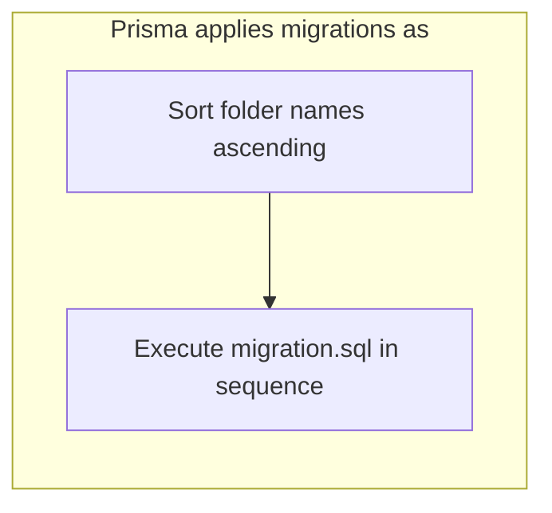
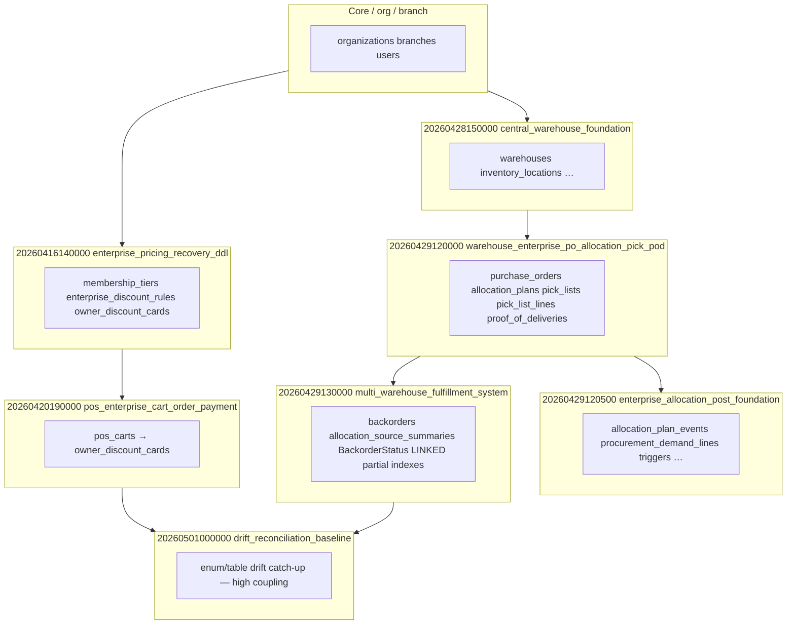

# Migration dependency graph (overview)

**Purpose:** High-level ordering for warehouse, pricing/POS, and “deferred consolidation” migrations.  
**Detail:** Full ordering is the **sorted list of folder names** under `prisma/migrations/`.

---

## 1. Lexicographic ordering rule



Implication: **`20260411…` < `20260428…` < `20260429…` < `20260501…`** always.

---

## 2. Module-level dependency (simplified)



---

## 3. Critical ordering constraints

| Dependency | Must exist before |
|------------|------------------|
| `warehouses` | Warehouse-scoped FKs (often deferred in `DO` blocks + applied in `20260428150100`, `20260429120500`, etc.) |
| `membership_tiers` | `owner_discount_cards.membershipTierId` |
| `owner_discount_cards` | `pos_carts.ownerDiscountCardId` (`20260420190000`) |
| `allocation_plans` (+ `parentPlanId` for partial unique) | Supplementary-plan rules (`20260429130000` absorbs earlier intent) |
| `pick_lists` | Any index/ALTER on `pick_lists` |

---

## 4. Consolidation migrations (merge targets)

When an early migration would reference tables that do **not** exist until later, the codebase uses:

1. **Placeholder** early migration (`SELECT 1` + comment).
2. **Substantive DDL** in the **first migration that runs after** all prerequisites exist.

Examples: `20260404200000` → `20260429120500`; April 2026 pick/backorder placeholders → `20260429120000` / `20260429130000`.

---

## 5. Tooling

Generating a machine-readable graph for all 250+ folders is best done by:

```bash
ls prisma/migrations | sort
npm run migrate:audit-deps
```

The JSON output lists **heuristic** dependency violations (should be empty after repairs).
