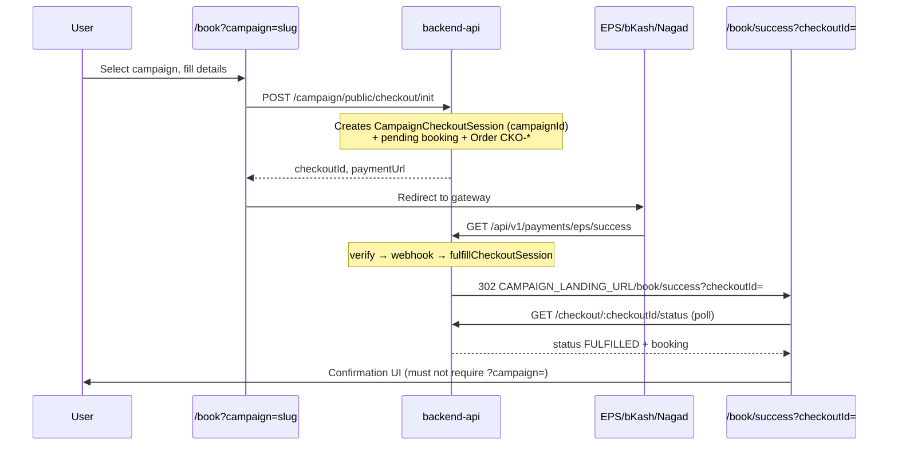

# Vaccination Booking Payment Flow — Root Cause & Fix Plan

**Date:** 2026-06-07  
**Symptom:** After successful EPS/bKash payment, user lands on `/book/success?checkoutId=…` but the page shows **"No campaign was selected"**.  
**Repos:** `backend-api` (checkout, payment, redirect), `vaccination_2026` (landing, success UI)

---

## Executive summary

Campaign context is **persisted correctly** in the database (`CampaignCheckoutSession.campaignId`) and the post-payment redirect **does** include `checkoutId`. The bug is **frontend-only**: the success page polls checkout status successfully, then mounts `BookingWizard` with `initialSuccess` but **without** `campaignSlug`. `BookingWizard` still enforces `?campaign=` via an early `if (!activeSlug)` guard **before** rendering the success step.

| Layer | Campaign context | Status |
|-------|------------------|--------|
| Checkout init | `campaignId` on session | OK |
| Payment intent / EPS `ValueB` | `checkoutSessionId` | OK (post prior fixes) |
| API callback redirect | `/book/success?checkoutId=` | OK |
| `GET /checkout/:id/status` | Resolves booking via session | OK |
| Success page polling | Sets `success` when `FULFILLED` | OK |
| `BookingWizard` render | Requires `campaignSlug` prop | **BUG** |

**Fix:** Success UI must not depend on URL `?campaign=` when `checkoutId` (or booking ref / payment transaction) is available. Render confirmation from checkout status payload; enrich API with campaign name/slug from session join.

---

## 1. End-to-end flow



### Step-by-step touch points

| Step | Location | What happens |
|------|----------|--------------|
| 1. Campaign selection | `vaccination_2026/app/book/page.tsx` | `resolveBookingCampaignSlug` from `?campaign=` |
| 2. Booking draft | `BookingWizard` + `sessionStorage` (`bpa_booking_draft_v7`) | Stores location, pets, `checkoutId` after init |
| 3. Checkout init | `checkout.service.ts` → `initCheckout` | Session row with `campaignId`, amount, `PENDING` |
| 4. Payment intent | `payment.service.ts` → `createCheckoutPaymentIntent` | Order `CKO-*`, EPS metadata `ValueB` = session id |
| 5. Return URLs | `checkout.service.ts` L442–446 | `returnUrl` / `cancelUrl` append `checkoutId` |
| 6. Gateway redirect | EPS success callback | `eps.redirectPaths.ts` → `/book/success?checkoutId=` |
| 7. Fulfillment | `fulfillCheckoutFromOrder` → `fulfillCheckoutSession` | Session `FULFILLED`, booking `CONFIRMED`, SMS |
| 8. Success page | `app/book/success/page.tsx` | Poll `getCheckoutStatus` until `FULFILLED` |
| 9. Confirmation UI | **Was:** `BookingWizard initialSuccess` **Bug:** slug guard | **Fix:** `PostCheckoutSuccess` / slug bypass |

---

## 2. Where campaign context is (and is not) lost

### Not lost (server-side)

- `CampaignCheckoutSession.campaignId` — set at init, never cleared.
- `createCheckoutPaymentIntent` passes `campaignName` to gateway display only.
- EPS redirect carries `checkoutId` (from `ValueB` or `MerchantTransactionId` `CKO-*` resolution).
- `getCheckoutStatus` loads booking by `checkoutSessionId` / `session.bookingId`.

### Lost at UI boundary (root cause)

```253:258:vaccination_2026/components/booking/BookingWizard.tsx
  if (!activeSlug) {
    return (
      <div className="booking-alert booking-alert--danger" role="alert">
        {MISSING_CAMPAIGN_SLUG_MESSAGE}
      </div>
    );
  }
```

Success page call site:

```156:161:vaccination_2026/app/book/success/page.tsx
  if (success) {
    return (
      <div className="container py-4 py-lg-5">
        <BookingWizard initialSuccess={success} />
      </div>
    );
  }
```

`initialSuccess` sets `bookingResult` and `step === 2`, but the slug guard runs first → user sees **"No campaign was selected"** despite valid `checkoutId` and fulfilled booking.

### Secondary gaps (non-blocking for this bug)

| Gap | Impact | Fix |
|-----|--------|-----|
| `getCheckoutStatus` omits campaign name/slug | Success UI cannot show campaign without extra fetch | Join `campaign` in status API |
| `/book/payment/failed` ignores `checkoutId` | Cancel/fail redirects pass `checkoutId` but page only shows `ref` | Poll status / show recovery copy |
| `BookingDetails` has no `campaign` field | Booking-by-ref paths need separate campaign fetch | Optional `campaign` on checkout status only |

---

## 3. Requirements mapping

| Requirement | Approach |
|-------------|----------|
| Load by `checkoutId` | Already implemented on success page (poll) |
| Load by booking ref | Legacy `/book/payment/success?ref=` + optional `ref` on success URL |
| Load by payment transaction | Server resolves `CKO-*` → checkout session in EPS callback |
| No `?campaign=` on success | Render `PostCheckoutSuccess` from status payload |
| Show booking + payment + campaign | Status API adds `campaign`; booking has `paymentStatus` |
| Never show missing-campaign after paid | Remove `BookingWizard` from post-payment path; guard `initialSuccess` in wizard |

---

## 4. Implementation plan

### Backend (`backend-api`)

1. **`getCheckoutStatus`** — `include: { campaign: { select: { name, slug } } }`; return `campaign`, `paymentMethod`, surface `booking.paymentStatus`.
2. No schema migration required (`campaignId` already on session).

### Frontend (`vaccination_2026`)

1. **`PostCheckoutSuccess`** — Renders campaign label, payment status badge, `StepSuccess`.
2. **`app/book/success/page.tsx`** — Use `PostCheckoutSuccess` instead of `BookingWizard`.
3. **`BookingWizard`** — Early return for `initialSuccess` (defensive, other callers).
4. **`CheckoutStatus` type** — Add `campaign`, `paymentMethod`.
5. **`app/book/payment/failed/page.tsx`** — Accept `checkoutId` + `reason`; optional status poll.

---

## 5. Verification matrix

| Scenario | Expected landing URL | Expected UI |
|----------|-------------------|-------------|
| bKash success | `/book/success?checkoutId=` | Confirmation + campaign + payment paid |
| Nagad success | Same (EPS unified) | Same |
| Cancelled | `/book/payment/failed?checkoutId=&reason=cancelled` | Failed/cancelled message, retry link |
| Failed payment | `/book/payment/failed?checkoutId=` | Failed message |
| Refresh success page | Same URL | Re-poll → same confirmation (idempotent) |
| New tab success URL | `checkoutId` in URL only | Works without `sessionStorage` |

### Automated

- `npm test` — EPS redirect + payment guards (existing).
- Add unit coverage for checkout status campaign enrichment if test harness allows.

### Manual (staging)

1. Complete paid booking → confirm no "No campaign was selected".
2. Hard refresh `/book/success?checkoutId=…`.
3. Open success URL in incognito/new tab.
4. Cancel at gateway → failed page with `checkoutId`.
5. Decline/fail payment → failed page.

---

## 6. Deployment notes

- Deploy **backend-api** first (status API enrichment is backward compatible).
- Deploy **vaccination_2026** success page + wizard guard.
- Confirm `CAMPAIGN_LANDING_URL` matches production landing host.
- EPS success route must remain `GET /api/v1/payments/eps/success` (not legacy SSL redirect without `checkoutId`).

---

## 7. Implementation status (2026-06-07)

| Change | File |
|--------|------|
| Status API returns `campaign`, `paymentMethod` | `checkout.service.ts` → `getCheckoutStatus` |
| Post-payment UI without `?campaign=` | `PostCheckoutSuccess.tsx`, `app/book/success/page.tsx` |
| Defensive wizard guard | `BookingWizard.tsx` early `initialSuccess` return |
| Failed/cancel page `checkoutId` enrichment | `app/book/payment/failed/page.tsx` |
| Success alert style | `app/globals.css` → `.booking-alert--success` |

---

## 8. Related documents

- `docs/audits/production-payment-success-bug.md` — bare `/book/success` without query (prior fix)
- `docs/audits/payment-success-callback-root-cause.md` — EPS verify 404 / fulfillment
- `docs/payment/eps-gateway-setup.md` — gateway configuration
