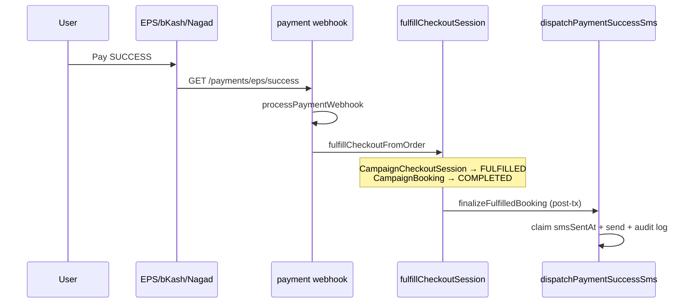

# Payment Success SMS — BPA Vaccination 2026

**Date:** 2026-06-07  
**Scope:** Backend-only confirmation SMS after paid express checkout fulfillment.

---

## Goal

Send exactly **one** SMS when a vaccination booking is **paid** (`paymentStatus = COMPLETED`) and the express checkout session reaches **`FULFILLED`**.

SMS is never triggered from frontend pages (`/book/success`, polling, refresh, or new tab).

---

## Payment flow (where SMS fires)



| Step | Module | Event |
|------|--------|-------|
| Checkout init | `checkout.service.ts` | Session `PENDING`, booking `PENDING` |
| Gateway pay | EPS / unified payments | Order `CKO-*` |
| Callback | `eps.service.ts` → `processPaymentWebhook` | Order `COMPLETED` |
| Fulfillment | `fulfillCheckoutSession` | Session `FULFILLED`, booking `COMPLETED` |
| SMS | `finalizeFulfilledBooking` | `dispatchPaymentSuccessSms(bookingId)` |
| Status poll | `getCheckoutStatus` | Read-only — **no SMS** |

### Legacy non-checkout webhook path

If a booking is confirmed via `processPaymentWebhook` **without** express checkout fulfillment (`fulfilledViaCheckout === false`), the same `dispatchPaymentSuccessSms` runs from `payment.service.ts`. Idempotency via `smsSentAt` prevents duplicates when both paths could theoretically run.

---

## Service

**File:** `src/services/notification/payment-success-sms.service.ts`

| Responsibility | Detail |
|----------------|--------|
| Eligibility | `paymentStatus` ∈ `COMPLETED` (or `NOT_REQUIRED` for free express fulfilled checkout); checkout session `FULFILLED` when `checkoutSessionId` present |
| Idempotency | `smsSentAt` claim via `updateMany … WHERE smsSentAt IS NULL` |
| Message | Fixed 2026 vaccination template (venue) or zone-interest variant |
| Delivery | `sendSMS` + `campaign_sms_logs` row |
| Audit | `logCampaignAudit` → `PAYMENT_SUCCESS_SMS_SENT` / `PAYMENT_SUCCESS_SMS_FAILED` |
| Logging | `[PAYMENT_SUCCESS_SMS]` with `bookingId`, `checkoutId`, `phone`, `providerResponse` |

### Message template (venue / confirmed)

```
Bangladesh Pet Association

Your vaccination booking is confirmed.

Booking Ref: {bookingRef}
Campaign: {campaignName}
Pet: {petName}
Date: {appointmentDate}

Thank you.
```

Zone-interest pending assignment uses a separate body (area + “venue/date/time via SMS later”).

---

## Database

Migration: `20260607120000_campaign_booking_payment_success_sms`

| Column | Type | Purpose |
|--------|------|---------|
| `smsSentAt` | `DateTime?` | Set when dispatch is claimed/sent — blocks duplicates |
| `smsReference` | `Varchar(64)?` | e.g. `campaign_sms_log:501` or gateway id |

Table: `campaign_bookings` (`CampaignBooking` model).

---

## Duplicate prevention

| Scenario | Behavior |
|----------|----------|
| EPS callback retry | `smsSentAt` set → `skipped_duplicate` |
| Webhook retry | Same |
| `fulfillCheckoutFromOrder` + webhook | Webhook logs `payment_success_sms_skip_webhook`; SMS only from `finalizeFulfilledBooking` |
| Success page refresh / poll | No backend SMS call |
| Concurrent claims | Second `updateMany` returns `count: 0` → skip |

---

## Configuration

Uses existing SMS stack:

- `SMS_PROVIDER` / BulkSMSBD env vars (see `docs/sms/bulksmsbd-setup.md`)
- BullMQ worker when Redis available (`notificationWorker.ts`)

---

## Deployment checklist

1. **Review migration SQL**  
   `prisma/migrations/20260607120000_campaign_booking_payment_success_sms/migration.sql`

2. **Integrity check (before deploy)**  
   ```bash
   node scripts/check-migration-integrity.js
   ```

3. **Apply migration**  
   ```bash
   npx prisma migrate deploy
   npx prisma generate
   ```

4. **Deploy backend-api** (API + workers if separate)

5. **Verify env**  
   - `BULKSMSBD_*` or `SMS_*` credentials  
   - `CAMPAIGN_LANDING_URL` (unchanged; not used for SMS trigger)

6. **Smoke test (staging)**  
   - Complete one paid bKash booking  
   - Confirm one SMS received  
   - Refresh `/book/success?checkoutId=…` → no second SMS  
   - Check logs for `[PAYMENT_SUCCESS_SMS] event=sent`  
   - Check `campaign_bookings.smsSentAt` populated

7. **Integrity check (after deploy)**  
   ```bash
   node scripts/check-migration-integrity.js
   ```

---

## Modified files

| File | Change |
|------|--------|
| `prisma/schema.prisma` | `smsSentAt`, `smsReference` on `CampaignBooking` |
| `prisma/migrations/20260607120000_campaign_booking_payment_success_sms/migration.sql` | Additive columns |
| `src/services/notification/payment-success-sms.service.ts` | **New** — dispatch service |
| `src/services/notification/payment-success-sms.service.test.ts` | **New** — unit tests |
| `src/api/v1/modules/campaign/checkout.service.ts` | `finalizeFulfilledBooking` → `dispatchPaymentSuccessSms` |
| `src/api/v1/modules/campaign/payment.service.ts` | Webhook path → `dispatchPaymentSuccessSms` |
| `src/api/v1/modules/campaign/payment.service.test.ts` | Mock new service |
| `docs/payment-success-sms.md` | **New** — this document |

---

## Related

- `docs/payment-flow-fix.md` — success page / checkout redirect
- `docs/sms/bulksmsbd-setup.md` — gateway credentials
- `docs/audits/payment-success-callback-root-cause.md` — EPS callback history
