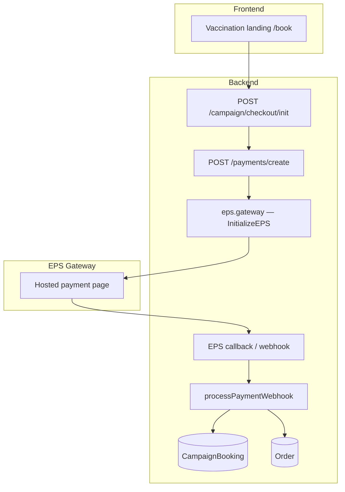
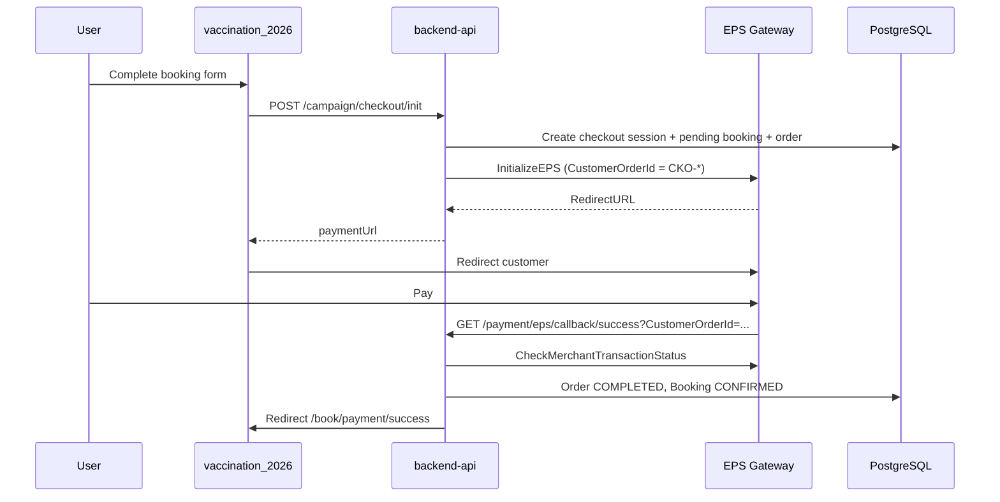

# EPS Payment Gateway — Setup Guide

**Project:** BPA Vaccination Campaign 2026  
**Backend:** `backend-api`  
**Related audit:** [eps-gateway-audit.md](./eps-gateway-audit.md)

---

## Architecture

EPS integrates through two complementary layers:

1. **Unified payment strategy** (`PAYMENT_PROVIDER=eps`) — used by campaign checkout and booking payment flows.
2. **Dedicated EPS module** (`/api/v1/payment/eps/*`) — direct initiate/validate/webhook endpoints for testing or custom clients.

Both layers share the same gateway client (`eps.gateway.ts`) and configuration.



---

## Payment flow



---

## Required environment variables

Set in `backend-api/.env` (never commit secrets):

```env
PAYMENT_PROVIDER=eps
API_PUBLIC_BASE_URL=https://api.yourdomain.com
CAMPAIGN_LANDING_URL=https://vaccination.yourdomain.com

EPS_BASE_URL=https://sandboxpgapi.eps.com.bd
EPS_SANDBOX=true
EPS_USERNAME=<from EPS merchant panel>
EPS_PASSWORD=<from EPS merchant panel>
EPS_HASH_KEY=<base64 hash key>
EPS_MERCHANT_ID=<merchant id>
EPS_STORE_ID=<store id>

# Optional overrides (defaults derived from API_PUBLIC_BASE_URL)
# EPS_CALLBACK_URL=https://api.yourdomain.com/api/v1/payment/eps/webhook
# EPS_SUCCESS_URL=https://api.yourdomain.com/api/v1/payment/eps/callback/success
# EPS_FAIL_URL=https://api.yourdomain.com/api/v1/payment/eps/callback/fail
# EPS_CANCEL_URL=https://api.yourdomain.com/api/v1/payment/eps/callback/cancel

PAYMENT_WEBHOOK_SECRET=<optional shared secret for webhook POST>
CAMPAIGN_PAYMENT_TIMEOUT_MINUTES=30
```

| Variable | Purpose |
|----------|---------|
| `EPS_BASE_URL` | REST API host (`sandboxpgapi.eps.com.bd` sandbox, `pgapi.eps.com.bd` production) |
| `EPS_CALLBACK_URL` | Server-side webhook URL registered in EPS dashboard |
| `EPS_SUCCESS_URL` / `FAIL` / `CANCEL` | Browser return URLs after payment |
| `API_PUBLIC_BASE_URL` | Public HTTPS base for auto-generated callback URLs |

**Important:** Do **not** use `sandbox-pgapi.eps.com.bd` (typo — DNS NXDOMAIN).

---

## API endpoints

### Campaign (used by vaccination_2026)

| Method | Endpoint | Description |
|--------|----------|-------------|
| POST | `/api/v1/campaign/checkout/init` | Start checkout; returns `paymentUrl` when payment required |
| GET | `/api/v1/campaign/checkout/:id/status` | Poll checkout / booking status |
| POST | `/api/v1/campaign/booking/:ref/payment` | Legacy booking payment intent |
| GET | `/api/v1/campaign/booking/:ref/payment-status` | Payment status for booking |
| GET | `/api/v1/campaign/payments/callback-urls` | All provider callback URLs |

### Unified payments

| Method | Endpoint | Description |
|--------|----------|-------------|
| POST | `/api/v1/payments/create` | Create payment session (active provider) |
| POST | `/api/v1/payments/verify` | Verify payment |
| GET/POST | `/api/v1/payments/webhook` | Unified webhook handler |
| GET | `/api/v1/payments/callback-urls` | Provider URL registry |

### EPS module (direct — canonical paths)

| Method | Endpoint | Description |
|--------|----------|-------------|
| POST | `/api/v1/payments/eps/initiate` | Create EPS session |
| POST | `/api/v1/payments/eps/validate` | Verify with EPS API (JSON body) |
| GET | `/api/v1/payments/eps/verify/:transactionId` | Verify by transaction id |
| GET/POST | `/api/v1/payments/eps/webhook` | Webhook / IPN |
| GET | `/api/v1/payments/eps/success` | Success browser callback |
| GET | `/api/v1/payments/eps/fail` | Failure browser callback |
| GET | `/api/v1/payments/eps/cancel` | Cancel browser callback |
| GET | `/api/v1/payments/eps/callback-urls` | EPS URL list |

**Legacy aliases (same handlers):** `/api/v1/payment/eps/*` and `/callback/success|fail|cancel`.

---

## Callback URLs (register in EPS merchant panel)

With `API_PUBLIC_BASE_URL=https://api.example.com`:

| Type | URL |
|------|-----|
| Success | `https://api.example.com/api/v1/payments/eps/success` |
| Fail | `https://api.example.com/api/v1/payments/eps/fail` |
| Cancel | `https://api.example.com/api/v1/payments/eps/cancel` |
| Webhook | `https://api.example.com/api/v1/payments/eps/webhook` |

After success/fail/cancel, the API redirects the browser to `CAMPAIGN_LANDING_URL` paths:
- Success → `/book/success?checkoutId=...` (express checkout; resolved from `CKO-*` order if EPS omits query params) or `/book/payment/success?ref=...` (legacy)
- Fail/Cancel → `/book/payment/failed?...`

If EPS `CheckMerchantTransactionStatus` returns HTTP 404, the API falls back to browser callback params and still fulfills the order (see `docs/audits/payment-success-callback-root-cause.md`).

After success, users are redirected to `{CAMPAIGN_LANDING_URL}/book/success?checkoutId={sessionId}` resolved from `MerchantTransactionId` (`CKO-*`). Deploy checklist: `docs/audits/payment-success-production-deploy.md`.

---

## Deployment checklist

- [ ] Set `PAYMENT_PROVIDER=eps`
- [ ] Set all EPS credentials (sandbox or production)
- [ ] Set `API_PUBLIC_BASE_URL` to public HTTPS API URL
- [ ] Set `CAMPAIGN_LANDING_URL` to vaccination site URL
- [ ] Set `CAMPAIGN_PAYMENT_BRANCH_ID` or ensure at least one `ACTIVE` branch exists
- [ ] Run migrations: `npx prisma migrate deploy` (includes `payment_transactions` tables)
- [ ] Restart API after env changes
- [ ] Verify startup log: `[Payment] Active provider: eps`
- [ ] Run connectivity scripts (below)
- [ ] Smoke-test checkout on staging
- [ ] Confirm booking stays `PENDING` until payment, then `CONFIRMED`

### Startup verification

```bash
cd backend-api
npx ts-node scripts/test-eps-connection.ts
node scripts/verify-eps-endpoint.js
node scripts/verify-payment-provider-config.js
```

Expected startup logs:

```text
[Payment] EPS gateway: baseUrl=https://sandboxpgapi.eps.com.bd | sandbox=enabled
[Payment] Active provider: eps
[Payment] Webhook base: https://api.example.com/api/v1/payments/webhook | configured: yes
```

---

## Manual testing checklist

### Sandbox payment

1. Open vaccination landing `/book` with a paid campaign.
2. Complete booking steps → reach payment gateway step.
3. Confirm API returns `paymentUrl` from `checkout/init`.
4. Complete payment on EPS sandbox page.
5. Confirm redirect to `/book/payment/success` or `/book/success`.
6. Verify booking: `paymentStatus=COMPLETED`, `status=CONFIRMED`.
7. Verify order row: `paymentStatus=COMPLETED`.
8. Check `payment_transaction_logs` and `payment_transactions` rows.

### Failure paths

- [ ] Cancel on EPS page → booking remains unpaid, redirect to failed page
- [ ] Failed payment → `paymentStatus=FAILED` on booking
- [ ] Retry payment after failure → new redirect URL issued

### Idempotency

- [ ] Replay same success webhook/callback → no duplicate `order_payments`, returns `duplicate: true`
- [ ] Double-click pay on frontend → single order (Serializable transaction guard)

### Direct EPS module (optional)

```bash
curl -X POST https://api.example.com/api/v1/payment/eps/initiate \
  -H "Content-Type: application/json" \
  -d '{"referenceId":"TEST-001","amount":100,"metadata":{"phone":"01700000000"}}'
```

Postman collection: `docs/postman/eps-payment.postman_collection.json`

---

## Risks and assumptions

| Item | Notes |
|------|-------|
| EPS sandbox credentials | Must match EPS merchant panel; demo creds may differ from production |
| Public HTTPS required | EPS cannot callback to `localhost` — use ngrok or staging URL |
| `CustomerOrderId` mapping | Order lookup relies on EPS returning `CustomerOrderId` (= `CAMP-*` / `CKO-*`); fallback uses `PaymentTransactionLog` |
| No Prisma migration in this pass | Uses existing `payment_transactions` / `payment_transaction_logs` tables |
| Frontend provider-agnostic | Switching away from EPS is env-only (`PAYMENT_PROVIDER`) |
| Hash key encoding | `EPS_HASH_KEY` must be the base64 key from EPS documentation |

---

## Troubleshooting

| Symptom | Likely cause | Action |
|---------|--------------|--------|
| `ENOTFOUND sandbox-pgapi.eps.com.bd` | Wrong hostname | Set `EPS_BASE_URL=https://sandboxpgapi.eps.com.bd` |
| `EPS payment gateway is not configured` | Missing/placeholder env | Run `node scripts/verify-payment-provider-config.js` |
| Webhook 404 order not found | Callback URL or txn id mismatch | Check `CustomerOrderId` in callback query; see audit doc |
| Payment OK but booking still PENDING | Callback URL not reaching API | Verify EPS dashboard URLs and `API_PUBLIC_BASE_URL` |
| "Campaign payment setup not configured" | No ACTIVE branch in DB | Seed branch or set `CAMPAIGN_PAYMENT_BRANCH_ID` — **not an EPS credential issue** |
