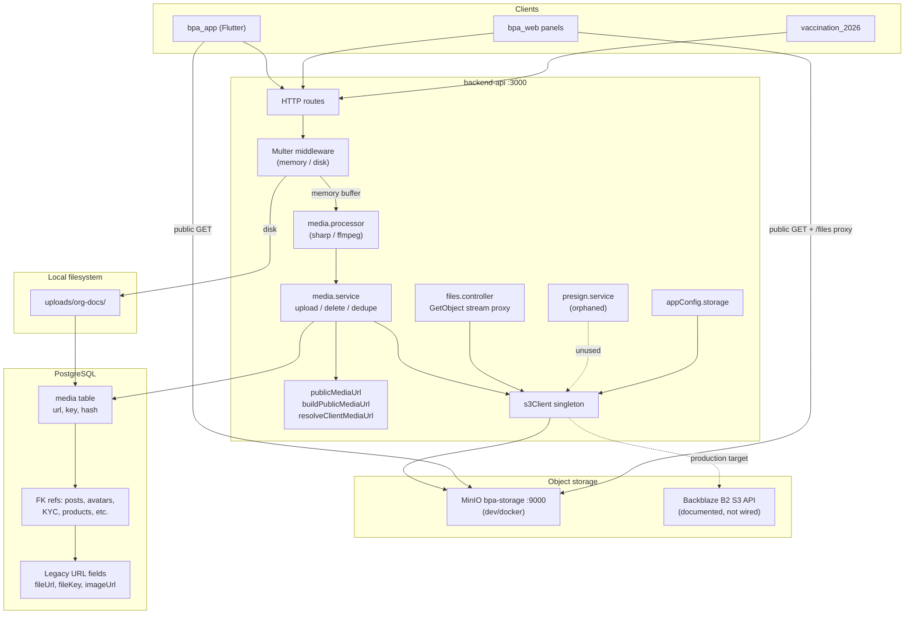

# Backblaze B2 Storage Migration Plan

**Date:** 2026-06-05  
**Scope:** `backend-api` object storage architecture audit and production migration from self-hosted MinIO to Backblaze B2  
**Status:** Planning only — no code changes in this document  
**Related audits:** `docs/image-storage-audit-report.md`, `docs/media_module_recovery_report.md`, `DISASTER-RECOVERY-PLAYBOOK.md`

---

## Executive summary

The BPA backend uses a **single S3-compatible client** (`@aws-sdk/client-s3`) backed by **MinIO in development** (Docker service `bpa-storage`) and documented **Backblaze B2 placeholders in `.env.example`** that are **not wired into runtime code**. All primary uploads flow through `media.service.ts` → `PutObject` → PostgreSQL `media` table (`url` + `key`).

**Backblaze B2 can serve as a near drop-in replacement** at the SDK layer because the codebase already uses path-style S3 API calls with a configurable endpoint. However, migration is **not env-only**: public URL semantics, bucket policy setup, dual env-var naming (`AWS_*` vs `S3_*`), local-disk org documents, and client `MEDIA_BASE_URL` / `MINIO_PUBLIC_URL` alignment must be addressed.

**Recommendation:** Keep MinIO for local/docker dev; point production `AWS_*` (or unified storage config) at B2; migrate objects with `rclone`/`aws s3 sync`; run URL repair script; validate public read via B2 bucket settings or CDN.

---

## 1. Current architecture

### 1.1 Architecture diagram



### 1.2 Storage access patterns

| Pattern | Used for | Mechanism |
|---------|----------|-----------|
| **Public direct GET** | Feed images, avatars, post media, most uploads | `media.url` or `resolveClientMediaUrl(key)` → `{MINIO_PUBLIC_URL}/{bucket}/{key}` |
| **API proxy stream** | Owner KYC documents | `GET /api/v1/files/{key}` → `GetObjectCommand` → pipe to response |
| **Presigned GET** | Intended for KYC previews | `presign.service.ts` — **not wired** (`ownerKyc.presign.patch.ts` orphaned) |
| **Local disk** | Organization legal documents | `uploads/org-docs/` → API-relative URL |
| **Runtime-generated** | Campaign certificates, booking QR | HTML/PDF generated in-process — **not stored in object storage** |
| **Metadata-only** | Vendor/ticket attachments | `fileKey` stored; upload assumed client-side |

### 1.3 Object key layout

```
{countryCode}/          # optional prefix when STORAGE_USE_COUNTRY_PREFIX=true (default)
  {folder}/
    {ownerUserId}/
      {timestamp}_{random}{ext}
```

**Known folder prefixes:**

| Folder | Caller |
|--------|--------|
| `media` | Default (`media.controller`, posts) |
| `avatars` | `meProfile.service.ts` |
| `owner-kyc` | `owner.controller.ts` |
| `verification/{entityType}` | `owner.verification.controller.ts` |
| `doctor-verification` | `doctorVerification.controller.ts` |
| `verification/producer_org` | `producerKyc.controller.ts` |
| `producer-product-proofs` | `producer.controller.ts` |
| `clinical-items` | `ownerClinic.controller.ts` |
| `{dynamic}` | `master-catalog.service.ts` (image import) |

---

## 2. Provider abstraction assessment

### 2.1 Current state: **no provider pattern**

Storage is implemented as a **thin singleton stack**, not a swappable provider interface:

```
appConfig.storage (env → object)
    → s3Client.ts (S3Client singleton)
        → media.service.ts | files.controller.ts | presign.service.ts | s3Upload.ts | init-minio.ts
```

| Expected abstraction | Present? |
|---------------------|------------|
| `StorageProvider` interface | No |
| Factory / strategy on `STORAGE_PROVIDER` | No — `STORAGE_PROVIDER=s3` in `.env.example` is **never read** |
| Separate public vs private bucket adapters | No — single `bucketName` |
| Provider-specific init scripts | Only `scripts/init-minio.ts` (MinIO-oriented bucket policy) |

### 2.2 What *is* abstracted

- **S3 API surface:** All object I/O uses AWS SDK commands (`PutObject`, `GetObject`, `DeleteObject`, `HeadObject`) — compatible with MinIO, AWS S3, and B2 S3-compatible API.
- **URL resolution:** `publicMediaUrl.ts` rebuilds client URLs from `key` + config, decoupling stored URLs from host changes.
- **Upload pipeline:** `media.service.uploadAndCreateMedia` is the single canonical upload entry point for ~95% of flows.

### 2.3 Implication for B2

B2 integration does **not** require a full provider framework for MVP. Mapping production env vars to the existing `AWS_*` config (or extending `appConfig`) is sufficient. A formal provider interface is optional technical debt cleanup, not a migration blocker.

---

## 3. Backblaze B2 drop-in compatibility

### 3.1 Verdict: **SDK-level drop-in; operations-level configuration required**

| Requirement | MinIO (current) | B2 S3-compatible API | Compatible? |
|-------------|-----------------|----------------------|-------------|
| `@aws-sdk/client-s3` | Yes | Yes | Yes |
| Custom `endpoint` | `http://localhost:9000` | `https://s3.{region}.backblazeb2.com` | Yes |
| `forcePathStyle: true` | Required | Required (`S3_FORCE_PATH_STYLE=true`) | Yes |
| Region format | `us-east-1` | `us-east-005` (B2-specific) | Yes (use B2 region string) |
| PutObject / GetObject / DeleteObject / HeadObject | Yes | Yes | Yes |
| `@aws-sdk/s3-request-presigner` | Yes | Yes | Yes |
| Public bucket via `PutBucketPolicy` | `init-minio.ts` | Supported but **B2 console / lifecycle differs** | Partial — test in staging |
| Public URL shape | `{host}/{bucket}/{key}` | Same path-style **or** B2 native `fXXX.backblazeb2.com/file/...` | Requires `MINIO_PUBLIC_URL` / CDN choice |
| Docker dev MinIO | `bpa-storage` service | N/A for dev | Keep MinIO locally |

### 3.2 B2-specific considerations

1. **Public access:** B2 public buckets are enabled in the B2 console (or via S3 API bucket rules). Do not assume `npm run minio:init` works unchanged against B2.
2. **Public URL base:** Production clients should not use the S3 API endpoint as `MINIO_PUBLIC_URL`. Prefer:
   - B2 download-friendly URL (`https://f{podId}.backblazeb2.com/file/{bucketName}/...`), or
   - Cloudflare CDN / custom domain in front of the bucket.
3. **CORS:** Configure B2 bucket CORS if browsers fetch objects directly (feed images, Flutter `Image.network`).
4. **Egress costs:** B2 charges download bandwidth; MinIO self-hosted does not. Feed traffic and mobile image loads should be sized.
5. **Rate limits:** B2 S3 API has per-account limits; bulk migration and repair scripts should be throttled.
6. **Credential security:** `.env.example` currently contains **placeholder-looking B2 application keys**. Treat as compromised if ever committed to a shared repo; rotate before production use.

### 3.3 Not in scope for B2 (no object storage today)

| Feature | Storage |
|---------|---------|
| Campaign vaccination certificates | Generated PDF/HTML at request time (`certificate.service.ts`) |
| Booking QR images | Generated at runtime (`qr.service.ts`) |
| Prescriptions (clinic module) | Database records; no S3 upload path found |
| EMR / lab `fileUrl` fields | Client-supplied URL strings |
| Medicine CSV import | In-memory multer; `MedicineImportBatch.rawStorageKey` unused in `src/` |

---

## 4. Affected files

### 4.1 Core infrastructure (must review for migration)

| File | Role |
|------|------|
| `src/config/appConfig.ts` | Maps `AWS_*`, `MINIO_PUBLIC_URL`, `STORAGE_USE_COUNTRY_PREFIX` |
| `src/infrastructure/storage/s3Client.ts` | Singleton `S3Client`; Docker `bpa-storage` → `localhost` rewrite |
| `src/infrastructure/storage/s3Upload.ts` | Legacy `uploadBuffer()` — **no callers** |
| `src/shared/storage/publicMediaUrl.ts` | `buildPublicMediaUrl`, `resolveClientMediaUrl` |
| `src/api/v1/modules/media/media.service.ts` | Primary upload/delete/HeadObject/dedupe |
| `src/api/v1/modules/media/media.processor.ts` | Image resize, WebP avatars, optional video transcode |
| `src/api/v1/modules/media/media.controller.ts` | `POST /upload` handler |
| `src/api/v1/modules/media/media.routes.ts` | Media REST routes |
| `src/controllers/files.controller.ts` | Private KYC file proxy (`GetObject`) |
| `src/routes/files.routes.ts` | `GET /api/v1/files/*` |
| `src/services/presign.service.ts` | Presigned GET (orphaned; import bug) |
| `src/controllers/ownerKyc.presign.patch.ts` | Presign mapper — **not imported** |
| `scripts/init-minio.ts` | Bucket create + public-read policy |
| `scripts/repair-media-urls.mjs` | Rewrite `media.url` from `key` + public base |
| `scripts/audit-media-urls.mjs` | DB + HTTP HEAD audit |
| `scripts/list-minio-objects.mjs` | Object listing |
| `scripts/test-minio-upload.mjs` | E2E upload test |
| `docker-compose.yml` | `bpa-storage` MinIO service; `minio:init` on API boot |
| `.env.example` | Storage env documentation |

### 4.2 Upload consumers (via `uploadAndCreateMedia`)

| File | Folder / notes |
|------|----------------|
| `src/api/v1/modules/me/meProfile.service.ts` | `avatars` |
| `src/api/v1/modules/owner/owner.controller.ts` | `owner-kyc` |
| `src/api/v1/modules/owner/owner.verification.controller.ts` | `verification/{entityType}` |
| `src/api/v1/modules/owner/ownerClinic.controller.ts` | `clinical-items` |
| `src/api/v1/modules/doctor/doctorVerification.controller.ts` | `doctor-verification` |
| `src/api/v1/modules/producer/producerKyc.controller.ts` | `verification/producer_org` |
| `src/api/v1/modules/producer/producer.controller.ts` | `producer-product-proofs` |
| `src/api/v1/modules/products/master-catalog.service.ts` | Dynamic folder, URL import |
| `src/controllers/mediaUploaderController/mediaUploaderController.ts` | Legacy adapter |

### 4.3 URL resolution consumers

| File | Role |
|------|------|
| `src/api/v1/modules/posts/posts.service.ts` | Feed + avatar URL rewrite |

### 4.4 Local-disk storage (separate migration track)

| File | Role |
|------|------|
| `src/api/v1/modules/owner/routes/organizations.routes.ts` | Multer `diskStorage` → `uploads/org-docs/` |
| `src/api/v1/modules/owner/controllers/organizations.controller.ts` | Creates `Media` with API-relative URL |

### 4.5 Middleware

| File | Role |
|------|------|
| `src/middleware/upload.middleware.ts` | Memory multer, image/pdf, 10MB |
| `src/middleware/upload.memory.ts` | Configurable `MAX_UPLOAD_BYTES` |
| `src/api/v1/modules/me/profilePhotoUpload.middleware.ts` | Profile photo errors |
| `src/api/v1/modules/me/profilePhotoUpload.config.ts` | 8MB, MIME allow-list |
| `src/middlewares/optionalAuth.ts` | Cookie auth for `/files/*` (no `?token=` support) |
| `src/middlewares/countryContext.ts` | Country prefix for storage keys |

### 4.6 Metadata-only / proxy URL generators

| File | Role |
|------|------|
| `src/api/v1/modules/owner/owner.controller.ts` | JWT file-view URLs for KYC |
| `src/api/v1/modules/doctor/doctorVerification.controller.ts` | JWT file-view URLs |
| `src/api/v1/modules/admin_verifications/admin_verifications.controller.ts` | Admin file-view URLs |
| `src/api/v1/modules/vendors/vendors.service.ts` | Stores `fileKey` metadata |
| `src/api/v1/modules/clinic/emr.service.ts` | `VisitAttachment.fileUrl` |
| `src/api/v1/modules/clinic/lab.service.ts` | `LabReport.fileUrl` |

### 4.7 Prisma schema

| File | Role |
|------|------|
| `prisma/schema.prisma` | `Media` model + all FK relations |
| `prisma/schema/10_core.prisma` | Modular `Media` fragment |
| `prisma/migrations/20260425120000_medicine_import_batch_storage_source/` | `rawStorageKey` |
| `prisma/migrations/20260219000000_vendor_module_enterprise/` | `VendorAttachment.fileKey` |
| `prisma/migrations/20260301200000_support_tickets/` | `TicketAttachment.fileKey` |

### 4.8 Downstream clients (outside backend-api, env alignment required)

| Repo | File | Notes |
|------|------|-------|
| `bpa_app` | `lib/core/media/media_url.dart` | `MEDIA_BASE_URL` dart-define; rewrites localhost/minio hosts |
| `bpa_app` | `lib/core/config/app_config.dart` | `MEDIA_BASE_URL` |
| `bpa_web` | Panels loading `` | API proxy unchanged; public media URLs change |
| `vaccination_2026` | Landing/booking | Uses API-returned media URLs |

---

## 5. Environment variables

### 5.1 Active runtime variables (read by code today)

| Variable | Default | Used in | Purpose |
|----------|---------|---------|---------|
| `AWS_REGION` | `us-east-1` | `appConfig`, scripts | S3 client region |
| `AWS_BUCKET_NAME` | `bpa-pets` | `appConfig`, `media.service`, `files.controller`, scripts | Bucket name |
| `AWS_ENDPOINT` | `http://localhost:9000` | `appConfig`, `s3Client`, scripts | Internal API → storage endpoint |
| `MINIO_PUBLIC_URL` | `""` | `appConfig`, `publicMediaUrl`, repair script | Client-facing URL base (stored in DB + API responses) |
| `AWS_ACCESS_KEY_ID` | `admin` | `appConfig`, scripts | Credentials |
| `AWS_SECRET_ACCESS_KEY` | `password123` | `appConfig`, scripts | Credentials |
| `AWS_FORCE_PATH_STYLE` | `true` | `appConfig`, `s3Client` | Path-style addressing |
| `STORAGE_USE_COUNTRY_PREFIX` | `true` | `appConfig` → `buildKey()` | `BD/` style key prefix |
| `MAX_UPLOAD_BYTES` | 15MB–100MB | multer limits | Upload size cap |
| `IMAGE_MAX_SIDE` | 1600 | `media.processor` | Resize bound |
| `IMAGE_JPEG_QUALITY` | 82 | `media.processor` | JPEG quality |
| `VIDEO_TRANSCODE` | `false` | `media.processor` | FFmpeg transcode toggle |
| `VIDEO_TRANSCODE_MAX_MB` | 80 | `media.processor` | Transcode size cap |
| `PROFILE_PHOTO_MAX_SIDE` | 512 | `media.processor` | Avatar resize |
| `PROFILE_PHOTO_WEBP_QUALITY` | 82 | `media.processor` | Avatar WebP quality |
| `FFMPEG_PATH` | ffmpeg-static | `media.processor` | Transcode binary |
| `UPLOAD_DIR` | `uploads` | org docs routes | Local disk path |
| `PUBLIC_BASE_URL` | `http://localhost:{PORT}` | org docs controller | Local file URLs |
| `CORS_ORIGINS` | — | `files.controller` | Cross-origin file proxy |

### 5.2 Documented but NOT wired (`.env.example` B2 block)

| Variable | Status |
|----------|--------|
| `STORAGE_PROVIDER` | Not read by any `src/` file |
| `S3_ENDPOINT` | Not read by `appConfig` |
| `S3_REGION` | Not read by `appConfig` |
| `S3_BUCKET` | Fallback only in `files.controller.ts` bucket resolution |
| `S3_ACCESS_KEY` | Not read |
| `S3_SECRET_KEY` | Not read |
| `S3_FORCE_PATH_STYLE` | Not read |

### 5.3 Recommended production B2 mapping (Option A — minimal code change)

Map B2 credentials onto existing `AWS_*` keys (no code change for MVP):

```env
# Production — Backblaze B2 via S3-compatible API
AWS_REGION=us-east-005
AWS_BUCKET_NAME=bpa-production-media
AWS_ENDPOINT=https://s3.us-east-005.backblazeb2.com
AWS_ACCESS_KEY_ID=<b2_application_key_id>
AWS_SECRET_ACCESS_KEY=<b2_application_key>
AWS_FORCE_PATH_STYLE=true

# Public URL for clients (NOT the S3 API endpoint)
# Use B2 download URL base or CDN, e.g.:
# MINIO_PUBLIC_URL=https://fXXXX.backblazeb2.com/file/bpa-production-media
# or: MINIO_PUBLIC_URL=https://media.bpa.org.bd
MINIO_PUBLIC_URL=<public_download_base>

STORAGE_USE_COUNTRY_PREFIX=true
```

### 5.4 Recommended production mapping (Option B — unified config, requires code change)

Wire `STORAGE_PROVIDER` and `S3_*` aliases in `appConfig.ts` so `.env.example` matches runtime. See Section 9.

### 5.5 Development (unchanged)

```env
AWS_ENDPOINT=http://bpa-storage:9000    # inside Docker
# or http://localhost:9000 on host
MINIO_PUBLIC_URL=http://<LAN-IP>:9000
AWS_BUCKET_NAME=bpa-pets
AWS_ACCESS_KEY_ID=minioadmin
AWS_SECRET_ACCESS_KEY=minioadmin
```

---

## 6. Prisma models storing file URLs or keys

### 6.1 Central `Media` model

```prisma
model Media {
  id          Int       @id @default(autoincrement())
  url         String    // canonical public URL (may be stale; key is source of truth)
  key         String?   // S3 object key (nullable for legacy local-disk rows)
  type        String    // IMAGE | VIDEO | FILE | mime string (org docs)
  hash        String?   @unique  // SHA-256 deduplication
  mimeType    String?
  sizeBytes   Int?
  ownerUserId Int
  deletedAt   DateTime?
}
```

**Entities referencing `Media` via `mediaId` / `*MediaId`:**

- `UserProfile` — `avatarMediaId`, `coverMediaId`
- `Pet` — `profilePicId`
- `PetFamilyMember` — `avatarMediaId`
- `PostMedia` — feed attachments
- `OwnerKycDocument`, `OrganizationDocument`, `BranchDocument`
- `VerificationDocument`, `ProducerOrgDocument`, `AuthProductProof`
- `FundraisingVerificationDocument`, `FundraisingPayoutTransferLog.proofMediaId`
- `ProductMedia`, `ServiceMedia`, `MasterProductMedia`
- `MasterProductCatalog.primaryMediaId`
- `Achievement.iconMediaId`, `Ad`, `UserGalleryItem`

### 6.2 Direct URL / key fields (no `Media` FK)

| Model | Field | Notes |
|-------|-------|-------|
| `UserProfile` | `providerAvatarUrl` | External OAuth URL |
| `Pet` | `qrCodeUrl` | Generated QR URL |
| `DoctorVerificationDocument` | `fileUrl` | Legacy |
| `DoctorLicense` | `documentUrl` | Legacy |
| `VisitAttachment` | `fileUrl` | Client-supplied |
| `LabReport` | `fileUrl` | Client-supplied |
| `CaseEvidence` | `url` | Complaint evidence |
| `VendorAttachment` | `fileKey` | Metadata only |
| `TicketAttachment` | `fileKey` | Support tickets |
| `MedicineImportBatch` | `rawStorageKey` | Schema reserved, unused in src |
| `MasterProductCatalog` | `imageUrl` | Legacy import URL |
| Inventory audit models | `photoUrl` | Audit photos |

### 6.3 Campaign certificates

- `certificateToken` on `campaign_pets` / vaccination records — **not object storage**
- PDF served via `GET /api/v1/campaign/public/certificates/:token/pdf`

**No Prisma schema migration is required for B2** if object keys remain unchanged during data sync.

---

## 7. Service inventory

| Service | Location | Operations |
|---------|----------|------------|
| **Upload** | `media.service.uploadToStorage` | `PutObjectCommand` |
| **Upload (legacy)** | `s3Upload.uploadBuffer` | Unused |
| **Upload (local)** | `organizations.controller.uploadOrgDocument` | Filesystem write |
| **Download (public)** | Client direct GET | No API involvement |
| **Download (private)** | `files.controller.streamFileByKey` | `GetObjectCommand` + ACL check |
| **Download (presigned)** | `presign.service.getPresignedGetUrl` | Not wired to routes |
| **Delete** | `media.service.deleteFromStorage` | `DeleteObjectCommand` + soft-delete |
| **Delete (local)** | `organizations.controller.deleteOrgDocument` | `fs.unlinkSync` |
| **Existence check** | `media.service.storageObjectExists` | `HeadObjectCommand` |
| **Public URL build** | `publicMediaUrl.buildPublicMediaUrl` | String concat from config |
| **URL rewrite** | `publicMediaUrl.resolveClientMediaUrl` | Key-first, host rewrite fallback |
| **Bucket init** | `scripts/init-minio.ts` | `CreateBucket` + `PutBucketPolicy` |
| **URL repair** | `scripts/repair-media-urls.mjs` | SQL UPDATE from key |

---

## 8. Risks

| Risk | Severity | Mitigation |
|------|----------|------------|
| **Dual env naming (`AWS_*` vs `S3_*`)** | High | Document single canonical mapping; extend `appConfig` or use Option A mapping |
| **Wrong `MINIO_PUBLIC_URL` in production** | High | Use B2 download URL or CDN; run `repair-media-urls.mjs` after cutover |
| **Public bucket misconfiguration on B2** | High | Staging validation with `audit-media-urls.mjs`; explicit B2 public bucket setup |
| **Object data loss during migration** | Critical | Sync MinIO → B2 before cutover; verify object count + sample HEAD checks |
| **DB URLs point to old MinIO host** | Medium | `resolveClientMediaUrl` rebuilds from `key` when key present; run repair script |
| **Org docs on local disk** | Medium | Separate migration to S3 or accept dual backend |
| **Hash deduplication shared delete** | Medium | Deleting deduped media removes object; audit refs before bulk delete |
| **JWT `?token=` on file URLs not validated** | Medium | Fix `optionalAuth` or `files.controller` before relying on cross-origin KYC previews |
| **`presign.service` import bug** | Low | `const { s3Client }` vs default export — fix if enabling presigned flow |
| **B2 egress cost at scale** | Medium | CDN caching; monitor bandwidth |
| **Docker boot runs `minio:init` against B2** | Medium | Gate init script by environment or skip in production compose |
| **Secrets in `.env.example`** | High | Rotate B2 keys; replace with placeholders |
| **Client `MEDIA_BASE_URL` hardcoded to dev IP** | High | Update Flutter build defines and web env for production CDN |
| **CORS on B2 for browser direct loads** | Medium | Configure bucket CORS rules |
| **Campaign path unaffected but DR playbook references MinIO** | Low | Update `DISASTER-RECOVERY-PLAYBOOK.md` after cutover |

---

## 9. Migration strategy

### Phase 0 — Preparation (no production traffic change)

1. **Rotate credentials** if B2 keys were exposed in `.env.example`.
2. **Create B2 bucket** `bpa-production-media` (or chosen name) in target region.
3. **Enable public read** for objects that must be directly accessible (feed, avatars) via B2 console or tested S3 bucket policy.
4. **Configure CORS** on B2 bucket for production origins (`bpa.org.bd`, app domains, admin panels).
5. **Choose public URL strategy:**
   - Path A: B2 friendly URL (`fXXX.backblazeb2.com/file/{bucket}/...`)
   - Path B: Custom domain + Cloudflare CDN (recommended for production scale)
6. **Inventory MinIO objects:** `node scripts/list-minio-objects.mjs`
7. **Baseline audit:** `node scripts/audit-media-urls.mjs` against current MinIO

### Phase 1 — Staging validation

1. Deploy staging API with B2 `AWS_*` env (Option A) or after `appConfig` unification (Option B).
2. **Do not run** `npm run minio:init` against B2 in staging without testing — use B2 console for bucket setup.
3. Run `node scripts/test-minio-upload.mjs` (rename/generalize to `test-storage-upload.mjs` in implementation phase).
4. Upload test image via `POST /api/v1/media/upload`; verify public GET and feed rewrite.
5. Upload KYC doc; verify `GET /api/v1/files/{key}` proxy with auth cookie.
6. Run `repair-media-urls.mjs` against staging DB if migrating staging data.

### Phase 2 — Data sync (objects)

1. **Sync all objects** MinIO → B2 preserving keys:

   ```bash
   # Example with rclone (configure both remotes first)
   rclone sync minio:bpa-pets b2:bpa-production-media --progress

   # Or AWS CLI-compatible
   aws s3 sync s3://bpa-pets s3://bpa-production-media \
     --endpoint-url https://s3.us-east-005.backblazeb2.com
   ```

2. **Verify counts:** object count on B2 ≥ MinIO; spot-check 50+ random keys with HEAD.
3. **Migrate local org docs** (optional parallel track):
   - Script: read `media` rows where `url` contains `/uploads/org-docs/`
   - Upload to `BD/organization-docs/{orgId}/...` via `uploadAndCreateMedia` pattern
   - Update `media.key` and `media.url`

### Phase 3 — Production cutover

**Recommended: maintenance window or blue-green with short read-only period**

| Step | Action |
|------|--------|
| 1 | Set API to maintenance / pause uploads (optional) |
| 2 | Final incremental sync MinIO → B2 (delta since Phase 2) |
| 3 | Update production env: `AWS_*`, `MINIO_PUBLIC_URL` → B2 public base |
| 4 | Deploy API (no schema migration) |
| 5 | Run `node scripts/repair-media-urls.mjs` on production DB |
| 6 | Run `node scripts/audit-media-urls.mjs` — expect HTTP 200 on sample set |
| 7 | Update client builds: `MEDIA_BASE_URL` / CDN config |
| 8 | Smoke test: upload, feed, avatar, KYC preview, delete |
| 9 | Monitor error rates and B2 bandwidth for 24–48h |

### Phase 4 — Decommission MinIO (production)

1. Keep MinIO running read-only for 7–14 days as rollback source.
2. After stability period, stop production MinIO; retain backup snapshot.
3. Update `DISASTER-RECOVERY-PLAYBOOK.md` RPO/RTO for B2.
4. Keep Docker MinIO for **local dev only**.

### Phase 5 — Technical debt (post-migration)

1. Unify `appConfig` to read `S3_*` or `STORAGE_PROVIDER`.
2. Rename `MINIO_PUBLIC_URL` → `STORAGE_PUBLIC_URL` (with backward-compatible alias).
3. Migrate org docs off local disk.
4. Fix file-view JWT `?token=` validation or enable presigned URLs.
5. Remove or wire `s3Upload.ts`, `ownerKyc.presign.patch.ts`.
6. Generalize `init-minio.ts` → `init-storage-bucket.ts` with provider guard.

---

## 10. Rollback strategy

### 10.1 Fast rollback (< 15 minutes)

If issues detected immediately after cutover:

1. Revert production env to MinIO `AWS_*` and `MINIO_PUBLIC_URL`.
2. Redeploy previous API release (no code rollback needed if Option A).
3. Run `repair-media-urls.mjs` to point DB URLs back to MinIO public base.
4. Revert client `MEDIA_BASE_URL` if already changed.

**Requirement:** MinIO must remain available with synced data through the rollback window.

### 10.2 Rollback after new uploads on B2

If production ran on B2 and new objects were created:

1. Sync B2 → MinIO (reverse delta sync) before reverting env.
2. Objects created only on B2 will 404 on MinIO unless synced back.
3. `media.key` values are provider-agnostic — no DB rollback needed if keys match.

### 10.3 Rollback decision matrix

| Symptom | Action |
|---------|--------|
| Public images 403/404 | Check B2 public settings + `MINIO_PUBLIC_URL`; rollback env if unfixable quickly |
| KYC proxy fails | Check `AWS_ENDPOINT` reachability from API; credentials |
| Upload failures | Check B2 write permissions; rate limits |
| High latency | CDN fronting; not necessarily rollback |
| Cost spike | CDN + caching; throttle non-critical media |

---

## 11. Required code changes (implementation phase — not done yet)

### 11.1 Minimum (Option A — env-only production cutover)

| Change | File | Description |
|--------|------|-------------|
| None required | — | Map B2 to `AWS_*` in production env |

### 11.2 Recommended (Option B — config hygiene)

| Priority | File | Change |
|----------|------|--------|
| P0 | `src/config/appConfig.ts` | Read `S3_*` as fallbacks; honor `STORAGE_PROVIDER`; add `publicUrl` alias from `STORAGE_PUBLIC_URL` |
| P0 | `.env.example` | Remove real secrets; document dev vs prod blocks; rename comments for B2 |
| P1 | `docker-compose.yml` | Skip `minio:init` when `STORAGE_PROVIDER=b2` or use profile |
| P1 | `scripts/init-minio.ts` | Guard: only run for MinIO endpoints; or split B2 init |
| P1 | `scripts/test-minio-upload.mjs` | Rename + parameterize for any S3 endpoint |
| P2 | `src/shared/storage/publicMediaUrl.ts` | Support B2 native URL format if not path-style |
| P2 | `src/services/presign.service.ts` | Fix `s3Client` import (`require("../infrastructure/storage/s3Client")` default) |
| P2 | `src/middlewares/optionalAuth.ts` | Validate `?token=` JWT with `purpose: FILE_VIEW` |
| P3 | `src/api/v1/modules/owner/controllers/organizations.controller.ts` | Migrate to `uploadAndCreateMedia` |
| P3 | `src/infrastructure/storage/` | Optional `StorageProvider` interface + factory |
| P3 | Remove dead code | `s3Upload.ts`, `ownerKyc.presign.patch.ts` if presign not needed |

### 11.3 No Prisma migration required

Object keys and `media` schema are provider-neutral.

---

## 12. Testing strategy

### 12.1 Pre-migration automated checks

| Test | Command / path |
|------|----------------|
| Storage connectivity | `node scripts/test-minio-upload.mjs` |
| Object inventory | `node scripts/list-minio-objects.mjs` |
| DB URL health | `node scripts/audit-media-urls.mjs` |
| Unit tests | `npm test` (no storage-specific suite today — gap) |
| Typecheck | `npm run typecheck` |

### 12.2 Staging manual test matrix

| # | Scenario | Endpoint | Expected |
|---|----------|----------|----------|
| 1 | Image upload | `POST /api/v1/media/upload` | 201, `media.key` + public URL |
| 2 | Public image GET | Direct URL from response | HTTP 200, correct `Content-Type` |
| 3 | Feed rewrite | `GET /api/v1/posts/feed` | URLs use new public base |
| 4 | Avatar upload | Profile photo endpoint | WebP in `avatars/` prefix |
| 5 | KYC upload | Owner KYC upload | Key under `owner-kyc/` or `BD/owner-kyc/` |
| 6 | KYC private view | `GET /api/v1/files/{key}` with auth | Streamed content |
| 7 | KYC forbidden | Same URL, wrong user | 403 |
| 8 | Media delete | `DELETE /api/v1/media/:id` | Object removed, soft-delete in DB |
| 9 | Dedup repair | Re-upload same file bytes | Reuses hash; object exists |
| 10 | Hash repair path | DB row with missing object | Re-upload on next upload |
| 11 | URL repair script | `repair-media-urls.mjs` | All `media.url` match canonical |
| 12 | Master catalog import | Image from URL import | Object in storage |
| 13 | Video upload (if enabled) | Large video + `VIDEO_TRANSCODE` | Transcoded mp4 in bucket |
| 14 | Org doc (if migrated) | Org legal doc upload | Object in bucket, not local disk |

### 12.3 Post-cutover production monitoring (48h)

- `audit-media-urls.mjs` sample: 0% HTTP 403/404 on recent images
- API 5xx rate on `/media/upload` and `/files/*`
- B2 dashboard: upload count, download bandwidth, error rate
- User reports: broken feed images, KYC preview failures

### 12.4 Suggested new tests (implementation phase)

```typescript
// Example areas for jest integration tests (not yet present)
// - publicMediaUrl.buildPublicMediaUrl with B2 public base
// - appConfig storage resolution with S3_* fallbacks
// - media.service upload mock s3Client PutObject
```

---

## 13. Cutover checklist

```
[ ] B2 bucket created and credentials rotated
[ ] B2 public access + CORS configured
[ ] Production MINIO_PUBLIC_URL / CDN domain chosen
[ ] Staging full test matrix passed
[ ] MinIO → B2 object sync completed and verified
[ ] Production env updated (AWS_* → B2)
[ ] API deployed
[ ] repair-media-urls.mjs executed
[ ] audit-media-urls.mjs shows healthy samples
[ ] Flutter MEDIA_BASE_URL / web CDN updated
[ ] KYC file proxy verified from admin panel (cross-origin)
[ ] Rollback window: MinIO kept read-only for 7–14 days
[ ] DISASTER-RECOVERY-PLAYBOOK.md updated
[ ] .env.example secrets replaced with placeholders
```

---

## 14. Summary

| Question | Answer |
|----------|--------|
| Current provider | MinIO (S3-compatible) via `@aws-sdk/client-s3` |
| Abstraction level | Thin singleton — **no provider interface** |
| B2 drop-in? | **Yes at SDK level**; env mapping + public URL + bucket policy required |
| Schema changes? | **None** for object key migration |
| Biggest gaps | Unwired `S3_*` env vars, local org docs, `MINIO_PUBLIC_URL` naming, orphaned presign |
| Fastest path | Map B2 → `AWS_*` in production + object sync + URL repair |
| Dev impact | Keep Docker MinIO unchanged |

---

*This document is planning-only. Implementation should follow `docs/PRISMA_MIGRATION_NON_DESTRUCTIVE_POLICY.md` for any future schema work and `BPA_STANDARD.md` for code changes.*
