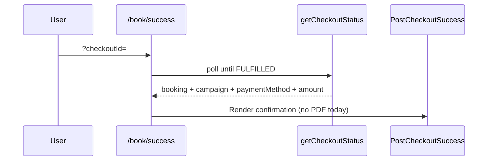

# Vaccination 2026 — Mobile Validation, Booking PDF & SMS Plan

**Date:** 2026-06-07  
**Status:** **Implemented** (2026-06-07) — see `vaccination-download-pdf-and-mobile-fix-implementation-report.md`  
**Repos:** `vaccination_2026` (landing/booking UI), `backend-api` (API/SMS/PDF optional), `bpa_web` (admin search — minor)

---

## Executive summary

| Task | Finding | Effort |
|------|---------|--------|
| **T1 Mobile validation** | Backend already accepts `+880` / `880` / `01…`; **frontend rejects** `+880` and `880` | Small (frontend + admin UX) |
| **T2 Payment success PDF** | **No booking PDF exists**; certificate PDF uses Puppeteer server-side only | Medium (new client PDF module) |
| **T3 Lookup PDF** | Lookup works; data in `sessionStorage` lacks payment/campaign fields | Medium (extend claim payload + PDF component) |
| **T4 SMS audit** | See `docs/audits/sms-delivery-audit.md` | Done (report) |
| **T5 SMS test endpoint** | **Already exists** — gap is admin UI exposure | Small (optional UI only) |
| **T6 Verification** | After implementation | — |

---

## Affected files (complete inventory)

### Task 1 — Mobile validation

| Repo | File | Role | Change needed |
|------|------|------|---------------|
| vaccination_2026 | `lib/bookingValidation.ts` | **Root cause** — regex `^01[3-9]\d{8}$` only | Replace with shared phone util |
| vaccination_2026 | `lib/phone.ts` *(new — see architecture note)* | Reusable normalize/validate | **Create** |
| vaccination_2026 | `components/booking/steps/StepBookingDetails.tsx` | Phone inputs | Use normalize on blur/submit |
| vaccination_2026 | `components/booking/steps/StepMobile.tsx` | Legacy step | Same |
| vaccination_2026 | `components/booking/steps/StepOwner.tsx` | Legacy step | Same |
| vaccination_2026 | `components/booking/steps/StepContactArea.tsx` | Legacy step | Same |
| vaccination_2026 | `components/booking/steps/StepQuickStart.tsx` | Legacy step | Same |
| vaccination_2026 | `app/booking/page.tsx` | My booking lookup form | Normalize + friendlier placeholder |
| vaccination_2026 | `components/landing/CampaignLocatorSection.tsx` | Pre-register phone | Add client validation before API |
| backend-api | `src/api/v1/modules/campaign/campaign.utils.ts` | `isValidBdPhone`, `normalizePhone` | **No change** (already correct) |
| backend-api | `src/api/v1/modules/campaign/campaign.validation.ts` | `phoneSchema` accepts +880 | **No change** |
| backend-api | `src/api/v1/modules/campaign/claim.service.ts` | Claim uses `isValidBdPhone` | **No change** |
| backend-api | `src/api/v1/modules/campaign/bookingListFilters.util.ts` | Admin search by phone | Normalize filter input server-side |
| bpa_web | `app/admin/(larkon)/campaigns/[id]/bookings/page.tsx` | Phone filter field | Normalize before API call (optional UX) |

**Not in vaccination_2026 scope (duplicate logic elsewhere):**  
`bpa_web` organization/producer `validatePhone()` helpers — out of scope unless explicitly requested.

### Task 2 — Payment success PDF

| Repo | File | Role | Change needed |
|------|------|------|---------------|
| vaccination_2026 | `components/booking/PostCheckoutSuccess.tsx` | Post-payment success UI | Add PDF card |
| vaccination_2026 | `components/booking/BookingPdfDocument.tsx` | *(new)* Printable layout | **Create** |
| vaccination_2026 | `lib/bookingPdf.ts` | *(new)* Generate/download helpers | **Create** |
| vaccination_2026 | `app/book/success/page.tsx` | Polls checkout status | Pass PDF props |
| vaccination_2026 | `package.json` | Dependencies | Add PDF lib (see §Architecture) |
| vaccination_2026 | `app/icon.svg` | BPA mark | Embed in PDF header |
| vaccination_2026 | `config/organization.ts` | Branding copy | Footer text source |

### Task 3 — Booking lookup PDF

| Repo | File | Role | Change needed |
|------|------|------|---------------|
| vaccination_2026 | `app/booking/[ref]/page.tsx` | Post-claim detail | Add Download/Print |
| vaccination_2026 | `app/booking/page.tsx` | Claim form | Store extended payload in session |
| vaccination_2026 | `lib/campaignApi.ts` | `BookingDetails` type | Extend if API adds fields |
| backend-api | `src/api/v1/modules/campaign/claim.service.ts` | Claim response | Optional: include `campaign`, `paidAmount`, `paymentMethod` |

### Task 4 — SMS audit

| File | Role |
|------|------|
| `docs/audits/sms-delivery-audit.md` | **Created** — full investigation |

### Task 5 — SMS test (mostly exists)

| Repo | File | Role | Change needed |
|------|------|------|---------------|
| backend-api | `src/api/v1/modules/notifications/sms.routes.ts` | `POST /notifications/sms/test` | **Exists** |
| backend-api | `src/api/v1/modules/notifications/sms.controller.ts` | `smsTestHandler` | Enhance response detail (optional) |
| backend-api | `src/api/v1/modules/admin_sms/admin_sms.routes.ts` | `POST /admin/sms/send` | **Exists** |
| bpa_web | `src/bpa/campaign/admin/CampaignOperationsCenter.tsx` | Bulk SMS only | Add “Test SMS” panel (optional) |

---

## Flow review (current state)

### Booking success (post-payment)



- SMS: backend `dispatchPaymentSuccessSms` after `fulfillCheckoutSession` (not frontend).
- PDF: **missing** — user only sees Booking ID + verification code in `StepSuccess`.

### Booking lookup

1. `/booking` → `validateClaim` → `claimBooking` API  
2. Backend `claim.service.ts` already normalizes `+880` / `880` if `isValidBdPhone` passes.  
3. **Frontend blocks** `+880` before API is called.  
4. `/booking/[ref]` reads `sessionStorage` only — no PDF actions.

### PDF generation (existing elsewhere)

| Feature | Location | Technology |
|---------|----------|------------|
| Vaccination **certificate** PDF | `certificate.service.ts` | Puppeteer (server), base64 API |
| Booking PDF | — | **Does not exist** |

### SMS (payment success)

- Service: `src/services/notification/payment-success-sms.service.ts`
- Idempotency: `campaign_bookings.smsSentAt`
- Docs: `docs/payment-success-sms.md`

---

## Task 1 — Implementation plan (mobile)

### Root cause

```3:9:vaccination_2026/lib/bookingValidation.ts
const bdPhoneRegex = /^01[3-9]\d{8}$/;
// ... only accepts 01XXXXXXXXX after trim — no +880/880 normalization
```

Backend already handles all formats:

```106:127:backend-api/src/api/v1/modules/campaign/campaign.utils.ts
export function isValidBdPhone(phone: string): boolean {
  const cleaned = phone.replace(/[\s-]/g, "");
  return /^(\+?880)?01[3-9]\d{8}$/.test(cleaned);
}
export function normalizePhone(phone: string): string { /* → 01XXXXXXXXX */ }
```

### Proposed utility (`vaccination_2026`)

**Path note:** Project uses `lib/` not `utils/`. Recommend **`lib/phone.ts`** with exports matching your spec:

```ts
normalizeBangladeshPhone(input: string): string  // → 01XXXXXXXXX
isValidBangladeshPhone(input: string): boolean
formatBangladeshPhone(input: string): string     // display-friendly
```

**Validation rules:**
- Strip spaces and hyphens; allow single leading `+`
- Accept `01[3-9]XXXXXXXX`, `8801…`, `+8801…`
- Reject wrong length, non-digits (except leading `+`), invalid operator digit
- Friendly errors: *“Enter a valid Bangladesh mobile (e.g. 01701022277 or +8801701022277)”*

**`bookingValidation.ts` change:**
```ts
.transform((v) => normalizeBangladeshPhone(v))
.refine((v) => isValidBangladeshPhone(v), ...)
```

**API payloads:** Always send normalized `01…` to `initCheckout` / `claimBooking`.

**Admin search:** Normalize phone filter in `bookingListFilters.util.ts` before `contains` query.

---

## Task 2 & 3 — Implementation plan (PDF)

### Required PDF fields

| Field | Success page source | Lookup source |
|-------|---------------------|---------------|
| BPA Logo | `app/icon.svg` | Same |
| Campaign name | `checkoutResult.campaign.name` | **Gap** — extend claim API |
| Booking ID | `booking.bookingRef` | ✓ |
| Verification code | `verificationCode` | ✓ |
| Customer name | `booking.owner.name` (often `"Guest"`) | ✓ |
| Mobile | `booking.owner.phone` | ✓ |
| Location / area | `bookingArea` / `coverageZoneName` | ✓ |
| Venue | `booking.location.name` | ✓ |
| Schedule | `booking.slot` labels | ✓ |
| Cats | `pets.length` / names | ✓ |
| Payment status | derived from `paymentStatus` + checkout | **Gap** on lookup |
| Payment method | `checkoutResult.paymentMethod` | **Gap** |
| Payment amount | `checkoutResult.amount` | **Gap** |
| Booking date | `booking.bookingDate` | ✓ |
| Footer | `Official BPA Vaccination Campaign 2026` | static |

### Architecture decision — **requires confirmation**

| Option | Pros | Cons | Recommendation |
|--------|------|------|----------------|
| **A. Client-side `@react-pdf/renderer`** | No server deps; works offline; fast on mobile; re-download from session | New dependency; logo embedding | **Preferred** |
| **B. Client `jspdf` + `html2canvas`** | Familiar | Heavy; poor mobile quality | Not preferred |
| **C. Server Puppeteer** (like certificates) | Consistent output | Prod ops burden; auth for lookup; latency | Fallback only |
| **D. Print-only HTML** (`window.print`) | Zero deps | No true `.pdf` download with filename | Use **alongside** A for Print button |

**Recommended:** Option **A + D**
- `Download PDF` → `@react-pdf/renderer` → `BPA-Vaccination-Booking-{BOOKING_REF}.pdf`
- `Print PDF` → `window.print()` on same layout (print CSS)

### New components

```
components/booking/
  BookingPdfCard.tsx       # UI card on success + lookup
  BookingPdfDocument.tsx   # @react-pdf document definition
lib/
  bookingPdf.ts            # downloadBookingPdf(), printBookingPdf()
  bookingPdfTypes.ts       # BookingPdfData (flattened props)
```

### Backend extension (lookup PDF data)

Extend `claimBooking` response (non-breaking additive fields):

```ts
campaign?: { name: string; slug: string }
paidAmount?: number
paymentMethod?: string
```

Source: `campaignBooking` + `checkoutSession` join.

### UI placement

**PostCheckoutSuccess** — new section after payment alert:

```markdown
## Download Booking PDF
[Download PDF] [Print PDF]
```

**`/booking/[ref]`** — same card after verification.

---

## Task 5 — SMS test endpoint

**Already implemented:**

| Endpoint | Auth | Purpose |
|----------|------|---------|
| `POST /api/v1/notifications/sms/test` | `authenticateToken` + `requireAdmin` | Single test SMS + gateway response |
| `POST /api/v1/admin/sms/send` | Same | Admin single send with custom message |
| `GET /api/v1/admin/sms/logs` | Same | Delivery logs |

**Optional enhancement (if approved):**
- Add campaign-scoped test panel in `bpa_web` Operations Center SMS tab
- Return structured `providerResponse` in test handler (already partial via `sendSMS` result)

---

## Approved decisions (implemented)

1. `lib/phone.ts` (not `utils/`)
2. `@react-pdf/renderer` client-side PDF
3. Mobile as customer identity when `ownerName` is Guest
4. Extended `claimBooking` response
5. Admin SMS test UI in bpa_web Operations Center
6. Admin phone filter normalization
7. Copy Booking ID + Verification Code buttons
8. SMS delivery status badge on success + lookup

---

## Conflicts & decisions (resolved)

### 1. `utils/phone.ts` vs `lib/phone.ts`

Next.js project convention is `lib/`. Propose **`lib/phone.ts`** unless you require literal `utils/` folder.

### 2. PDF generation strategy

Confirm **client-side `@react-pdf/renderer`** vs server Puppeteer.

### 3. Customer name on PDF

Express checkout stores `ownerName: "Guest"`. Options:
- **A)** Show mobile as primary identity (no schema change) — recommended short-term
- **B)** Add optional name field to booking form + persist — larger scope

### 4. Lookup payment fields

Confirm extending **`claimBooking` API** vs separate `GET /booking/:ref/pdf-data` secured endpoint.

### 5. Task 5 scope

Backend test SMS **exists**. Confirm whether you want **bpa_web admin UI** only, or backend changes too.

### 6. bpa_web phone validation

Admin booking search works with partial match (`slice(-11)`). Normalize on input for consistency — include in T1?

---

## Implementation phases (after approval)

### Phase 1 — Mobile (1–2 h)
1. Create `lib/phone.ts`
2. Update `bookingValidation.ts`
3. Update placeholders / error copy on booking + lookup + pre-register
4. Backend: normalize admin phone filter

### Phase 2 — PDF core (3–4 h)
1. Add `@react-pdf/renderer`
2. `BookingPdfDocument` + `bookingPdf.ts`
3. Wire `PostCheckoutSuccess`
4. Extend claim API for lookup fields

### Phase 3 — Lookup PDF (1 h)
1. Persist extended claim in sessionStorage
2. Wire `/booking/[ref]`

### Phase 4 — SMS UI (optional, 1 h)
1. Test SMS panel in Operations Center

### Phase 5 — Verification
1. Unit tests: `lib/phone.ts`
2. `npm run build` both repos
3. Manual matrix (Task 6)

---

## Task 6 — Verification checklist (post-implementation)

| Check | Method |
|-------|--------|
| `+8801701022277` accepted | Booking form + lookup |
| `8801701022277` accepted | Booking form + lookup |
| `01701022277` accepted | Booking form + lookup |
| DB stores `01…` | API request payload / DB spot-check |
| Success page PDF card | Visual + download |
| Filename `BPA-Vaccination-Booking-{REF}.pdf` | Download test |
| Lookup PDF | After claim flow |
| SMS status | `docs/audits/sms-delivery-audit.md` |
| TypeScript / build | `typecheck` + `build` both repos |

---

## Risks

| Risk | Mitigation |
|------|------------|
| PDF lib increases bundle size | Dynamic import `bookingPdf.ts` on button click |
| Mobile PDF download quirks | Test iOS Safari + Android Chrome; print fallback |
| Guest name on PDF | Show phone prominently; optional name field later |
| SMS still fails in prod | PDF is backup channel (primary goal of T2) |

---

## Future recommendations

1. Collect owner name on express booking (optional field).
2. Email booking PDF via backend notification worker.
3. Share `lib/phone.ts` logic to a small `@bpa/phone` package if more repos need it.
4. Server-side PDF archive in object storage for audit trail.

---

## Related documents

- `docs/audits/sms-delivery-audit.md`
- `docs/payment-success-sms.md`
- `docs/payment-flow-fix.md`
