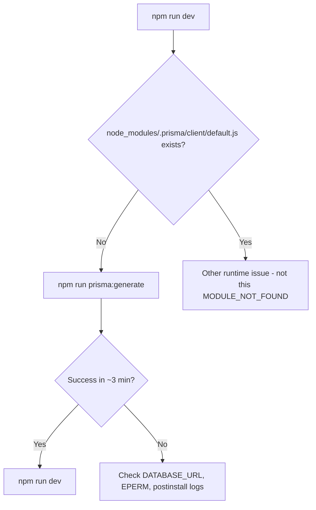

# Prisma Client Generation Analysis

**Project:** `D:\BPA_Data\backend-api`  
**Date:** 2026-06-02  
**Error:** `Cannot find module '.prisma/client/default'`  
**Status:** Analysis only (no configuration changes applied in this pass)

---

## Executive summary

The API crashes at startup because **`prisma generate` has not produced the generated client** under `node_modules/.prisma/client/`. The published npm package `@prisma/client` is only a **stub** that re-exports code from that generated folder. Running migrations (`prisma migrate deploy`) does **not** replace client generation.

The immediate recovery command is:

```bash
npm run prisma:generate
```

(or `node scripts/run-local-prisma.cjs generate` from the repo root). Expect **~3 minutes** on this machine due to a very large schema (~12.7k lines, ~557 KB).

---

## Observed failure

From the developer terminal (`npm run dev` after `npx prisma migrate deploy`):

```
Error: Cannot find module '.prisma/client/default'
Require stack:
- ...\node_modules\@prisma\client\default.js
- ...\src\infrastructure\db\prismaClient.ts
- ...\src\config\prisma.ts
- ...\src\app.ts
- ...\src\index.ts
```

A follow-up attempt used an invalid CLI invocation:

```bash
npx prisma migrate generate   # ❌ not a real subcommand
```

Prisma responded with `Unknown command "generate"` under the `migrate` command group.

---

## Root cause

| Layer | What happens |
|--------|----------------|
| **Runtime** | `import { PrismaClient } from "@prisma/client"` loads `@prisma/client/default.js`. |
| **Stub** | `default.js` does `require('.prisma/client/default')`. |
| **Missing artifact** | Node resolves the package name `.prisma` to `node_modules/.prisma/`. The file `node_modules/.prisma/client/default.js` **did not exist** before `prisma generate` ran. |
| **Why missing** | Generated output is **not in git** (see `.gitignore`: `**/.prisma`). It must be created locally by `prisma generate` (or `postinstall` / `prebuild` hooks that call the same). |
| **What the developer did** | Applied migrations only (`migrate deploy`), then started the API **without** a successful `generate`. |

**Primary root cause:** absence of a successful `prisma generate` after install or schema change.

**Contributing factors:**

1. **Wrong CLI command** — `prisma migrate generate` does not exist; client generation is **`prisma generate`** (project script: `npm run prisma:generate`).
2. **`migrate deploy` ≠ `migrate dev`** — deploy applies SQL only; it does not document or guarantee client regeneration the way `migrate dev` does for local dev workflows.
3. **Large schema** — `prisma/schema.prisma` is ~12,755 lines / ~557 KB; generation took **~180 seconds** in verification. Slow or interrupted `postinstall` could leave `node_modules` without `.prisma/client`.
4. **Stale internal docs** — `docs/DEV_API_RUN_AND_DIST.md` still references Prisma **5.22.0** and warns about Prisma 7 breaking `datasource url` in schema, but the project already runs **7.7.0** with `prisma.config.ts` (see below).

---

## Why `@prisma/client` loads `.prisma/client/default`

This is **by design** in Prisma Client 7.x, not a misconfiguration.

**TypeScript entry (`@prisma/client/index.d.ts`):**

```ts
export * from '.prisma/client/default'
```

**Runtime entry (`@prisma/client/default.js`):**

```js
module.exports = {
  ...require('.prisma/client/default'),
}
```

The npm package `@prisma/client` ships engines and typings glue; **model-specific** client code is generated into `node_modules/.prisma/client/` (default output when the schema has no custom `output` path). The `#main-entry-point` / `default` modules in that folder are created only by the generator.

---

## Prisma 7 configuration (verified)

The project **is** using Prisma ORM 7 patterns.

### Versions (`package.json` / lockfile)

| Package | Declared | Installed (npm) |
|---------|----------|-----------------|
| `prisma` (dev) | `^7.7.0` | **7.7.0** |
| `@prisma/client` | `^7.7.0` | **7.7.0** |
| `@prisma/adapter-pg` | `^7.6.0` | present |

Versions are aligned between CLI and client (no 7.6 vs 7.7 mismatch in the local `node_modules` tree used for this analysis).

### `prisma.config.ts` (Prisma 7 config file)

- Uses `defineConfig` from `prisma/config`.
- Sets `schema`, `migrations.path`, `migrations.seed`, and `datasource.url` / `shadowDatabaseUrl` from env.
- CLI loads it: `Loaded Prisma config from prisma.config.ts.`

### `prisma/schema.prisma`

```prisma
generator client {
  provider        = "prisma-client-js"
  previewFeatures = ["partialIndexes"]
}

datasource db {
  provider = "postgresql"
}
```

- **No `url` in schema** — correct for Prisma 7 when URL lives in `prisma.config.ts`.
- **No `output` on generator** — default generated path: `node_modules/.prisma/client`.
- **Provider:** `prisma-client-js` (standard Node client, not `prisma-client` Rust generator).

### Runtime client (`src/infrastructure/db/prismaClient.ts`)

- Uses `PrismaPg` adapter + `pg` `Pool` (driver adapter pattern required when not using built-in datasource URL in schema).
- Requires `DATABASE_URL` at module load.

### `tsconfig.json`

- `include`: `src/**/*.ts` only — does not affect Prisma generate output location.
- `moduleResolution`: `node` — compatible with CommonJS `require('.prisma/client/default')` from `@prisma/client`.

### Legacy duplicate seed config

`package.json` still has:

```json
"prisma": {
  "seed": "node -r ts-node/register prisma/seed.ts"
}
```

Seed is also defined in `prisma.config.ts` under `migrations.seed`. Prisma 7 prefers the config file; the duplicate is harmless but should be consolidated when fixing docs/tooling.

---

## Generator block and output path

| Setting | Value |
|---------|--------|
| `provider` | `prisma-client-js` |
| `previewFeatures` | `partialIndexes` |
| `output` | *(omitted → default)* |

**Default output (Prisma 7.7):** `node_modules/.prisma/client/`  
CLI success message also references `@prisma/client` because generated code is wired into that package’s export graph.

**Git:** `.gitignore` contains `**/.prisma` and `prisma/.prisma`, so every clone/CI machine must run `generate` after install.

---

## Automation already in the repo

| Hook / script | Command |
|---------------|---------|
| `postinstall` | `node scripts/run-local-prisma.cjs generate` |
| `prebuild` | same |
| `prisma:generate` | same |
| `setup:prisma` | `validate` + `generate` |
| Docker `dockerfile` | explicit `run-local-prisma.cjs generate` before `npm run build` |
| `docker-compose.yml` | `npx prisma generate` after `npm ci` |

`scripts/run-local-prisma.cjs` correctly runs the **local** `node_modules/prisma` CLI (avoids `npx` pulling a different global version).

If `npm install` was run with **`--ignore-scripts`**, or `postinstall` failed/timed out on the large schema, `.prisma/client` would still be missing — matching the observed error.

---

## Files involved

| File | Role |
|------|------|
| `package.json` | Pins Prisma 7.7; `postinstall` / `prebuild` / `prisma:generate` scripts |
| `package-lock.json` | Locks `prisma@7.7.0`, `@prisma/client@7.7.0` |
| `prisma.config.ts` | Prisma 7 datasource URL, migrations, seed |
| `prisma/schema.prisma` | Generator + models (very large) |
| `tsconfig.json` | TS compile scope for `src/` |
| `scripts/run-local-prisma.cjs` | Local CLI wrapper |
| `src/infrastructure/db/prismaClient.ts` | Imports `@prisma/client` (triggers stub → `.prisma/client`) |
| `src/config/prisma.ts` | Re-exports prisma singleton |
| `node_modules/@prisma/client/default.js` | Stub that `require`s `.prisma/client/default` |
| `node_modules/.prisma/client/*` | **Generated** client (must exist at runtime) |
| `.gitignore` | Excludes `**/.prisma` from version control |
| `dockerfile` | Documents generate-before-build |
| `docker-compose.yml` | Uses `npx prisma generate` (works when local `prisma` is installed) |
| `docs/DEV_API_RUN_AND_DIST.md` | Describes this error but **outdated** (still says Prisma 5.22) |

---

## Verification performed (read-only goal; generate was run to confirm fix path)

Before analysis, `node_modules/.prisma/client` was **absent** (0 files under `.prisma` in the project tree).

Running:

```bash
node scripts/run-local-prisma.cjs generate
```

- Exit code: **0**
- Duration: **~180 s**
- Message: `Generated Prisma Client (v7.7.0) to .\node_modules\@prisma\client`
- Created: `node_modules/.prisma/client/default.js` (and related artifacts)

That confirms the configuration is **capable of generating** the missing module; the failure was **operational** (generate not run or not completed), not a broken generator `output` path.

---

## Exact fix required (recommended order)

### 1. Generate the client (required)

From repo root, with `DATABASE_URL` set (loaded via `prisma.config.ts` / `dotenv` for CLI):

```bash
npm run prisma:generate
```

Alternative:

```bash
node scripts/run-local-prisma.cjs generate
```

Wait for completion (~3 min on Windows for this schema). Confirm:

```text
node_modules/.prisma/client/default.js
```

exists.

### 2. Start the API

```bash
npm run dev
```

### 3. Avoid invalid / risky commands

| Do | Don't |
|----|--------|
| `npm run prisma:generate` | `npx prisma migrate generate` |
| `npm run prisma:migrate:deploy` for DB | Rely on `migrate deploy` alone before first `generate` |
| `node scripts/run-local-prisma.cjs …` | Bare `npx prisma` when `node_modules` is incomplete (can fetch wrong version) |

### 4. If `postinstall` keeps failing

- Ensure install **without** `--ignore-scripts`.
- Stop running Node processes that lock Prisma engine DLLs on Windows (see `docs/DEV_API_RUN_AND_DIST.md` EPERM section).
- Re-run: `npm ci` then `npm run setup:prisma`.

### 5. Optional follow-ups (not done in this analysis)

- Update `docs/DEV_API_RUN_AND_DIST.md` to reflect Prisma **7.7** and `prisma.config.ts`.
- Align `docker-compose.yml` to use `node scripts/run-local-prisma.cjs generate` for consistency with `package.json`.
- Remove duplicate `package.json` `"prisma".seed` if seed is fully owned by `prisma.config.ts`.

---

## Decision tree



---

## Conclusion

| Question | Answer |
|----------|--------|
| Is Prisma 7 config in use? | **Yes** — `prisma.config.ts`, schema without datasource URL, adapter-pg client. |
| Is generator/output misconfigured? | **No** — default `prisma-client-js` → `node_modules/.prisma/client`. |
| Why `.prisma/client/default`? | **Normal** Prisma 7 stub re-export from `@prisma/client`. |
| Root cause | **Generated client never created** (or removed) before `npm run dev`; migrations alone are insufficient. |
| Exact fix | Run **`npm run prisma:generate`** (or local script wrapper), then restart dev server. |
