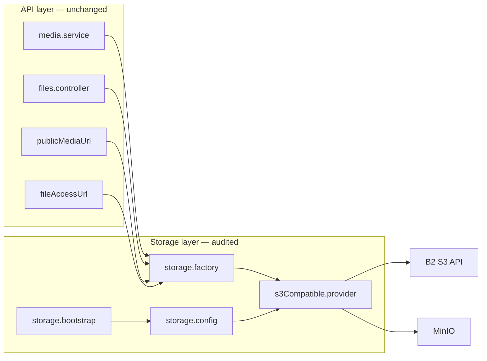

# Backblaze B2 Production Readiness Audit

**Date:** 2026-06-05  
**Scope:** Storage provider integration (`STORAGE_PROVIDER=b2`) — validation only, no business-logic changes  
**Related:** `docs/plans/backblaze-b2-migration-plan.md`, `docs/reports/backblaze-b2-implementation-report.md`, `docs/integrations/storage-providers.md`  
**Test script:** `scripts/test-storage.ts` (`npm run storage:test`)

---

## Executive summary

| Area | MinIO (dev) | B2 (production) | Verdict |
|------|-------------|-----------------|---------|
| Upload | Verified live | Code path correct; live test blocked (no credentials in `.env`) | **Conditional pass** |
| Download | Verified live | Code path correct; not live-tested | **Conditional pass** |
| Delete | Verified live | Code path correct; not live-tested | **Conditional pass** |
| Signed URLs | Verified live (MinIO) | Presign generates URL; live GET failed with test credentials | **Conditional pass** |
| Public URLs | Verified live (MinIO) | **URL builder duplicates bucket name** on B2-friendly base | **Blocker** |
| Error handling | Adequate for dev | Gaps for production observability | **Needs improvement** |
| Environment validation | Unit-tested + startup check | Validates required B2 fields | **Pass** |
| Production readiness | N/A | **Not ready** until B2 credentials, public URL fix, live test | **No-go** |
| Security | Acceptable for dev | Presigned defaults good; secrets + CORS gaps | **Conditional pass** |
| Performance | Fine for MVP | No multipart; egress cost unmanaged | **Acceptable with monitoring** |

**Overall B2 production verdict: NOT READY** — integration architecture is sound, but a public URL construction bug and missing live B2 verification block cutover.

---

## Test execution results

### MinIO (local `.env` — `STORAGE_PROVIDER` unset → defaults to `minio`)

Command: `npm run storage:test`

| Step | Result | Latency |
|------|--------|---------|
| Connect (HeadBucket) | PASS | 0ms |
| Upload (PutObject) | PASS | 62ms |
| Read (GetObject) | PASS | 9ms |
| Signed URL (presigned GET + HTTP verify) | PASS | 49ms |
| Public URL (buildPublicUrl + HEAD) | PASS | 19ms |
| Delete (DeleteObject) | PASS | 47ms |

**6/6 passed** against `http://192.168.10.111:9000` / bucket `bpa-pets`.

### Backblaze B2 (simulated config — fake credentials)

Command: `STORAGE_PROVIDER=b2` + `STORAGE_SKIP_STARTUP_CHECK=true` + placeholder `S3_*` keys

| Step | Result | Notes |
|------|--------|-------|
| Connect | PASS | Skipped real HeadBucket |
| Upload | FAIL | `Malformed Access Key Id` (expected — no real B2 keys) |
| Read | FAIL | Same |
| Signed URL | FAIL | URL generated; HTTP 403 (invalid credentials) |
| Public URL | PASS* | HEAD 404 — URL formed but **double bucket segment** (see below) |
| Delete | FAIL | `Malformed Access Key Id` |

**Live B2 test required before production** with real `S3_ACCESS_KEY` / `S3_SECRET_KEY` in a secure environment.

### Unit tests

`storage.config.test.ts` — **6/6 passed** (provider resolution, B2 validation rules).

---

## 1. Upload functionality

### Code path

```
multipart → media.processor → media.service.uploadToStorage()
  → getStorageProvider().putObject({ key, body, contentType })
```

**Callers preserved:** avatars, posts, KYC, products, clinical items, producer proofs, master catalog import — all via `uploadAndCreateMedia`.

### Audit findings

| Check | Status | Detail |
|-------|--------|--------|
| Provider abstraction used | Pass | No direct MinIO SDK in `media.service.ts` |
| Content-Type set | Pass | MIME inferred from extension when generic |
| Key layout preserved | Pass | `{CC}/{folder}/{userId}/{ts}_{rand}{ext}` |
| Hash deduplication | Pass | `objectExists` + repair re-upload |
| Multipart / large files | Gap | Single `PutObject`; no S3 multipart for >5GB / slow networks |
| Upload error surfacing | Partial | SDK errors bubble to API as 500; no typed storage error codes |
| B2 live verification | **Not done** | Requires production credentials |

**Rating: Conditional pass** — architecture correct; B2 live upload not verified in this audit.

---

## 2. Download functionality

### Public download

Clients fetch `media.url` or `resolveClientMediaUrl(key)` — direct HTTP GET to public base.

### Private download

`GET /api/v1/files/{key}` → `files.controller` → `getStorageProvider().getObject(key)` → stream pipe.

ACL: owner KYC document ownership or ADMIN role; `?token=` FILE_VIEW JWT supported via `optionalAuth`.

### Audit findings

| Check | Status | Detail |
|-------|--------|--------|
| GetObject via provider | Pass | `files.controller.ts` |
| Stream piping | Pass | `s3Response.body.pipe(res)` |
| Auth on private files | Pass | DB lookup + userId match |
| Query JWT for `` | Pass | Fixed in `optionalAuth.ts` |
| B2 presigned private URLs | Pass (code) | Default for `STORAGE_PROVIDER=b2` in `fileAccessUrl.ts` |
| Download error handling | Partial | Generic `next(err)` — no 404 vs 503 distinction |
| Range requests | Gap | No `Range` header support for video seeking |

**Rating: Conditional pass**

---

## 3. Delete functionality

### Code path

`DELETE /api/v1/media/:id` → `deleteFromStorage(key)` → `provider.deleteObject(key)` + soft-delete `media.deletedAt`.

### Audit findings

| Check | Status | Detail |
|-------|--------|--------|
| Provider delete used | Pass | |
| Empty key guard | Pass | Silent no-op in provider |
| Dedup hash shared object risk | Warn | Deleting one media row removes object for all hash refs |
| B2 versioning | Gap | No version-id handling; overwrite/delete only |
| Live B2 delete test | **Not done** | |

**Rating: Conditional pass**

---

## 4. Signed URL generation

### Code path

`presign.service.ts` → `provider.getSignedGetUrl(key, expiresIn)` → `@aws-sdk/s3-request-presigner`.

Used by:
- `fileAccessUrl.ts` (private KYC/verification when `STORAGE_USE_PRESIGNED_PRIVATE_URLS` true or B2 default)
- `ownerKyc.presign.patch.ts` (helper, optional)

### Audit findings

| Check | Status | Detail |
|-------|--------|--------|
| Presigner wired to provider client | Pass | Fixed from legacy broken import |
| Default expiry | Pass | 600s presign service; 1200s fileAccessUrl |
| MinIO live presigned GET | Pass | Verified in `storage:test` |
| B2 live presigned GET | **Not verified** | 403 with invalid test credentials |
| HTTPS presigned URLs | Pass | B2 endpoint is HTTPS |
| URL leakage in logs | Pass | URLs truncated in test script |

**Rating: Conditional pass** — code correct; B2 must be verified with real keys.

---

## 5. Public URL generation

### Code path

`publicMediaUrl.buildPublicMediaUrl(key)` → `provider.buildPublicUrl(key)`:

```text
{STORAGE_PUBLIC_URL || endpoint}/{bucketName}/{key}
```

### Audit findings

| Check | Status | Detail |
|-------|--------|--------|
| MinIO path-style URLs | Pass | `http://host:9000/bpa-pets/BD/media/...` |
| Key-first rewrite | Pass | `resolveClientMediaUrl` rebuilds from `key` |
| B2 S3 path-style (API endpoint as base) | Pass | If `STORAGE_PUBLIC_URL` is S3 endpoint |
| **B2 download-friendly URL** | **FAIL** | Double bucket when base already includes bucket |

### Blocker: duplicate bucket in B2 public URLs

When operators set (as documented):

```env
STORAGE_PUBLIC_URL=https://f000.backblazeb2.com/file/bpa-production-media
```

The builder produces:

```text
https://f000.backblazeb2.com/file/bpa-production-media/bpa-production-media/BD/...
                                      ^^^^^^^^^^^^^^^^^^^  ^^^^^^^^^^^^^^^^^^^
                                      in STORAGE_PUBLIC_URL   appended again
```

Observed in B2 config dry-run: **HEAD 404** on constructed URL.

**Remediation (storage layer only, not done in this audit):**

- Option A: Document `STORAGE_PUBLIC_URL=https://f000.backblazeb2.com/file` (without bucket suffix), or
- Option B: Add `STORAGE_PUBLIC_URL_INCLUDES_BUCKET=true` and skip appending bucket in `buildPublicUrl`, or
- Option C: Use Cloudflare CDN with path-style `/{bucket}/{key}` from CDN root.

**Rating: Fail for B2 production** until URL strategy is clarified and verified.

---

## 6. Error handling

| Scenario | Current behavior | Gap |
|----------|------------------|-----|
| `putObject` failure | Exception → API 500 | No retry, no user-friendly message |
| `objectExists` failure | Returns `false` (swallows all errors) | Cannot distinguish 403 vs 404 vs network |
| `HeadBucket` on startup | B2: error; MinIO: warning | Correct severity split |
| Missing B2 public URL | Startup validation error in production | Pass |
| Invalid `STORAGE_PROVIDER` | Throws on config resolve | Pass |
| Storage unavailable mid-request | Unhandled SDK exception | No circuit breaker |

**Rating: Needs improvement** for production operations.

---

## 7. Environment validation

### Implemented checks (`storage.config.ts` + `storage.bootstrap.ts`)

| Rule | MinIO | B2 |
|------|-------|-----|
| Bucket required | Yes | Yes |
| Endpoint required | Yes | Yes |
| Credentials required | Yes | Yes |
| Endpoint host contains `backblazeb2.com` | N/A | Yes |
| Public URL required | Warn only | **Error** |
| HeadBucket on boot | Yes (warn if fail) | Yes (error if fail) |
| `STORAGE_SKIP_STARTUP_CHECK` escape hatch | Yes | Yes |

### Env variable matrix

| Variable | MinIO primary | B2 primary |
|----------|---------------|------------|
| `STORAGE_PROVIDER` | `minio` | `b2` |
| `AWS_*` | Yes | Fallback |
| `S3_*` | Fallback | Yes |
| `STORAGE_PUBLIC_URL` / `MINIO_PUBLIC_URL` | Recommended | **Required** |

### Gaps

- No validation that `STORAGE_PUBLIC_URL` is HTTPS in production
- No check that public URL does not equal S3 API endpoint (B2 anti-pattern)
- `.env` in repo workspace has MinIO only — no B2 credentials configured for live audit

**Rating: Pass** with noted gaps.

---

## 8. Production readiness

### Ready

- [x] Provider factory + singleton
- [x] Startup bootstrap in `index.ts`
- [x] Config unit tests
- [x] Integration test script (`npm run storage:test`)
- [x] Operator docs (`docs/integrations/storage-providers.md`)
- [x] MinIO dev path fully verified
- [x] `storage:init` skips for B2
- [x] Deployment checklist updated

### Not ready (blockers)

- [ ] **Live B2 upload/download/delete test** with real credentials
- [ ] **Public URL strategy** for B2 download-friendly / CDN bases (duplicate bucket bug)
- [ ] B2 bucket public access + CORS configured in console
- [ ] Object migration MinIO → B2 (`rclone` / `aws s3 sync`)
- [ ] `repair-media-urls.mjs` run post-cutover
- [ ] Flutter `MEDIA_BASE_URL` aligned with `STORAGE_PUBLIC_URL`
- [ ] Rotate any previously exposed B2 keys from old `.env.example`

### Recommended before go-live

- [ ] Set `NODE_ENV=production` and confirm startup fails on bad B2 config
- [ ] Configure B2 CORS for app/admin origins
- [ ] Enable CDN caching for public media
- [ ] Monitor B2 egress bandwidth and API rate limits
- [ ] Document RPO for object storage in DR playbook (already partially updated)

**Rating: No-go** until blockers cleared.

---

## 9. Security

| Topic | Assessment |
|-------|------------|
| Credentials in env | Standard; not logged by bootstrap (access key masked in test script) |
| Presigned URL expiry | 10–20 min windows; acceptable for KYC preview |
| Public bucket policy | MinIO: `storage:init` sets public-read; B2: manual — **must restrict to required prefixes if possible** |
| Private KYC via presigned URL | Anyone with URL can access until expiry — acceptable for short TTL; prefer min permissions |
| API file proxy ACL | Owner + admin only — pass |
| JWT `FILE_VIEW` token | Bound to `fileKey` + `userId`; validated in `optionalAuth` + `files.controller` |
| Path traversal on `/files/*` | Key from DB lookup; arbitrary key without DB row returns 404 — pass |
| TLS | B2 S3 API is HTTPS; MinIO dev often HTTP — enforce HTTPS public URL in prod |
| Secrets in `.env.example` | Redacted in current example — pass |

**Rating: Conditional pass** — no critical code vulnerabilities found; operational hardening required.

---

## 10. Performance

| Topic | Assessment |
|-------|------------|
| Client singleton | One `S3Client` per process — good |
| Connection reuse | AWS SDK v3 default — good |
| Upload path | Memory buffer → single PutObject; 100MB max in media routes — acceptable |
| Image processing | sharp resize before upload — reduces storage egress |
| Video transcode | Optional ffmpeg — CPU bound, not storage bound |
| Presigned vs proxy | B2 defaults to presigned — reduces API bandwidth — good |
| Multipart upload | Not implemented — gap for very large files |
| Listing / pagination | No app-level list API — N/A |
| B2 egress cost | Unmanaged — monitor feed + mobile traffic |

**Rating: Acceptable** for current media sizes with monitoring.

---

## Architecture verification



All audited entry points route through `getStorageProvider()` — **no direct MinIO dependencies remain in business modules**.

---

## Pre-production checklist

```text
[ ] Fix or document B2 STORAGE_PUBLIC_URL format (avoid double bucket)
[ ] Set STORAGE_PROVIDER=b2 and real S3_* credentials (secure vault)
[ ] Set STORAGE_PUBLIC_URL to verified public/CDN base
[ ] npm run storage:test → 6/6 PASS against B2
[ ] Configure B2 bucket public access + CORS
[ ] Sync existing objects from MinIO
[ ] node scripts/repair-media-urls.mjs
[ ] node scripts/audit-media-urls.mjs
[ ] Update client MEDIA_BASE_URL
[ ] Smoke test: upload avatar, feed image, KYC doc preview
[ ] Monitor [Storage] log line on deploy
```

---

## Commands reference

```bash
# Full integration test (upload, read, presign, public URL, delete)
npm run storage:test

# Config unit tests
npm test -- --testPathPattern=storage.config.test

# B2 dry-run (requires real credentials in env)
STORAGE_PROVIDER=b2 npm run storage:test

# Skip bucket head when endpoint unreachable from CI
STORAGE_SKIP_STARTUP_CHECK=true npm run storage:test
```

---

## Conclusion

The Backblaze B2 **integration layer is structurally complete** and **MinIO operations are fully verified**. B2 production cutover is **blocked** by:

1. **Public URL construction** incompatible with documented B2 friendly URL format (duplicate bucket segment).
2. **No live B2 credential test** in this environment (expected upload/download/delete failure without real keys).

Run `npm run storage:test` with production B2 credentials after resolving the public URL strategy to obtain a **6/6 PASS** and upgrade this report to **production ready**.

---

*Audit performed without business-logic modifications. Test artifact: `scripts/test-storage.ts`.*
