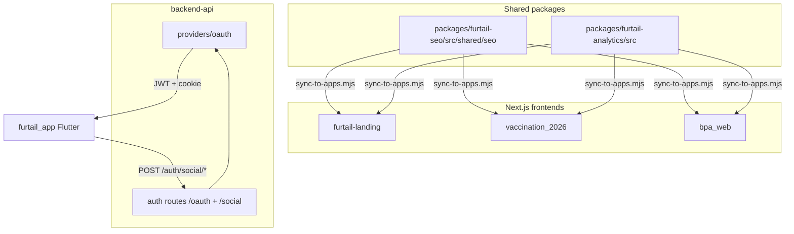

# Furtail/Furtail Ecosystem — Centralized SEO, Analytics, Tracking & Social Login

**Status:** Implemented (2026-06-05)  
**Scope:** `backend-api`, `furtail-landing`, `vaccination_2026`, `bpa_web`, `furtail_app` (reference), shared packages  
**Related:** [PORT_AND_DOMAIN_MAP.md](../infrastructure/PORT_AND_DOMAIN_MAP.md), [AUTH_ARCHITECTURE_SYSTEM_ANALYSIS.md](../AUTH_ARCHITECTURE_SYSTEM_ANALYSIS.md)

---

## 1. Executive summary

This document defines the centralized infrastructure for:

| Capability | Canonical source | Consumed by |
|------------|------------------|-------------|
| **SEO metadata** (OG, Twitter, canonical, robots, sitemap helpers) | `packages/furtail-seo/src/shared/seo` | Next.js apps via sync |
| **Analytics** (GA4, GTM, Meta Pixel, Clarity) | `packages/furtail-analytics/src` | Next.js apps via sync |
| **Social OAuth** (Google, Facebook) | `backend-api/src/api/v1/providers/oauth` | Mobile app, web panels (future) |

**Design principles:**

1. **Environment-driven** — all IDs and verification tokens come from env vars; features are disabled when unset.
2. **Non-breaking auth** — existing JWT + HttpOnly cookie (`access_token`) contract unchanged; `/api/v1/auth/oauth/*` preserved; `/api/v1/auth/social/*` aliases added for mobile app compatibility.
3. **Sync-over-workspace** — shared packages copy into each app (same pattern as `furtail-analytics`); no monorepo npm workspace required.
4. **Domain registry** — single source for all six production domains.

---

## 2. Ecosystem map

### 2.1 Applications

| App | Repo | Port | Production host | SEO surface | Auth |
|-----|------|------|-----------------|-------------|------|
| **backend-api** | `backend-api` | 3000 | `api.furtail.world` | Auth HTML UI only | JWT + OAuth providers |
| **furtail-landing** | `furtail-landing` | 3101 | `furtail.world` | **Primary apex SEO** | None (public) |
| **vaccination_2026** | `vaccination_2026` | 3110 | `vaccination.furtail.world` | **Primary campaign SEO** | Campaign OTP only |
| **bpa_web** | `bpa_web` | 3100–3107 | `*.furtail.world` panels | Owner/producer landing; dashboards `noindex` | Email/phone + password |
| **furtail_app** | `furtail_app` | — | Mobile (`furtail://`) | None | Google + Facebook via API |

### 2.2 Supported domains (registry)

| Key | Domain | Role |
|-----|--------|------|
| `BPA_APEX` | `furtail.world` | Marketing apex, vaccination bridge |
| `VACCINATION` | `vaccination.furtail.world` | Campaign booking (canonical) |
| `COMMUNITY_PETS_CLINIC` | `communitypetsclinic.com` | Legacy/alternate clinic brand |
| `COMMUNITY_PET_SHOP` | `communitypetshop.com` | Legacy/alternate shop brand |
| `PET_SMART_SOLUTION` | `petsmartsolution.com` | Furtail product brand |
| `PRANI_DOCTOR` | `pranidoctor.com` | PraniDoctor telemedicine brand |

Source: `packages/furtail-seo/src/shared/seo/domains.ts` (synced to each Next.js app).

---

## 3. Architecture



### 3.1 SEO module (`src/shared/seo`)

| File | Purpose |
|------|---------|
| `domains.ts` | Canonical domain registry (all six domains) |
| `config.ts` | `getSeoConfig()` — site URL, verification tokens, OG defaults |
| `metadata.ts` | `buildPageMetadata()` — OpenGraph, Twitter, canonical, robots |
| `verification.ts` | Google Search Console + Facebook domain verification meta |
| `robots.ts` | `buildRobots()` helper for `app/robots.ts` |
| `sitemap.ts` | `SitemapEntry` types + `buildSitemapUrl()` helper |
| `index.ts` | Public exports |

**Sync command:**

```bash
node packages/furtail-seo/scripts/sync-to-apps.mjs
```

Targets: `furtail-landing/src/shared/seo`, `vaccination_2026/src/shared/seo`, `bpa_web/src/shared/seo`.

Existing `@/lib/seo/*` paths in furtail-landing re-export from `src/shared/seo` to avoid breaking imports.

### 3.2 Analytics module (extended)

| Provider | Env var | Notes |
|----------|---------|-------|
| Google Analytics 4 | `NEXT_PUBLIC_GA_MEASUREMENT_ID` | Direct gtag.js |
| Google Tag Manager | `NEXT_PUBLIC_GTM_CONTAINER_ID` | Container snippet + noscript |
| Meta Pixel | `NEXT_PUBLIC_META_PIXEL_ID` | Facebook Pixel |
| Microsoft Clarity | `NEXT_PUBLIC_CLARITY_PROJECT_ID` | Session replay |
| App surface tag | `NEXT_PUBLIC_ANALYTICS_APP_SURFACE` | `landing` \| `campaign` \| `panel` |

When GTM is set, it loads the container; GA4/Meta can also be configured inside GTM. Direct GA4/Pixel scripts still load when their env vars are set (hybrid mode supported).

**Sync command:**

```bash
node packages/furtail-analytics/scripts/sync-to-apps.mjs
```

### 3.3 OAuth providers (backend-api)

| Provider | Endpoint(s) | Body | Env vars |
|----------|-------------|------|----------|
| Google | `POST /api/v1/auth/oauth/google` **and** `/auth/social/google` | `{ idToken }` | `GOOGLE_CLIENT_ID` |
| Facebook | `POST /api/v1/auth/oauth/facebook` **and** `/auth/social/facebook` | `{ accessToken }` | `FACEBOOK_APP_ID`, `FACEBOOK_APP_SECRET` |

**Provider modules:** `src/api/v1/providers/oauth/google.provider.ts`, `facebook.provider.ts`  
**Shared login:** `src/api/v1/services/oauthLogin.service.ts` (user create/link, JWT, cookie — same as password login)

**Conflict codes preserved:** `EMAIL_USES_PASSWORD`, `EMAIL_DIFFERENT_PROVIDER`

---

## 4. Environment variables

### 4.1 Frontend SEO & analytics (all Next.js apps)

```env
# Site identity
NEXT_PUBLIC_SITE_URL=https://furtail.world
NEXT_PUBLIC_SITE_NAME=Furtail

# Google Search Console HTML tag verification
NEXT_PUBLIC_GOOGLE_SITE_VERIFICATION=xxxxxxxxxxxxxxxxxxxxxxxxxxxxxxxxxxxxxxxx

# Facebook domain verification (optional)
NEXT_PUBLIC_FACEBOOK_DOMAIN_VERIFICATION=xxxxxxxxxxxxxxxxxxxxxxxxxxxxxxxx

# Default OG image (absolute URL or site-relative path)
NEXT_PUBLIC_OG_IMAGE_URL=/og-image.png

# Twitter/X site handle (optional, without @)
NEXT_PUBLIC_TWITTER_SITE=bangladeshpet

# Analytics
NEXT_PUBLIC_ANALYTICS_APP_SURFACE=landing
NEXT_PUBLIC_GA_MEASUREMENT_ID=G-XXXXXXXXXX
NEXT_PUBLIC_GTM_CONTAINER_ID=GTM-XXXXXXX
NEXT_PUBLIC_META_PIXEL_ID=
NEXT_PUBLIC_CLARITY_PROJECT_ID=

# OAuth client IDs (web panels — optional, for future social login UI)
NEXT_PUBLIC_GOOGLE_CLIENT_ID=
NEXT_PUBLIC_FACEBOOK_APP_ID=
```

### 4.2 Backend OAuth

```env
GOOGLE_CLIENT_ID=
FACEBOOK_APP_ID=
FACEBOOK_APP_SECRET=
```

### 4.3 Per-app templates

| Repo | Template file |
|------|---------------|
| backend-api | `.env.example` (OAuth section) |
| furtail-landing | `.env.example` |
| vaccination_2026 | `.env.example` |
| bpa_web | `.env.example` |
| furtail_app | `env/example.json` (API URL only; OAuth IDs in native config) |

---

## 5. Implementation checklist

Use this when rolling out to production.

### Phase A — Shared packages

- [x] Create `packages/furtail-seo/src/shared/seo` module
- [x] Create `packages/furtail-seo/scripts/sync-to-apps.mjs`
- [x] Extend `packages/furtail-analytics` with GTM support
- [x] Run sync scripts for SEO and analytics

### Phase B — Frontend integration

- [x] furtail-landing: re-export `lib/seo` from `shared/seo`; wire verification in metadata
- [x] vaccination_2026: adopt shared SEO helpers; keep campaign-specific canonical logic
- [x] bpa_web: add `robots.ts`, `sitemap.ts`, panel `noindex` metadata, AnalyticsShell on public layouts
- [ ] Add `public/og-image.png` to bpa_web (asset — deploy separately)
- [ ] bpa_web login UI: add Google/Facebook buttons (optional follow-up)

### Phase C — Backend OAuth

- [x] Extract Google verification to `providers/oauth/google.provider.ts`
- [x] Implement Facebook token verification + login
- [x] Add `/api/v1/auth/social/*` route aliases (furtail_app compatibility)
- [x] Update `.env.example` with `FACEBOOK_APP_ID`, `FACEBOOK_APP_SECRET`
- [ ] Verify furtail_app Google/Facebook login against staging API

### Phase D — Production deploy

- [ ] Set all env vars per domain in nginx/Docker secrets
- [ ] Run Google Search Console verification per domain
- [ ] Submit sitemaps (see §6.1)
- [ ] Test OAuth on production with real client IDs
- [ ] Confirm CSP in `infra/nginx/snippets/security-headers.conf` allows GTM/GA/Pixel

---

## 6. Setup checklists (external consoles)

### 6.1 Google Search Console

For **each** public domain:

1. Go to [Google Search Console](https://search.google.com/search-console).
2. Add property → **URL prefix** → enter `https://<domain>`.
3. Choose **HTML tag** verification method.
4. Copy the `content` value from the meta tag.
5. Set `NEXT_PUBLIC_GOOGLE_SITE_VERIFICATION=<content>` in that app's env.
6. Deploy and click **Verify** in Search Console.
7. Submit sitemap:
   - `furtail.world` → `https://furtail.world/sitemap.xml`
   - `vaccination.furtail.world` → `https://vaccination.furtail.world/sitemap.xml`
8. Repeat for alternate brands when they go live (`communitypetsclinic.com`, etc.).

### 6.2 Google Analytics 4

1. Create GA4 property at [analytics.google.com](https://analytics.google.com).
2. Admin → Data streams → Add stream → **Web**.
3. Enter production URL for each surface (or one property with multiple streams).
4. Copy **Measurement ID** (`G-XXXXXXXXXX`).
5. Set `NEXT_PUBLIC_GA_MEASUREMENT_ID` per app/surface.
6. Set `NEXT_PUBLIC_ANALYTICS_APP_SURFACE` (`landing`, `campaign`, or `panel`).
7. Optional: link GA4 to Search Console (Admin → Product links).

### 6.3 Google Tag Manager

1. Create container at [tagmanager.google.com](https://tagmanager.google.com).
2. Container type: **Web**.
3. Copy **Container ID** (`GTM-XXXXXXX`).
4. Set `NEXT_PUBLIC_GTM_CONTAINER_ID` in frontend env.
5. Inside GTM, add tags:
   - GA4 Configuration (or use direct `NEXT_PUBLIC_GA_MEASUREMENT_ID`)
   - Meta Pixel (or use direct `NEXT_PUBLIC_META_PIXEL_ID`)
   - Custom events for `data-furtail-track` / `data-furtail-cta` (optional)
6. Publish container.
7. Verify with GTM Preview mode on staging.

### 6.4 Meta Pixel

1. Go to [Meta Events Manager](https://business.facebook.com/events_manager).
2. Connect data source → **Web** → Create Pixel.
3. Copy **Pixel ID**.
4. Set `NEXT_PUBLIC_META_PIXEL_ID` in frontend env.
5. For domain verification: Meta Business Settings → Brand safety → Domains → add domain → set `NEXT_PUBLIC_FACEBOOK_DOMAIN_VERIFICATION`.
6. Test with Meta Pixel Helper browser extension.

### 6.5 Google Login (OAuth)

**Backend (token verification):**

1. [Google Cloud Console](https://console.cloud.google.com) → APIs & Services → Credentials.
2. Create **OAuth 2.0 Client ID** (type: Web application for server; Android/iOS for app).
3. Set `GOOGLE_CLIENT_ID` in `backend-api` `.env` (Web client ID used for `verifyIdToken`).
4. For mobile: use platform-specific client IDs in `furtail_app` (Firebase/Google Sign-In config).

**Web panels (future UI):**

1. Create additional Web client ID with authorized JavaScript origins:
   - `https://owner.furtail.world`
   - `https://admin.furtail.world`
   - etc.
2. Set `NEXT_PUBLIC_GOOGLE_CLIENT_ID` in `bpa_web` `.env`.

**Test:**

```bash
curl -X POST http://localhost:3000/api/v1/auth/oauth/google \
  -H "Content-Type: application/json" \
  -d '{"idToken":"<valid-google-id-token>"}'
```

### 6.6 Facebook Login (OAuth)

**Backend:**

1. [Meta for Developers](https://developers.facebook.com) → Create app → **Consumer** type.
2. Add **Facebook Login** product.
3. Settings → Basic → copy **App ID** and **App Secret**.
4. Set `FACEBOOK_APP_ID` and `FACEBOOK_APP_SECRET` in `backend-api` `.env`.
5. Facebook Login → Settings → add Valid OAuth Redirect URIs (for web flows).
6. App Review → request `email` permission if needed.

**Mobile (furtail_app):**

1. Add Android/iOS platform in Facebook app settings.
2. Configure `flutter_facebook_auth` with App ID in native config (`AndroidManifest.xml`, `Info.plist`).

**Test:**

```bash
curl -X POST http://localhost:3000/api/v1/auth/social/facebook \
  -H "Content-Type: application/json" \
  -d '{"accessToken":"<valid-facebook-access-token>"}'
```

---

## 7. robots.txt and sitemap.xml

Each public Next.js app implements:

- `app/robots.ts` → serves `/robots.txt`
- `app/sitemap.ts` → serves `/sitemap.xml`

**furtail-landing** (apex):

- Allow `/`, disallow nothing critical
- Sitemap: apex pages + `/vaccination` bridge

**vaccination_2026** (campaign):

- Allow `/`, `/book`, `/verify/certificate`
- Disallow `/book/payment/` (payment return URLs)

**bpa_web** (panels):

- `noindex` on dashboard routes via metadata
- `robots.ts`: disallow `/admin`, `/shop`, `/clinic`, etc. (internal tools)
- Sitemap: owner/producer public landing only (when `SITE_MODE=owner|producer`)

---

## 8. OpenGraph and Twitter/X metadata

Provided by `buildPageMetadata()`:

| Field | Source |
|-------|--------|
| `og:title`, `og:description`, `og:url`, `og:image` | Page input + `NEXT_PUBLIC_OG_IMAGE_URL` default |
| `og:site_name` | `NEXT_PUBLIC_SITE_NAME` |
| `og:locale` | `en_BD` (configurable) |
| `twitter:card` | `summary_large_image` |
| `twitter:site` | `NEXT_PUBLIC_TWITTER_SITE` (optional) |
| `canonical` | Page path or `canonicalUrl` override (bridge pages) |

**Campaign bridge rule:** `furtail.world/vaccination` sets `canonicalUrl` → `https://vaccination.furtail.world` (preserved).

---

## 9. Auth safety rules (do not break)

1. **Cookie name** remains `access_token`.
2. **JWT payload** remains `{ id }` for panel auth (producer may add `perms`, `tv`).
3. **Existing routes** `/api/v1/auth/login`, `/api/v1/auth/register`, `/api/v1/auth/oauth/google` unchanged.
4. **New aliases** `/api/v1/auth/social/google` and `/api/v1/auth/social/facebook` mount same handlers.
5. **409 conflict codes** for email/provider collisions unchanged.
6. **Campaign OTP** (`/api/v1/campaign/auth/*`) remains separate from panel auth.
7. **No server sessions** — stateless JWT only.

---

## 10. Commands reference

```bash
# Sync shared SEO module to all Next.js apps
node packages/furtail-seo/scripts/sync-to-apps.mjs

# Sync shared analytics module to all Next.js apps
node packages/furtail-analytics/scripts/sync-to-apps.mjs

# Validate backend env
cd backend-api && npm run validate:env
```

---

## 11. Touch points (files changed)

| Area | Path |
|------|------|
| Plan (this doc) | `backend-api/docs/setup/SEO_AND_AUTH_SETUP.md` |
| SEO package | `packages/furtail-seo/src/shared/seo/*` |
| Analytics package | `packages/furtail-analytics/src/*` (GTM added) |
| OAuth providers | `backend-api/src/api/v1/providers/oauth/*` |
| OAuth service | `backend-api/src/api/v1/services/oauthLogin.service.ts` |
| OAuth controller | `backend-api/src/api/v1/modules/auth/oauth.controller.ts` |
| Auth routes | `backend-api/src/api/v1/modules/auth/auth.routes.ts` |
| Env templates | `backend-api/.env.example`, `furtail-landing/.env.example`, `vaccination_2026/.env.example`, `bpa_web/.env.example` |

---

## 12. Implementation report

See §13 below (updated after code merge).

---

## 13. Final implementation report

> **Updated:** 2026-06-05 after code implementation.

### Delivered

| # | Requirement | Status | Location |
|---|-------------|--------|----------|
| 1 | Setup documentation | ✅ | `docs/setup/SEO_AND_AUTH_SETUP.md` |
| 2 | GSC, GA4, GTM, Meta Pixel, OG, Twitter, robots, sitemap | ✅ | `packages/furtail-seo`, `packages/furtail-analytics` |
| 3 | Reusable SEO module `src/shared/seo` | ✅ | `packages/furtail-seo/src/shared/seo` + sync to 3 Next.js apps |
| 4 | Google + Facebook OAuth providers | ✅ | `backend-api/src/api/v1/providers/oauth` |
| 5 | Environment-driven config | ✅ | `getSeoConfig()`, `getAnalyticsConfig()`, provider env checks |
| 6 | All six domains supported | ✅ | `domains.ts` in package + `backend-api/src/shared/seo` |
| 7 | Implementation checklist | ✅ | §5 |
| 8 | External setup checklists | ✅ | §6 |
| 9 | Env templates | ✅ | `.env.example` per repo + `docs/setup/SEO_AND_AUTH_ENV.template` |
| 10 | No breaking auth changes | ✅ | `/oauth/*` preserved; `/social/*` aliases added |

### Files created / modified

**New packages & scripts**

- `packages/furtail-seo/src/shared/seo/*` (8 modules)
- `packages/furtail-seo/scripts/sync-to-apps.mjs`

**Analytics extensions**

- `packages/furtail-analytics/src/config.ts` — `NEXT_PUBLIC_GTM_CONTAINER_ID`
- `packages/furtail-analytics/src/components/AnalyticsProvider.tsx` — GTM loader
- `packages/furtail-analytics/src/components/AnalyticsShell.tsx` — GTM noscript iframe
- `packages/furtail-analytics/scripts/sync-to-apps.mjs` — added `bpa_web` target

**Backend OAuth**

- `src/api/v1/providers/oauth/google.provider.ts`
- `src/api/v1/providers/oauth/facebook.provider.ts`
- `src/api/v1/services/oauthLogin.service.ts`
- `src/api/v1/modules/auth/oauth.controller.ts` — refactored to use providers
- `src/api/v1/modules/auth/auth.routes.ts` — `/social` alias mount
- `src/shared/seo/domains.ts` — server-side domain registry

**Frontend integration (synced + wired)**

- `furtail-landing/src/shared/seo/*` — synced; `lib/seo/metadata.ts` re-exports
- `furtail-landing/src/app/robots.ts`, `sitemap.ts` — use shared helpers
- `vaccination_2026/src/shared/seo/*` — synced; `app/robots.ts`, `sitemap.ts` updated
- `bpa_web/src/shared/seo/*`, `src/lib/analytics/*` — synced
- `bpa_web/app/robots.ts`, `sitemap.ts`, `layout.jsx` — SEO + analytics wired

### Auth endpoint matrix (unchanged + new aliases)

| Method | Path | Body | Status |
|--------|------|------|--------|
| POST | `/api/v1/auth/oauth/google` | `{ idToken }` | Existing — unchanged |
| POST | `/api/v1/auth/social/google` | `{ idToken }` | **New alias** (furtail_app) |
| POST | `/api/v1/auth/oauth/facebook` | `{ accessToken }` | **Implemented** (was 501) |
| POST | `/api/v1/auth/social/facebook` | `{ accessToken }` | **New alias** (furtail_app) |

### Sync commands (run after package edits)

```bash
node packages/furtail-seo/scripts/sync-to-apps.mjs
node packages/furtail-analytics/scripts/sync-to-apps.mjs
```

### Post-deploy actions (operator)

1. Fill env vars using `docs/setup/SEO_AND_AUTH_ENV.template`.
2. Run sync scripts after any package changes.
3. Complete external console setup (§6).
4. Submit sitemaps in Search Console per domain.
5. Test mobile social login: `furtail_app` → `/api/v1/auth/social/google` and `/social/facebook`.
6. Add `public/og-image.png` to `bpa_web` (referenced in OG metadata).
7. Optional follow-up: Google/Facebook sign-in buttons on `bpa_web` login page.
