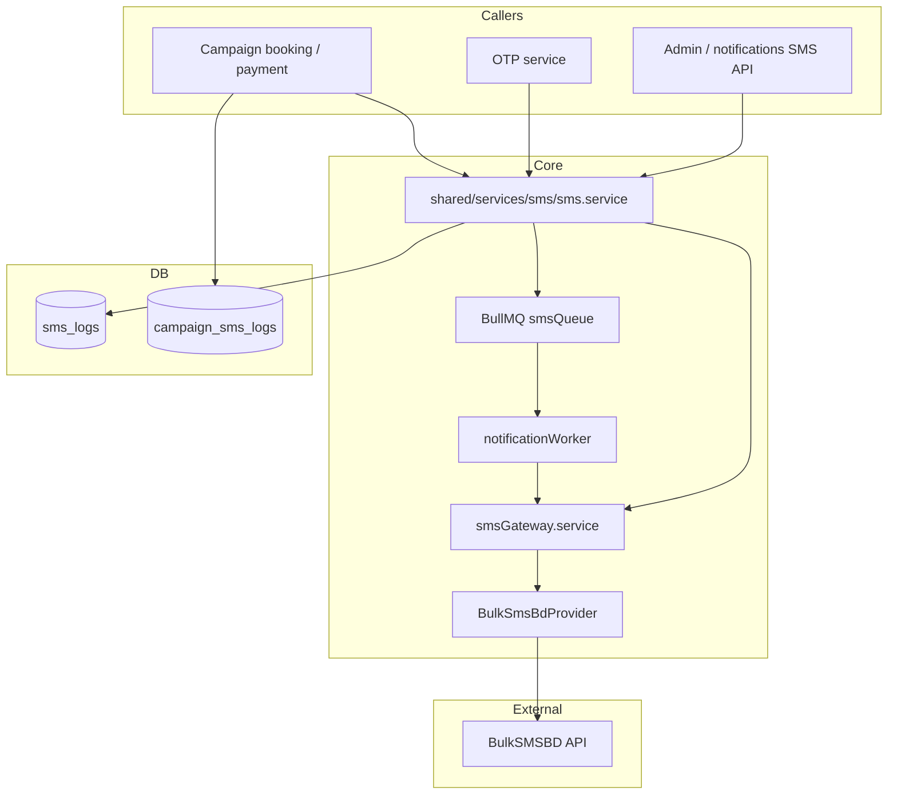
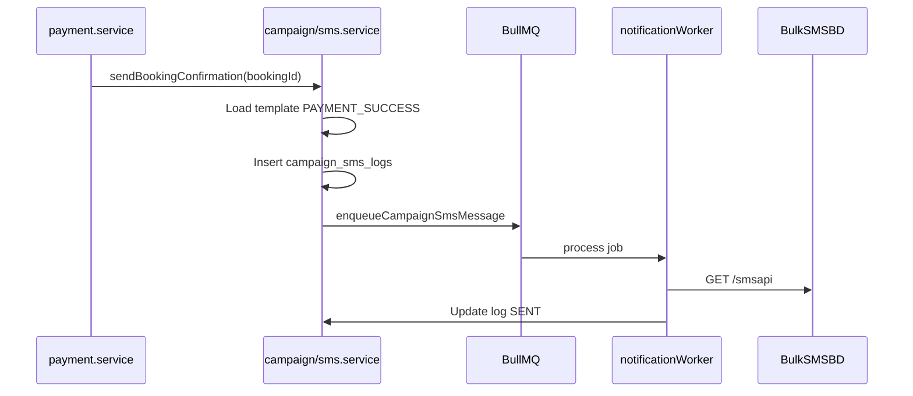

# BulkSMSBD SMS Gateway — Setup Guide

**Project:** BPA/WPA Vaccination 2026  
**Backend:** `backend-api`  
**Audit:** [bulksmsbd-audit.md](./bulksmsbd-audit.md)

---

## Architecture



---

## Sequence flow (campaign payment success)



---

## Environment variables

```env
SMS_ENABLED=true
SMS_PROVIDER=bulksmsbd
SMS_API_METHOD=GET
SMS_API_URL=http://bulksmsbd.net/api/smsapi
SMS_BALANCE_API_URL=http://bulksmsbd.net/api/getBalanceApi
SMS_API_KEY=your_api_key
SMS_SENDER_ID=8809617634446
SMS_SENDER_TYPE=NonMask
SMS_DEFAULT_TYPE=text
SMS_BASE_URL=http://bulksmsbd.net/api
SMS_TIMEOUT_MS=15000
SMS_DEFAULT_COUNTRY_CODE=880
SMS_IP_WHITELIST_ENABLED=false

REDIS_ENABLED=true
SMS_QUEUE_ATTEMPTS=3
SMS_QUEUE_BACKOFF_MS=5000
```

| Variable | Purpose |
|----------|---------|
| `SMS_ENABLED` | Master switch (`false` disables live sends) |
| `SMS_PROVIDER` | `bulksmsbd` (default), `ssl_wireless`, or mock |
| `SMS_API_URL` | Full legacy send URL override |
| `SMS_BALANCE_API_URL` | Balance check URL |
| `SMS_API_KEY` | BulkSMSBD API key |
| `SMS_SENDER_ID` | Approved sender ID |
| `SMS_IP_WHITELIST_ENABLED` | Log reminder to whitelist server IP in BulkSMSBD panel |

Legacy aliases: `BULKSMSBD_API_KEY`, `BULKSMSBD_SENDER_ID`, `BULKSMSBD_LEGACY_URL`.

---

## API endpoints

### Notifications SMS (admin-protected)

| Method | Path | Description |
|--------|------|-------------|
| POST | `/api/v1/notifications/sms/test` | Send test SMS to a phone |
| GET | `/api/v1/notifications/sms/balance` | BulkSMSBD balance |
| POST | `/api/v1/notifications/sms/send` | Single SMS `{ phone, message }` |
| POST | `/api/v1/notifications/sms/send-bulk` | Bulk `{ phones[], message }` |

Requires: `Authorization` bearer token + admin role. Returns **503** if `SMS_ENABLED=true` but credentials missing.

### Admin SMS Center (equivalent, existing)

| Method | Path |
|--------|------|
| GET | `/api/v1/admin/sms/dashboard` |
| GET | `/api/v1/admin/sms/balance` |
| POST | `/api/v1/admin/sms/send` |
| POST | `/api/v1/admin/sms/bulk` |
| POST | `/api/v1/admin/sms/retry/:id` |

### Campaign public (OTP)

| Method | Path |
|--------|------|
| POST | `/api/v1/campaign/public/otp/request` |
| POST | `/api/v1/campaign/public/otp/verify` |

---

## Deployment checklist

- [ ] Set `SMS_API_KEY` and `SMS_SENDER_ID` from BulkSMSBD panel
- [ ] Whitelist server egress IP in BulkSMSBD if required (`SMS_IP_WHITELIST_ENABLED=true` reminder)
- [ ] Enable Redis for async queue: `REDIS_ENABLED=true`
- [ ] Run notification worker: `npm run worker:notifications`
- [ ] Restart API — confirm log: `[SMS] Active provider: bulksmsbd | configured: yes`
- [ ] `POST /api/v1/notifications/sms/test` with admin token
- [ ] Complete test booking + payment — confirm confirmation SMS

---

## Testing guide

### 1. Test SMS (admin)

```bash
curl -X POST http://localhost:3000/api/v1/notifications/sms/test \
  -H "Authorization: Bearer <admin_token>" \
  -H "Content-Type: application/json" \
  -d '{"phone":"01700000000"}'
```

### 2. Balance check

```bash
curl http://localhost:3000/api/v1/notifications/sms/balance \
  -H "Authorization: Bearer <admin_token>"
```

### 3. Campaign OTP

```bash
curl -X POST http://localhost:3000/api/v1/campaign/public/otp/request \
  -H "Content-Type: application/json" \
  -d '{"phone":"01700000000"}'
```

### 4. Verify logs

```sql
SELECT id, phone, status, template, provider, "createdAt"
FROM sms_logs ORDER BY id DESC LIMIT 10;
```

---

## Troubleshooting

| Symptom | Cause | Fix |
|---------|-------|-----|
| 503 SMS_NOT_CONFIGURED | Missing API key or sender ID | Set env vars, restart API |
| SMS queued but not sent | Worker not running | Start `npm run worker:notifications` |
| BulkSMSBD response code 1001+ | Invalid key/sender/IP | Check BulkSMSBD panel |
| OTP rate limit | >3 requests/min | Wait 60s |
| Mock sends in dev | Provider not configured | Set credentials or `SMS_ALLOW_MOCK=true` |

---

## Manual testing checklist

- [ ] Startup log shows SMS provider configured
- [ ] Test SMS delivers to real phone
- [ ] Balance API returns numeric balance
- [ ] Campaign OTP request sends SMS
- [ ] Paid booking triggers confirmation SMS after payment webhook
- [ ] Payment failure triggers failure SMS
- [ ] Failed SMS visible in `sms_logs` with error message
- [ ] Admin retry works for failed log

---

## Risks and assumptions

- BulkSMSBD legacy API uses **GET** with query params — long messages may hit URL length limits
- **Redis required** for non-blocking booking flow at scale; direct send used as fallback
- Auth module OTP routes may need separate wiring — `authOtp.service.ts` is ready
- SMS credentials must never be exposed to frontend or mobile apps
