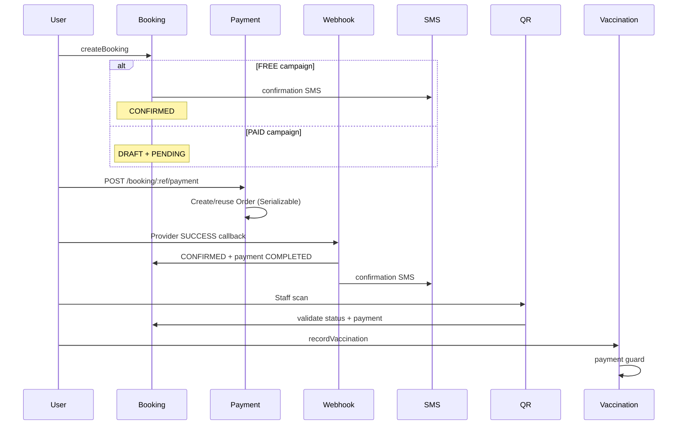

# Payment Flow Audit Report — Vaccination Campaign 2026

**Project:** `D:\BPA_Data\backend-api`  
**Date:** June 2, 2026  
**Scope:** Campaign booking → payment → webhook → QR → SMS → certificate

---

## Executive Summary

The campaign payment flow was audited end-to-end. Several **correctness and idempotency gaps** were found and **fixed** in this pass. Core booking slot locking remains strong (Serializable transactions). Payment webhook and intent creation were hardened against duplicate orders/payments. SMS timing was corrected for paid bookings. QR and vaccination now enforce payment clearance.

---

## Flow Overview



---

## Component Audit

### 1. Booking (`booking.service.ts`)

| Check | Before | After |
|-------|--------|-------|
| Slot capacity race | Serializable transaction | Unchanged (strong) |
| Paid booking initial state | DRAFT + PENDING | Unchanged (correct) |
| SMS on create | Sent for all bookings | **FREE only**; paid SMS after webhook |
| Cancel slot release | DRAFT slots leaked | **DRAFT included** in slot decrement |
| Walk-in paid | CHECKED_IN + PENDING | Unchanged; vaccination/QR now block |

### 2. Payment (`payment.service.ts`)

| Check | Before | After |
|-------|--------|-------|
| Duplicate order on concurrent intent | Non-atomic create | **Serializable transaction** + duplicate check inside tx |
| Idempotency key usage | Stored, never queried | Parsed via `campaign.paymentGuards` |
| Pending order re-intent | No `paymentUrl` | **Re-initiates provider** for existing pending order |
| Webhook duplicate `orderPayment` | Always inserted | **Skip if same `reference` exists** |
| Webhook idempotency | Pre-check only | **Re-check inside Serializable tx** |
| Post-payment SMS | None | **`sendBookingConfirmation` after SUCCESS** |
| `getPaymentStatus` amount | Unit price only | **`unitPrice × petCount`** |

### 3. Webhook route (`campaign.routes.ts`)

| Check | Before | After |
|-------|--------|-------|
| Body validation | None | **`paymentWebhookSchema` (Zod)** |
| Auth | Public | Optional **`CAMPAIGN_PAYMENT_WEBHOOK_SECRET`** header |
| Order not found | `{ success: true }` | **HTTP 404** with error code |
| Duplicate processing | Partial | Returns `duplicate: true` when already COMPLETED |

### 4. QR (`qr.service.ts`)

| Check | Before | After |
|-------|--------|-------|
| Payment/status gate | None | **`getBookingCheckInBlockReason`** blocks DRAFT/PENDING |
| HMAC checksum | Generated, not verified | Documented limitation (future hardening) |

### 5. SMS (`sms.service.ts`)

| Event | When sent |
|-------|-----------|
| FREE booking create | Immediately |
| PAID booking create | **Not sent** (was incorrectly sent) |
| Payment SUCCESS webhook | **Confirmation SMS** |
| Vaccination complete | After vaccination (unchanged) |

### 6. Certificate (`certificate.service.ts` + `vaccination.service.ts`)

| Check | Before | After |
|-------|--------|-------|
| Payment before vaccination | Not checked | **`PaymentErrors.PAYMENT_REQUIRED`** if not cleared |
| Certificate generation | Post-vaccination | Unchanged |

---

## Idempotency & Race Condition Matrix

| Operation | Mechanism | Status |
|-----------|-----------|--------|
| `createBooking` | Serializable tx, slot lock | ✅ Strong |
| `createPaymentIntent` | Serializable tx, order dedup by `campaign_booking:{id}` | ✅ Fixed |
| `processPaymentWebhook` SUCCESS | Serializable tx + existing `orderPayment.reference` check | ✅ Fixed |
| `processPaymentWebhook` retry | Early return if order already COMPLETED | ✅ Fixed |
| `cancelBooking` DRAFT | Slot decrement in tx | ✅ Fixed |
| `checkInBooking` queue | No tx on queue number | ⚠️ Low risk (cosmetic duplicate queue #) |
| Walk-in quota | Count outside tx | ⚠️ Documented; rare edge case |

---

## Issues Fixed in This Pass

1. **Premature confirmation SMS** for unpaid DRAFT bookings  
2. **DRAFT cancel slot leak** — capacity not released  
3. **Duplicate payment records** on webhook retry  
4. **Non-atomic payment intent** — concurrent order creation  
5. **Missing post-payment SMS** and booking confirmation trigger  
6. **QR validation ignored payment state**  
7. **Vaccination allowed without payment** on paid campaigns  
8. **`getPaymentStatus` amount mismatch** vs charged total  
9. **Webhook always returned success** when order missing  
10. **No webhook payload validation or optional secret**

---

## Remaining Recommendations

| Priority | Item |
|----------|------|
| High | Implement real bKash/Nagad/SSLCommerz provider modules (currently mock in non-prod) |
| Medium | Verify QR HMAC checksum in `validateBookingQr` |
| Medium | Walk-in quota check inside Serializable transaction |
| Medium | Staff endpoint to mark walk-in cash payment complete |
| Low | Wire `processRefund` to admin route |
| Low | IP allowlist for payment webhook in production |

---

## Files Changed

```
src/api/v1/modules/campaign/campaign.paymentGuards.ts          (new)
src/api/v1/modules/campaign/campaign.paymentGuards.test.ts     (new)
src/api/v1/modules/campaign/payment.service.test.ts            (new)
src/api/v1/modules/campaign/payment.service.ts
src/api/v1/modules/campaign/booking.service.ts
src/api/v1/modules/campaign/vaccination.service.ts
src/api/v1/modules/campaign/qr.service.ts
src/api/v1/modules/campaign/campaign.routes.ts
src/api/v1/modules/campaign/campaign.validation.ts
.env.example
docs/vaccination-campaign-2026/PAYMENT-AUDIT-REPORT.md
```

---

## Tests

```bash
npm test -- src/api/v1/modules/campaign/campaign.paymentGuards.test.ts src/api/v1/modules/campaign/payment.service.test.ts
```

**Result:** 9 tests passed

Coverage includes:
- Payment guard helpers (DRAFT/PENDING blocks)
- Webhook idempotency (duplicate SUCCESS)
- Single `orderPayment` row per transaction reference
- Booking confirmation + SMS trigger on SUCCESS
- Total due calculation (`unitPrice × petCount`)

---

## Configuration

```env
CAMPAIGN_PAYMENT_WEBHOOK_SECRET=your-shared-secret
```

Webhook callers must send header: `x-campaign-payment-secret: your-shared-secret` when secret is configured.

Payload schema:

```json
{
  "provider": "bkash",
  "transactionId": "CAMP-VAC-ABC123",
  "status": "SUCCESS",
  "amount": 600
}
```
