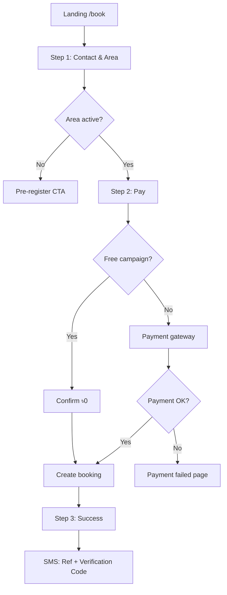

# Booking Flow Simplification — Implementation Plan

**Project:** BPA 2026 Vaccination Campaign  
**Date:** June 3, 2026  
**Status:** Planning (no code changes yet)  
**Goal:** Reduce booking friction and maximize conversion by replacing the 7-step flow with a 3-step flow.

---

## 1. Executive Summary

The current public booking wizard (`vaccination_2026`) requires **7 labeled steps** including OTP verification, clinic selection, schedule selection, and pet/owner details **before** payment. OTP session tokens gate all booking APIs. This creates drop-off at OTP, clinic, and schedule steps.

The target experience is **3 steps**:

| Step | User sees | System does |
|------|-----------|-------------|
| **1 — Book** | Mobile, campaign area, full address, alternate contact (optional), cat count | Validates area availability & capacity; stores draft |
| **2 — Pay** | Direct payment (bKash / Nagad / SSL) or free confirm | Creates payment intent **without** OTP; no account required |
| **3 — Success** | Booking ID, verification code, QR | **After payment success:** create booking, generate IDs, send SMS |

Future booking lookup uses **Mobile + Booking ID + Verification Code** (no OTP).

---

## 2. Current State Analysis

### 2.1 Repositories & Roles

| Workspace | Path | Role |
|-----------|------|------|
| Public booking UI | `vaccination_2026` | Landing + 7-step wizard + claim flow |
| API & data | `backend-api/src/api/v1/modules/campaign/` | Bookings, OTP, payment, SMS, rollout |
| Admin | `bpa_web/app/admin/(larkon)/campaigns/[id]/` | Rollout, locations, slots, pricing |
| Staff | `bpa_web/app/staff/(larkon)/campaign/` | Check-in, vaccination |
| Mobile app | `bpa_app/lib/features/campaign/` | Post-booking link/view only (not booking UI) |

### 2.2 Current 7-Step Flow

Orchestrator: `vaccination_2026/components/booking/BookingWizard.tsx`  
Draft key: `sessionStorage` → `bpa_booking_draft_v2`

| UI step | Label | Component | Key action |
|---------|-------|-----------|------------|
| 0 | Start | `StepQuickStart.tsx` | Phone, division/district, cat count → request OTP |
| 1 | Verify | `StepOtp.tsx` | Verify OTP → JWT session |
| 2 | Clinic | `StepClinic.tsx` | Pick `CampaignLocation` |
| 3 | Time | `StepSchedule.tsx` | Date + slot via availability API |
| 4 | Details | `StepDetailsLight.tsx` | Owner name + pet names |
| 5 | Pay | `StepPayment.tsx` | Coupon + payment method |
| 6 | Done | `StepConfirm.tsx` | QR / redirect to gateway |

### 2.3 Current API Sequence (Paid Campaign)

```
POST /campaign/auth/request-otp          (purpose: BOOKING)
POST /campaign/auth/verify-otp           → Bearer JWT (24h)
POST /campaign/booking/                  → Creates DRAFT booking + reserves slot
POST /campaign/booking/:ref/payment      → Payment gateway redirect
[Gateway webhook]                        → CONFIRMED + SMS
GET  /campaign/booking/:ref              → Requires OTP session
```

**Critical ordering today:** Booking (and slot reservation) happens **before** payment. OTP is required **before** booking creation.

### 2.4 Current Claim / Lookup Flow

Route: `vaccination_2026/app/booking/page.tsx`

```
Phone (+ optional ref) → OTP (VIEW_BOOKING) → JWT → GET /booking/my or /booking/:ref
```

### 2.5 Existing Building Blocks We Can Reuse

| Capability | Location | Notes |
|------------|----------|-------|
| Booking ref generation | `campaign.utils.ts` → `generateBookingRef()` | Format `VAC-XXXXXX` |
| QR token | `generateQrToken()` | Stored on `CampaignBooking.qrToken` |
| Verification code | `qr.service.ts` → `generateVerificationCode(qrToken)` | Derived `XXXX-XXXX`; **not exposed to frontend today** |
| Payment gateways | `payment.service.ts` | bKash, Nagad, SSLCommerz via `Order` model |
| Post-payment SMS | `payment.service.ts` webhook → `sendBookingConfirmation()` | Template `BOOKING_CONFIRMED` |
| Rollout area check | `rollout.service.ts` → `checkAreaActive()` | Used on landing only; **not enforced at booking** |
| Admin rollout CRUD | `bpa_web/.../rollout/page.tsx` + admin API | Division + city; district/upazila in schema but partial UI |
| BD geo APIs | `GET /rollout/divisions`, `/districts`, `/upazilas` | Already public |
| No account required | `CampaignBooking.ownerUserId` nullable | Auto-links if phone matches BPA user |

### 2.6 Gaps vs Target Flow

| Requirement | Current | Gap |
|-------------|---------|-----|
| 3-step UX | 7 steps | Merge/remove clinic, schedule, details, OTP steps |
| No OTP before payment | OTP at step 1–2 | Remove `BOOKING` OTP gate from checkout |
| Payment-first booking | Booking created before payment | **Invert flow:** pay → then create booking |
| Step 1: full address + alt contact | Division/district only; no full address | New fields + validation |
| Step 1: campaign area (upazila) | District only in wizard | Add upazila; tie to rollout region |
| Claim: ref + verification code | OTP-based | New public lookup endpoint |
| Admin: division/district/upazila/capacity | Partial admin UI | Extend rollout admin + capacity metrics |
| Area gating at booking | Landing pre-register only | Enforce `checkAreaActive` + region capacity |

---

## 3. Target State Design

### 3.1 User Journey (3 Steps)



### 3.2 Step 1 — Contact & Area (Fields)

| Field | Required | Validation | Storage |
|-------|----------|------------|---------|
| Mobile number | Yes | BD `01[3-9]XXXXXXXX` | `ownerPhone` |
| Campaign area | Yes | Division → District → Upazila; must pass `checkAreaActive` | `ownerAddressJson` + `rolloutRegionId` |
| Full address | Yes | Min 10 chars, max 500 | `ownerAddressJson.fullAddress` |
| Alternate contact | No | Same phone format if provided | `ownerAddressJson.alternatePhone` or new column |
| Cat count | Yes | 1..`maxPetsPerBooking` | `petCount`; placeholder pets at creation |

**Removed from booking UI (deferred to check-in / staff):**

- Owner display name → default `"Guest"` or derived from phone until check-in
- Pet names → auto-create `"Cat 1"`, `"Cat 2"`, … until staff updates at vaccination
- Clinic picker → auto-assigned from campaign area
- Date/time picker → auto-assigned next available slot in area (see §3.4)

### 3.3 Step 2 — Direct Payment

- Single screen: price summary (unit × cats), optional coupon, payment method selector, **Pay now** CTA.
- No OTP, no login, no intermediate confirmation screens.
- For **FREE** campaigns: show “Confirm booking” (৳0) — still step 2 for consistent 3-step UX.
- Payment intent created from **checkout session** (not from existing booking row).

### 3.4 Step 3 — Success

Display:

- **Booking ID** (`bookingRef`, e.g. `VAC-ABC123`)
- **Verification code** (`XXXX-XXXX`, derived from `qrToken`)
- QR code (existing `generateBookingQr`)
- Area / address summary
- Cat count & amount paid
- Copy-friendly SMS reminder: “Save your Booking ID and Verification Code”

SMS sent automatically on success (paid: webhook; free: immediate after creation).

### 3.5 Auto-Assignment Strategy (Clinic + Slot)

Because users no longer pick clinic/time, the backend resolves assignment at booking creation:

```
Input: campaignId + rolloutRegionId (or division/district/upazila)
  1. Resolve active CampaignRolloutRegion
  2. Prefer region.locationId if set; else nearest active CampaignLocation in same district
  3. Find next OPEN slot with capacity (date >= tomorrow, respects minAdvanceHours)
  4. If no slot: fail checkout with AREA_FULL (before payment) or retry next region location
```

**Capacity checks (two layers):**

1. **Region capacity:** `bookedCount` vs `CampaignRolloutRegion.targetCapacity` (new counter — see §4.1)
2. **Slot capacity:** existing `CampaignSlot.bookedCount` vs `capacity`

Pre-payment validation uses region + slot availability so users never pay for an unfulfillable booking.

### 3.6 Future Booking Claim

Replace OTP claim with credential-based lookup:

```
POST /api/v1/campaign/public/booking/claim
Body: { phone, bookingRef, verificationCode }
Response: BookingDetails (redacted) + QR
```

Validation:

1. Normalize phone; find booking by `bookingRef`
2. Phone must match `ownerPhone` (or alternate if we allow — **recommend primary only**)
3. `verificationCode` must match `generateVerificationCode(qrToken)` (case/dash insensitive)
4. Rate limit: 5 attempts / 15 min / IP + phone

**Deprecate:** `VIEW_BOOKING` OTP flow on `/booking` page (keep OTP endpoints for staff/admin if needed; remove from public claim UI).

---

## 4. Data Model Changes

### 4.1 New: `CampaignCheckoutSession` (recommended)

Stores pre-payment intent; survives gateway redirect.

```prisma
model CampaignCheckoutSession {
  id              String   @id @default(cuid())
  campaignId      Int
  rolloutRegionId Int?
  ownerPhone      String   @db.VarChar(15)
  alternatePhone  String?  @db.VarChar(15)
  addressJson     Json     // divisionId, districtId, upazilaId, fullAddress, labels
  catCount        Int
  couponCode      String?  @db.VarChar(32)
  paymentMethod   String?  @db.VarChar(20)
  amount          Decimal  @db.Decimal(10, 2)
  status          CampaignCheckoutStatus @default(PENDING) // PENDING | PAID | EXPIRED | FAILED
  orderId         Int?     // linked Order before webhook completes
  bookingId       Int?     // set after fulfillment
  expiresAt       DateTime
  createdAt       DateTime @default(now())
  updatedAt       DateTime @updatedAt

  campaign Campaign @relation(...)
  order    Order?   @relation(...)
  booking  CampaignBooking? @relation(...)
  region   CampaignRolloutRegion? @relation(...)

  @@index([ownerPhone])
  @@index([status, expiresAt])
  @@map("campaign_checkout_sessions")
}

enum CampaignCheckoutStatus {
  PENDING
  PAID
  FULFILLED
  EXPIRED
  FAILED
}
```

**Alternative (lighter):** Redis-only checkout payload keyed by `checkoutId`, with Order.notes storing JSON. Prisma model preferred for audit, idempotency, and admin visibility.

### 4.2 Extend `CampaignRolloutRegion`

```prisma
// Add to CampaignRolloutRegion:
bookedCount  Int @default(0)  // increment on confirmed booking in this region
```

Admin capacity = `targetCapacity - bookedCount` (expose in API + admin UI).

### 4.3 Extend `CampaignBooking`

```prisma
// Optional explicit columns (or use metadataJson):
rolloutRegionId   Int?
checkoutSessionId String?  @db.VarChar(32)
ownerAlternatePhone String? @db.VarChar(15)
```

Extend `ownerAddressJson` schema:

```typescript
{
  divisionId: number;
  districtId: number;
  upazilaId: number;
  division: string;   // display names
  district: string;
  upazila: string;
  fullAddress: string;
  alternatePhone?: string;
}
```

### 4.4 Placeholder Pets

At fulfillment, create `CampaignPet` rows:

```typescript
pets: Array.from({ length: catCount }, (_, i) => ({
  name: `Cat ${i + 1}`,
  gender: "UNKNOWN",
}))
```

Staff portal already supports editing pet details at check-in/vaccination.

### 4.5 SMS Template Update

New/updated template variables for `BOOKING_CONFIRMED`:

```
BPA Vaccination: Paid! Booking ID: {{bookingRef}}. Code: {{verificationCode}}.
{{catCount}} cat(s) — {{areaName}}. View: {{claimUrl}}
```

Remove dependency on pet name / slot time in simplified flow (or use area + “schedule TBC” until auto-slot assigns time).

---

## 5. API Design

### 5.1 New Public Endpoints (No Auth)

| Method | Path | Purpose |
|--------|------|---------|
| `GET` | `/public/campaigns/:slug/booking-areas` | List bookable rollout regions with remaining capacity |
| `POST` | `/public/checkout/init` | Validate step 1; create checkout session + payment intent |
| `GET` | `/public/checkout/:checkoutId/status` | Poll after gateway return |
| `POST` | `/public/booking/claim` | Lookup by phone + ref + verification code |
| `POST` | `/public/checkout/confirm-free` | FREE campaigns: fulfill without gateway |

### 5.2 `POST /public/checkout/init`

**Request:**

```json
{
  "campaignSlug": "cat-flu-rabies-2026",
  "phone": "01712345678",
  "alternatePhone": "01812345678",
  "area": {
    "divisionId": 1,
    "districtId": 10,
    "upazilaId": 100
  },
  "fullAddress": "House 12, Road 5, Dhanmondi, Dhaka",
  "catCount": 2,
  "couponCode": "BPA2026",
  "paymentMethod": "BKASH",
  "returnUrl": "https://vaccination.bpa.bd/book/success",
  "cancelUrl": "https://vaccination.bpa.bd/book/payment/failed"
}
```

**Response (paid):**

```json
{
  "success": true,
  "data": {
    "checkoutId": "cks_abc123",
    "amount": 1000,
    "currency": "BDT",
    "paymentUrl": "https://...",
    "expiresAt": "2026-06-03T12:30:00Z"
  }
}
```

**Response (free):**

```json
{
  "success": true,
  "data": {
    "checkoutId": "cks_abc123",
    "amount": 0,
    "requiresPayment": false
  }
}
```

**Server-side validation:**

1. Campaign active & booking open
2. `checkAreaActive(campaignId, divisionId, districtId, upazilaId)`
3. Region `bookedCount + catCount <= targetCapacity`
4. Auto-assignment dry-run: slot available
5. No duplicate confirmed booking same phone + same campaign + same day (configurable)
6. Rate limit: 3 checkout attempts / phone / hour

### 5.3 Payment Webhook Fulfillment (Modified)

Current webhook confirms existing `CampaignBooking`. **New path:**

```
Webhook SUCCESS
  → Find Order → checkoutSessionId from notes
  → Idempotent: if session.status === FULFILLED, return
  → createBookingFromCheckout(session):
      - auto-assign location + slot
      - generate bookingRef, qrToken
      - status CONFIRMED, paymentStatus COMPLETED
      - increment region.bookedCount + slot.bookedCount
  → sendBookingConfirmation() with verificationCode
  → session.status = FULFILLED
```

**Failure / timeout:**

- Session expires after 30 minutes (`expiresAt`)
- Cron job: mark `EXPIRED` pending sessions; no booking created
- No slot reservation until fulfillment (avoids holding capacity for abandoned checkouts)

### 5.4 `POST /public/booking/claim`

**Request:**

```json
{
  "phone": "01712345678",
  "bookingRef": "VAC-ABC123",
  "verificationCode": "A1B2-C3D4"
}
```

**Response:** Same shape as current `BookingDetails` + `verificationCode` + `qrImageUrl`.

**Security:**

- Generic error message on mismatch (“Invalid credentials”)
- Audit log failed attempts
- Optional CAPTCHA after 3 failures (phase 2)

### 5.5 Deprecated / Modified Endpoints

| Endpoint | Change |
|----------|--------|
| `POST /campaign/auth/request-otp` (BOOKING) | **Deprecate** for public booking; keep for admin/staff if needed |
| `POST /campaign/booking/` | Keep for backward compat during migration; mark deprecated; require feature flag off for new flow |
| `GET /campaign/booking/my` | Replace with claim-based single booking or claim + list by phone+code batch |
| `POST /campaign/booking/:ref/payment` | Deprecated when checkout-init handles payment |

### 5.6 Admin API Additions

| Method | Path | Purpose |
|--------|------|---------|
| `GET` | `/admin/campaigns/:id/rollout/regions/:regionId/stats` | bookedCount, targetCapacity, utilization % |
| `PATCH` | `/admin/rollout/regions/:id` | Extend to accept districtId, upazilaId, locationId, targetCapacity, isActive |
| `GET` | `/admin/campaigns/:id/checkout-sessions` | Monitor abandoned checkouts |

---

## 6. Frontend Implementation (`vaccination_2026`)

### 6.1 New Step Components

| Component | Replaces |
|-----------|----------|
| `StepContactArea.tsx` | `StepQuickStart`, `StepOtp`, `StepClinic`, `StepSchedule`, `StepDetailsLight` |
| `StepPayDirect.tsx` | `StepPayment` (simplified — no back-navigation to 5 prior steps) |
| `StepSuccess.tsx` | `StepConfirm` (add verification code prominently) |

### 6.2 Updated Types (`lib/bookingTypes.ts`)

```typescript
export const BOOKING_STEPS = [
  { key: "contact", label: "Details", short: "1" },
  { key: "pay", label: "Pay", short: "2" },
  { key: "success", label: "Done", short: "3" },
] as const;

export type OwnerDraft = {
  phone: string;
  alternatePhone: string;
  divisionId: number | "";
  districtId: number | "";
  upazilaId: number | "";
  division: string;
  district: string;
  upazila: string;
  fullAddress: string;
};

export type BookingDraft = {
  step: number;
  catCount: number;
  owner: OwnerDraft;
  checkoutId?: string;
  bookingRef?: string;
  verificationCode?: string;
  couponCode: string;
  appliedCouponCode: string;
};
```

Remove from draft: `locationId`, `slotId`, `bookingDate`, `pets[]`, OTP state.

### 6.3 Rewritten `BookingWizard.tsx`

```
Step 0 (Contact & Area):
  - Load bookable areas: GET /booking-areas OR reuse rollout APIs + area-check
  - On continue: POST /checkout/init
  - If paymentUrl → redirect (step 2 external)
  - If free → POST /checkout/confirm-free → step 2 success

Return from gateway:
  /book/success?checkoutId= → poll status → show StepSuccess

StepSuccess:
  - Show bookingRef, verificationCode, QR
  - Clear draft from sessionStorage
```

### 6.4 Claim Page Rewrite (`app/booking/page.tsx`)

Replace OTP UI with:

- Mobile number
- Booking ID (`VAC-XXXXXX`)
- Verification code (`XXXX-XXXX`)
- Submit → `POST /public/booking/claim` → redirect to `/booking/[ref]`

Remove dependency on `bpa_campaign_session` for claim flow.

### 6.5 Landing & Marketing Alignment

- Update hero / sticky CTA copy: **“Book in 3 steps”** (not 4 or 7)
- `PREMIUM-NATIONAL-CAMPAIGN-EXPERIENCE.md` express booking section
- Progress bar: 3 steps only (`BookingProgress.tsx`)

### 6.6 Files to Remove / Archive

| File | Action |
|------|--------|
| `steps/StepOtp.tsx` | Remove from wizard (keep file until OTP fully deprecated) |
| `steps/StepClinic.tsx` | Remove from wizard |
| `steps/StepSchedule.tsx` | Remove from wizard |
| `steps/StepDetailsLight.tsx` | Remove from wizard |
| `lib/session.ts` usage in booking | Remove for booking/claim; optional keep for legacy |

---

## 7. Admin Implementation (`bpa_web`)

### 7.1 Rollout / Campaign Area Admin

Enhance `app/admin/(larkon)/campaigns/[id]/rollout/page.tsx`:

| Control | Status today | Target |
|---------|--------------|--------|
| Division | Partial (dropdown) | Keep |
| District | Schema only | Add cascading dropdown |
| Upazila | Schema only | Add cascading dropdown |
| Campaign availability | `isActive` toggle | Keep + show open/closed badge |
| Capacity | `targetCapacity` | Show `bookedCount / targetCapacity` bar |
| Linked location | Optional `locationId` | Dropdown of campaign locations |
| Date range | startDate/endDate | Keep |

### 7.2 New Admin Views

- **Area utilization table:** sort regions by fill rate
- **Checkout funnel:** initiated vs paid vs fulfilled (from `CampaignCheckoutSession`)
- **Alert:** region ≥ 90% capacity

### 7.3 API Client (`bpa_web/lib/campaignApi.ts`)

Add:

- `campaignAdminRolloutRegionStats(campaignId, regionId)`
- Extend `campaignAdminCreateRolloutRegion` / `Update` with districtId, upazilaId

---

## 8. Backend Service Layer

### 8.1 New Services

| Service | File | Responsibilities |
|---------|------|------------------|
| `checkout.service.ts` | New | init, confirm-free, status, expire stale |
| `assignment.service.ts` | New | region → location → slot resolution |
| `claim.service.ts` | New | phone + ref + code validation |

### 8.2 Modified Services

| Service | Changes |
|---------|---------|
| `booking.service.ts` | Add `createBookingFromCheckout()`; optional slim `createBooking` for legacy |
| `payment.service.ts` | Link Order to checkout session; fulfillment creates booking |
| `rollout.service.ts` | Increment/decrement region `bookedCount`; expose bookable areas list |
| `sms.service.ts` | Include `verificationCode`, `claimUrl` in confirmation template |
| `qr.service.ts` | Export verification code in `BookingDetails` mapper |

### 8.3 Feature Flag

```env
CAMPAIGN_SIMPLIFIED_BOOKING=true
```

When `true`:

- Public site uses 3-step flow
- Legacy `POST /campaign/booking/` returns 410 or redirect hint
- OTP `BOOKING` purpose disabled (optional)

Allows staged rollout and quick rollback.

---

## 9. Security & Fraud Considerations

| Risk | Mitigation |
|------|------------|
| Booking enumeration | Claim endpoint returns generic errors; rate limits |
| Verification code brute force | 8 hex chars ≈ 32 bits; rate limit 5/min; lockout |
| Payment without fulfillment | Idempotent webhook + transactional fulfillment |
| Double booking same phone | Existing same-day check + checkout idempotency key |
| Area spoofing | Server validates geo IDs against rollout DB, not client labels |
| SMS OTP removal | Acceptable: payment + possession of verification code replaces phone OTP for claim |
| Bot checkout | Optional hCaptcha on step 1 (phase 2); phone rate limits in phase 1 |

**Staff check-in unchanged:** QR scan or ref lookup at venue still works via staff APIs.

---

## 10. Implementation Phases

### Phase 0 — Design sign-off (this document)

- [ ] Product confirms auto-assignment rules (slot vs “TBC” messaging)
- [ ] Confirm FREE campaign still uses step 2 confirm
- [ ] Confirm alternate phone not accepted for claim (primary only)

### Phase 1 — Backend foundation (3–4 days)

1. Prisma migration: `CampaignCheckoutSession`, `bookedCount` on region
2. `checkout.service.ts` + `assignment.service.ts`
3. `POST /public/checkout/init`, `/confirm-free`, `/status`
4. Modify payment webhook for checkout fulfillment
5. `POST /public/booking/claim`
6. `GET /public/campaigns/:slug/booking-areas`
7. Enforce area + capacity in checkout init
8. Update SMS template + include verification code in response
9. Unit tests: checkout, assignment, claim, webhook idempotency

### Phase 2 — Public frontend (2–3 days)

1. New step components + 3-step wizard rewrite
2. Claim page rewrite
3. Success / payment return pages
4. Update `campaignApi.ts` client
5. Remove OTP/session from booking path
6. i18n strings (bn/en)

### Phase 3 — Admin enhancements (1–2 days)

1. District/upazila dropdowns on rollout page
2. Capacity utilization display
3. Checkout session monitoring (optional MVP)

### Phase 4 — QA & migration (2 days)

1. E2E: paid + free + failed payment + claim
2. Load test checkout init rate limits
3. Enable feature flag in staging
4. UAT checklist update

### Phase 5 — Production rollout

1. Deploy backend + migration
2. Deploy admin
3. Deploy `vaccination_2026` with flag on
4. Monitor conversion funnel + SMS delivery
5. Deprecate legacy 7-step after 2 weeks stable

---

## 11. Testing Plan

### 11.1 Backend Tests

| Case | Expected |
|------|----------|
| Checkout init — inactive area | 400 `AREA_NOT_OPEN` |
| Checkout init — region full | 400 `AREA_FULL` |
| Checkout init — no slot | 400 `NO_AVAILABILITY` |
| Paid webhook — first success | Booking created, SMS queued, session FULFILLED |
| Paid webhook — duplicate | Idempotent, single booking |
| Free confirm | Immediate booking + SMS |
| Claim — valid credentials | 200 + booking details |
| Claim — wrong code | 401 generic |
| Claim — wrong phone | 401 generic |
| Region bookedCount | Increments on fulfill; decrements on cancel |

### 11.2 Frontend Tests

| Case | Expected |
|------|----------|
| Step 1 validation | Inline errors for phone, area, address, cats |
| Paid flow | Redirect to gateway; return shows success |
| Free flow | Step 2 → confirm → success |
| Draft persistence | Refresh on step 1 restores form |
| Claim page | Valid triplet → booking detail |

### 11.3 Manual UAT Scripts

Update `docs/vaccination-campaign-2026/02-UAT-CHECKLIST.md` with 3-step scenarios.

---

## 12. Metrics & Success Criteria

| Metric | Baseline (7-step) | Target |
|--------|-------------------|--------|
| Landing → payment started | Measure via `booking_funnel_step` | +40% relative |
| Payment started → completed | Gateway conversion | +15% relative |
| Median time to pay | ~3–5 min | < 60 seconds |
| OTP drop-off | Track step 0→1 | Eliminated |
| Claim success rate | OTP-based | ≥ same with code lookup |

Analytics events to add:

- `checkout_initiated`, `checkout_payment_redirect`, `checkout_fulfilled`, `booking_claim_success`, `booking_claim_failed`

---

## 13. Rollback Plan

1. Set `CAMPAIGN_SIMPLIFIED_BOOKING=false`
2. Redeploy previous `vaccination_2026` build (keep 7-step wizard tagged in git)
3. Legacy booking API remains functional throughout migration
4. Checkout sessions in `PENDING` expire naturally; no data loss for fulfilled bookings
5. `bookedCount` on regions: freeze updates via flag; manual reconcile if needed

See also: `docs/vaccination-campaign-2026/05-ROLLBACK-PLAN.md`

---

## 14. Open Questions & Assumptions

| # | Question | Proposed default |
|---|----------|------------------|
| 1 | Show assigned clinic/time on success or “we’ll SMS details”? | Show if auto-assigned; else “Schedule confirmed separately” |
| 2 | Hold slot during checkout (30 min)? | **No** — validate at init + re-validate at fulfillment |
| 3 | Allow claim with alternate phone? | **No** — primary mobile only |
| 4 | Coupon on step 1 or step 2? | Step 2 (payment screen) |
| 5 | Rocket payment method? | Keep if gateway supports; same as today |
| 6 | bpa_app changes? | None for booking; linking by phone still works post-import |

---

## 15. File Change Index (Implementation Reference)

### backend-api (new/modified)

```
prisma/schema.prisma                                          [MODIFY]
prisma/migrations/YYYYMMDD_campaign_checkout_session/         [NEW]
src/api/v1/modules/campaign/checkout.service.ts               [NEW]
src/api/v1/modules/campaign/assignment.service.ts             [NEW]
src/api/v1/modules/campaign/claim.service.ts                  [NEW]
src/api/v1/modules/campaign/checkout.controller.ts            [NEW]
src/api/v1/modules/campaign/campaign.validation.ts            [MODIFY]
src/api/v1/modules/campaign/campaign.routes.ts                [MODIFY]
src/api/v1/modules/campaign/booking.service.ts                [MODIFY]
src/api/v1/modules/campaign/payment.service.ts                [MODIFY]
src/api/v1/modules/campaign/rollout.service.ts                [MODIFY]
src/api/v1/modules/campaign/sms.service.ts                    [MODIFY]
src/api/v1/modules/campaign/campaign.types.ts                 [MODIFY]
```

### vaccination_2026 (new/modified)

```
components/booking/BookingWizard.tsx                          [REWRITE]
components/booking/steps/StepContactArea.tsx                  [NEW]
components/booking/steps/StepPayDirect.tsx                    [NEW]
components/booking/steps/StepSuccess.tsx                      [NEW]
components/booking/BookingProgress.tsx                        [MODIFY]
lib/bookingTypes.ts                                           [MODIFY]
lib/bookingValidation.ts                                      [MODIFY]
lib/campaignApi.ts                                            [MODIFY]
app/book/page.tsx                                             [MODIFY]
app/book/success/page.tsx                                     [NEW or MODIFY]
app/booking/page.tsx                                          [REWRITE]
```

### bpa_web (modified)

```
app/admin/(larkon)/campaigns/[id]/rollout/page.tsx            [MODIFY]
lib/campaignApi.ts                                            [MODIFY]
```

---

## 16. Related Documentation

- [02-user-flows.md](./02-user-flows.md) — update after implementation
- [05-api-design.md](./05-api-design.md) — add checkout + claim endpoints
- [06-payment-flow.md](./06-payment-flow.md) — payment-first sequence
- [08-sms-design.md](./08-sms-design.md) — verification code in confirmation SMS
- [NATIONAL-ROLLOUT-SYSTEM.md](./NATIONAL-ROLLOUT-SYSTEM.md) — area capacity
- [BOOKING-FLOW-REPORT.md](../../vaccination_2026/docs/vaccination-campaign-2026/BOOKING-FLOW-REPORT.md) — superseded by this plan

---

*Document version: 1.0 — June 3, 2026. Planning only; no code modified.*

---

## 17. Implementation Notes (June 3, 2026)

**Status:** Implemented.

### New public endpoints

| Method | Path | Description |
|--------|------|-------------|
| GET | `/api/v1/campaign/public/campaigns/:slug/booking-areas` | Active rollout regions with capacity |
| POST | `/api/v1/campaign/public/checkout/init` | Start express checkout (no OTP) |
| POST | `/api/v1/campaign/public/checkout/confirm-free` | Fulfill free checkout |
| GET | `/api/v1/campaign/public/checkout/:checkoutId/status` | Poll after payment redirect |
| POST | `/api/v1/campaign/public/booking/claim` | Lookup by phone + ref + code |

### New admin endpoints

| Method | Path | Description |
|--------|------|-------------|
| GET | `/api/v1/campaign/admin/campaigns/:id/rollout/regions/:regionId/stats` | Region utilization |
| GET | `/api/v1/campaign/admin/campaigns/:id/checkout-sessions` | Checkout funnel monitor |

### Migration

`prisma/migrations/20260603120000_campaign_checkout_session/migration.sql`

### Legacy compatibility

- `POST /campaign/booking/` (OTP flow) remains available for staff/testing.
- Public site uses express checkout only.

