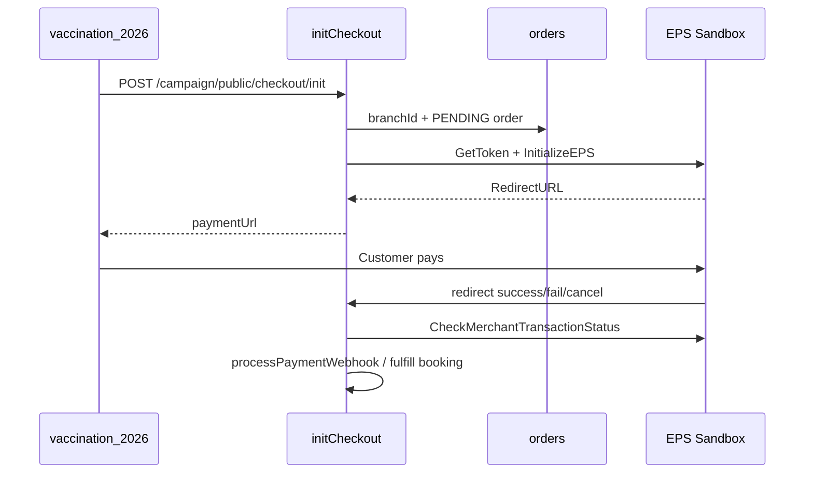

# EPS Sandbox Payment Provider (BPA unified payments)

**Provider code:** `eps`  
**Activation:** `PAYMENT_PROVIDER=eps`  
**Architecture:** Strategy pattern via `paymentProvider.registry` → `paymentOrchestrator.service` → campaign `createCheckoutPaymentIntent`

## Environment variables

| Variable | Required | Description |
|----------|----------|-------------|
| `PAYMENT_PROVIDER` | Yes (for EPS) | Set to `eps` |
| `API_PUBLIC_BASE_URL` | Yes | Public API host for callback URLs (or `BACKEND_PUBLIC_URL` / `APP_URL`) |
| `EPS_BASE_URL` | Recommended | Sandbox API: `https://sandboxpgapi.eps.com.bd` (live: `https://pgapi.eps.com.bd`) |
| `EPS_USERNAME` | Yes | Merchant username (email) |
| `EPS_PASSWORD` | Yes | Merchant password |
| `EPS_HASH_KEY` | Yes | EPS hash key (base64); `EPS_HASH` legacy alias |
| `EPS_MERCHANT_ID` | Yes | Merchant UUID from EPS panel |
| `EPS_STORE_ID` | Yes | Store UUID from EPS panel |
| `EPS_SANDBOX` | Optional | Default `true` when unset; used to pick default base URL if `EPS_BASE_URL` empty |
| `EPS_SUCCESS_URL` | Optional | Override success redirect |
| `EPS_FAIL_URL` | Optional | Override fail redirect |
| `EPS_CANCEL_URL` | Optional | Override cancel redirect |
| `CAMPAIGN_LANDING_URL` | Optional | User-facing return after redirect handlers |

**Never commit real credentials.** Use `.env` locally and secrets manager in production.

### Example (local dev / QA)

```env
PAYMENT_PROVIDER=eps
API_PUBLIC_BASE_URL=http://localhost:3000
CAMPAIGN_LANDING_URL=http://localhost:5173

EPS_BASE_URL=https://sandboxpgapi.eps.com.bd
EPS_USERNAME=your_sandbox_username
EPS_PASSWORD=your_sandbox_password
EPS_HASH_KEY=your_base64_hash_key
EPS_MERCHANT_ID=your-merchant-uuid
EPS_STORE_ID=your-store-uuid
EPS_SANDBOX=true
```

For callbacks reachable by EPS sandbox, use **ngrok** or a staging HTTPS host for `API_PUBLIC_BASE_URL`.

### Gateway hosts (verified 2026-06)

| Host | Role | Status |
|------|------|--------|
| `https://sandboxpgapi.eps.com.bd` | Sandbox REST API (`/v1/Auth/GetToken`, etc.) | **Use for `EPS_SANDBOX=true`** |
| `https://pgapi.eps.com.bd` | Production REST API | Use with live credentials |
| `https://sandboxpg.eps.com.bd` | Customer payment page (redirect UI) | Not the API base URL |
| `https://sandbox-pgapi.eps.com.bd` | Documented typo in some SDKs | **DNS does not resolve** — do not use |

Run `node scripts/verify-eps-endpoint.js` after changing EPS env.

## API flow (implemented)

| Step | EPS endpoint | BPA module |
|------|----------------|------------|
| GetToken | `POST {EPS_BASE_URL}/v1/Auth/GetToken` | `eps.provider.ts` (`getEpsAuthToken`) |
| Initialize | `POST .../v1/EPSEngine/InitializeEPS` | `eps.provider.ts` (`createIntent`) |
| Redirect | `RedirectURL` in response | Returned as `paymentUrl` in checkout |
| Status check | `GET .../CheckMerchantTransactionStatus` | `eps.provider.ts` (`checkTransactionStatus`) |
| Success callback | `GET /api/v1/payment/eps/callback/success` | `modules/payment/eps` |
| Fail callback | `GET /api/v1/payment/eps/callback/fail` | Same |
| Cancel callback | `GET /api/v1/payment/eps/callback/cancel` | Same |
| Dedicated module | `/api/v1/payment/eps/*` | `eps.routes.ts` |

Callbacks **always re-verify** status with EPS before fulfilling orders (same pattern as SSLCommerz IPN validation).

## Checkout flow



`merchantTransactionId` is the **order number** (`CKO-...`) so webhooks match `orders.orderNumber`.

## Restart after env change

1. Update `backend-api/.env`
2. Stop `npm run dev`
3. Start API — boot log should show: `[Payment] Active provider: eps | ... | configured: yes`
4. `GET http://localhost:3000/api/v1/payments/callback-urls` — confirm `eps` URLs

## Verification commands

```bash
# Config + unit tests
npm test -- --testPathPattern="paymentProvider.config|eps.utils"

# Campaign anchor (branch + organizer)
npm run seed:campaign-checkout-anchor
npm run verify:campaign-checkout-anchor

# Direct checkout (needs EPS + API_PUBLIC_BASE_URL in .env)
npx cross-env TS_NODE_TRANSPILE_ONLY=1 node -r ts-node/register scripts/verify-checkout-init-direct.ts
```

## Switching to live EPS

1. Obtain live credentials from EPS
2. Set `EPS_BASE_URL=https://pgapi.eps.com.bd` and `EPS_SANDBOX=false`
3. Update `EPS_*` credentials in env only — **no code change**
4. Set production `API_PUBLIC_BASE_URL` (HTTPS)
5. Register callback URLs in EPS merchant panel (match `callback-urls` endpoint)

## Files

| File | Role |
|------|------|
| `src/api/v1/modules/payment/eps/` | Dedicated EPS module (initiate, callbacks, validate) |
| `src/api/v1/modules/payment/paymentTransaction.service.ts` | `payment_transactions` table |
| `src/api/v1/providers/eps.provider.ts` | Back-compat re-export for unified strategy |
| `src/api/v1/providers/eps.utils.ts` | HMAC hash + transaction id helpers |
| `src/api/v1/payments/strategies/eps.strategy.ts` | Strategy registration |
| `src/api/v1/providers/paymentProvider.config.ts` | Env + readiness |
| `src/api/v1/payments/paymentProvider.registry.ts` | Factory |
| `src/api/v1/payments/paymentOrchestrator.service.ts` | Unified create/verify/webhook |
| `src/api/v1/modules/campaign/payment.service.ts` | Campaign bridge |
| `src/api/v1/payments/payment.routes.ts` | Shared redirect routes |
