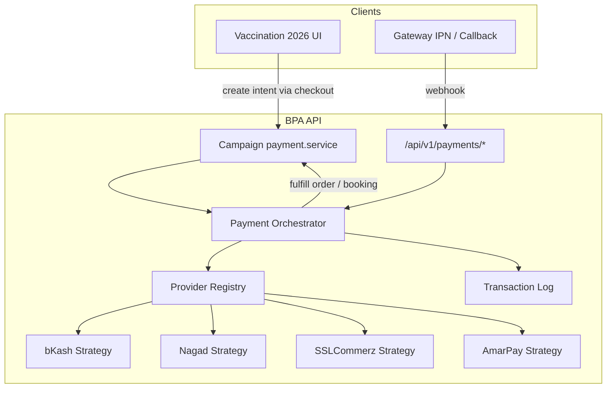

# Payment Gateway Architecture (Vaccination Campaign 2026)

Provider-based payment system for the BPA backend API. One active gateway is selected at runtime via environment variables; the booking module and campaign checkout flow use the same unified payment layer without code changes when switching providers.

## Supported providers

| `PAYMENT_PROVIDER` | Env credentials |
|---|---|
| `sslcommerz` (default) | `SSLCOMMERZ_STORE_ID`, `SSLCOMMERZ_STORE_PASSWORD` |
| `eps` | `EPS_USERNAME`, `EPS_PASSWORD`, `EPS_HASH`, `EPS_MERCHANT_ID`, `EPS_STORE_ID`, `EPS_BASE_URL` (optional) |
| `amarpay` | `AMARPAY_STORE_ID`, `AMARPAY_SIGNATURE_KEY` |
| `bkash` | `BKASH_APP_KEY`, `BKASH_APP_SECRET`, `BKASH_USERNAME`, `BKASH_PASSWORD` |
| `nagad` | `NAGAD_MERCHANT_ID`, `NAGAD_PUBLIC_KEY`, `NAGAD_PRIVATE_KEY` |

Optional: `NAGAD_MERCHANT_NUMBER`, sandbox flags (`*_SANDBOX=true`), and per-provider URL overrides.

## Architecture overview



### Strategy Pattern

Each gateway implements `PaymentProviderStrategy`:

- `createPayment` — initiate checkout session / redirect URL
- `verifyPayment` — server-side status check
- `handleWebhook` — validate signature/IPN and normalize to `VerifiedPaymentEvent`
- `refund` — optional (bKash today)

Strategies live under `src/api/v1/payments/strategies/` and wrap existing low-level providers in `src/api/v1/providers/`.

The registry (`paymentProvider.registry.ts`) reads `PAYMENT_PROVIDER` and returns the active strategy.

## Configuration

### Required

```env
PAYMENT_PROVIDER=sslcommerz
API_PUBLIC_BASE_URL=https://api.yourdomain.com

# Provider-specific (example: SSLCommerz)
SSLCOMMERZ_STORE_ID=
SSLCOMMERZ_STORE_PASSWORD=
```

### Optional

```env
PAYMENT_WEBHOOK_SECRET=          # Validates x-payment-webhook-secret / x-campaign-payment-secret
PAYMENT_RECOVERY_INTERVAL_MS=600000
CAMPAIGN_PAYMENT_TIMEOUT_MINUTES=30
CAMPAIGN_LANDING_URL=https://vaccination.yourdomain.com
```

### Startup validation

On API boot, `bootstrapPaymentProvider()` (`paymentProvider.bootstrap.ts`):

1. Resolves `PAYMENT_PROVIDER`
2. Validates required env keys for that provider
3. Ensures `API_PUBLIC_BASE_URL` (or fallback) is set for callback URLs
4. **Production:** throws and exits if misconfigured
5. **Development:** logs warnings and continues

## Unified HTTP API

Base path: `/api/v1/payments`

| Method | Path | Purpose |
|--------|------|---------|
| `POST` | `/create` | Create payment intent (redirect URL) |
| `POST` | `/verify` | Verify transaction by reference / provider TX id |
| `POST` | `/webhook` | Nagad, SSLCommerz IPN, AmarPay IPN |
| `GET` | `/webhook` | bKash tokenized callback (query params) |
| `GET` | `/webhook/redirect/success` | SSLCommerz browser success redirect |
| `GET` | `/webhook/redirect/fail` | SSLCommerz browser fail redirect |
| `GET` | `/webhook/redirect/cancel` | SSLCommerz browser cancel redirect |
| `GET` | `/callback-urls` | DevOps registry of callback URLs |

### POST /create

```json
{
  "amount": 500,
  "currency": "BDT",
  "referenceId": "CAMP-ABC123",
  "returnUrl": "https://vaccination.example.com/book/success",
  "cancelUrl": "https://vaccination.example.com/book/payment/failed",
  "orderId": 42,
  "metadata": { "phone": "01700000000", "name": "Guest" }
}
```

Response:

```json
{
  "success": true,
  "data": {
    "provider": "bkash",
    "redirectUrl": "https://...",
    "providerPaymentId": "...",
    "logId": 1
  }
}
```

### POST /verify

```json
{
  "referenceId": "CAMP-ABC123",
  "providerTxId": "optional-gateway-id"
}
```

On success, the orchestrator dispatches fulfillment to the campaign module (booking confirmation or checkout session fulfillment).

### Webhook security

1. **Optional shared secret** — when `PAYMENT_WEBHOOK_SECRET` is set, requests must include `x-payment-webhook-secret` or legacy `x-campaign-payment-secret`.
2. **Provider validation** — each strategy verifies signatures / executes server-side validation (e.g. SSLCommerz `val_id`, Nagad sensitiveData signature, bKash execute API).
3. **Replay guard** — Redis key `campaign:payment:event:{provider}:{eventId}` (7-day TTL) prevents duplicate processing.

## Campaign / booking integration

The vaccination booking module does **not** call gateway SDKs directly.

Flow:

1. **Express checkout** (`checkout.service.ts`) → `createCheckoutPaymentIntent` in `payment.service.ts`
2. `payment.service.ts` creates an `Order` row and calls `createUnifiedPayment` (orchestrator)
3. User pays at the active provider
4. Provider hits `/api/v1/payments/webhook`
5. Orchestrator validates, logs, and calls `processPaymentWebhook` → updates `Order`, confirms `CampaignBooking`, or fulfills `CampaignCheckoutSession`

`PAYMENT_PROVIDER` overrides the client-selected method: switching gateways is env-only.

Legacy campaign routes under `/api/v1/campaign/public/payments/*` remain for backward compatibility and delegate to the same orchestrator.

## Transaction logging

Table: `payment_transaction_logs` (Prisma model `PaymentTransactionLog`)

| Field | Description |
|-------|-------------|
| `phase` | `CREATE`, `VERIFY`, `WEBHOOK`, `RECOVERY` |
| `status` | `PENDING`, `SUCCESS`, `FAILED` |
| `referenceId` | Order number / merchant invoice |
| `providerTxId` | Gateway transaction id |
| `requestJson` / `responseJson` | Audit payload |

Service: `paymentTransaction.service.ts`

## Failure recovery

Background job (`paymentRecovery.service.ts`), scheduled from `src/index.ts`:

- Re-verifies stale `PENDING` campaign orders (between 3 minutes and `CAMPAIGN_PAYMENT_TIMEOUT_MINUTES`)
- Expires abandoned orders after timeout
- Updates checkout sessions / bookings to `FAILED` when appropriate

Interval: `PAYMENT_RECOVERY_INTERVAL_MS` (default 10 minutes).

## File map

```
src/api/v1/payments/
  payment.types.ts
  paymentProvider.interface.ts
  paymentProvider.registry.ts
  paymentProvider.bootstrap.ts
  paymentOrchestrator.service.ts
  paymentTransaction.service.ts
  paymentRecovery.service.ts
  payment.controller.ts
  payment.routes.ts
  payment.validation.ts
  strategies/
    bkash.strategy.ts
    nagad.strategy.ts
    sslcommerz.strategy.ts
    amarpay.strategy.ts

src/api/v1/providers/
  paymentProvider.config.ts
  bkash.provider.ts
  nagad.provider.ts
  sslcommerz.provider.ts
  amarpay.provider.ts
  paymentReplay.guard.ts

src/api/v1/modules/campaign/
  payment.service.ts          # Order + booking fulfillment
  payment.webhooks.service.ts # Legacy callback adapters
```

## Deployment checklist

1. Set `PAYMENT_PROVIDER` and provider credentials in production env
2. Set `API_PUBLIC_BASE_URL` to the public API hostname
3. Register webhook URL in gateway dashboard: `{API_PUBLIC_BASE_URL}/api/v1/payments/webhook`
4. For SSLCommerz, register IPN URL and redirect URLs (or use defaults from config)
5. Run migration: `npx prisma migrate deploy`
6. Run `npx prisma generate` and restart API
7. Confirm startup log: `[Payment] Active provider: … | webhook: … | configured: yes`
8. Hit `GET /api/v1/payments/callback-urls` to verify URLs

## Switching providers

Change only env and restart — no deploy of application code:

```env
PAYMENT_PROVIDER=bkash
BKASH_APP_KEY=...
# etc.
```

Update the gateway merchant panel callback URL to `/api/v1/payments/webhook`.

## Testing

```bash
npm test -- src/api/v1/providers/paymentProvider.config.test.ts
npm test -- src/api/v1/modules/campaign/payment.service.test.ts
npx tsc --noEmit
```

## Related docs

- [Booking flow simplification](./booking-flow-simplification-plan.md)
- [API design — express checkout](./05-api-design.md)
