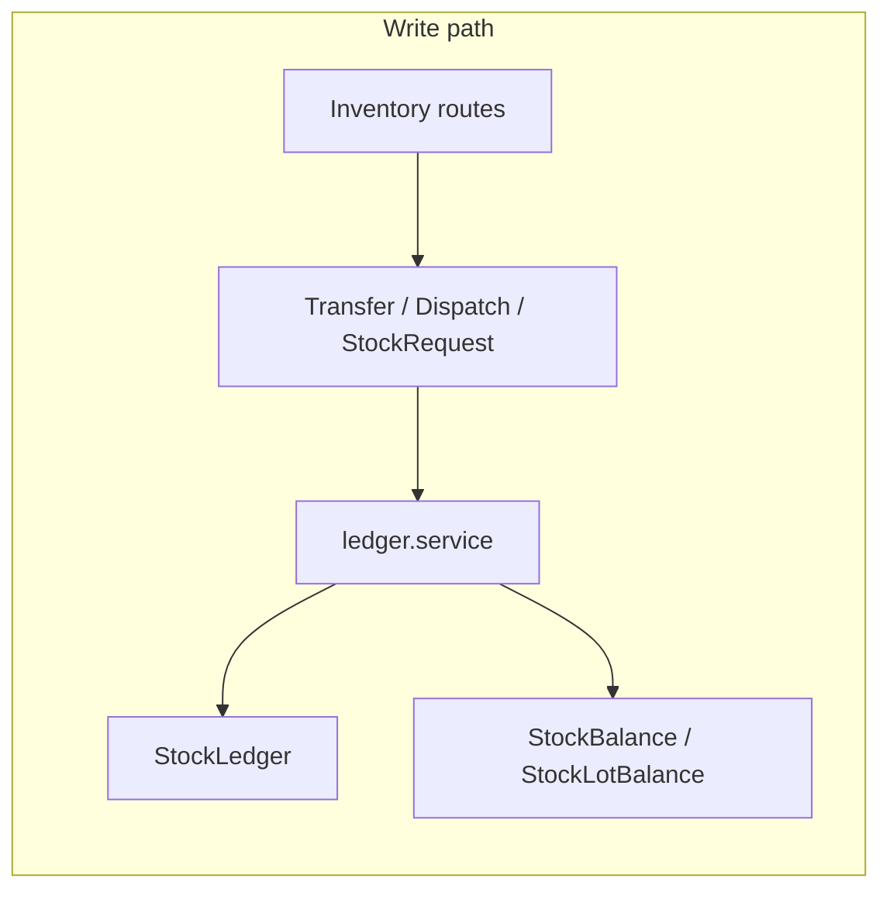

# Warehouse Phase 1 — Foundation

Enterprise documentation for multi-tenant warehouse stock in BPA/WPA. Source of truth for inventory movement is **ledger-based** (`StockLedger`); balances are derived (`StockBalance`, `StockLotBalance`).

## Assumptions

- **Tenancy:** Every stock query and mutation is scoped by `orgId` (directly on models that carry it, or via `Branch.orgId` → `InventoryLocation.branchId`).
- **Stock truth:** Append-only `StockLedger` rows; no direct overwrite of balances except through the ledger service transaction path.
- **Physical hierarchy:** `Organization` → `Warehouse` → `WarehouseZone` → `WarehouseRack` → `WarehouseBin` → optional `InventoryLocation.binId` (pick face / bin-level location). Branch-level locations without a warehouse remain valid.
- **Naming:** **Stock lot** = `StockLot` (expiry-tracked inventory). The Prisma model `Batch` elsewhere in the schema is **production/factory** batching, not warehouse stock.

## Current system gaps (addressed in Phase 1)

1. Rack/bin were not first-class; Phase 1 adds `WarehouseRack` and `WarehouseBin` and optional `InventoryLocation.binId`.
2. `StockLedger.orgId` was often null on write; Phase 1 resolves from location when omitted in `recordLedgerEntryInTx`.
3. `StockTransferItem` lacked `stockRequestItemId`; Phase 1 adds optional FK for request-line traceability.
4. Legacy `Inventory` / `StockTransaction` tables remain for backward compatibility; HTTP routes for direct adjust/upsert return 410 — new flows use ledger APIs.

## Target architecture

All IN/OUT movements flow through `ledger.service` (`recordLedgerEntry` / `recordLedgerEntryInTx`). Orchestrators (`transfers`, `dispatches`, `stock_requests`, GRN receive) call the ledger service inside transactions.

## Database schema (relevant entities)

| Entity | Purpose |
|--------|---------|
| `Warehouse` | Org-scoped warehouse; optional `branchId` link |
| `WarehouseZone` | Zone within warehouse (`@@unique([warehouseId, code])`) |
| `WarehouseRack` | Rack within zone |
| `WarehouseBin` | Bin within rack |
| `InventoryLocation` | Stock-holding location; `warehouseId`, `zoneId`, optional `binId` |
| `StockLot` | Lot/batch for expiry and FEFO |
| `StockLedger` | Immutable movement lines |
| `StockBalance` / `StockLotBalance` | Cached aggregates per location (+ variant or + lot) |
| `StockTransfer` / `StockTransferItem` | Inter-location transfer; optional `stockRequestId` / `stockRequestItemId` |

## API contract (additive under `/api/v1/inventory`)

| Method | Path | Description |
|--------|------|-------------|
| GET | `/warehouses` | List warehouses for resolved org scope |
| GET | `/locations` | Existing — list accessible locations; optional `warehouseId` filter |
| GET | `/stock` | Aggregated balances (`warehouseId`, `variantId`, pagination) |
| POST | `/stock/in` | Ledger IN (e.g. `ADJUSTMENT` / receive-style types per body) |
| POST | `/stock/out` | Ledger OUT; insufficient stock → error |
| POST | `/transfers` | Create draft transfer (same semantics as `POST /api/v1/transfers`) |
| POST | `/transfers/:id/dispatch` | Alias for send / `IN_TRANSIT` — same as `POST /api/v1/transfers/:id/send` |

**Errors:** Reuse existing patterns (`400` validation, `403` permission, `401` auth). Inventory-specific codes from `INVENTORY_ERROR_CODES` where applicable (e.g. `LOT_EXPIRED`, `LOT_RECALLED`).

**Backward compatibility:** Existing `/api/v1/inventory/*` and `/api/v1/transfers/*` routes unchanged.

## Migration strategy

- New migrations only; follow `docs/PRISMA_MIGRATION_NON_DESTRUCTIVE_POLICY.md`.
- No `migrate reset` or `db push` on production-like databases.
- After adding columns/tables: `npx prisma migrate deploy` and `node scripts/check-migration-integrity.js`.
- Optional follow-up: backfill `StockLedger.orgId` for historical rows (separate batch job).

## Related documentation

- Enterprise hardening (indexes, rate limits, receive matching, Phase-2 prep): [`docs/warehouse-enterprise-hardening.md`](./warehouse-enterprise-hardening.md)

## Related files

- Ledger: `src/api/v1/modules/inventory/ledger.service.ts`
- Facades: `src/api/v1/modules/inventory/services/*.service.ts`
- Transfers: `src/api/v1/modules/transfers/transfers.service.ts`
- Stock requests: `src/api/v1/modules/stock_requests/stock_requests.service.ts`
