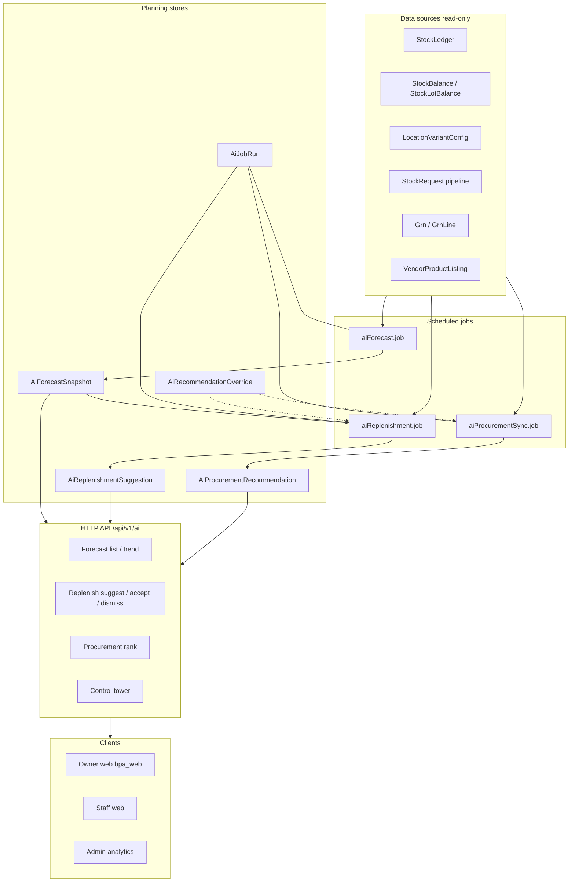
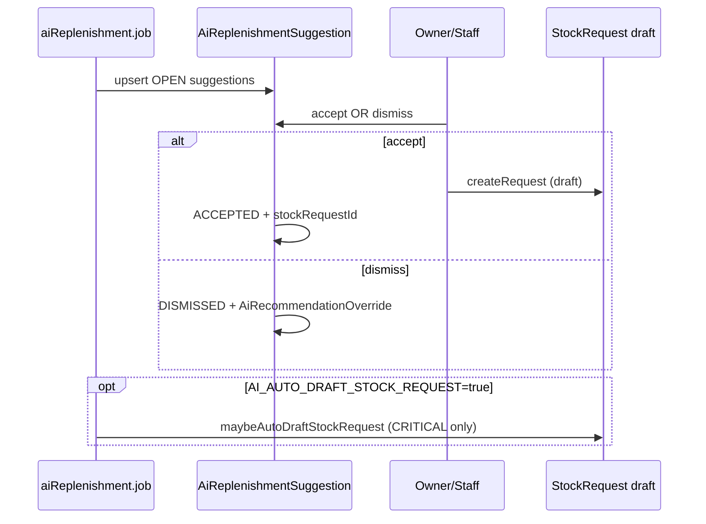

# Wave-1 — Phases 4–6: Demand Forecasting, Auto Replenishment, Procurement Intelligence

**Document path:** `docs/wave1-phase4-6-demand-replenishment-procurement-plan.md`
**Related:** [`phase-4-ai-intelligence-plan.md`](./phase-4-ai-intelligence-plan.md), [`warehouse-phase1-foundation.md`](./warehouse-phase1-foundation.md), [`warehouse-phase2-fulfillment-engine-plan.md`](./warehouse-phase2-fulfillment-engine-plan.md), [`WAREHOUSE_PHASE3_ENTERPRISE_HARDENING_REPORT.md`](./WAREHOUSE_PHASE3_ENTERPRISE_HARDENING_REPORT.md), [`PRISMA_MIGRATION_NON_DESTRUCTIVE_POLICY.md`](./PRISMA_MIGRATION_NON_DESTRUCTIVE_POLICY.md)

**Repositories (audited):**

| Role | Path |
|------|------|
| Backend API | `D:\BPA_Data\backend-api` |
| Web app (Next.js) | `D:\BPA_Data\bpa_web` *(note: if your local clone uses `web_app`, align paths to the same app)* |

This document is the **single Wave-1 planning source of truth** for extending the existing Phase-4 “AI intelligence” baseline into production-grade **forecasting**, **replenishment**, and **procurement intelligence** without breaking ledger-first inventory, fulfillment, or multi-tenant isolation.

---

## 1. Executive summary

**Objective:** Add a **planning layer** that:

- Forecasts demand at **product / variant / location / time-window** granularity using **real ledger and operational data** (not synthetic “AI”).
- Recommends **replenishment** with **min/max, safety stock, lead time, service level**, and **seasonality-aware** extensions where data supports them.
- Surfaces **procurement intelligence**: supplier comparison, purchase recommendations, **price and lead-time history**, and **shortage-risk** signals—**without** auto-approving purchases.

**Current baseline:** The backend already ships a **minimal, explainable** implementation under `src/api/v1/modules/ai_intelligence/`, persisted in `AiForecastSnapshot`, `AiReplenishmentSuggestion`, `AiProcurementRecommendation`, `AiJobRun`, `AiRecommendationOverride`, with cron-friendly npm scripts (`job:ai-forecast`, `job:ai-replenishment`, `job:ai-procurement-sync`). Wave-1 **extends** this foundation rather than replacing it.

**Architectural stance:** **Loosely coupled modules**—forecasting job → snapshot store; replenishment engine reads snapshots + balances + configs + pipeline; procurement ranks vendors from listings + GRN history; **alerting** reads the same stores; **explainability** is a first-class JSON field pattern already started (`factorsJson`, `inputsJson`, `metaJson`, ranked vendor payloads).

---

## 2. Current-state audit (relevant to forecasting / replenishment / procurement)

### 2.1 Data and tenancy

| Area | Finding |
|------|---------|
| **Org isolation** | `Product.orgId`, `Branch` → `orgId`, `StockLedger.orgId` (nullable but populated on write path per Phase-1 docs), `Vendor.orgId`, `PurchaseOrder.orgId`, `Warehouse.orgId`. AI tables carry `orgId` directly. |
| **Stock truth** | Append-only `StockLedger`; `StockBalance` / `StockLotBalance` are derived. Phase-1/2 docs require mutations through ledger services. |
| **Locations** | `InventoryLocation` ties to `branchId`, optional `warehouseId`, `zoneId`, `binId`; `InventoryLocationType` includes `CENTRAL_WAREHOUSE`, `PHARMACY`, `CLINIC_STORE`, etc. |
| **Branch demand config** | `LocationVariantConfig`: `minStock`, `maxStock`, `reorderPoint` per `(locationId, variantId)`. |
| **Fulfillment pipeline** | `StockRequest` / `StockRequestItem`, `StockTransfer`, `StockDispatch`, `AllocationPlan`, `PickList`—replenishment already counts **open stock request pipeline** in `replenishment.service.ts`. |
| **Inbound procurement** | `PurchaseOrder` / `PurchaseOrderLine`, `Grn` / `GrnLine` with `unitCost`; `Vendor`, `VendorProductListing`. |
| **Existing AI persistence** | See §16 for models; unique keys today anchor forecasts to **`orgId + branchId + variantId + horizonDays`** (not warehouse-only or pure product-level). |

### 2.2 Backend modules (audited paths)

| Module | Path | Role in Wave-1 |
|--------|------|------------------|
| Forecasting | `src/api/v1/modules/ai_intelligence/aiForecast.service.ts` | Ledger aggregation, weekly trend, snapshot upsert, list + demand trend API helpers. |
| Replenishment | `src/api/v1/modules/ai_intelligence/replenishment.service.ts` | ROP/order-up-to, pipeline, suggestion upsert, accept → **draft** `StockRequest`. |
| Procurement | `src/api/v1/modules/ai_intelligence/procurement.service.ts` | Vendor ranking from listings + GRN/return proxies. |
| Control tower | `src/api/v1/modules/ai_intelligence/controlTower.service.ts` | Org-level KPIs and critical alerts. |
| HTTP | `src/api/v1/modules/ai_intelligence/ai_intelligence.routes.ts`, mounted at **`/api/v1/ai`** in `src/api/v1/routes.ts` | Permission-gated read/manage endpoints. |
| Jobs | `src/common/jobs/aiForecast.job.ts`, `aiReplenishment.job.ts`, `aiProcurementSync.job.ts` | Scheduled recomputation entry points. |
| Permissions | `src/api/v1/services/permissionsRegistry.service.ts` | Keys: `inventory.ai.forecast.read`, `inventory.ai.replenishment.manage`, `inventory.ai.procurement.read`, `inventory.ai.control_tower.read`. |
| Inventory / ledger | `src/api/v1/modules/inventory/ledger.service.ts` (and facades) | Source of demand types; must stay consistent with `DEMAND_LEDGER_TYPES`. |

### 2.3 Frontend (audited)

- Primary app: **`bpa_web`** (Next.js App Router under `app/`).
- Warehouse/staff/owner inventory UIs exist (e.g. stock requests, warehouse operations per Phase-2/3 docs); **dedicated owner “AI planning” pages are not yet first-class**—Wave-1 should add them (see §17).
- Separate clinic “replenishment” copy exists (`app/owner/(larkon)/clinic/[branchId]/refill/page.tsx`) referencing owner clinic APIs—**do not conflate** with `/api/v1/ai/*` unless product explicitly merges UX.

### 2.4 Documentation already in `/docs`

- [`phase-4-ai-intelligence-plan.md`](./phase-4-ai-intelligence-plan.md) — concise architecture; **keep it** as a short index and point here for Wave-1 depth.
- Warehouse Phases 1–3 — inventory movement, fulfillment, hardening; **planning layer must only read** or enqueue draft workflows, not bypass ledger.

---

## 3. Assumptions and missing-data strategy

| Assumption | Rationale |
|------------|-----------|
| **Demand proxy** | Outbound ledger lines whose `type` ∈ `DEMAND_LEDGER_TYPES` (`SALE_POS`, `SALE_CLINIC`, `SALE_ONLINE`, `TRANSFER_OUT`) represent consumptive demand at that location. |
| **Cold start** | New SKUs/branches have sparse ledger history → **widen confidence intervals**, lower confidence score, optionally fall back to **category/branch priors** (future) or **manual override** via `AiRecommendationOverride`. |
| **Lead time** | Default constants in `aiConstants.ts` until per-supplier or per-SKU lead times exist in DB; overrides in `AiRecommendationOverride` (`leadTimeDays`, `safetyDays`). |
| **Seasonality** | Requires **≥2 seasonal cycles** of weekly or monthly aggregates; until then, use **damped weekly trend** only (already partially present). |
| **Procurement “price history”** | Derived from **`GrnLine.unitCost`** time series (no separate price table required for MVP). |
| **No auto-PO / auto-approve** | Align with existing Phase-4 policy: suggestions only; human creates/submits `PurchaseOrder`. |
| **Strict org isolation** | Every query filters by `orgId` resolved from `Branch` or session; admin cross-org views use admin middleware, not owner routes. |

**Missing-data handling (uniform rules):**

1. **No ledger history** → skip forecast snapshot or store with `method: INSUFFICIENT_DATA` and `confidence: 0`; do not emit replenishment unless explicit policy says “config-only ROP”.
2. **No vendor listing** → procurement rank empty with explain code `NO_APPROVED_LISTING`.
3. **No GRN cost** → price score neutral (0.5) as today; show `price_unknown` in reason codes.

---

## 4. Gap analysis

| Gap | Impact | Wave-1 direction |
|-----|--------|------------------|
| Forecasts keyed by **branch**, not **warehouse-only** or **product-aggregated** | Cannot yet show “central warehouse demand” as a first-class snapshot row without derivation | Add **`planningScope`** / `locationType` filter or separate snapshot table rows for `CENTRAL_WAREHOUSE` locations (see §16). |
| **Service level** not explicit in formulas | Safety stock is “safety days × demand” heuristic | Introduce **z-score** optional path when demand variance stable; keep heuristic as default. |
| **Seasonality** partial | Only weekly buckets + capped trend | Add **month-of-year** factors when ≥24 months data (feature flag). |
| **Purchase lifecycle** | Accept replenishment → `StockRequest` only; no **draft PO** from procurement rank | Add optional **`PurchaseSuggestion`** or link procurement output to **draft PO** creation (§14). |
| **Price / lead-time history APIs** | Data exists in GRN; not exposed as curated series | Add read APIs + materialized rollups if performance requires (§12, §18). |
| **Alerting** | Partially embedded in control tower | Centralize **alert rules** + notification channel hooks (§20). |
| **Frontend** | APIs exist; UX incomplete | Owner/admin/staff pages (§17). |

---

## 5. Target architecture



**Coupling rules:**

- Forecasting **never** calls transfer/dispatch write paths.
- Replenishment **accept** only calls existing `stock_requests.service` **create** (draft).
- Procurement **never** posts GRN or PO without user action.

---

## 6. Demand forecasting model design

### 6.1 Baseline (production today): `SIMPLE_LEDGER_BASELINE`

- **Input window:** `DEFAULT_WINDOW_DAYS` (90) configurable.
- **Per variant:** Sum outbound units (`|quantityDelta|`) for demand ledger types across **all active locations in branch** (`getBranchLocationIds`).
- **Avg daily demand:** total consumption / span days.
- **Trend:** Weekly aggregation + **capped** linear regression slope vs mean (`aiExplainability` helpers).
- **Horizon forecast:** `avgDaily * horizonDays * (1 + trendAdj)`.
- **Confidence:** Heuristic from row count + coefficient of variation of weekly totals.

### 6.2 Wave-1 extensions (same service, pluggable `method` string)

| Method code | When to use |
|-------------|-------------|
| `SIMPLE_LEDGER_BASELINE` | Default; sparse data friendly. |
| `SEASONAL_WEEK_OF_YEAR` | Optional; if bucketed history ≥ N weeks. |
| `EWMA_DEMAND` | Smoothing for high-noise SKUs. |
| `PROPHET_OR_EXTERNAL` | **Hook only**: export features → optional external job; write back snapshot with same table. |

**“Real AI” requirement:** Any ML model must **ingest features from §7** and **persist explainability** (`factorsJson`, `inputsJson`); model name/version in `inputsJson.modelVersion`.

---

## 7. Forecast data sources and feature design

| Feature | Source | Notes |
|---------|--------|-------|
| `ledger_outbound_units` | `StockLedger` | Filter `type ∈ DEMAND_LEDGER_TYPES`, `quantityDelta < 0`. |
| `location_breakdown` | `StockLedger` + `InventoryLocation` | For warehouse vs branch views, group by `location.type` or `warehouseId`. |
| `variant_attributes` | `ProductVariant`, `Product` | Category/brand for hierarchical priors (future). |
| `open_orders_proxy` | `StockRequestItem` | Not demand; use as **downward adjustment** to “net demand” only if product defines double-counting risk (optional). |
| `promo_calendar` | *Missing* | Placeholder in `inputsJson` for future. |
| `week_index` / `month_index` | Derived from `createdAt` | Seasonality features. |

**Feature store pattern (lightweight):** For Wave-1, **no new OLAP DB**—use SQL aggregates in service layer; if latency becomes an issue, add **`ForecastFeatureDaily`** rollup table (§16 optional).

---

## 8. Forecast granularity and aggregation rules

| View | Primary key strategy | Aggregation rule |
|------|----------------------|------------------|
| **Variant × Branch** | Current `AiForecastSnapshot` | Sum demand across all `InventoryLocation` where `branchId = X`. |
| **Variant × Warehouse** | New snapshot row OR derived query | Restrict ledger to `location.warehouseId = W` (and optionally `type = CENTRAL_WAREHOUSE`). |
| **Product × Branch** | Not stored by default | Roll up: `sum(forecastUnits)` over variants of product **or** recompute from ledger grouped by `productId`. |
| **Time window** | `horizonDays` on snapshot | Multiple horizons (7, 14, 30) = multiple rows differing by `horizonDays` (unique key permits this). |

**Rules:**

- **Single source of truth:** Stored snapshots for default horizon(s); ad-hoc API may compute on the fly for admin with rate limits.
- **Double-counting:** `TRANSFER_OUT` from branch to warehouse is **consumption at source**; do not also count as demand at destination (inbound is receipt). Document this in UI help.

---

## 9. Replenishment rules and formulas

**Effective reorder point (already aligned in code conceptually):**

- `configuredRop = max over locations of (reorderPoint ?? minStock ?? 0)`.
- `derivedRop = ceil(avgDaily * (leadTimeDays + safetyDays))` when config unset.
- `rop = max(configuredRop, derivedRop)` when config is zero everywhere (see `effectiveRop` in `replenishment.service.ts`—evolve to make precedence **configurable** per org policy).

**Suggested order quantity:**

- `target = orderUpTo ?? ceil((leadTimeDays + safetyDays) * avgDaily)` capped by `maxStock` when present.
- `suggestedQty = max(0, target - onHand - inboundPipeline)`.

**Reason codes (extend enum-like string convention):** `AT_OR_BELOW_ROP`, `PROJECTED_STOCKOUT`, future: `BELOW_SAFETY_STOCK`, `SEASONAL_RISK`, `CENTRAL_BUFFER_SHORT`.

---

## 10. Safety stock and reorder point strategy

| Strategy | Formula | Use when |
|----------|---------|----------|
| **Fixed days cover** | `SS = avgDaily * safetyDays` | Default; matches mental model for ops. |
| **Service level (normal approx.)** | `SS = z * σ_LT` where σ_LT = std dev of **lead-time demand** | Data-rich SKUs; **z** from target fill rate (e.g. 0.95 → ~1.65). |
| **Min/Max** | If `onHand <= minStock` → suggest up to `maxStock` | When `LocationVariantConfig` populated. |

**Overrides:** `AiRecommendationOverride` per variant/branch: `safetyDays`, `leadTimeDays`, `dismissedUntil` to suppress noisy alerts.

---

## 11. Auto-replenishment workflow

**Principles:** Automation is **opt-in** per org via env (existing pattern: `AI_AUTO_DRAFT_STOCK_REQUEST` in `replenishment.service.ts`).



**Wave-1 additions:**

- Policy object: **max drafts per day**, **exclude weekends**, **require approval queue** before submit (business rule outside this doc).
- **Warehouse-initiated replenishment** (branch requests from central): same math but **inbound pipeline** includes `WarehouseTransferOrder` in relevant statuses when wired.

---

## 12. Procurement intelligence design

**Goals:**

- **Supplier comparison:** Rank vendors per variant using **price**, **reliability**, **quality/returns**, with **published weights** (already in `procurement.service.ts`).
- **Purchase recommendation:** Top vendor + runner-up; **no auto-buy**.
- **Price history:** Time series from `GrnLine.unitCost` by `(variantId, vendorId)`.
- **Lead-time history:** `Grn.receivedAt - Grn.createdAt` (or PO submit → receive if linked).
- **Shortage-risk:** Join **replenishment severity** + **low vendor score** + **slow GRN** → composite alert.

**Explainability:** Return `weights`, `components`, `reasonCodes`, `medianPeerPrice` in API responses (already partially in `scoresJson`).

---

## 13. Supplier scoring and recommendation logic

**Current weights (baseline):** `price: 0.35`, `reliability: 0.35`, `quality: 0.2`, `ledger: 0.1`.

**Wave-1 refinements:**

| Component | Signal | Improvement |
|-----------|--------|-------------|
| Price | Median unit cost vs peer median | Add **volatility penalty** if cost CV high. |
| Reliability | Consistency of receive delay | Add **on-time %** if `expectedDeliveryDate` populated on PO. |
| Quality | `VendorReturn` / GRN ratio | Keep; add **QC fail rate** from `QcInspection` if linked to vendor line. |
| Ledger | `VendorLedgerEntry` patterns | Replace static `0.5` with **payment/discipline proxy** (optional). |

**Output:** Persist `rankedVendorsJson` with explicit **stable sort** (score desc, then price asc).

---

## 14. Purchase suggestion lifecycle

| State | Description | System action |
|-------|-------------|---------------|
| **Computed** | `AiProcurementRecommendation` row | Job refresh |
| **Reviewed** | User opens UI | None |
| **Draft PO created** | *(Wave-1)* link `purchaseOrderId` optional FK | Create `PurchaseOrder` in `DRAFT` with suggested vendor/lines |
| **Submitted** | User workflow | Existing PO module |
| **Received** | GRN | Feeds back into scoring |

**Today:** Replenishment accept → **StockRequest** only. **Wave-1:** Add parallel path **“Create draft PO”** from procurement rank for **central warehouse** users with permission `inventory.purchase_orders.manage` (or equivalent existing key).

---

## 15. Prisma / data-model proposal

### 15.1 Existing models (keep; may extend columns)

- `AiForecastSnapshot`, `AiReplenishmentSuggestion`, `AiProcurementRecommendation`, `AiJobRun`, `AiRecommendationOverride` — see `prisma/schema.prisma` (~6969+).

### 15.2 Recommended additive changes (non-destructive migrations only)

| Change | Purpose |
|--------|---------|
| `AiForecastSnapshot.planningScope` enum: `BRANCH`, `WAREHOUSE`, `NETWORK` | Distinguish aggregation dimension |
| `AiForecastSnapshot.scopeEntityId` nullable Int | `warehouseId` when scope = WAREHOUSE |
| `AiReplenishmentSuggestion` — relax unique if per-location rows needed | Replace `@@unique([orgId, branchId, variantId, dayBucket])` with `(orgId, branchId, variantId, dayBucket, locationId)` **only if** location-level suggestions required |
| **`VendorPriceObservation`** (optional) | Denormalize `grnLineId`, `unitCost`, `observedAt` for fast charts |
| **`ForecastFeatureDaily`** (optional) | `orgId`, `branchId`, `variantId`, `date`, `outboundUnits` for faster windows |

Run `node scripts/check-migration-integrity.js` before/after deploy per project policy.

---

## 16. Backend module / file plan

| Action | Path |
|--------|------|
| Extend | `ai_intelligence/aiForecast.service.ts` — scopes, seasonality, service-level SS |
| Extend | `ai_intelligence/replenishment.service.ts` — pipeline includes WTO/dispatch; policy hooks |
| Extend | `ai_intelligence/procurement.service.ts` — price/lead-time series helpers |
| Add | `ai_intelligence/alerting.service.ts` — rule evaluation + notification payloads |
| Add | `ai_intelligence/purchaseSuggestion.service.ts` — draft PO builder *(optional phase)* |
| Extend | `ai_intelligence/ai_intelligence.routes.ts` — new GETs for history series |
| Extend | `ai_intelligence/ai_intelligence.controller.ts` |
| Extend | Jobs — pass org list, shard by branch, record `AiJobRun.statsJson` |
| Reuse | `stock_requests.service.ts`, `owner`/`inventory` modules for writes |

---

## 17. Frontend route / page / component plan (`bpa_web`)

| Actor | Suggested route | Purpose |
|-------|-----------------|--------|
| **Owner** | `app/owner/(larkon)/inventory/planning/page.tsx` | Control tower dashboard (KPIs, critical SKUs) |
| **Owner** | `app/owner/(larkon)/inventory/planning/forecast/[branchId]/page.tsx` | Forecast table + explain drawer |
| **Owner** | `app/owner/(larkon)/inventory/planning/replenishment/[branchId]/page.tsx` | Suggestions, accept/dismiss |
| **Owner** | `app/owner/(larkon)/inventory/planning/procurement/[branchId]/page.tsx` | Vendor ranks + price history chart |
| **Staff** | `app/staff/(larkon)/branch/[branchId]/inventory/replenishment-suggestions/page.tsx` | Operational list (subset of owner) |
| **Admin** | `app/admin/(larkon)/vendor-analytics/page.tsx` | Already referenced in Phase-4 doc; align with `adminVendorAnalytics.controller.ts` |

**Components:** Reuse `SectionCard`, `DataTableWrapper`, chart placeholder consistent with WowDash patterns; **no full UI redesign**—incremental tables + drawers.

**API client:** Extend `lib/api.ts` or `app/owner/_lib/ownerApi.ts` with typed helpers for `/api/v1/ai/*`.

---

## 18. API contract design

**Existing (baseline):**

| Method | Path | Purpose |
|--------|------|---------|
| GET | `/api/v1/ai/forecast?branchId=&horizonDays=&variantId=` | List snapshots + explain |
| GET | `/api/v1/ai/demand-trend?branchId=&variantId=&windowDays=` | Sparkline data |
| GET | `/api/v1/ai/replenishment/suggestions?branchId=` | List OPEN suggestions |
| POST | `/api/v1/ai/replenishment/suggestions/:id/accept` | Draft stock request |
| POST | `/api/v1/ai/replenishment/suggestions/:id/dismiss` | Dismiss + override row |
| GET | `/api/v1/ai/procurement/recommendations?branchId=` | Ranked vendors |
| GET | `/api/v1/ai/control-tower/overview` | Org KPIs |

**Wave-1 additions (proposed):**

| Method | Path | Purpose |
|--------|------|---------|
| GET | `/api/v1/ai/forecast?branchId=&warehouseId=` | Warehouse-scoped filter |
| GET | `/api/v1/ai/procurement/price-history?variantId=&vendorId=` | GRN-based series |
| GET | `/api/v1/ai/procurement/lead-time-history?vendorId=` | DELTA(receive, create) series |
| GET | `/api/v1/ai/alerts` | Normalized alert feed for bell widget |
| POST | `/api/v1/ai/procurement/recommendations/:id/create-draft-po` | Optional draft PO |

**Response shape (consistent):**

```json
{
  "success": true,
  "data": { },
  "explain": { "method": "...", "factors": [], "inputs": {} }
}
```

---

## 19. Dashboards and UX flows

1. **Owner opens Control Tower** → sees branch count, critical replenishment lines, low-confidence forecasts → drills into branch.
2. **Forecast view** → selects variant → sees factors + demand trend chart → exports CSV (optional).
3. **Replenishment** → sorts by severity → **Accept** → lands on existing **stock request draft** screen → user submits per existing workflow.
4. **Procurement** → sees ranked vendors → **View price history** → **Create draft PO** (Wave-1 optional) → existing PO approval.
5. **Staff** → narrower view: today’s critical SKUs for their branch only.

---

## 20. Alerting rules

| Rule ID | Condition | Severity | Channel |
|---------|-----------|----------|---------|
| `REP-CRITICAL` | `AiReplenishmentSuggestion.status=OPEN` AND `severity=CRITICAL` | High | In-app, email optional |
| `REP-WARNING` | OPEN + WARNING | Medium | In-app |
| `FC-LOW-CONF` | `confidence < 0.35` | Low | Badge on forecast |
| `PROC-SHORTAGE` | Top vendor score < T AND replenishment OPEN | High | Control tower |
| `PO-DELAY` | GRN received **after** PO `expectedDeliveryDate` | Medium | Procurement inbox |

**Implementation:** `alerting.service.ts` produces **idempotent** alert keys `(orgId, ruleId, entityId, dayBucket)`; store in `AiJobRun.statsJson` or a dedicated **`PlanningAlert`** table if persistence needed beyond logs.

---

## 21. Migration strategy

1. **Schema:** Additive migrations only; no edit of applied migration files.
2. **Backfill:** Optional job to populate `scopeEntityId` for existing snapshots (default BRANCH scope).
3. **Feature flags:** `AI_FORECAST_METHOD`, `AI_ENABLE_SEASONALITY`, `AI_AUTO_DRAFT_STOCK_REQUEST` (existing).
4. **Deploy order:** migrate → deploy API → deploy workers → deploy frontend → enable flags per tenant.

---

## 22. Step-by-step implementation sequence

1. **Lock requirements** from this doc + product sign-off on “no auto-PO”.
2. **Extend forecast aggregation** for warehouse-scoped and product-rollup **read APIs** (minimal schema change).
3. **Harden replenishment** pipeline inputs (WTO, optional dispatch in-flight) behind feature flag.
4. **Add procurement history** endpoints (GRN-based) — read-only.
5. **Alerting service** + optional `PlanningAlert` table.
6. **Frontend**: owner planning hub + branch pages; staff narrow view.
7. **Optional:** draft PO from procurement.
8. **Performance:** daily rollup table if p95 SLA missed.
9. **Docs:** shorten [`phase-4-ai-intelligence-plan.md`](./phase-4-ai-intelligence-plan.md) to link here.

---

## 23. Risks, edge cases, and validation checklist

| Risk | Mitigation |
|------|------------|
| **Cross-tenant leak** | Code review every new query for `orgId`; use branch → org resolution consistently with controller helpers. |
| **Double-counting demand** | Document ledger types; exclude `ADJUSTMENT` from demand. |
| **Over-automation** | Keep `AI_AUTO_DRAFT_STOCK_REQUEST` default **false**. |
| **DB load** | Batch jobs off-peak; limit variants per branch (`maxVariants` in `runForecastForBranch`). |

**Validation checklist (pre-release):**

- [ ] Forecast numbers match manual SQL sum on sample variant for 90-day window.
- [ ] Accept suggestion creates **DRAFT** stock request only.
- [ ] Dismiss creates override row and suppresses repeat (policy-dependent).
- [ ] Procurement ranks change when GRN costs shift.
- [ ] Permission denied without `inventory.ai.*` keys.
- [ ] Org A user cannot pass Org B `branchId` (403).

---

## 24. Testing strategy

| Layer | Scope |
|-------|--------|
| **Unit** | Pure functions: trend clamp, ROP math, scoring weights (Jest). |
| **Integration** | Prisma test DB: ledger rows → snapshot → suggestion → accept → `StockRequest` row. |
| **API** | Supertest: `/api/v1/ai/*` with mocked auth + branch access. |
| **E2E (optional)** | Playwright: owner accepts suggestion and sees draft request. |

Existing: `stockCount.service.test.ts` pattern in inventory module—mirror for `ai_intelligence`.

---

## 25. Rollback / safety strategy

- **Disable jobs:** remove cron or set env `AI_JOBS_ENABLED=false` *(add if not present)*.
- **API:** feature-flag new routes; keep read-only baseline.
- **Data:** AI tables are **isolated**; rollback code without dropping tables.
- **Fulfillment:** unchanged; replenishment accept path is additive.

---

## 26. Definition of done

Wave-1 Phases 4–6 are **done** when:

1. **Forecasting** supports **branch and warehouse (or product rollup) views** with documented aggregation rules and **explainable** outputs.
2. **Replenishment** uses **min/max, ROP, safety/lead-time** logic with clear formulas and **user-visible reasons**.
3. **Procurement intelligence** exposes **comparison + price/lead-time history + shortage awareness** grounded in **GRN/PO** data.
4. **Integration** respects **ledger + fulfillment + stock request** flows; suggestions never bypass controls.
5. **Multi-tenant isolation** verified by tests and manual QA.
6. **Frontend** exposes owner/staff paths documented in §17 for core workflows.
7. **Operations** have runbooks for jobs, alerts, and rollback (§21, §25).

---

**Updated:** `D:\BPA_Data\backend-api\docs\wave1-phase4-6-demand-replenishment-procurement-plan.md`
