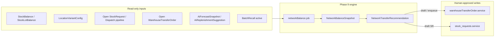

# Wave-3 — Phases 9–10: Network Inventory Balancing, Returns / Reverse Logistics, Recall Execution

**Document path:** `docs/wave3-phase9-10-network-balance-returns-recall-plan.md`

**Governance:** Follow [`WINDSURF_GLOBAL_RULE.md`](./WINDSURF_GLOBAL_RULE.md) (plan-first, docs in `/docs` only, single source of truth). Schema changes must follow [`PRISMA_MIGRATION_NON_DESTRUCTIVE_POLICY.md`](./PRISMA_MIGRATION_NON_DESTRUCTIVE_POLICY.md).

**Related (must stay compatible):**

| Phase / doc | Role |
|-------------|------|
| [`wave1-phase4-6-demand-replenishment-procurement-plan.md`](./wave1-phase4-6-demand-replenishment-procurement-plan.md) | Branch-level forecasting, `AiReplenishmentSuggestion`, accept → draft `StockRequest` |
| [`wave2-phase7-8-supplier-purchase-inbound-putaway-plan.md`](./wave2-phase7-8-supplier-purchase-inbound-putaway-plan.md) | PO/GRN, inbound, putaway, vendor returns baseline |
| [`WAREHOUSE_PHASE3_ENTERPRISE_HARDENING_REPORT.md`](./WAREHOUSE_PHASE3_ENTERPRISE_HARDENING_REPORT.md) | Ledger-first fulfillment hardening |
| Warehouse Phase-1/2 docs | Locations, `StockTransfer`, dispatch pipeline |

**Repositories:**

| Role | Path |
|------|------|
| Backend API | `D:\BPA_Data\backend-api` |
| Web (Next.js) | `D:\BPA_Data\bpa_web` |

---

## 1. Executive summary

**Objective:** Deliver **Wave-3 Phase 9 — Network inventory balancing** and **Phase 10 — Returns, reverse logistics, and recall execution** as a **production-grade** layer that:

- **Rebalances** sellable inventory across **warehouses and branches** using explainable **surplus/shortage** signals and **transfer recommendations**, without bypassing the append-only **`StockLedger`** or org/branch isolation.
- **Executes** end-to-end **reverse logistics**: customer/POS returns, **branch → central** stock returns, **warehouse ↔ warehouse** movements, and **vendor returns** with **dispositions**, **disputes**, and **financial traceability** where the domain already supports it.
- **Runs** **batch/lot recalls** safely: **quarantine**, **blocked/reserved** semantics, optional **allocation release** under governance, and **resolution** (dispose, return-to-vendor, re-label) tied to ledger postings.

**Current baseline:** The platform already has **`StockBalance` / `StockLotBalance`**, **`LocationVariantConfig`** (min/max/ROP), **`AiReplenishmentSuggestion`** (branch-centric), **`StockRequest` → `StockTransfer` / `StockDispatch`** (branch pull from warehouse), **`WarehouseTransferOrder`** (inter-location WTO), **`StockReturn`** (branch → warehouse enums), **`VendorReturn`**, **`ReturnRequest` / `ReturnItem`** (POS retail), **`BatchRecall`** with **`RecallStatus`**, ledger types including **`QUARANTINE_*`**, **`RECALL_QUARANTINE`**, **`RETURN_IN` / `RETURN_OUT`**, and services: **`batchRecall.service.ts`**, **`warehouseTransferOrder.service.ts`**, **`transfers`**, **`stock_requests`**, **`ledger.service.ts`** (recall checks), **`stockAvailability.service.ts`**.

**Wave-3 stance:** **Extend and orchestrate** existing primitives. Add **network-level planning tables and jobs** (recommendations, not silent moves), **unified reverse-logistics case** records where gaps exist, and **first-class UX** for owner/network ops, QC, and compliance—not a parallel inventory engine.

---

## 2. Current-state audit

### 2.1 Data model (Prisma — representative)

| Area | Models / enums | Finding |
|------|----------------|---------|
| **Canonical truth** | `StockLedger`, `StockBalance`, `StockLot`, `StockLotBalance` | Ledger-first; lot-level where enforced. |
| **Branch pull replenishment** | `StockRequest`, `StockRequestItem`, `StockTransfer`, `StockDispatch`, `StockDispatchItem`, `StockDiscrepancy` | Mature multi-wave dispatch; AI replenishment creates **draft stock request**. |
| **Inter-warehouse** | `WarehouseTransferOrder`, `WarehouseTransferOrderLine`, `WarehouseTransferOrderStatus` | Exists; lines link optional `outboundLedgerId` / `inboundLedgerId`. |
| **Branch → warehouse return** | `StockReturn`, `StockReturnItem`, `StockReturnReason`, `StockReturnStatus` | **Limited lifecycle** (CREATED → IN_TRANSIT → RECEIVED); no rich dispute/disposition on header. |
| **Vendor reverse** | `VendorReturn`, `VendorReturnLine`, `VendorReturnStatus` | DRAFT → CREDITED; ties to `locationId`, optional `ledgerId` on lines. |
| **Retail POS return** | `ReturnRequest`, `ReturnItem`, `ReturnCondition`, `PosCreditNote` | Customer return path; not unified with **B2B** stock return. |
| **Recall** | `BatchRecall`, `RecallSeverity`, `RecallStatus` | Per **lot**; `allocationReleasedAt` for controlled release; **no** first-class “recall campaign” spanning multiple lots/products. |
| **Locations** | `InventoryLocation`, `InventoryLocationType` (incl. `QUARANTINE`, `RETURN_AREA`, `DAMAGE_AREA`, `STAGING`) | Supports physical segregation; **policy** must define which types participate in **sellable** network balancing. |
| **Planning (branch)** | `AiForecastSnapshot`, `AiReplenishmentSuggestion`, `AiPlanningScope` | **Branch** or **single warehouse** scope—not a **multi-node** optimization. |
| **Clinical noise** | `ReplenishmentRecommendation` | **ClinicalItem** domain; distinct from **product** network balancing—do not merge tables. |

### 2.2 Backend modules (audited paths)

| Concern | Path | Wave-3 relevance |
|---------|------|------------------|
| Ledger / availability | `inventory/ledger.service.ts`, `inventory/stockAvailability.service.ts` | Recall blocks; must remain source of truth for “can allocate”. |
| Batch recall | `inventory/batchRecall.service.ts`, `batchRecall.controller.ts`, routes in `inventory.routes.ts` | Extend for campaign-level ops, reporting, cross-location sweep. |
| WTO | `inventory/warehouseTransferOrder.service.ts`, `warehouseTransferOrder.controller.ts` | Target for **recommended** WTO drafts from network balancer. |
| Transfers (branch flow) | `transfers/transfers.service.ts` | Branch **stock request** fulfillment. |
| Stock requests | `stock_requests/stock_requests.service.ts` | Pull-based replenishment; network balancer may **suggest** SR vs **push** WTO. |
| Warehouse ops | `warehouse/warehouseOperations.service.ts` | Dashboard counts for recalls, WTOs—align new KPIs here. |
| AI / replenishment | `ai_intelligence/replenishment.service.ts` | **Per-branch** ROP; Wave-3 **composes** with network view. |
| Permissions | `services/permissionsRegistry.service.ts` | New keys for network balance, reverse logistics admin. |

### 2.3 API mounting (`src/api/v1/routes.ts`)

- `/api/v1/inventory` — includes batch recall and WTO endpoints (verify exact prefixes in `inventory.routes.ts`).
- `/api/v1/ai/*` — replenishment suggestions (branch scope).
- `/api/v1/stock-requests`, transfers, dispatches — existing fulfillment.

### 2.4 Frontend (`bpa_web`) — existing touchpoints

| Area | Example paths |
|------|----------------|
| Supply planning | `app/owner/(larkon)/inventory/planning/`, `planning/replenishment/`, `control-tower/` |
| Stock requests | `app/owner/(larkon)/inventory/stock-requests/` |
| WTO | `app/owner/(larkon)/inventory/warehouse-transfers/` (list, new, `[id]`) |
| Staff replenishment | `app/staff/(larkon)/branch/[branchId]/inventory/replenishment-suggestions/` |

**Gap:** No **network heatmap** or **surplus → shortage** matcher UI; **reverse logistics** not unified (WTO vs stock return vs vendor return vs POS return); **recall** UX may be API-complete but **operations playbook** (sweep, customer comms placeholders) thin.

### 2.5 Behavioral notes

- **Recalls** block allocation via `stockAvailability` / ledger paths—**do not** duplicate checks in the balancer job without calling shared services.
- **WTO** and **StockRequest** pipelines are **different products** (push between storages vs branch pull)—network balancer should output **typed recommendations**.

---

## 3. Assumptions

| # | Assumption |
|---|------------|
| A1 | **Org isolation** is mandatory; “network” means **nodes within one `orgId`** (warehouses + branches), unless a future enterprise cross-org feature is explicitly scoped out of Wave-3. |
| A2 | **Sellable** network balancing considers only locations flagged as **fulfillment-eligible** (config on `InventoryLocation` or derived from `InventoryLocationType` + policy table). **QUARANTINE** / **DAMAGE_AREA** are excluded unless explicitly “re-release” workflows post-QC. |
| A3 | **No auto-transfer** without human or policy-gated approval: recommendations create **draft** `WarehouseTransferOrder`, **draft** `StockTransfer`/`StockRequest`, or **task queue** rows—configurable per org. |
| A4 | **Lot-tracked** SKUs use **lot-aware** surplus/shortage; non-lot uses **variant**-level net only. |
| A5 | **Recall** authority is **regulated-process aware**: severity drives **SLA timers** and **escalation**, not automatic destruction. |
| A6 | **Financial** credit for vendor returns remains in **`VendorReturn`**; customer refunds stay in **POS / orders**; Wave-3 **links** records via `refType` / `metaJson` rather than merging ledgers. |
| A7 | **Transport lead time** between nodes is either **constant per pair** (org config) or **unknown** (default zero)—advanced routing is not required for v1. |

---

## 4. Gap analysis

| Gap | Impact | Wave-3 direction |
|-----|--------|-------------------|
| **No multi-node surplus/shortage store** | Cannot explain “move 12 from A to B” at org level | Add **`NetworkBalanceSnapshot`** / **`NetworkTransferRecommendation`** (or equivalent) with `inputsJson` / `factorsJson`. |
| **AiReplenishmentSuggestion** is branch-local | Ignores **push from surplus warehouse** | Phase 9 job **reads** AI + balances + pipeline; emits **cross-node** recommendations. |
| **StockReturn** lacks dispute, partial receive workflow, disposition | Ops friction; weak audit | Extend model or add **`ReverseLogisticsCase`** with state machine and links to `StockReturn`. |
| **Recall** is **single-lot** | Manufacturer recall spans SKU/batch family | Optional **`RecallCampaign`** grouping many `BatchRecall` rows + comms checklist metadata. |
| **Customer return** vs **stock return** disconnected | Reporting gaps | Case object + **reason taxonomy** mapping both. |
| **Permissions** | Network-level actions need owner vs regional vs admin | New registry keys + middleware. |
| **Frontend** | Operators cannot see **network** view | Owner **Network supply** hub + staff receive/QA screens. |

---

## 5. Network balancing design

### 5.1 Goals

- **Service level** at each node: respect `LocationVariantConfig` (min, max, ROP) and **pipeline** (open WTO, open stock requests, in-transit dispatch).
- **Global efficiency**: reduce **system-wide** excess **above max** and **deficit** **below ROP** by **paired moves**.
- **Feasibility**: respect **lot constraints**, **recall blocks**, **reservations**, **QC holds**.

### 5.2 Architecture (logical)



**Coupling:** The job **never** posts ledger lines directly; it calls existing **create draft** APIs or inserts **recommendation rows** for UI acceptance.

### 5.3 Node graph

- **Nodes** = `InventoryLocation` records (or `Warehouse` + default pick face) eligible for balancing.
- **Edges** = allowed transfer routes: **org-level matrix** `NetworkTransferRoute` (fromLocationType → toLocationType, max daily moves, allowed—for example **CENTRAL_WAREHOUSE → BRANCH_STORE**).

### 5.4 Frequency and idempotency

- **Batch job** (cron) + **on-demand** recompute for owner UI.
- **Idempotency key**: hash of `(orgId, variantId, dayBucket, scope)` similar to `AiReplenishmentSuggestion`.

---

## 6. Transfer recommendation logic

### 6.1 Inputs (per variant, per planning window)

| Input | Source |
|-------|--------|
| `onHand` | `StockBalance` (+ lot rollup if needed) |
| `reserved` | Balance reserved fields + open fulfillment reservations |
| `inboundPipeline` | Sum of approved-not-received WTO / dispatch lines targeting node |
| `outboundPipeline` | Sum of in-flight transfers out |
| `min`, `max`, `rop` | `LocationVariantConfig` |
| `forecast` | Optional: `AiForecastSnapshot` for demand at destination branch |

### 6.2 Surplus and shortage scores

- **Surplus units** (node *i*):
  `max(0, onHand + inboundPipeline - reserved - max_i - safetyBuffer)`
  where `safetyBuffer` is org-tunable (e.g. days of cover × avg demand).
- **Shortage units** (node *j*):
  `max(0, rop_j - (onHand + inboundPipeline - reserved))`
  capped by **max fill** to `max_j`.

### 6.3 Matching algorithm (v1)

1. Sort shortage nodes by **severity** (below ROP depth × optional **priority** weight per branch).
2. Sort surplus nodes by **excess** descending.
3. **Greedy** match: assign from surplus to highest-priority shortage while **respecting route matrix** and **minimum move quantity** (avoid noise transfers).
4. **Cost proxy** (optional): `distanceScore * qty` + **expiry** preference (FEFO from surplus lots).

### 6.4 Output types

| Type | When |
|------|------|
| `CREATE_WTO` | Both ends are **warehouse-class** locations and route allows **WTO**. |
| `CREATE_STOCK_REQUEST` | Destination is **branch store**; source is **upstream warehouse**—use existing **stock request** pattern. |
| `SPLIT` | Large shortage → multiple sources (multiple recommendation rows). |

Each row stores **`explainJson`**: `{ surplusNodeId, shortageNodeId, variantId, lotId?, qty, reasonCodes: [] }`.

---

## 7. Surplus / shortage detection

### 7.1 Definitions

| Term | Definition |
|------|------------|
| **Hard shortage** | `onHand + firm inbound < ROP` (or `< min` if ROP unset). |
| **Soft shortage** | Forecast suggests **stockout** within **N** days if no inbound. |
| **Surplus** | `onHand > max` (or **days of cover > policy ceiling**). |
| **Phantom surplus** | High on-hand but **mostly reserved**—net free ≤ 0; excluded. |

### 7.2 Pipeline inclusion rules

- **Include**: `StockRequest` status in {APPROVED, PARTIALLY_DISPATCHED, …} per existing replenishment service.
- **Include**: `WarehouseTransferOrder` not CLOSED/CANCELLED.
- **Exclude**: Lines tied to **recalled** lots at **source** (cannot ship).

### 7.3 Dashboard KPIs

- **Org**: count of SKUs in shortage anywhere; **total excess units**; **in-transit** units.
- **Node**: **days of cover** histogram; **fill rate** from recommendations accepted vs executed.

---

## 8. Reverse logistics lifecycle

### 8.1 Unified lifecycle (conceptual)

```
INITIATED → APPROVED → SHIPPED/IN_TRANSIT → RECEIVED → INSPECTED → DISPOSITIONED → CLOSED
                     ↘ DISPUTED ↔ RESOLUTION →
```

- **Maps to existing artifacts** by path:
  - **POS return**: `ReturnRequest` → restock or scrap via adjustments/quarantine.
  - **Branch stock return**: `StockReturn` → receive at warehouse → QC → putaway or `VendorReturn`.
  - **Vendor return**: `VendorReturn` → dispatch → credit.
  - **WTO reverse**: may be modeled as **new WTO in opposite direction** or **StockReturn** if policy dictates—**do not** fork ledger types.

### 8.2 “Case” optional wrapper

- **`ReverseLogisticsCase`** (optional new table): `id`, `orgId`, `caseType` (CUSTOMER, BRANCH_TO_DC, DC_TO_VENDOR, RECALL_RELATED), `status`, `primaryEntityType`, `primaryEntityId`, `metaJson`, timestamps.
- Links **many** underlying rows for **single pane of glass**.

---

## 9. Return reasons and dispositions

### 9.1 Taxonomy (consolidated)

| Domain | Reason codes (extend enums carefully) | Typical disposition |
|--------|----------------------------------------|---------------------|
| **Customer / POS** | `CHANGED_MIND`, `DEFECTIVE`, `WRONG_ITEM`, `EXPIRED_AT_PICKUP` | Restock (`RETURN_IN` to sellable), **quarantine**, **scrap** |
| **Branch → DC** | Existing `StockReturnReason` + `OTHER` | QC: **resealable**, **rework**, **vendor return**, **destroy** |
| **Vendor** | Already `VendorReturn.reason` string + line `condition` | Credit, replacement, destroy-on-site |

### 9.2 Disposition enum (proposal)

- `RESTOCK_SELLABLE`
- `RESTOCK_QUARANTINE`
- `RETURN_TO_VENDOR`
- `DESTROY`
- `REWORK`
- `DONATE` *(optional)*

Map dispositions to **`StockLedgerType`** and existing **QC** flows (`QC_QUARANTINE_RELEASE`, `QC_QUARANTINE_DISPOSE`, etc.).

### 9.3 Disputes

- Trigger: **quantity mismatch**, **wrong lot**, **condition** at receive.
- Store: **`StockDiscrepancy`** pattern (already on `StockTransfer`) extended to **StockReturn** receive or **VendorReturn** receive with **evidence** `evidenceMediaIds`.

---

## 10. Recall execution workflow

### 10.1 States (existing + ops)

| State | Meaning |
|-------|---------|
| `ACTIVE` | Recall recorded; **may** still allocate if `allocationReleasedAt` set (exception path). |
| `QUARANTINED` | Lot moved to quarantine / ledger reflects **RECALL_QUARANTINE**; **no** sellable allocation. |
| `RESOLVED` | Disposition complete; lot closed or re-entered under rules. |
| `CANCELLED` | Erroneous recall reversed per policy. |

### 10.2 Execution steps

1. **Initiate** (`createRecall`) — severity, reason, lot.
2. **Notify** (optional campaign): stakeholders list in `metaJson`; integrations placeholder.
3. **Quarantine sweep**: job or manual **list locations** holding lot → **move** to `QUARANTINE` location via controlled ledger postings (reuse **`quarantineLot`** path in `batchRecall.service.ts`).
4. **Block new allocation**: enforced in **`stockAvailability`** / allocation.
5. **Resolve**: choose **destroy**, **return to vendor** (spawn `VendorReturn`), or **re-release** (`releaseRecallAllocation` only with permission + audit).
6. **Close** campaign when all child recalls **RESOLVED**.

### 10.3 Multi-lot / multi-SKU recall (Phase 10 enhancement)

- **`RecallCampaign`**: `id`, `orgId`, `title`, `externalRef` (manufacturer notice), `severity`, `status`, `metaJson`.
- **`BatchRecall`** add optional `campaignId` (nullable for backward compatibility).

---

## 11. Quarantine and blocked stock behavior

### 11.1 Rules

- **Quarantine locations** (`InventoryLocationType.QUARANTINE`): **not** included in **sellable** network balancing **sources**.
- **Recalled lots**: **blocked** for **allocation** regardless of location until **release** or **move** completes—**single source of truth** in `stockAvailability` / ledger rules.
- **QC hold** (inbound): if Wave-2 **staging-first** policy applies, balances in **staging** may be **non-sellable** until QC passes—network balancer must read **availability**, not raw `StockBalance` if the service exposes **net sellable**.

### 11.2 Reservation interaction

- **Reserved** qty cannot be **recommended** as surplus **transfer**; recommendations use **available-to-transfer** = `onHand - reserved - blocked`.

---

## 12. Data-model proposal

**Principle:** Prefer **additive** migrations; align with [`PRISMA_MIGRATION_NON_DESTRUCTIVE_POLICY.md`](./PRISMA_MIGRATION_NON_DESTRUCTIVE_POLICY.md).

### 12.1 Phase 9 (network balancing)

| Artifact | Purpose |
|----------|---------|
| `NetworkTransferRoute` | Allowed edges + constraints (`orgId`, `fromLocationId?`, `toLocationId?`, or type-based rules, `maxQtyPerDay`, `priority`). |
| `NetworkBalanceJobRun` | Similar to `AiJobRun`—`jobType: NETWORK_BALANCE`, `statsJson`. |
| `NetworkBalanceSnapshot` | Per org, optional `branchId`/`warehouseId` scope, `computedAt`, rollup JSON. |
| `NetworkTransferRecommendation` | `orgId`, `variantId`, `lotId?`, `fromLocationId`, `toLocationId`, `recommendedQty`, `status` (OPEN/ACCEPTED/DISMISSED), `targetEntityType` (WTO/STOCK_REQUEST/NONE), `targetEntityId?`, `explainJson`, `dayBucket`. |

**Indexes:** `(orgId, status, dayBucket)`, `(variantId, fromLocationId, toLocationId)`.

### 12.2 Phase 10 (reverse logistics / recall)

| Artifact | Purpose |
|----------|---------|
| `ReverseLogisticsCase` | Optional umbrella for linking entities. |
| `StockReturn` extensions | `disputedAt`, `receivedConditionJson`, `disposition`, `linkedVendorReturnId?` — **or** store in `metaJson` first to avoid wide migrations. |
| `RecallCampaign` | Optional grouping for `BatchRecall`. |
| `ReturnReasonCode` | Enum expansion or lookup table for **unified** analytics. |

### 12.3 Compatibility

- **Do not** rename `StockReturnReason` without migration path.
- **`WarehouseTransferOrder`** remains the **inter-warehouse** mover; network balancer **prefills** lines on create.

---

## 13. Backend module / file plan

| Module | New / extend | Responsibility |
|--------|--------------|----------------|
| `src/api/v1/modules/network_balance/` | **New** | `networkBalance.service.ts` (compute surplus/shortage, match), `networkBalance.job.ts`, `networkBalance.controller.ts`, `networkBalance.routes.ts` |
| `src/api/v1/modules/inventory/` | **Extend** | Wire recommendations accept → `warehouseTransferOrder.service` / `stock_requests.service` |
| `src/api/v1/modules/inventory/batchRecall.service.ts` | **Extend** | Campaign hooks, sweep helpers |
| `src/api/v1/modules/reverse_logistics/` | **New** (optional) | Case CRUD, dispute transitions, link APIs |
| `src/api/v1/services/permissionsRegistry.service.ts` | **Extend** | New permission keys |
| `src/api/v1/routes.ts` | **Extend** | Mount `/api/v1/network-balance`, `/api/v1/reverse-logistics` |

---

## 14. Frontend route / page / component plan (`bpa_web`)

| Area | Route | Components |
|------|-------|------------|
| **Network dashboard** | `app/owner/(larkon)/inventory/network-balance/` | `NetworkBalanceSummaryCards`, `SurplusShortageTable`, `RecommendationQueue`, `AcceptDismissActions` |
| **Recommendation detail** | `.../network-balance/recommendations/[id]/` | Explain drawer, map of nodes |
| **Reverse logistics hub** | `app/owner/(larkon)/inventory/reverse-logistics/` | Tabs: Customer returns (link), Branch returns, Vendor returns, Disputes |
| **Stock return detail** | extend existing or `.../stock-returns/[id]/` | Timeline, disposition, QC |
| **Recall campaigns** | `app/owner/(larkon)/inventory/recalls/` | Campaign list, lot list, sweep status |
| **Staff** | `app/staff/(larkon)/branch/[branchId]/inventory/reverse-logistics/` | Receive/inspect shorter flows |
| **Navigation** | `src/lib/permissionMenu.ts`, `branchSidebarConfig.ts` | New entries gated by permissions |

**UI rule:** Follow existing WowDash patterns; **no redesign**—extend cards/tables already used in **planning** and **warehouse-transfers** pages.

---

## 15. API contracts (illustrative)

**Base:** `/api/v1/network-balance` (owner/manager; JWT + org scope).

| Method | Path | Body / query | Response |
|--------|------|--------------|----------|
| `GET` | `/recommendations` | `?branchId=&status=OPEN&variantId=` | `{ data: NetworkTransferRecommendation[] }` |
| `POST` | `/recommendations/:id/accept` | `{ target: "WTO" \| "STOCK_REQUEST", overrides?: { qty } }` | `{ data: { createdId, type } }` |
| `POST` | `/recommendations/:id/dismiss` | `{ reason? }` | `{ success: true }` |
| `POST` | `/recompute` | `{ scope: "ORG" \| "BRANCH", branchId? }` | `{ data: { jobRunId } }` |
| `GET` | `/snapshots/latest` | `?branchId=` | Snapshot rollup |

**Reverse logistics** (if case API added):

| Method | Path | Purpose |
|--------|------|---------|
| `GET` | `/reverse-logistics/cases` | Filter by status/type |
| `POST` | `/reverse-logistics/cases` | Create case + link |
| `PATCH` | `/reverse-logistics/cases/:id` | Status / disposition |

**Recall campaign** (optional):

| Method | Path | Purpose |
|--------|------|---------|
| `GET` | `/inventory/recalls/campaigns` | List |
| `POST` | `/inventory/recalls/campaigns` | Create |
| `POST` | `/inventory/recalls/campaigns/:id/lots` | Attach `BatchRecall` |

*Exact payloads must match implementation; existing **`/api/v1/inventory/recalls/*`** patterns should be extended rather than duplicated.*

---

## 16. UX and dashboard flows

### 16.1 Owner — weekly network review

1. Open **Network supply** → see **heatmap** (branch × SKU cluster) or **table** of worst shortages.
2. Open **Recommendations** → sort by **financial risk** or **service risk**.
3. **Accept** → redirect to **pre-filled WTO** or **stock request** draft.
4. Track **Execution** via existing WTO / stock request detail pages.

### 16.2 Recall coordinator

1. Create **campaign** (optional) → attach lots.
2. Run **sweep** (job) → progress by location.
3. **Resolve** each lot → **vendor return** or **destroy** with **audit** trail.

### 16.3 Warehouse receiver

1. **Receive** `StockReturn` → **discrepancy** UI if counts mismatch.
2. **QC decision** → putaway to **sellable** or **quarantine**.

---

## 17. Audit, compliance, and logging

| Event | What to log |
|-------|-------------|
| Recommendation generated | `inputsJson` hash, job run id |
| Accept / dismiss | User id, timestamp, target entity |
| WTO / SR created from recommendation | Link `networkRecommendationId` on draft (optional FK) |
| Recall state change | Existing `BatchRecall` + new **audit** rows if required by policy |
| Disposition | Ledger id references on lines |

**Immutability:** Ledger lines remain **append-only**; corrections via **reversing/adjustment** patterns only.

---

## 18. Migration strategy

1. **Document** current row counts for new tables (0).
2. Add **nullable** FKs first (`BatchRecall.campaignId`).
3. Deploy API **dark** (feature flag) → run **job** in shadow mode (persist snapshots, do not create drafts).
4. Enable **accept** paths per org after QA.
5. Run `node scripts/check-migration-integrity.js` before/after per policy.

---

## 19. Implementation sequence

| Step | Deliverable |
|------|-------------|
| 1 | **Routes matrix** + read APIs for nodes (`NetworkTransferRoute` seed/migration). |
| 2 | **Surplus/shortage** calculator service + unit tests (pure functions). |
| 3 | **`NetworkTransferRecommendation` job** + persistence + list API. |
| 4 | **Accept** → WTO draft + SR draft integration tests. |
| 5 | **Owner UI** network dashboard + recommendation queue. |
| 6 | **Reverse logistics** case (optional) + **StockReturn** receive/dispute UI. |
| 7 | **Recall campaign** + sweep job + UI. |
| 8 | Permissions, docs, **WAVE3** release notes. |

---

## 20. Risks and validation checklist

| Risk | Mitigation |
|------|------------|
| **Double fulfillment** | Unique constraints on recommendations; idempotent accept. |
| **Balancing ignores recalls** | Integration tests calling `stockAvailability` with active recall. |
| **Performance** on large orgs | Batch by variant; limit top-N shortages; **materialized** snapshot. |
| **Wrong route** | Strict `NetworkTransferRoute` validation before create WTO. |
| **Regulatory** | Severity on recalls; export audit for **external** notice id. |

**Validation checklist (pre-prod):**

- [ ] Accept recommendation creates **exactly one** draft entity.
- [ ] Recalled lot **cannot** be recommended as surplus source.
- [ ] Quarantine excluded from sellable sources.
- [ ] Org A cannot read org B’s recommendations.
- [ ] Ledger sums still reconcile after WTO/SR execution paths.

---

## 21. Testing strategy

| Layer | Scope |
|-------|--------|
| **Unit** | Surplus/shortage math, greedy matcher, route validation. |
| **Integration** | Prisma transactions: accept recommendation → WTO lines; recall block on allocation. |
| **API** | Supertest / existing patterns for new routes. |
| **E2E** (optional) | Owner flow: list → accept → see WTO draft. |

**Fixtures:** Small org with 2 warehouses + 1 branch; known `LocationVariantConfig`; seeded balances.

---

## 22. Rollback / safety strategy

- **Feature flags:** `networkBalance.enabled`, `recallCampaign.enabled`.
- **Disable job** via cron flag without DB rollback.
- **Recommendations:** bulk **dismiss** or status **CANCELLED** script if bad batch emitted.
- **Schema rollback:** avoid dropping columns; use **deprecated** flags.

---

## 23. Definition of done

**Phase 9 — Network balancing**

- [ ] Scheduled job writes **snapshots** and **OPEN** recommendations with **explainJson**.
- [ ] Owner can **list, accept, dismiss** recommendations; accept creates **draft WTO** or **draft stock request** with linkage.
- [ ] Surplus/shortage definitions documented and **test-covered**.
- [ ] Permissions and audit events in place.

**Phase 10 — Returns / reverse logistics / recall execution**

- [ ] End-to-end **branch return** receive with **disposition** and optional **dispute** path.
- [ ] **Vendor return** link from recalled/quarantined stock where applicable (manual spawn acceptable).
- [ ] **Recall** sweep + optional **campaign** grouping + **resolution** reporting.
- [ ] Quarantine/blocked behavior **unchanged** for existing recall APIs; new features **additive** only.

**Documentation**

- This file is the **single Wave-3 Phase 9–10 planning source of truth**; implementation PRs should reference it and update §**Current-state audit** if the baseline shifts.

---

**Updated:** `docs/wave3-phase9-10-network-balance-returns-recall-plan.md`
