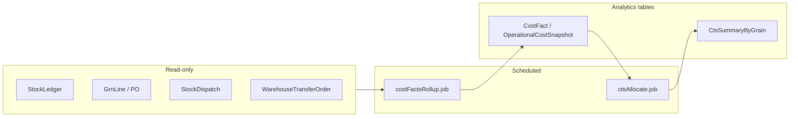

# Wave-4 — Phases 11–12: Financial Intelligence + Cost-to-Serve, SLA / Service Intelligence + Exception Command Center

**Document path:** `docs/wave4-phase11-12-financial-sla-exception-command-center-plan.md`

**Governance:** Follow [`WINDSURF_GLOBAL_RULE.md`](./WINDSURF_GLOBAL_RULE.md) (plan-first, docs in `/docs` only, single source of truth). Schema changes must follow [`PRISMA_MIGRATION_NON_DESTRUCTIVE_POLICY.md`](./PRISMA_MIGRATION_NON_DESTRUCTIVE_POLICY.md).

**Related (must stay compatible):**

| Phase / doc | Role |
|-------------|------|
| [`wave1-phase4-6-demand-replenishment-procurement-plan.md`](./wave1-phase4-6-demand-replenishment-procurement-plan.md) | Forecasting, `AiReplenishmentSuggestion`, procurement intel, control tower baseline |
| [`wave2-phase7-8-supplier-purchase-inbound-putaway-plan.md`](./wave2-phase7-8-supplier-purchase-inbound-putaway-plan.md) | PO/GRN, inbound cost basis |
| [`wave3-phase9-10-network-balance-returns-recall-plan.md`](./wave3-phase9-10-network-balance-returns-recall-plan.md) | Network balancing, reverse logistics, recall severity ↔ SLA hooks |
| [`WAREHOUSE_PHASE3_ENTERPRISE_HARDENING_REPORT.md`](./WAREHOUSE_PHASE3_ENTERPRISE_HARDENING_REPORT.md) | Ledger-first fulfillment |
| [`clinic-settlement-system.md`](./clinic-settlement-system.md) (if present) | Doctor/clinic settlement ledgers — financial adjacency |

**Repositories:**

| Role | Path |
|------|------|
| Backend API | `D:\BPA_Data\backend-api` |
| Web (Next.js) | `D:\BPA_Data\bpa_web` |

---

## 1. Executive summary

**Objective:** Deliver **Wave-4 Phase 11 — Financial intelligence and cost-to-serve (CTS)** and **Phase 12 — SLA / service intelligence and an exception command center** as a **production-grade** layer that:

- **Measures** warehouse and network **operational cost** using **auditable allocation rules** over existing transactional truth (`StockLedger`, `Grn`/`GrnLine`, transfers, dispatches, optional labor/overhead inputs)—without replacing accounting GL or ERP.
- Computes **cost-to-serve** at configurable grain (**product/variant**, **branch/location**, **order/stock movement**, **time**) with **explainable breakdowns** (landed unit cost, handling, transport proxy, shrink, financing stub).
- Defines and measures **service-level objectives (SLOs)** across fulfillment, replenishment, support, and regulated workflows (e.g. recall response), reusing and extending **SLA-adjacent fields** where they already exist (`SupportTicket.slaBreachedAt`, `slaDeadline` on related models, `RecallSeverity`).
- Provides a **centralized exception command center**: a **unified inbox** and **workflow** for operational and compliance exceptions (dispatch discrepancies, receiving failures, stock anomalies, ticket SLA risk, enforcement-adjacent signals), with **severity**, **escalation**, **assignment**, and **resolution traceability**.

**Architectural stance:** **Read-mostly analytics and orchestration** on top of append-only inventory and existing case/ticket primitives. **No silent financial postings** to operational ledgers from analytics jobs; **cost facts** are **derived snapshots** or **allocation lines** with `inputsJson` / `methodVersion` for reproducibility. Phase 12 **indexes** exceptions from domain tables and **does not** replace `ComplaintCase` / `SupportTicket`—it **aggregates views** and **cross-links**.

---

## 2. Current-state audit

### 2.1 Data model (Prisma — representative)

| Area | Models / fields | Finding |
|------|-----------------|--------|
| **Inventory financial truth** | `StockLedger`, `StockLedgerType`, `refType` | Append-only; types include GRN, transfers, dispatch, returns, quarantine/recall. Strong basis for **movement-based cost allocation**. |
| **Inbound unit economics** | `Grn`, `GrnLine` (`unitCost` where populated), `PurchaseOrder` / `PurchaseOrderLine` | Purchase price and receipt linkage; **landed cost** may be incomplete without freight/tax lines—plan must allow **partial** inputs. |
| **Vendor AP-style history** | `VendorLedgerEntry` | Ties to `PurchaseOrder`; useful for **invoice vs GRN** reconciliation signals—not full CTS alone. |
| **Network ops** | `StockDispatch`, `StockDispatchDiscrepancy`, `WarehouseTransferOrder`, `StockTransfer`, `NetworkTransferRecommendation` | **Timestamps and statuses** support **lead-time** and **fulfillment delay** SLOs; discrepancies are first-class **exceptions**. |
| **AI / planning** | `AiForecastSnapshot`, `AiReplenishmentSuggestion`, `AiJobRun`, `AiRecommendationOverride` | Already has **explainability JSON** patterns; Phase 11 should **mirror** for cost facts. |
| **Clinic commercial** | `DoctorSettlementLedger`, `SettlementAdjustment`, `ClinicInvoice`, `PosInvoice` | **Revenue/settlement** side; CTS for **clinical product** may use **clinical stock ledger** where relevant—**separate cube** from warehouse product unless explicitly unified. |
| **Support SLA (producer)** | `SupportTicket` (`slaBreachedAt`, priority, status), `TicketAuditEvent` | **MVP SLA breach marker** exists; **no** generalized SLO catalog or proactive deadline column on all domains. |
| **Trust & safety** | `ComplaintCase`, `EnforcementAction`, `GovernanceIncident` | Case workflow; **escalation** from tickets via `escalatedCaseId`. |
| **Recall** | `BatchRecall`, `RecallSeverity`, `RecallStatus` | Severity exists; **timers** not modeled as generic SLO instances. |
| **Branch manager control** | `ManagerApprovalEscalation` (mapped table), related policy fields | **Threshold escalation** pattern exists for approvals—reuse concepts for **operational escalation rules**. |

### 2.2 Backend modules (audited paths)

| Concern | Path | Wave-4 relevance |
|---------|------|------------------|
| Control tower / KPIs | `ai_intelligence/controlTower.service.ts` | Extend with **cost + SLA widgets** or parallel **financial intelligence service** to avoid god-file growth. |
| Ledger | `inventory/ledger.service.ts` | Source of **quantities and refs** for cost allocation; **do not** double-post. |
| GRN / pricing | `grn/grn.service.ts`, `inventory/inventory.service.ts` | Landed cost inputs. |
| Dispatches / discrepancies | `dispatches/dispatches.service.ts` | Exception sources + **timestamps** for SLO measurement. |
| Admin support | `admin_support/admin_support.service.ts` | Ticket SLA; integrate with command center **view**. |
| Enforcement | `admin_enforcement/admin_enforcement.service.ts` | Severity and case linkage patterns. |
| Permissions | `services/permissionsRegistry.service.ts` | Today: `inventory.ai.control_tower.read`, `admin.support.tickets.*`, governance enforcement keys—**new keys** for financial + ops command center. |

### 2.3 API mounting (`src/api/v1/routes.ts`)

- `/api/v1/ai/*` — control tower and AI endpoints; Phase 11/12 may add **`/api/v1/intelligence/*`** or **`/api/v1/operations-command-center/*`** to keep boundaries clear.
- `/api/v1/admin/support/tickets` — producer tickets.
- Inventory, dispatches, transfers — **exception drill-down** targets.

### 2.4 Frontend (`bpa_web`) — existing touchpoints

| Area | Example paths |
|------|----------------|
| Inventory control tower | `app/owner/(larkon)/inventory/control-tower/page.tsx` |
| Admin support | `app/admin/(larkon)/support/tickets/` |
| Enforcement | `app/admin/(larkon)/enforcement/` |
| Replenishment / planning | `app/owner/(larkon)/inventory/planning/`, staff `replenishment-suggestions/` |

**Gap:** No **org-level financial intelligence** dashboard, no **CTS drill-down** by SKU/branch/order, no **unified operational exception** queue across inventory + tickets + recalls.

---

## 3. Assumptions

| # | Assumption |
|---|------------|
| A1 | **Single-org analytics** default: all cost and SLO aggregates are **scoped by `orgId`** (and branch/location as needed). Cross-org reporting is **out of scope** unless product explicitly funds it. |
| A2 | **Analytics vs accounting:** Wave-4 produces **management accounting** and **operational KPIs**, not statutory financial statements. Currency is **one org currency** per snapshot window (multi-currency deferred). |
| A3 | **Source of unit cost:** Primary **inventory unit cost** comes from **GRN lines** and **rolling average / WMS policy** already implied by ledger; where missing, **configurable default** or **explicit override** per variant with audit. |
| A4 | **Labor and facility cost** are introduced as **optional cost drivers** (monthly allocation inputs), not extracted from payroll systems in v1. |
| A5 | **SLO targets** are **configured per org** (and optionally per branch category), stored in DB—not hardcoded. |
| A6 | **Command center** is a **read-heavy hub** with **actions** delegating to existing APIs (resolve discrepancy, assign ticket, acknowledge recall task)—**no** parallel resolution state machine for every domain in v1. |
| A7 | **Performance:** Heavy aggregates run as **scheduled jobs** + **materialized summary tables**; API serves **precomputed** rows for large ranges. |

---

## 4. Gap analysis

| Gap | Impact | Wave-4 direction |
|-----|--------|------------------|
| **No cost fact / CTS store** | Cannot answer “what did this branch/order cost to serve?” | Add **`CostFact`** / **`CostAllocationLine`** (or time-series **`OperationalCostSnapshot`**) with grain + method version. |
| **Landed cost incomplete** | CTS skew when freight/duty missing | **Nullable components** + **confidence** flags; import **ExpenseCharge** stub lines optional. |
| **SLO definition fragmented** | Only some domains have SLA timestamps | Introduce **`ServiceLevelObjective`** + **`SloMeasurement`** (or event stream) with **domain adapter** pattern. |
| **Exceptions siloed** | Ops uses separate UIs for discrepancies vs tickets vs recalls | **Unified index** `OperationalExceptionIndex` (see §10) or **query-only view** aggregating IDs + type + severity. |
| **Root-cause** | Post-incident learning is manual | Standard **`rcaCategory`**, **`contributingFactorsJson`**, link to **ledger ref** and **user actions** from audit. |
| **Permissions** | Financial data sensitivity | New keys: **`inventory.financial.read`**, **`operations.command_center.read`**, **`operations.command_center.manage`**, admin superset. |

---

## 5. Cost model and cost-to-serve design

### 5.1 Principles

- **Immutable transactions** remain in `StockLedger` / financial source tables; **cost analytics** **derive** from them.
- **Double-entry accounting** is **out of scope**; use **vector of cost components** per fact row.
- **Versioning:** Each run stores `costModelVersion` + `allocationPolicyId` for reproducibility.

### 5.2 Cost components (v1)

| Component | Typical source | Notes |
|-----------|----------------|-------|
| **Material / COGS** | `GrnLine.unitCost` × qty; issues via ledger | Lot-aware where `StockLot` links exist. |
| **Inbound freight / handling (allocated)** | Optional charges on PO/GRN or monthly allocation | Spread by **value** or **weight** over receipt lines. |
| **Internal transfer / move** | `WarehouseTransferOrder`, `StockDispatch` — distance or **fixed per trip** proxy | Uses **`NetworkTransferRoute`** metadata if present (Wave-3). |
| **Shrink / waste** | Adjustment ledger types, damage locations | Period aggregate allocated to **SKU/branch** by **loss qty**. |
| **Labor / facility (stub)** | Monthly **`CostDriverInput`** per branch | Allocate by **order count**, **lines picked**, or **revenue proxy**. |

### 5.3 Cost-to-serve definitions (configurable)

- **CTS (variant, branch, period):** Sum of allocated components for **all demand** fulfilled **to** that branch in window.
- **CTS (order / dispatch):** Attach to **`StockDispatch`** or **`PosInvoice`** / **`ClinicInvoice`** via ref — **allocation pass** distributes **shared** costs proportional to **line value or qty**.
- **Unit CTS:** CTS / **units fulfilled** (define denominator: exclude returns per policy).

### 5.4 Job architecture

**Frequency:** Daily rollup + optional **on-demand** refresh for owner dashboard (throttled).

---

## 6. SLA model and service-level measurement

### 6.1 SLO catalog

Represent **objectives** as data:

| Field | Purpose |
|-------|---------|
| `sloKey` | Stable string e.g. `FULFILL_DISPATCH_ON_TIME`, `TICKET_FIRST_RESPONSE`, `RECALL_ACKNOWLEDGE` |
| `domain` | `INVENTORY`, `SUPPORT`, `RECALL`, `PROCUREMENT`, `CLINIC_QUEUE` |
| `targetType` | `TIME_TO_COMPLETE`, `PERCENT_WITHIN_WINDOW`, `COUNT_BREACH` |
| `threshold` | e.g. 95% within 24h |
| `measurementWindow` | Rolling 7d/28d |

### 6.2 Measurement strategies

- **Event-based:** On state transition (e.g. dispatch **SHIPPED**), compute `duration = shippedAt - approvedAt`, compare to SLO.
- **Snapshot-based:** Nightly job evaluates open entities (e.g. tickets approaching breach), writes **`SloSnapshot`** / updates **`SloMeasurement`**.
- **Adapter pattern:** `SupportTicket` uses existing fields; add **`slaDeadline`** calculation at create/update if not present; inventory uses **dispatch/transfer** timestamps.

### 6.3 Service intelligence outputs

- **Compliance scorecard** per branch: % on-time replenishment, avg delay, discrepancy rate.
- **Support:** breach rate, **mean time to resolve** by category.
- **Recall:** time to **quarantine complete** vs severity target.

---

## 7. Exception taxonomy and command-center design

### 7.1 Exception categories (taxonomy)

| Code | Domain | Example sources |
|------|--------|-----------------|
| `INV.DISPATCH_DISCREPANCY` | Inventory | `StockDispatchDiscrepancy` |
| `INV.SHORT_PICK` | Inventory | Pick/allocate failures (if surfaced) |
| `INV.RECALL_ACTIVE` | Recall | `BatchRecall` OPEN + location sweep incomplete |
| `INV.PIPELINE_STUCK` | Network | `StockRequest` / `WTO` overdue vs SLA |
| `SUP.TICKET_SLA_RISK` | Support | Ticket approaching breach |
| `SUP.TICKET_BREACHED` | Support | `slaBreachedAt` set |
| `GOV.ENFORCEMENT_OPEN` | Governance | `ComplaintCase` OPEN linked entity |
| `PROC.PO_OVERDUE` | Procurement | PO approved but no GRN by expected date (if dates exist) |
| `CLINIC.PHARMACY_EXCEPTION` | Clinic | Existing medicine/incident hooks (optional adapter) |

### 7.2 Command center UX (logical)

- **Inbox:** Filterable list: severity, domain, branch, age, assignee.
- **Detail drawer:** Summary + **deep links** to native screens (dispatch, ticket, recall).
- **Bulk:** Assign owner role, **acknowledge**, **snooze** (policy-gated), **export** CSV.

### 7.3 Index vs duplicate workflow

- **Preferred:** **`OperationalExceptionView`** materialized or **indexed projection table** updated by hooks/cron: `(exceptionId, type, orgId, branchId?, severity, status, sourceRefType, sourceRefId, openedAt, dueAt)`.
- **Alternative v0:** Purely **API aggregation** from multiple queries — acceptable for **pilot** with strict **pagination** and **low org volume**.

---

## 8. Escalation and severity model

### 8.1 Severity levels (unified)

Align with existing strings where possible: **`LOW` / `MEDIUM` / `HIGH` / `CRITICAL`**.

Mapping examples:

- `RecallSeverity` → maps into unified scale with explicit **matrix** in config JSON.
- Dispatch discrepancy **qty delta** thresholds → severity by **policy table** (`ExceptionSeverityRule`).

### 8.2 Escalation rules

- **Time-based:** If `now > dueAt` and status **OPEN**, escalate severity or notify **next role**.
- **Role chain:** Branch manager → Owner → Admin (config per `ExceptionCategory`).
- **Integration:** Reuse **notification** service; optional **webhook** for enterprise SIEM (future).

### 8.3 Separation from governance

- **Trust & Safety** cases remain **`ComplaintCase`**; command center **links** but **does not** auto-create cases unless **policy** says so (e.g. repeated critical inventory loss).

---

## 9. Root-cause analytics approach

### 9.1 Data captured at resolution

- **`primaryCause`**: enum (e.g. `DATA_ENTRY`, `SYSTEM_BUG`, `VENDOR_SHORT`, `THEFT`, `TRAINING`, `UNKNOWN`).
- **`contributingFactorsJson`**: ranked list with optional **evidence refs** (audit log IDs, file keys).
- **Links:** `stockLedgerId`, `ticketId`, `dispatchId` — **nullable** foreign keys or loose refs.

### 9.2 Analytical use

- **Pareto** of causes per category / branch / month.
- **Regression:** correlate **CTS spikes** with **exception volume** (same warehouse week).

### 9.3 Privacy and safety

- **PII minimization** in RCA text; prefer **internal notes** with access control consistent with ticket permissions.

---

## 10. Data-model proposal

> **Note:** Exact names subject to migration review; follow non-destructive policy.

### 10.1 Phase 11 (financial / CTS)

| Artifact | Purpose |
|----------|---------|
| `CostAllocationPolicy` | Named policy: methods, weights, effective dates. |
| `CostDriverInput` | Period inputs: rent, labor hours, **orgId**, **branchId** optional. |
| `CostFact` | Atomic line: `orgId`, `grain` (enum), `variantId?`, `locationId?`, `refType`, `refId`, `component`, `amount`, `currency`, `period`, `inputsJson`, `methodVersion`. |
| `CtsSummary` | Rollup cache: `(orgId, branchId, variantId, period)` → totals + **denominator**. |

Optional: **`ExpenseCharge`** for freight/duty lines tied to `GrnId` or `PurchaseOrderId`.

### 10.2 Phase 12 (SLO + exceptions)

| Artifact | Purpose |
|----------|---------|
| `ServiceLevelObjective` | Catalog of SLO definitions and thresholds. |
| `SloMeasurement` | Time-bucketed measurement per SLO / scope. |
| `OperationalExceptionIndex` | Unified inbox projection (see §7). |
| `ExceptionSeverityRule` | Threshold config by category. |
| `RcaRecord` | Optional 1:1 with resolved exception index row. |

**Indexes:** `(orgId, status, severity, openedAt)`, `(sourceRefType, sourceRefId)` unique where appropriate.

---

## 11. Backend module/file plan

**Suggested new module root:** `src/api/v1/modules/operational_intelligence/` (or split `financial_intelligence/` + `operations_command_center/`).

| File | Responsibility |
|------|------------------|
| `financialIntelligence.service.ts` | Cost fact rollup, CTS queries, explain payload builders. |
| `financialIntelligence.controller.ts` | REST handlers. |
| `financialIntelligence.routes.ts` | Mount under `/api/v1/intelligence/financial` (example). |
| `slo.service.ts` | SLO evaluation, snapshot writers, ticket adapter. |
| `operationalExceptionIndex.service.ts` | Build/query unified index, acknowledge/assign. |
| `rca.service.ts` | Create/update RCA, list analytics. |
| `adapters/supportTicketSlo.adapter.ts` | Map tickets ↔ SLO |
| `adapters/inventoryFulfillmentSlo.adapter.ts` | Map dispatch/WTO ↔ SLO |
| `jobs/costFactsRollup.job.ts` | Cron entry |
| `jobs/sloEvaluation.job.ts` | Cron entry |
| `jobs/operationalExceptionRefresh.job.ts` | Rebuild index |

**Integration points:** Call from existing services on **critical transitions** (async queue or lightweight **outbox** table if needed—defer until load warrants).

**Permissions:** extend `permissionsRegistry.service.ts` with keys in §4.

---

## 12. Frontend route/page/component plan (`bpa_web`)

| Route (App Router) | Purpose |
|--------------------|---------|
| `app/owner/(larkon)/inventory/financial-intelligence/page.tsx` | Org CTS overview, trends |
| `app/owner/(larkon)/inventory/financial-intelligence/cts/[variantId]/page.tsx` | SKU/variant drill-down |
| `app/owner/(larkon)/operations/command-center/page.tsx` | Unified exception inbox (owner) |
| `app/admin/(larkon)/operations/command-center/page.tsx` | Network/admin view (if product wants cross-tenant—else **omit** or **aggregate-only**) |
| `app/admin/(larkon)/intelligence/slo/page.tsx` | SLO definitions (admin tooling) — optional |

**Shared components:**

- `src/bpa/owner/components/financial/CtsSummaryCards.tsx`
- `src/bpa/owner/components/financial/CostBreakdownTable.tsx`
- `src/bpa/shared/components/command-center/ExceptionInboxTable.tsx`
- `src/bpa/shared/components/command-center/ExceptionDetailDrawer.tsx`

**API client:** extend `app/owner/_lib/ownerApi.ts` / `lib/api.ts` with typed clients.

**Menu:** extend `branchSidebarConfig.ts` / owner nav — **behind** permissions.

---

## 13. API contracts (representative)

> Version prefix: `/api/v1`. All responses JSON; errors consistent with existing `{ success, message }` patterns.

### 13.1 Financial intelligence

| Method | Path | Description |
|--------|------|-------------|
| `GET` | `/intelligence/financial/summary` | Query: `orgId`, `from`, `to`, `branchId?` — totals, CTS index, top drivers |
| `GET` | `/intelligence/financial/cts` | Query: `variantId`, `branchId`, `period` — CTS breakdown |
| `GET` | `/intelligence/financial/cost-facts` | Paginated facts for audit |
| `POST` | `/intelligence/financial/refresh` | Trigger rollup (throttled; **owner/admin** only) |

### 13.2 SLO

| Method | Path | Description |
|--------|------|-------------|
| `GET` | `/intelligence/slo/measurements` | By `sloKey`, window |
| `GET` | `/intelligence/slo/definitions` | List `ServiceLevelObjective` |
| `PUT` | `/intelligence/slo/definitions/:id` | Admin update targets |

### 13.3 Command center

| Method | Path | Description |
|--------|------|-------------|
| `GET` | `/operations/command-center/exceptions` | Filters: severity, domain, status, branchId |
| `GET` | `/operations/command-center/exceptions/:id` | Detail + deep links |
| `PATCH` | `/operations/command-center/exceptions/:id` | Assign, acknowledge, snooze, resolve |
| `POST` | `/operations/command-center/exceptions/:id/rca` | Attach RCA |

**Idempotency:** `PATCH` uses ETag or `version` field on index row if concurrent updates become an issue.

---

## 14. UX/dashboards/command-center flows

### 14.1 Owner financial dashboard

1. Land on **summary**: total cost, CTS trend, **top 5** expensive branches/SKUs.
2. **Drill** to branch → variant list with **unit CTS** and **confidence** badge.
3. **Explain** opens side panel: **stacked bar** of components + **links** to underlying GRNs/dispatches.

### 14.2 Command center

1. **Default filter:** OPEN + HIGH/CRITICAL + **my branches** (owner) / **all org** (role).
2. Row click → **drawer** with **timeline** (audit + domain events).
3. **Primary action** routes to **existing** screen (e.g. “Resolve in dispatch UI”).
4. **Resolve** requires **RCA** when policy mandates (config).

### 14.3 Dashboards (WowDash)

- Reuse **SectionCard**, **DataTableWrapper**, existing **StatusBadge** patterns; **no redesign** of shell—per project rules.

---

## 15. Audit and explainability

- Every **cost fact** stores **`inputsJson`**: `{ grnLineIds: [], allocationWeights: {}, fxRate: null }`.
- **SLO measurement** stores **`calculationTrace`** (compact JSON): which timestamps used.
- **Command center** actions append to **`AuditLog`** or domain-specific audit (align with `admin_audit` patterns).
- **Human overrides** (cost override per variant) require **`reason`** + **`userId`** + **timestamp**.

---

## 16. Migration strategy

1. **Additive migrations only:** new tables and indexes; **no** destructive changes to `StockLedger`.
2. **Backfill jobs:** optional historical cost facts **batched** by month; **rate-limited** to protect DB.
3. **Feature flags:** `FINANCIAL_INTELLIGENCE_V1`, `COMMAND_CENTER_V1` via env or org feature table.
4. **Data quality gates:** if **>X%** GRN lines lack `unitCost`, dashboard shows **banner** and **limits** drill-down accuracy.

---

## 17. Implementation sequence

| Step | Deliverable |
|------|-------------|
| **W4-11a** | Schema: `CostAllocationPolicy`, `CostFact`, minimal rollup job, **read API** summary only |
| **W4-11b** | CTS allocation pass + `CtsSummary` + owner **financial** page (read-only) |
| **W4-11c** | Cost driver inputs (manual) + explainability polish |
| **W4-12a** | `ServiceLevelObjective` + adapters for **dispatch** + **ticket** SLOs |
| **W4-12b** | `OperationalExceptionIndex` + refresh job + **command center** inbox API |
| **W4-12c** | Owner UI command center + RCA + notifications |
| **W4-12d** | Admin SLO tuning UI (optional), cross-domain **scorecard** widget on control tower |

Dependencies: Wave-1–3 data **quality** (timestamps on transfers/dispatches) improves SLO accuracy—coordinate with ops.

---

## 18. Risks and validation checklist

| Risk | Mitigation |
|------|------------|
| **Incorrect CTS** misguides decisions | Show **confidence**, **method version**, **data coverage %**; shadow mode first |
| **Performance** on large ledger history | Partition facts by month; **limit** ad-hoc scans |
| **Scope creep** into full ERP | Strict **management accounting** charter; **no** GL posting |
| **Alert fatigue** | Severity rules, **snooze**, **dedupe** by `sourceRef` |
| **Permission leaks** | Financial endpoints **owner/admin** only; audit reads logged |

**Validation checklist (pre-prod):**

- [ ] Sample branch: manual CTS **reconciles** to spreadsheet within tolerance.
- [ ] SLO: inject test ticket/dispatch; **breach** detected within job interval.
- [ ] Command center: **each** exception type deep-links correctly.
- [ ] Load test: inbox query **p95** within SLA for target **org size**.

---

## 19. Testing strategy

| Layer | Scope |
|-------|--------|
| **Unit** | Allocation math (weights, rounding), severity rules, SLO duration calc |
| **Integration** | Services with **test DB** / Prisma: insert ledger + GRN → **CostFact** expected |
| **API** | Supertest on new routes: authz, pagination, filters |
| **E2E (Playwright/Cypress if present)** | Owner navigates financial dashboard + opens exception drawer |
| **Regression** | Existing inventory flows **unchanged**; ledger count invariant tests |

---

## 20. Rollback/safety strategy

- **Feature flags** default **off** in production until UAT sign-off.
- **Rollback:** disable routes via flag; **drop** read traffic to new tables; **retain** facts for audit (no delete required).
- **Forward fix:** incorrect allocation policy → **bump** `methodVersion`, **re-run** rollup (immutable old facts retained or marked **superseded**).
- **No** automated **writes** to core transactional tables from rollback scripts.

---

## 21. Definition of done

**Phase 11**

- [ ] Cost facts generated **daily** for pilot org(s) with documented **coverage**.
- [ ] Owner can view **CTS** by **branch** and **variant** with **component breakdown**.
- [ ] Explainability JSON passes **spot audit** vs source GRNs/dispatches.
- [ ] Permissions and **audit** trails verified.

**Phase 12**

- [ ] At least **two** domains (e.g. **dispatch timeliness** + **ticket SLA**) emit **SloMeasurement** rows.
- [ ] **OperationalExceptionIndex** lists **open** exceptions with **filters**; actions **delegate** correctly.
- [ ] **RCA** optional/required per policy; **exports** work.
- [ ] Documentation **updated** (this file version note), **runbooks** for jobs and **on-call** escalation.

---

**Document status:** Planning only — **no implementation** in this change set.

**Updated:** `D:\BPA_Data\backend-api\docs\wave4-phase11-12-financial-sla-exception-command-center-plan.md`
