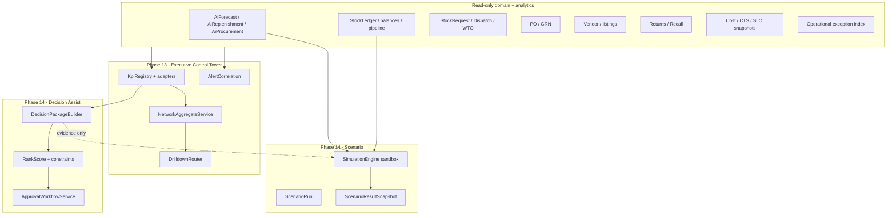

# Wave-5 — Phases 13–14: Executive Control Tower + Autonomous Decision Assist & Scenario Planning

**Document path:** `docs/wave5-phase13-14-control-tower-decision-assist-scenario-plan.md`

**Governance:** Follow [`WINDSURF_GLOBAL_RULE.md`](./WINDSURF_GLOBAL_RULE.md) (plan-first, docs in `/docs` only, single source of truth). Schema changes must follow [`PRISMA_MIGRATION_NON_DESTRUCTIVE_POLICY.md`](./PRISMA_MIGRATION_NON_DESTRUCTIVE_POLICY.md).

**Related (must stay compatible):**

| Phase / doc | Role |
|-------------|------|
| [`wave1-phase4-6-demand-replenishment-procurement-plan.md`](./wave1-phase4-6-demand-replenishment-procurement-plan.md) | Forecasting, replenishment, procurement intel, `ai_intelligence` baseline, `AiRecommendationOverride` |
| [`wave2-phase7-8-supplier-purchase-inbound-putaway-plan.md`](./wave2-phase7-8-supplier-purchase-inbound-putaway-plan.md) | PO/GRN, inbound, supplier listings |
| [`wave3-phase9-10-network-balance-returns-recall-plan.md`](./wave3-phase9-10-network-balance-returns-recall-plan.md) | Network balancing, reverse logistics, recalls |
| [`wave4-phase11-12-financial-sla-exception-command-center-plan.md`](./wave4-phase11-12-financial-sla-exception-command-center-plan.md) | Cost-to-serve, SLO catalog, operational exception command center |
| [`WAREHOUSE_PHASE3_ENTERPRISE_HARDENING_REPORT.md`](./WAREHOUSE_PHASE3_ENTERPRISE_HARDENING_REPORT.md) | Ledger-first fulfillment |

**Repositories:**

| Role | Path |
|------|------|
| Backend API | `D:\BPA_Data\backend-api` |
| Web (Next.js) | `D:\BPA_Data\bpa_web` |

**Status:** Planning only — **no implementation** in this document.

---

## 1. Executive summary

**Objective:** Deliver **Wave-5 Phase 13 — Executive (network) Control Tower** and **Phase 14 — Autonomous Decision Assist + Scenario Planning** as a single **management command system** that:

- **Unifies** visibility across **forecasting**, **replenishment**, **procurement**, **fulfillment** (stock requests, transfers, dispatches, warehouse transfer orders), **supplier** health, **inbound** (PO/GRN pipeline), **reverse logistics** (returns, vendor returns, recall-adjacent risk), **SLA / SLO** posture, **financial / cost-to-serve** signals (where Wave-4 analytics exist), and **alerts** — with **consistent org scoping**, **drill-down**, and **explainable KPI definitions**.
- Adds **decision assist**: **ranked, constraint-aware recommendations** (e.g. “approve network move,” “prioritize PO line,” “escalate exception”) with **explicit drivers**, **confidence**, **policy version**, and **human approval** — **never** silent end-to-end automation of inventory writes, financial postings, or supplier commitments.
- Adds **scenario planning** and **what-if simulation**: **parameterized, reproducible** runs that **recompute planning outputs in a sandbox** (derived snapshots only) to answer “if demand ↑10% and lead time +2 days, what breaks first?” — outputs must be **decision-useful** (bottlenecks, projected stockouts, cash/CTS deltas where data supports) and **reviewable** before any operational action.

**Architectural stance:** **Compose** existing domain services and analytics tables; add a thin **orchestration + presentation** layer for the tower, plus **immutable scenario result stores** that reference **inputsJson** / **engineVersion** for audit. **Ledger and transactional writes** remain behind existing APIs (`stock_requests`, `transfers`, `dispatches`, `grn`, `purchase orders`, etc.); the tower **does not** bypass them.

---

## 2. Current-state audit

### 2.1 Backend — planning and intelligence (Wave-1 baseline)

| Area | Finding |
|------|---------|
| **AI / planning** | `src/api/v1/modules/ai_intelligence/`: `aiForecast.service.ts`, `replenishment.service.ts`, `procurement.service.ts`, `controlTower.service.ts`, `planningAlerts.service.ts`, jobs under `src/common/jobs/`. |
| **Control tower (today)** | `getControlTowerOverview(orgId)` aggregates **branch list**, counts of **critical open replenishment suggestions**, **forecast snapshots**, **low-confidence forecasts**, and surfaces **top critical rows** — explain block notes **AGGREGATE_DB_COUNTS** (see `controlTower.service.ts`). **Scope:** replenishment + forecast centric; **not** a full network command view. |
| **Persistence** | `AiForecastSnapshot`, `AiReplenishmentSuggestion`, `AiProcurementRecommendation`, `AiJobRun`, `AiRecommendationOverride` — **explainability JSON** patterns (`factorsJson`, `inputsJson`, `reasonCodes`) already established. |
| **HTTP** | `/api/v1/ai/*` in `src/api/v1/routes.ts`; permissions include `inventory.ai.control_tower.read` (per Wave-1 doc). |

### 2.2 Backend — fulfillment, network, reverse (Waves 2–3)

| Area | Finding |
|------|---------|
| **Fulfillment** | `StockRequest`, `StockTransfer`, `StockDispatch`, allocation/pick paths — **ledger-first**; replenishment “accept” creates **draft** `StockRequest` (policy from Wave-1). |
| **Network** | `WarehouseTransferOrder`, `NetworkTransferRecommendation` / network balance concepts (Wave-3) — **recommendations**, not auto-moves. |
| **Reverse / recall** | `StockReturn`, `VendorReturn`, `ReturnRequest`, `BatchRecall` — disparate but linkable via refs and taxonomy (Wave-3). |

### 2.3 Backend — financial, SLA, exceptions (Wave-4)

| Area | Finding |
|------|---------|
| **CTS / cost** | Planned **`CostFact` / `OperationalCostSnapshot`**-style stores and allocation versioning (Wave-4) — may be **partially** implemented at time of Wave-5 build; tower must **gracefully degrade** (hide widgets or show “not configured”). |
| **SLO** | **`ServiceLevelObjective`** / measurement adapters (Wave-4 design) — tower consumes **summaries**, not raw domain reimplementation. |
| **Exception command center** | Unified **exception index** or query-only aggregation — tower **links** to detail routes rather than duplicating resolution state machines. |

### 2.4 Frontend (`bpa_web`)

| Area | Finding |
|------|---------|
| **Owner inventory** | `app/owner/(larkon)/inventory/control-tower/`, `planning/`, `replenishment-suggestions` paths referenced in prior wave docs; **staff** replenishment at `app/staff/(larkon)/branch/[branchId]/inventory/replenishment-suggestions/`. |
| **Gap** | No **single executive narrative** tying forecast → replenishment → PO/inbound → fulfillment SLA → returns/recall risk → finance in one **coherent** UX; no **scenario lab** for planners. |

### 2.5 Documentation in `/docs`

- Waves 1–4 plans are the **dependency chain**; this document is the **Wave-5** planning source of truth for Phases 13–14.

---

## 3. Assumptions

| # | Assumption |
|---|------------|
| A1 | **Org isolation** is mandatory; executive views default to **`orgId`** from session; cross-org **super-admin** views are optional and explicitly permissioned. |
| A2 | **Autonomous assist** means **assisted ranking, bundling, and drafting** — not **autonomous execution**. Any material operational or financial action requires **human approval** (or pre-approved **policy gates** with narrow scope — see §11). |
| A3 | **Scenario runs** are **read-only** with respect to `StockLedger` and transactional tables: they persist **ScenarioResult*** rows and optional **ephemeral cache**, not ledger lines. |
| A4 | **Engine determinism:** simulation uses **versioned** formulas (forecast, ROP, network balancer stubs) with **`engineVersion`** + **`inputsJson`** stored per run for reproducibility. |
| A5 | **Wave-4 analytics** may not be fully deployed; KPI panels **feature-flag** or **null-safe** render when cost/SLO tables are empty. |
| A6 | **Performance:** heavy aggregates are **precomputed** (jobs) + **pagination**; scenario engine runs are **async** with **status** + **poll** or **webhook** optional in later iterations. |
| A7 | **Currency / multi-entity accounting** remains single-currency management view unless product expands — tower shows **one org currency** for money KPIs. |

---

## 4. Gap analysis

| Gap | Impact | Wave-5 direction |
|-----|--------|------------------|
| **Siloed UIs and APIs** | Executives cannot see **one** prioritized risk picture | **Compose** unified overview API + dashboard with **deep links** |
| **Control tower KPIs limited to AI tables** | Under-represents **inbound**, **dispatch SLA**, **returns**, **finance** | **KPI registry** (metadata) + **adapters** per domain |
| **No scenario sandbox** | “What-if” is ad-hoc spreadsheet behavior | **`ScenarioRun`** + **deterministic recompute** pipeline |
| **Decision packages not first-class** | Recommendations scattered | **`DecisionPackage`** grouping with **approval state** |
| **Explainability inconsistent across domains** | Trust gap | **Standard evidence object** (see §11) across adapters |
| **No unified approval for “planner actions”** | Override only on AI rows | **Generalize** workflow: approve / reject / defer / escalate with **audit** |

---

## 5. Control tower target architecture

### 5.1 Logical architecture



### 5.2 Module boundaries

- **`executiveTower` / `networkCommand` service:** orchestrates **read** calls; **no** direct Prisma writes except **tower-specific** audit tables.
- **Domain services** remain authoritative for **inventory, PO, dispatch** — tower calls them **read-only** methods or replicated **summary tables** populated by jobs.
- **Simulation engine** lives in **`scenarioSimulation.service.ts`** (or subfolder) and **imports** the same pure functions used by production jobs where possible, wrapped with **sandbox inputs**.

### 5.3 API namespace

- Prefer **`/api/v1/executive-tower/*`** or **`/api/v1/network-command/*`** for **new** aggregate endpoints to avoid bloating `ai_intelligence` routes; **legacy** `/api/v1/ai/control-tower` may **delegate** to shared service for backward compatibility.

---

## 6. Executive KPI and network views

### 6.1 KPI registry (metadata-driven)

Define a **catalog** of KPIs with:

| Field | Purpose |
|-------|---------|
| `kpiKey` | Stable id, e.g. `NETWORK_STOCKOUT_RISK_7D`, `INBOUND_PO_BACKLOG_VALUE`, `FULFILL_ON_TIME_PCT` |
| `domain` | `FORECAST`, `REPLENISHMENT`, `PROCUREMENT`, `INBOUND`, `FULFILLMENT`, `REVERSE`, `FINANCE`, `SLA`, `ALERTS` |
| `grain` | `ORG`, `BRANCH`, `WAREHOUSE`, `SKU` |
| `refreshCadence` | `REAL_TIME`, `HOURLY`, `DAILY` |
| `adapterRef` | Which service/materialized table supplies it |
| `explainTemplate` | Human-readable formula reference |

### 6.2 Network views (UX-level)

| View | Content |
|------|---------|
| **Executive home** | Top 5 risks, cash/exposure summary (if available), SLA heat, inbound vs outbound velocity |
| **Supply health** | Forecast confidence distribution, critical replenishment backlog, procurement coverage |
| **Fulfillment pulse** | Open SR/dispatch aging, WTO backlog, discrepancy rate |
| **Inbound & supplier** | PO lines past due, GRN receipt velocity, vendor scorecard slice |
| **Reverse & compliance** | Returns aging, recall/quarantine exposure, exception queue count |
| **Financial lens** | CTS or margin proxy (when Wave-4 data present) |

### 6.3 Drill-down contract

Every KPI tile returns **`drilldownQuery`** (filters) + **`routeHint`** (frontend path) so navigation is **consistent** and **testable**.

---

## 7. Decision-assist model

### 7.1 Definition

**Decision assist** produces **`DecisionPackage`** records: a **bundle** of **candidate actions** (e.g. “Create draft PO for vendor X,” “Open WTO A→B,” “Escalate ticket Z”) each with:

- **Score** (rank)
- **Constraints checked** (boolean + messages)
- **Evidence** (`inputsJson`, source row ids)
- **Confidence** and **known unknowns**

### 7.2 Non-goals (safety)

- Does **not** auto-submit POs, post ledger, or confirm dispatches.
- Does **not** override **recall holds** or **regulatory** blocks — hard constraints **filter out** illegal actions and **surface** violations.

### 7.3 Ranking model

- **Multi-criteria score**: service level risk reduction, cost impact (CTS delta estimate), supplier reliability, SLA breach risk — weights **per org policy** (`DecisionPolicy` weights table).
- **Tie-breakers**: earlier stockout date, higher revenue-at-risk (if sales data linked), regulatory severity.

### 7.4 Human roles

- **Planner** — create/accept packages, run scenarios.
- **Approver** — approve **packages** above threshold.
- **Owner/Admin** — policy weights, feature flags.

---

## 8. Scenario planning design

### 8.1 Concepts

| Concept | Description |
|---------|-------------|
| **Scenario template** | Named preset: e.g. `DEMAND_SHOCK`, `LEAD_TIME_EXTENSION`, `SUPPLIER_OUTAGE`, `INBOUND_DELAY` |
| **Parameter set** | Typed parameters: `% demand`, `+days lead time`, `% supplier capacity`, `branch scope`, `SKU category filter` |
| **Horizon** | e.g. 7/28/90 days |
| **Baseline** | Pointer to **last production snapshot** or **live read** at `runStartedAt` |

### 8.2 Outputs (decision-useful)

- **Projected stockout list** (SKU × location × week)
- **Recommended transfer/PO count** (still **draft-only** pointers)
- **Bottleneck ranking** (node or supplier)
- **SLO breach probability** (heuristic) where SLO inputs exist
- **Financial delta** (optional): **estimated** extra holding or shortage cost — **labeled as estimate**

### 8.3 Lifecycle

`DRAFT` → `QUEUED` → `RUNNING` → `SUCCEEDED` | `FAILED` — results **immutable** once succeeded; **re-run** creates a **new** run id.

---

## 9. What-if simulation design

### 9.1 Difference from batch scenarios

| Aspect | Scenario planning | Ad-hoc what-if |
|--------|-------------------|----------------|
| **Trigger** | Saved template + scheduled / shared | Single user session |
| **Persistence** | Full audit trail | Optional **short TTL** snapshot or user-saved **favorite** |
| **Sharing** | Org-visible | Default private |

### 9.2 Interaction model

- User adjusts **sliders** (demand, lead time, MOQ override) → **debounced** recompute or **explicit “Run”**.
- Side-by-side **baseline vs simulated** tables for top N at-risk SKUs.
- **Export:** CSV of results (permission-gated).

### 9.3 Computational approach

- **Tier 1:** Analytical (ROP inequality, pipeline subtraction) — fast.
- **Tier 2:** Rolling time-step **without** Monte Carlo in v1 — optional **seeded** Monte Carlo later with **explicit** variance model version.

---

## 10. Recommendation approval / override workflow

### 10.1 States

`PROPOSED` → `PENDING_APPROVAL` → `APPROVED` | `REJECTED` | `DEFERRED` | `SUPERSEDED`

### 10.2 Actions

| Action | Effect |
|--------|--------|
| **Approve** | Unlocks **linked draft creation** (API calls user to `stock_requests` / `purchase` draft endpoints) — **idempotent** token |
| **Reject** | Records reason code + comment |
| **Override** | Stores structured override (extends `AiRecommendationOverride` pattern — quantity, vendor, date) |
| **Escalate** | Creates task in exception system or notification to role |

### 10.3 Thresholds

- Reuse **manager escalation** concepts (Wave-4 reference to `ManagerApprovalEscalation`): e.g. **value**, **volume**, **supplier newness**.

### 10.4 Idempotency

- **`clientRequestId`** on approve → prevents duplicate PO/SR from double-click.

---

## 11. Explainability and governance

### 11.1 Standard evidence object

```json
{
  "engineVersion": "wave5.sim.v1",
  "inputsHash": "sha256:...",
  "sources": [
    { "table": "AiReplenishmentSuggestion", "id": 12345 },
    { "table": "StockBalance", "keys": { "locationId": 1, "variantId": 2 } }
  ],
  "factors": [
    { "name": "pipeline_qty", "value": 40, "unit": "units" },
    { "name": "lead_time_days", "value": 7, "source": "vendor_listing" }
  ],
  "policyIds": ["DecisionPolicy:org:9:v3"],
  "confidence": 0.72,
  "caveats": ["sparse_history", "price_unknown"]
}
```

### 11.2 Policy gates (automation bounds)

- **Allowed without human:** low-value **informational** alerts, **draft** prep where **no** external commitment.
- **Never automatic:** ledger posting, PO submit to supplier, dispatch release, recall clearance.

### 11.3 Audit trail

- All packages and scenario runs store **`createdByUserId`**, **`approvedByUserId`**, timestamps, **IP/device** optional.

---

## 12. Data-model proposal

**New tables (conceptual — names illustrative):**

| Table | Purpose |
|-------|---------|
| **`ExecutiveKpiSnapshot`** | Materialized KPI values per org/day (or hour) for fast dashboard |
| **`DecisionPackage`** | Header: org, status, priority, summary, `policyVersion` |
| **`DecisionPackageItem`** | Line: action type, target refs, score, `evidenceJson`, state |
| **`DecisionApprovalEvent`** | Append-only approve/reject/defer |
| **`ScenarioRun`** | Template id, parametersJson, horizon, status, `engineVersion`, baseline refs |
| **`ScenarioResultSnapshot`** | Immutable outputsJson + top drivers; link to `ScenarioRun` |
| **`SimulationPolicy`** | Org-level weights, caps, feature flags |
| **`KpiDefinition`** | Registry rows (could be seed data, not user-editable v1) |

**Reuse:**

- `AiRecommendationOverride` — extend FK optional link **`decisionPackageItemId`**.
- Wave-4 **`OperationalExceptionIndex`** — **link** from alert correlation, do not duplicate.

**Indexes:** `(orgId, status, updatedAt)`, `(orgId, scenarioTemplate, createdAt)`.

---

## 13. Backend module / file plan

| Path | Responsibility |
|------|----------------|
| `src/api/v1/modules/executive_tower/executiveTower.service.ts` | Aggregate KPIs, drill-down builders |
| `src/api/v1/modules/executive_tower/executiveTower.controller.ts` | HTTP handlers |
| `src/api/v1/modules/executive_tower/executiveTower.routes.ts` | Routes mounting |
| `src/api/v1/modules/executive_tower/kpiAdapters/*.ts` | One adapter per domain (inbound, fulfillment, reverse, finance) |
| `src/api/v1/modules/decision_assist/decisionPackage.service.ts` | Build, rank, transition state |
| `src/api/v1/modules/decision_assist/decisionApproval.service.ts` | Approvals, overrides, idempotency |
| `src/api/v1/modules/scenario/scenarioSimulation.service.ts` | Run engine, persist results |
| `src/api/v1/modules/scenario/scenarioTemplate.service.ts` | CRUD templates (admin) |
| `src/common/jobs/executiveKpiRollup.job.ts` | Nightly/hourly KPI materialization |
| `src/common/jobs/scenarioRunWorker.job.ts` | Async scenario execution |

**Integration:** Register routes in `src/api/v1/routes.ts`; extend `permissionsRegistry.service.ts`.

---

## 14. Frontend route / page / component plan (`bpa_web`)

| Path | Purpose |
|------|---------|
| `app/owner/(larkon)/inventory/network-command/` (or extend `control-tower/`) | **Executive home** — unified KPIs + risk feed |
| `.../network-command/fulfillment/` | Fulfillment pulse drill-down |
| `.../network-command/inbound-supplier/` | PO/GRN + supplier |
| `.../network-command/reverse-compliance/` | Returns/recall lens |
| `.../network-command/finance/` | CTS/financial lens (gated) |
| `.../network-command/scenarios/` | Scenario list + detail |
| `.../network-command/scenarios/new/` | Template picker + parameters |
| `.../network-command/scenarios/[runId]/` | Results, compare baseline |
| `app/owner/(larkon)/inventory/network-command/_components/` | `KpiTile`, `RiskFeed`, `ScenarioCompareTable`, `DecisionPackageDrawer` |
| **Admin (optional)** | `app/admin/(larkon)/network-command/policy/` — weights, templates |

**Staff:** branch-scoped **subset** (e.g. fulfillment widget only) under `app/staff/...` if product requires — default **owner/network ops**-first.

---

## 15. API contracts (illustrative)

**Base:** `/api/v1/executive-tower` (prefix TBD — align with §5.3).

| Method | Path | Description |
|--------|------|-------------|
| `GET` | `/overview` | Unified KPI bundle + alert summary |
| `GET` | `/kpis` | Query `domain`, `grain`, `branchId?` |
| `GET` | `/drilldown` | Server-driven filters for child tables |
| `GET` | `/decision-packages` | List packages |
| `POST` | `/decision-packages` | Create from engine (internal or user-triggered) |
| `GET` | `/decision-packages/:id` | Detail + items |
| `POST` | `/decision-packages/:id/approve` | Approve (+ idempotency key) |
| `POST` | `/decision-packages/:id/reject` | Reject |
| `POST` | `/decision-packages/:id/override` | Structured override |
| `GET` | `/scenarios` | List runs |
| `POST` | `/scenarios` | Start run (`templateId`, `parametersJson`, `horizonDays`) |
| `GET` | `/scenarios/:runId` | Status + result snapshot |
| `DELETE` | n/a | Prefer **cancel** `POST /scenarios/:runId/cancel` for `QUEUED` only |

**Response shape (overview):**

```json
{
  "generatedAt": "2026-04-02T12:00:00.000Z",
  "orgId": 9,
  "kpis": [ { "kpiKey": "...", "value": 12.3, "unit": "percent", "trend": "up", "drilldown": { } } ],
  "alerts": [ { "severity": "HIGH", "code": "...", "title": "...", "refs": {} } ],
  "decisionPackages": { "pendingCount": 3 },
  "explain": { "engineVersion": "executive-tower.v1" }
}
```

**Errors:** Use existing API error envelope; **403** on missing permission; **409** on invalid state transition.

---

## 16. UX flows — control tower and simulation

### 16.1 Control tower — primary flow

1. User opens **Network Command** → sees **KPI tiles** + **risk feed** (sorted by severity × financial exposure proxy).
2. Clicks **tile** → **drill-down** page with **filters** and **export**.
3. Clicks **alert** → **detail drawer** with **evidence** + link to **domain screen** (e.g. dispatch discrepancy).
4. Optional: **Create decision package** from selected rows → **approval** flow.

### 16.2 Scenario / what-if flow

1. User opens **Scenarios** → **New** → pick **template** → set **parameters** → **Run**.
2. **Polling** or **SSE** (later) until **SUCCEEDED**.
3. Review **baseline vs result** tables → **Save** or **Share link** (org internal).
4. User clicks **“Create draft actions”** → creates **DecisionPackage** (still requires **approve** before operational APIs).

---

## 17. Audit / governance safeguards

| Safeguard | Implementation |
|-----------|------------------|
| **Immutability** | Result snapshots **append-only**; corrections via **new** run |
| **Separation of duties** | Approver ≠ requester optional flag per org |
| **Policy version pinning** | Every package stores **`policyVersion`** used |
| **Regulatory** | Recall/quarantine **hard stops** in constraint checker |
| **Rate limits** | Scenario runs per user/org (reuse rate limiter middleware patterns) |

---

## 18. Migration strategy

1. **Phase A — Read path:** Add tables with **empty** or backfilled **minimal** KPI snapshots; deploy **read** APIs behind feature flag.
2. **Phase B — Jobs:** Enable `executiveKpiRollup` job **shadow mode** (compute but do not serve) → validate numbers against manual SQL.
3. **Phase C — UI:** Ship **executive home** with **subset** of KPIs (forecast + replenishment + fulfillment only).
4. **Phase D — Decision packages + scenarios:** Enable **draft** workflows; **no** auto-execution.
5. **Schema:** One migration per logical group; **`prisma migrate deploy`**; **`node scripts/check-migration-integrity.js`** before/after per project policy.

---

## 19. Implementation sequence

| Step | Deliverable |
|------|-------------|
| 1 | Prisma models + migration review for `DecisionPackage*`, `ScenarioRun*`, `ExecutiveKpiSnapshot` |
| 2 | `executiveTower.service` + adapters (incremental: AI + fulfillment first) |
| 3 | `GET /overview`, `GET /kpis` + owner UI shell |
| 4 | Drill-down routes + alert correlation |
| 5 | `decisionPackage.service` + approval API + UI drawer |
| 6 | `scenarioSimulation.service` + async job + scenario UI |
| 7 | Wave-4 integration (CTS, SLO, exceptions) — **feature-flagged** |
| 8 | Hardening: permissions, rate limits, export |

---

## 20. Risks and validation checklist

| Risk | Mitigation |
|------|------------|
| **Misleading KPIs** | Definition registry + peer review + **drill-down to raw** |
| **Scenario drift** | `engineVersion` + locked **inputs hash** |
| **Performance** | Pre-aggregation, pagination, async runs |
| **Scope creep** | Strict adapter boundaries; **no** new fulfillment engine |
| **Compliance** | Hard constraints on recalls; audit on approvals |

**Validation checklist (release):**

- [ ] KPI definitions reviewed against **sample org** data
- [ ] Scenario result **reproduces** from stored inputs on **second run**
- [ ] Approve path **cannot** double-submit (idempotency)
- [ ] No ledger write from simulation code path (static check or integration test)
- [ ] Permissions verified for owner vs staff vs admin
- [ ] Migration integrity script passed

---

## 21. Testing strategy

| Layer | Scope |
|-------|-------|
| **Unit** | Pure functions: scoring, constraint check, input hash |
| **Integration** | Services with test DB: package state machine, scenario persistence |
| **API** | Contract tests for overview, scenario create, approve |
| **E2E (smoke)** | Owner login → open tower → run scenario → view result (staging) |

---

## 22. Rollback / safety strategy

| Mechanism | Detail |
|-----------|--------|
| **Feature flags** | `executive_tower_enabled`, `scenario_lab_enabled`, `decision_packages_enabled` |
| **API** | Toggle routes to **404** or **503** with message |
| **Data** | New tables **unused** if rolled back — **no** destructive backfill required |
| **Jobs** | Disable rollup job via flag — **no impact** on transactional paths |

---

## 23. Definition of done

**Phase 13 — Executive Control Tower**

- Unified **overview** API returns **multi-domain** KPIs with **drill-down** metadata.
- Owner UI presents **coherent** executive dashboard with **explain** footers.
- **Permissions** enforced; **org isolation** verified.

**Phase 14 — Decision Assist + Scenario Planning**

- **DecisionPackage** lifecycle with **approve/reject/override** and **audit trail**.
- **Scenario** create → async run → **immutable** result with **baseline comparison** UI.
- **No** automatic execution of inventory or supplier commitments; **draft** actions only post-approval.
- Documentation (**this file**) updated as single source of truth; **migration** policy respected.

---

**Updated:** `D:\BPA_Data\backend-api\docs\wave5-phase13-14-control-tower-decision-assist-scenario-plan.md`
